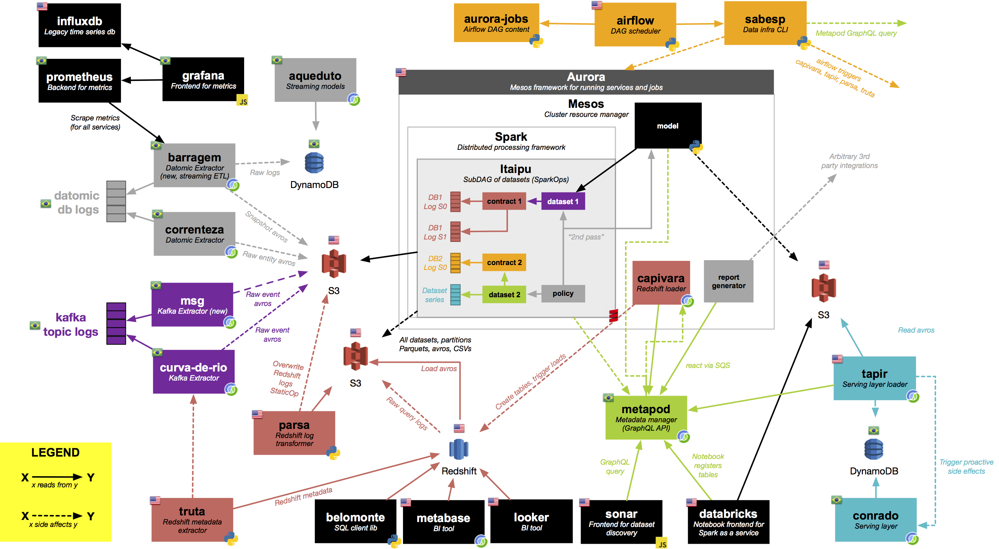

# Data Infra Documentation

This repository is the canonical place to put all documentation related to how to understand and operate in our analytical environment.

## Data Infra Overall

<object data="https://github.com/nubank/data-infra-docs/blob/master/images/DataInfraOverview.pdf" type="application/pdf" width="700px" height="700px">
    <embed src="https://github.com/nubank/data-infra-docs/blob/master/images/DataInfraOverview.pdf">
        This browser does not support PDFs. Please download the PDF to view it: <a href="https://github.com/nubank/data-infra-docs/blob/master/images/DataInfraOverview.pdf">Download PDF</a>.

    </embed>
</object>

* [Primer](primer.md)
* [Slack channel guide](squad/channels.md)
* [Data Infra Glossary](glossary.md)
* [General Glossary](https://github.com/nubank/playbooks/blob/master/docs/glossary.md)

## Ops
* [Hausmeister](squad/hausmeister.md) (a.k.a on-call rotation)
* [Monitoring the nightly run](monitoring_nightly_run.md)
* [On Call Runbook](on-call_runbook.md)
* [Ops How To](ops_how_to.md)
* [CLI usage examples](cli_examples.md)

## Itaipu
* [Primer](itaipu/primer.md)
* [Styleguide](itaipu/styleguide.md)
* [Workflow](itaipu/workflow.md)
* [Bumping Itaipu on Databricks](itaipu/databricks_bump.md)

## Infrastructure
* [Inventory](infrastructure/inventory.md)
* [Guide to the runtime environment](infrastructure/guide-to-the-runtime-environment.md)
* [Query Engines used/considered at Nubank](infrastructure/query_engines.md)
* [Testing models in staging](infrastructure/testing-models.md)

## Onboarding
* [Introduction and setup](onboarding/introduction.md)
* [Exercise Part I: Creating a dataset](onboarding/dataset-exercise.md)
* [Exercise Part II: Creating a service to expose a dataset via API](onboarding/service-exercise.md)

## Dimensional Modeling (Data Access)
* [Kimball on Dimensional Modeling Quotes](dimensional_modeling/kimball.md)
* [Contribution Margin (and how to update static inputs)](dimensional_modeling/contribution_margin.md)
