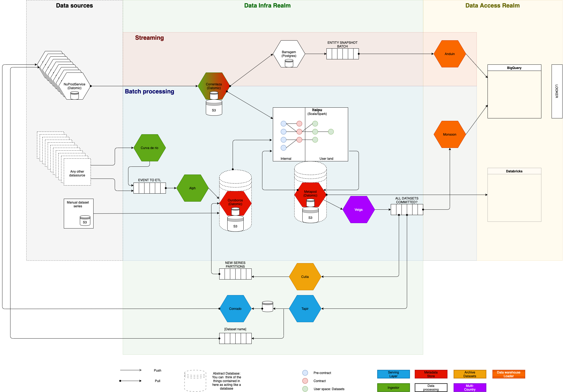

# Data Platform Documentation Hub

Data Platform Docs is a central documentation hub for Data platform Engineers and Data users. It is a one-stop store that contains the detailed documentation for developers to understand and work on the internal microservices and collaborate to create new services. This platform helps developers and data users to focus on a single documentation source, instead of hunting down several individual guides for different services.

The knowledge base comprises a comprehensive list of all microservices and its details, information on thought-through architectures, step-by-step guides, Incident response guides, Dataset series guides, FAQs, and more. 

 

|Data Infrastructure|Analytics Productivity|
:--------------------------------------------:|:------------------------------:
|[Dataset series on ETL](data-users/etl_users/dss-on-etl.md)|[About Analytics Productivity](https://playbooks.nubank.com.br/squads/analytics-productivity/)|
|[Manual Dataset Series](data-users/etl_users/manual_dataset_series.md)|[Optimize your SparkOp](data-users/etl_users/optimizing_your_sparkop.md)|
|[Archive Dataset series](data-users/etl_users/archived_datasets.md)|[Core Datasets](datasets/core-datasets/README.md)|
|[Services](services/data-ingestion/intro.md)|[Frozen Suite](https://docs.google.com/document/d/1tJx9ifOhscM7P4MtFifblbtDUoGTk-JqkDN9DXCqPsI/edit#heading=h.h1dr4jt5gg6g)|
|[Overview of Itaipu](services/data-processing/itaipu/itaipu.md)|[Iglu](tools/frozen_suite/iglu/README.md)|
|[Opening PRs on Itaipu](how-tos/itaipu/opening_prs.md)|[Ice mold](https://github.com/nubank/itaipu/tree/master/src/main/scala/etl/warehouse/ice_mold)|
|[Reviewing and merging PR on Itaipu](how-tos/itaipu/itaipu_reviewer.md)|[IceQL](tools/frozen_suite/iceql/README.md)|

 

|Data Access|Data users - FAQs|
|:----:|:---------------------------:|
|[Databricks](tools/databricks/README.md)|[Dataset series](data-users/FAQs/dataset-series.md)|
|[Looker](tools/looker/README.md)|[PII Data](data-users/FAQs/pii-data.md)|
|[Airflow](tools/airflow.md)|[Compilated failed - Itaipu](data-users/etl_users/FAQ.md)|

 

### Documentation site structure

- **About** - Contains all Data BU Squads overview, services owned and slack channels.
- **How-tos** - contains all the service related how-tos / cookbooks
- **Services** - contains all service related concepts.
- **On-call** - contains documentation set required for on-call engineers.
- **Onboarding** - contains all squads onboarding material.
- **Tools** - contains all squads tools that are used to generate and view dashboards.
- **Infrastructure** - contains all squads infrastructure - clusters, monitoring tools, tech stacks.
- **Troubleshooting** - contains all service related troubleshooting topics.

## Contributing

If you are contributing to the data-platform-docs, please be mindful of the following things:

* Make sure every .md file contains the owner on top and an empty line on bottom. Refer existing files.
* If a new file is added, make sure its relative path is added in `mkdocs.yml`, under `nav`.
* If a file is deleted make sure the relative path is deleted as well.
* If a file is renamed, make sure it's updated in the `nav` in the `mkdocs.yml`.

If you don't want to go through the above list, then before merging your PR,
use the following commands to check if all the required tests are passed

- ./bin/run-tests
- ./bin/local-build.sh
- ./bin/run-lint.sh

<!-- markdownlint-disable-file -->
