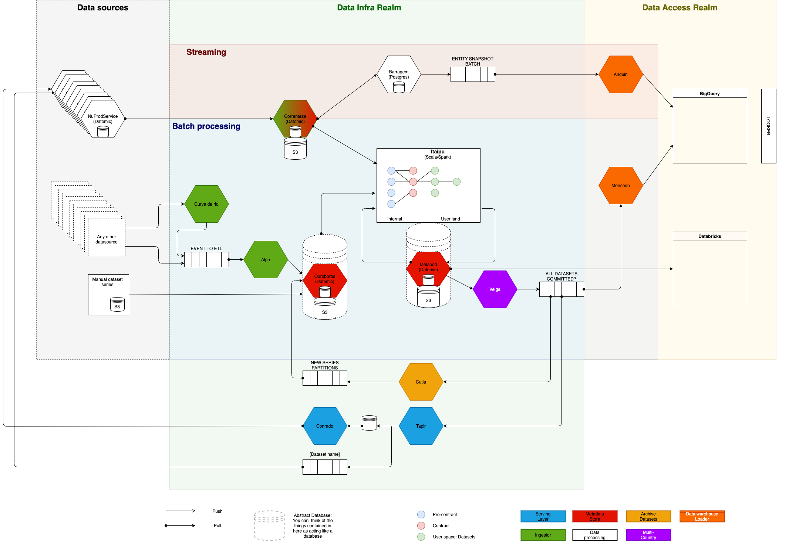

<!-- markdownlint-disable-file -->

# Data Infra overview

Data Platform Docs is a central documentation hub for Data Infra, Data Access Engineers and Data users.  It is a one-stop store that contains the detailed documentation for developers to understand and work on the internal microservices and collaborate to create new services. This platform helps developers and data users to focus on a single documentation source, instead of hunting down several individual guides for different services.

The knowledge base contains a comprehensive list of all microservices and its details, information on thought-through architectures, step-by-step guides, Incident response guides, Dataset series guides, FAQs and more.

* [Services and language stacks](/about/data-infra/services-language-stacks.md)
* [Slack channel guide]
* [Data Infra Glossary](../../glossary.md)
* [General Glossary](https://github.com/nubank/playbooks/blob/master/docs/glossary.md)

## ETL User references

* [FAQ](../../data-users/etl_users/FAQ.md)
* [Dataset Series](../../data-users/etl_users/dataset_series.md)
* [Manual Dataset Series](../../data-users/etl_users/manual_dataset_series.md)
* [Archived Datasets](../../data-users/etl_users/archived_datasets.md)
* [How to optimize your SparkOp](../../data-users/etl_users/optimizing_your_sparkop.md)

## ETL Operations

* [Hausmeister](../../on-call/data-infra/hausmeister.md) (a.k.a on-call rotation)
* [Monitoring the nightly run](../../on-call/data-infra/monitoring_nightly_run.md)
* [On Call Runbook](../../on-call/data-infra/on_call_runbook.md)
* [Ops How To](../../on-call/data-infra/ops_how_to.md)
* [Incident Response Checklist](../../on-call/data-infra/incident_response_checklist.md)
* [Getting help from other squads](../../on-call/data-infra/getting_help_from_other_squads.md)
* [CLI usage examples](../../on-call/data-infra/tools/cli_examples.md)
* [GraphQL clients](../../tools/graphql_clients.md)
* [Airflow](../../tools/airflow.md)
* [Metapod](../../how-tos/metapod.md)

## Itaipu

* [Primer](../../services/data-processing/itaipu/itaipu.md)
* [Styleguide](../../how-tos/itaipu/styleguide.md)
* [Workflow](../../how-tos/itaipu/workflow.md)
* [Bumping Itaipu on Databricks](../../tools/databricks/library_bump.md)
* [Updating the Log Cache](../../how-tos/itaipu/log_cache_update.md)
* [Dataset Series Compaction](../../troubleshooting/dataset_series_compaction.md)
* [Pororoca](../../how-tos/itaipu/pororoca.md)

## Infrastructure

* [Inventory](../../infrastructure/data-infra/inventory.md)
* [New country deployment](../../infrastructure/data-infra/new-country.md)
* [Guide to the runtime environment (Mesos & Aurora)](../../infrastructure/data-infra/guide-to-the-runtime-environment.md)
* [Query Engines used/considered at Nubank](../../infrastructure/data-infra/query_engines.md)
* [Testing models in staging](../../infrastructure/data-infra/testing-models.md)
* [The Serving Layer](../../infrastructure/data-infra/serving_layer.md)

### Onboarding

* [Introduction and setup](../../onboarding/data-infra/introduction.md)
* [Exercise Part I: Creating a dataset](../../onboarding/data-infra/dataset-exercise.md)
* [Exercise Part II: Creating a service to expose a dataset via API](../../onboarding/data-infra/service-exercise.md)

## See also

- [Slack channels](slack-channels.md)
- [Services owned](services-language-stacks.md)
