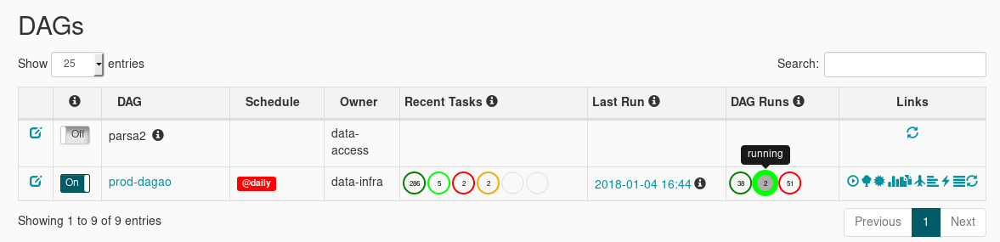
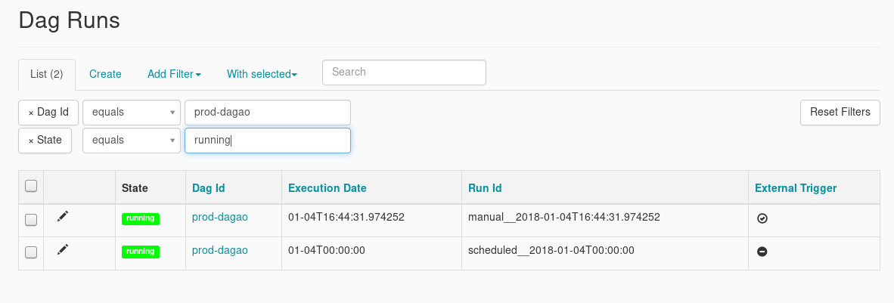
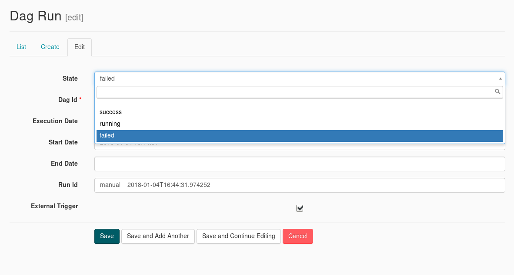
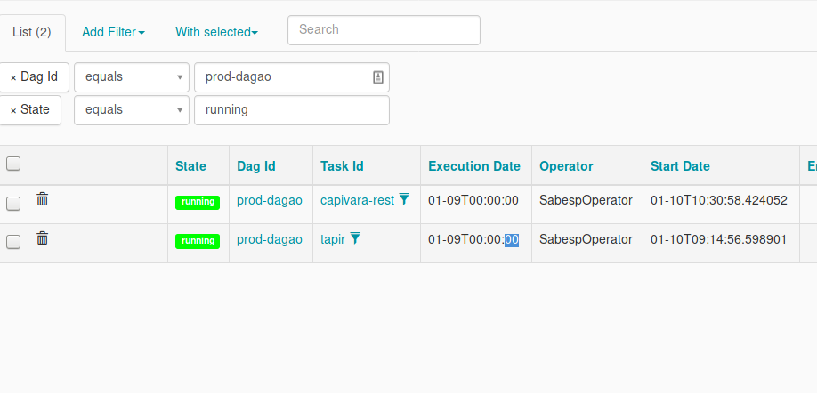
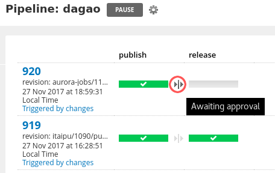
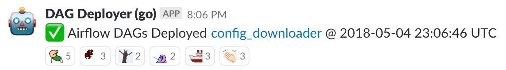
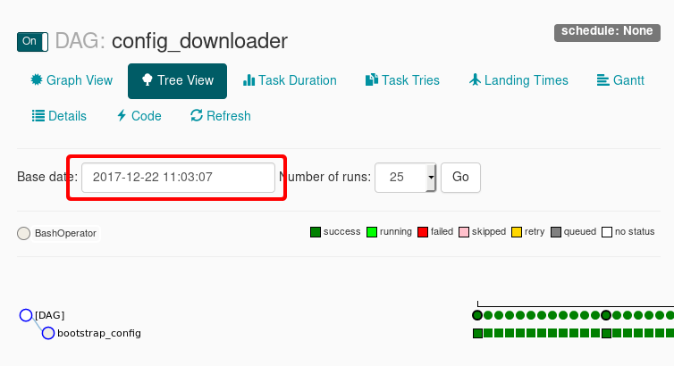

# Airflow

Table of contents

* [Useful links](#useful-links)
* [Manually stopping a run](#manually-stopping-a-run)
* [Deploying job changes to Airflow](#deploying-job-changes-to-airflow)
* [Updating Airflow](#updating-airflow)
* [Restarting the Airflow process](#restarting-the-airflow-process)
* [Dry run tests](#dry-run-tests)
* [Add new model to dagão dependencies](#add-new-model-to-dagão-dependencies)

### Useful links
* [Monitoring the run on Airflow](./monitoring_nightly_run.md)
* [Airflow DOCS on Creating a new DAG](https://airflow.apache.org/tutorial.html), Basically you need to create a python file, that has the definition of your DAG inside the airflow directory, then just follow the `Deploying job changes to Airflow`

### Manually stopping a run

Sometimes a run hangs and you will want to manually stop it. Or a manual run is overwritten by the scheduled run.

1. on the root airflow page, under the `DAG Runs` column for `prod-dagao` click the light green 'running' circle


2. Click the _edit_ icon for the run you want to stop (See the _execution date_ or look for `manual__` in the _Run Id_)


3. Set the Dag Run _State_ to `failed`


4. Kill manually all tasks left
   1. Get the list of tasks that needs to be killed from the task list. Click the green 'running' circle in the `recent_tasks` tab, and filter by your dag, and by it's execution date.
   

   2. For each `task_id` execute the following command
   `sabesp --aurora-stack=cantareira-stable jobs kill jobs prod {{task_name}}`

### Deploying job changes to Airflow
When a job is changed on [`aurora-jobs`](https://github.com/nubank/aurora-jobs), we need to be careful about how we update the workflow on Airflow because Airflow does not have isolation between runs, so a change to the workflow could affect the *currently running* DAG accidentally if we are not careful.
   1. The [`aurora-jobs` Go Pipeline](https://go.nubank.com.br/go/tab/pipeline/history/aurora-jobs) will build automatically
   2. When the [`aurora-jobs`](https://github.com/nubank/aurora-jobs) pipeline
 completes it'll trigger the [`dagao` Go
 Pipeline](https://go.nubank.com.br/go/pipeline/history/dagao). The main test
 that is run in this pipeline is called [`dry-run-tests`](#dry-run-tests). This needs to be
 manually `release` in order for Airflow to have access to it.

 ### *Don't do this during an active DAG run.*

   

   3. You can check that the configuration was loaded into airflow by clicking the link that will arrive on the [#etl-updates](https://nubank.slack.com/messages/CCYJHJHR9/) channel
   
   4. After clicking the link you can check the log and the execution date.
   

#### Additional details on deploying a new DAG

You can re-deploy the `dagao` DAG while it is running as long as there aren't changes from upstream dependencies (`aurora-jobs`, `itaipu`, models, etc.) that would effect the run.
You can check this by comparing the versions of repositories to the versions in the DAG run message on [#etl-updates](https://nubank.slack.com/messages/CCYJHJHR9/).
All upstream dependencies to `dagao` are built off their `master` branches, except for `itaipu`, which uses the `release` branch.

When a DAG is deployed while another is running, airflow will use the current state of the running DAG on the new DAG. Every new task will use the service versions provided by the newly deployed DAG.

### Updating Airflow

To update Airflow you need to first bump it's [Dockerfile](https://github.com/nubank/dockerfiles/blob/master/airflow/Dockerfile), merge it and wait until go has finished building it, then, you need to change the version on [deploy](https://github.com/nubank/deploy/blob/master/lib/recipes/airflow.rb#L21), open the deploy console in the cantareira environment and run:

`Airflow.create!("x")`

Wait until it's created and you can access https://cantareira-x-airflow.nubank.com.br/admin/ and then you can upsert the new airflow to the main DNS.

`Airflow.upsert_alias!("x")`

then you need to delete the old airflow

`Airflow.delete!("x")`

### Restarting the Airflow process

If you try clearing an airflow dag node and it doesn't actually restart the node, something on airflow may be messed up.
The way forward is to cycle the airflow process.

Ssh into the machine

```
nu ser ssh airflow --region us-east-1 --user phillip.mates --env cantareira --suffix t
```

and restart the process

```
sudo systemctl restart airflow
```

This should get things going again.


### Running tests for the Airflow DAGs

Running the command below, will spin a environment similiar to the production one, and will run and check all tasks in the `main.py` dag.

```
./script/test integration
```

### Dry run tests

The main thing that we want to test before deploying a new DAS to our Airflow
instance is the integration between Airflow and Aurora. Airflow starts the
Aurora jobs using sabesp, passing arguments as binds. The past has shown that
bindings are a likely target for runtime failures. For instance, typos in one of
the bindings on either the Airflow or the Aurora side, will result in a runtime
failure (in the middle of the night).

Fortunately we have an instrument that allows us to test the bindings between
Airflow and Aurora jobs. This instrument is Sabesp's `--dryrun` flag. We use
this flag, and only this flag, to distinguish production job instantiations from
test ones.

You can find the code for the dry run tests in the
[`deploy-airflow`](https://github.nubank/deploy-airflow) repository. Instead of
going through the topologically sorted DAG, it simply iterates through all the
tasks that are present in the DAG. For every task that it finds, such as
`itaipu-contracts`, it invocates Sabesp exactly like in production with the only
exception being the dry run flag enabled (very simple--using xargs).

The main pain point with this approach is that we have multiple nested docker
containers during this test. Our CI instance, which is a Go Docker container,
spawns the Airflow docker container, which spawns multiple Sabesp containers
during the test (one for every SabespOperator task in the production DAG). This
is an artifact of our move from factotum to Airflow (our testing worked
differently in the past).

Side note: obviously the docker in docker in docker approach is
undesirable. Because of this, I think that this part of our architecture should
be considered for a refactoring soon.

### Add new model to dagão dependencies

When users want to add new models to the nightly run we will need to make some updates to the dagão pipeline.

Let's say you are adding a model called `your-model-name`.
 - Check that there is a [go pipeline](https://go.nubank.com.br/go/tab/pipeline/history/your-model-name) for it. Someone should have created it via the [`batch-models-python-template`](https://github.com/nubank/batch-models-python-template/) repository.
 - Add the model pipeline as one of the dagão dependencies, and fetch model version from s3:
    
    Open a [`gocd-config-dsl`](https://github.com/nubank/gocd-config-dsl) PR that adds the model to [`common_batch_models.clj`](https://github.com/nubank/gocd-config-dsl/blob/master/src/gocd_config_dsl/pipelines/common_batch_models.clj). It will look similar to [this](https://github.com/nubank/gocd-config-dsl/pull/904).
    
 - Add model version to the json provided to airflow

   Open a [`data-tribe-go-scripts`](https://github.com/nubank/data-tribe-go-scripts) PR that adds the following to the [`bin/dagao/create-push-das.sh` file](https://github.com/nubank/data-tribe-go-scripts/blob/master/bin/dagao/create-push-das.sh)
    ```
    # to set the version variable using a value provided by the gocd-artifacts material
    your_model_name_version="$(cat your-model-name/model-version.json | jq '."your-model-name"' -r | cut -c 1-7 )"
    ...
    # to add the version to the json sent to airflow
    "your-model-name" : "$your_model_name_version"
    ```

 - Add the model to the DAG definition in `aurora-jobs`. It will look something like [this](https://github.com/nubank/aurora-jobs/pull/606/files)
