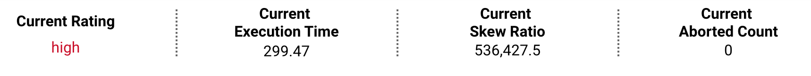

1. Go to the [datasets performance rating dashboard](https://datastudio.google.com/reporting/eb3ec818-9bcc-478d-bf95-d707a8440d44/page/p_a0aodzzlpc)
1. The Over Metrics tab displays all the information related to datasets performants rating, nummber of non-performant datasets that are at severe level and needs to be fixed.
1. Check if your squad is displayed in the **Breakdown by Squads** section.

    

1. Click on the **Squad View** to check if your dataset is considered as non-performant and with high urgency level.
1. Choose your squad from the drop-down menu. For instance, "CoreLimitPolicies".
    

1. It shows the non-performant datasets by urgency level that are related to the "CoreLimitPolicies".
    

1. Let's now see the details of a dataset "policy/random-lines-monitoring" with rating **severe**. To view the detailed information, in the **Breakdown by Dataset** section on the page, use the drop-down to choose a dataset.

    

1. The information of how many times the dataset has failed and on which dates is displayed on the dashboard. You will find the other details such as execution time, skew ratio, shuffles etc with Null value, because the dataset hasn't computed and aborted.
1. Let's now see the details of a dataset with rating **high**. In the **Breakdown by Dataset** section on the page, use the drop-down to choose the dataset "model-monitoring/accounts-due-dately-due-month-ts-sv-transformed".

1. The following details are displayed on the dashboard.

    
    

### What's Next

- [How to fix non-performant datasets](dashboards/datasets-performance-rating-system/how-to-fix-nonperformant-dashboards.md)
