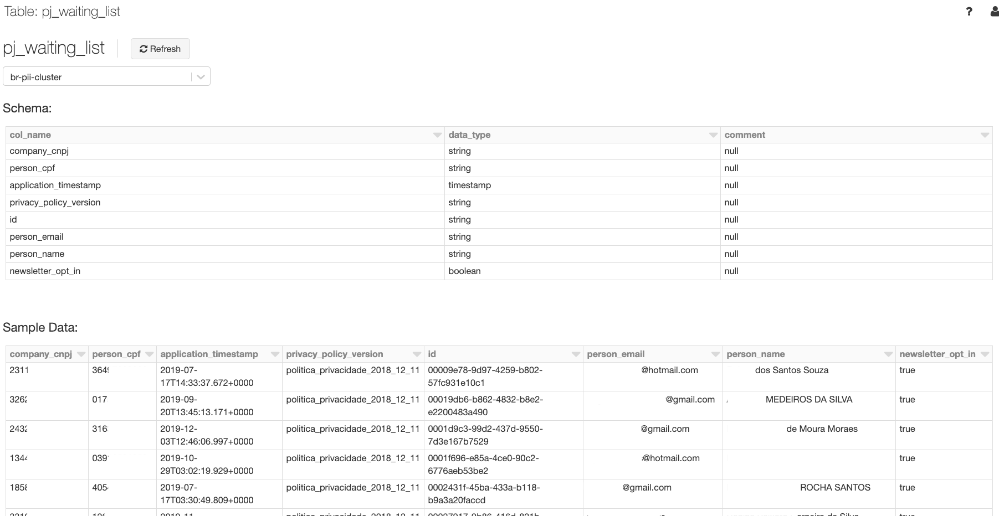
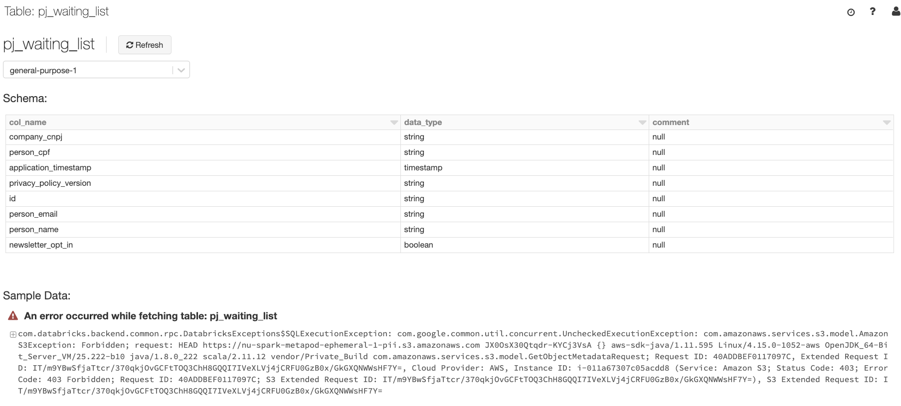

# PII and personal data Deletion

Any dataset or data source that has personal and/or PII information has the need to delete data. The logic to define what is PII and personal data there is a document made by compliance.

## How do I raise a PII or personal data deletion request?

For internal service teams at Nubank - You can either raise a request using [#lgpd-cx](https://nubank.slack.com/archives/C016VJ42ZT6to) for data deletion, or reach out for help at [#data-privacy](https://nubank.slack.com/archives/CLLFJMEBZ) slack channel and [provide necessary details](./pii-data.md#how-can-i-excise-the-data).

## How are the PII or personal data deletion requests (excision) handled?

Upon receiving the deletion request, the Data Protection squad (Xpeer) will check for the requests everyday and confirms the deletion on Slack in order to update customers / prospects.

Each request will be checked by legal every 48h in order to verify that the data subject is not part of a Legal Action or part of the Direct Mail program.

Upon validation by Legal,

- Data protection Squad runs the Excise from Datomic and informs Data infra through #data-protection-data-infra-sync of the same
- Data Infra Squad deletes data from the ETL and confirms in #data-protection-data-infra-sync
- Data protection notifies each 3rd party through the dpo@nubank.com.br email.

The Xpeer will confirm deletion to the data subject and close the ticket.

## What is considered as Pii and Personal Data?

A definition of what is Pii and personal data can be found [here](../../how-tos/data-deletion/pii_and_personal_data.md).

**KEEP IN MIND THIS IS A NON EXHAUSTIVE LIST AND NEW Pii MAY APPEAR OVER TIME.**

After you have a better understanding of the data that is considered as PII and personal, make sure you classify it as PII by setting the clearance attribute. For information on how to do that, see [How do I identify and Set attributes as Pii in Itaipu](./pii-data.md#how-do-i-identify-and-set-attributes-as-pii-in-itaipu)

**Important**: New attributes may keep adding to the PII data list and you can check all the attributes considered as PII at [Code base](https://github.com/nubank/ryze/blob/master/resources/br/compliance/actions.edn#L132). The list of attributes (tags) under Right-to-be-forgotten are considered as PII linked. Here is the list of attributes (tags) [description](https://github.com/nubank/ryze/blob/master/resources/br/compliance/tags.edn).

**Example**:

```
  {:name        :right-to-be-forgotten
  :description "Right to be forgotten"
  :tags        #{:address
                 :address-number
                 :address-postcode
                 :cpf
                 :complement
                 :device-info
                 :email
                 :mothers-name
                 :name
                 :address-ref-point
                 :card-printed-name
                 :document-id-number
                 :document-id-type
                 :document-id-year
                 :employer-cnpj
                 :employer-name
                 :ip
                 :pan
                 :phone-number
                 :preferred-name
                 :external-bank-account
                 :external-bank-account-cpf
                 :external-bank-account-name}}
```

## How do I identify and set attributes as Pii in Itaipu?

- One of the ways for identifying Pii in a dataset is by checking column names and their contents for information that could potentially identify a specific individual, such as CPF, Name, precise geolocation, etc.
- Once you have identified that the SparkOp you are working on contains Pii, you should categorize it as Pii by **setting the clearance attribute to PII**.

```scala
override val clearance: ClearanceType = ClearanceType.PII
```

In a more real case, the dataset "pj-waiting-list", contains Pii information, which we can identify by their column names and their contents:



This dataset should then be categorized as Pii, by setting the flag clearance to Pii, as in:

```scala
package nu.data.br.dataset_series

import java.time.LocalDate

import common_etl.operator.{ClearanceType, QualityAssessment}
import common_etl.operator.dataset_series.{DatasetSeriesAttribute, DatasetSeriesContractOp, SeriesType}
import common_etl.schema.LogicalType
import common_etl.metadata.{Country, Squad}

object PJWaitingList extends DatasetSeriesContractOp {

  override val seriesName: String          = "pj-waiting-list"
  override def country: Country            = Country.BR
  override val seriesType: SeriesType      = SeriesType.Events
  override val ownerSquad: Squad           = Squad.Pejota
  override val description: Option[String] = Some("List of company prospects")
  override val qualityAssessment: QualityAssessment =
    QualityAssessment.Neutral(asOf = LocalDate.parse("2019-07-10"))
  override val clearance: ClearanceType = ClearanceType.PII

  override val contractSchema: Set[DatasetSeriesAttribute] = Set(
    DatasetSeriesAttribute("id", LogicalType.UUIDType, isPrimaryKey = true, description = Some("Register Identifier")),
    DatasetSeriesAttribute("company_cnpj", LogicalType.StringType, description = Some("Company's CNPJ")),
    DatasetSeriesAttribute("person_name", LogicalType.StringType, description = Some("Name of company's owner")),
    DatasetSeriesAttribute("person_email", LogicalType.StringType, description = Some("Email of company's owner")),
    DatasetSeriesAttribute("person_cpf", LogicalType.StringType, description = Some("CPF of company's owner")),
    DatasetSeriesAttribute("privacy_policy_version",
                           LogicalType.StringType,
                           description = Some("Version of accepted privacy policy")),
    DatasetSeriesAttribute("newsletter_opt_in",
                           LogicalType.BooleanType,
                           description = Some("Opt in for newsletters mailing")),
    DatasetSeriesAttribute("application_timestamp",
                           LogicalType.TimestampType,
                           description = Some("Timestamp of registration"))
  )
}
```

This will make the materialized table inaccessible to those without the clearance needed, and avoid possible Pii leakage. In Databricks, for instance, this dataset would be made unavailable if you are trying to access it without proper permissions:



## How do I classify PII data on Ryze?

- For classifying Dataset series data on Ryze, refer to the documentation on [Data classification of dataset series](https://github.com/nubank/playbooks/blob/master/squads/data-protection/ryze/classification-dataset-series.md).

- For classifying Datomic data on Ryze, refer to the documentation on [Data classification of datomic data](../../how-tos/data-deletion/pii-classification.md)

### I (internal Nubank services) may have stored PII data on Datomic unintentionally and that data is available in ETL environment already

### How can I excise the data?

 Follow the steps below:

1. Reach out for help in #data-privacy channel.
1. Provide the following details:

    - Provide the details of attributes to be deleted. If you need to delete attributes from specific entities, then provide all the attribute ids to be deleted.
1. If you want to replace the current value i.e if it is necessary to backfill the attribute, then

    - make sure you have a backup of the current version of data.
    - create an endpoint to add the new value after the current value is deleted.
    - Be informed that your model may need to support the attributes that are yet to be backfilled i.e model should support the attributes that do not exist.

1. Data Protection Squad will then,

    - use Malzahar to excise the data. Malzahar can connect to all your service Datomic DBs and shards in Br and MX environments.

    - create new identifiers and resolvers for the database on Ryze (example, https://github.com/nubank/ryze/blob/master/resources/br/datomic/dealer/_metadata.edn and https://github.com/nubank/ryze/blob/master/resources/br/datomic/portiolli/_metadata.edn), as Malzahar datalog is based on it, and then update Ryze.

  **Example** - https://github.com/nubank/portiolli/pull/137/commits/4205970f991daaaed2d79d79f85d249181a75a18

### How do I check if the data is deleted?

Once the data is processed through Malzahar for deletion, it is guaranteed that the data is no longer available for services. If you would like to double check, you can query your service DB.

## Need more help?

If you still have questions or need additional information, please reach out to [#data-privacy](https://app.slack.com/client/T024U97V8/CLLFJMEBZ) or [#squad-data-access](https://app.slack.com/client/T024U97V8/C84FAS7L6) and we will provide appropriate support.
