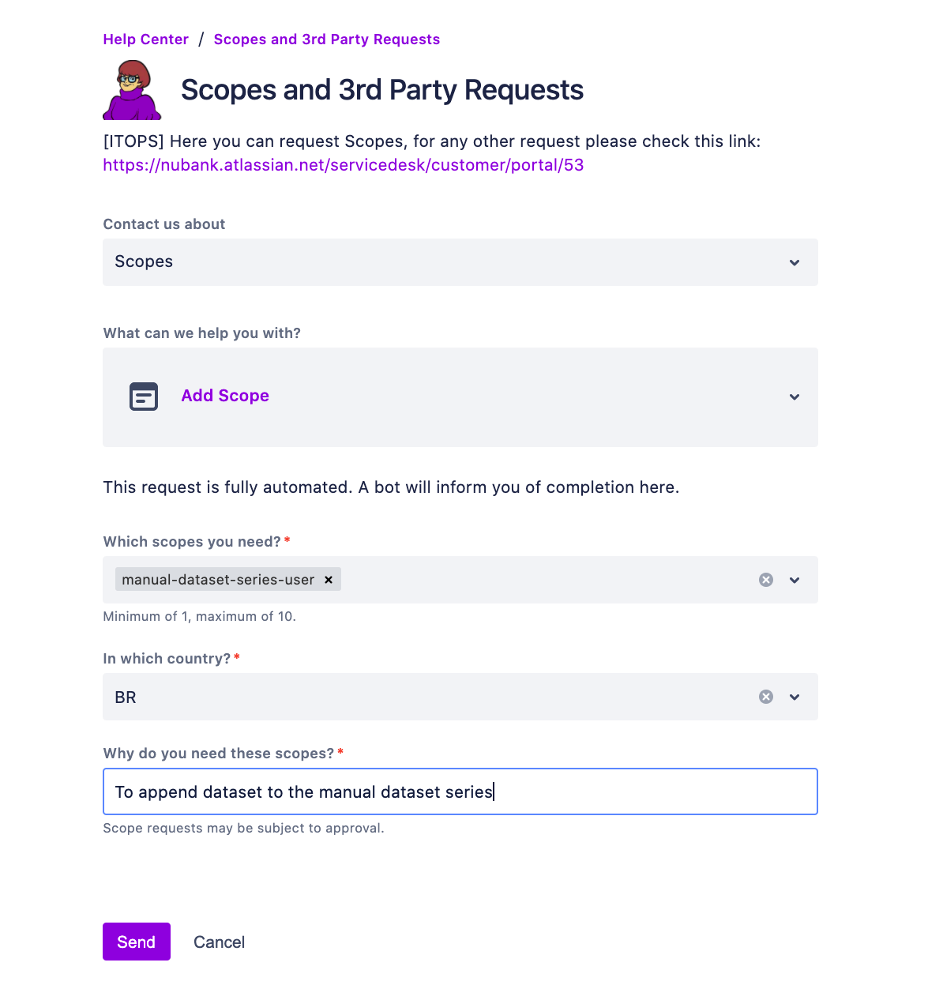
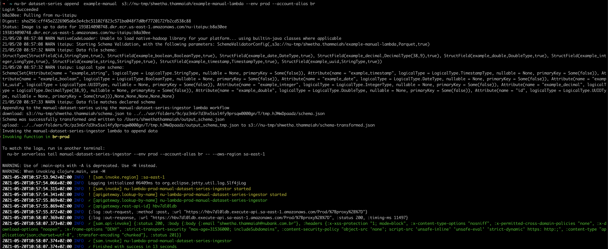

# Manual Dataset Series

Manual dataset series allows you to periodically ingest non-service (i.e data not originated on our services) generated data into ETL. Many users of Nubank's data platform need to get slowly changing adhoc data into the ETL.


---

## Manual dataset series ingestion - new feature release on 25/05/2021

Starting **25th May 2021**, you can ingest data manually into your dataset series without requesting for access permissions to the bucket `nu-spark-metapod-manual-dataset-series` on #data-help channel.

---

## Table of contents

- [What's changed](#what-has-changed)
- [When do the new changes come into effect](#when-do-the-new-changes-come-into-effect)
- [What do I need to do as an MDSS user to migrate to the new workflow](#what-do-i-need-to-do-as-an-mdss-user-to-migrate-to-the-new-workflow)
- Steps to append data
  - [Prerequisites](#prerequisites)
  - [Required access permissions](#required-access-permissions-before-appending-your-dataset)
  - [Preparing the data](#preparing-the-data)
  - [Appending dataset to manual dataset series by invoking AWS Lambda](#appending-dataset-to-manual-dataset-series-by-invoking-aws-lambda) - _***New workflow***_
  - [Appending dataset to manual dataset series using Old workflow](#appending-dataset-to-manual-dataset-series-using-old-workflow) - _***Old workflow deprecates on 8th June 2021***_
  - [Creating dataset series contract op for new dataset series](#creating-dataset-series-contract-op-for-new-dataset-series)
- [Troubleshooting](#troubleshooting)
- [How does it work](#how-does-it-work)

---

## What has changed

DataInfra has modified the manual ingestion workflow so that users no longer need to ask for permissions to the s3 bucket `nu-spark-metapod-manual-dataset-series`.

With the new workflow, the Nucli append command internally invokes an AWS lambda that performs the copying of parquet files and committing of data to the ETL. The lambda has the required write permissions to the `nu-spark-metapod-manual-dataset-series` bucket, therefore users do not have to request for this permission going forward. Furthermore, protecting access to this bucket increases the security and safety of the ETL.

However, users now need a new scope `manual-dataset-series-user` to invoke the AWS lambda and this new scope can be requested via the [access request form](https://nubank.atlassian.net/servicedesk/customer/portal/29). This scope has a validity of 90 days compared to the previous access permission that was valid only for a week.

**Note:** If you need to append data immediately i.e until you raise a request for new scope and get access permissions, you can follow the steps provided in the _*[Appending dataset to manual dataset series using Old workflow](#appending-dataset-to-manual-dataset-series-using-old-workflow)*_ section. **Note that from 9th June 2021, MDSS no longer supports the data ingestion via old workflow. For more information, see the section _*When do the new changes come into effect section*_ below and plan your migration.**

## When do the new changes come into effect

- A new release of nucli will be available to all MDSS users on 25th May, 2021.
- **Users need to update their nucli and ask for the scopes to invoke the AWS ingestor lambda on the [access request form](https://nubank.atlassian.net/servicedesk/customer/portal/29).**
- Please note that, for all users to migrate to the new workflow conveniently, we will still **support the old workflow until 1st June 2021**. Data infra admins will grant bucket permissions until 1st June 2021.
- **From 2nd June 2021**, DataInfra will no longer provide permissions to access to the `nu-spark-metapod-manual-dataset-series` bucket.
- You can continue to append data to the ETL using the old workflow until 8th June 2021 with valid permissions you already have to the `nu-spark-metapod-manual-dataset-series` bucket.
- **From 9th June 2021 onwards all users are expected to use the new workflow that appends data with the AWS lambda.**

---

## New workflow - Manual dataset series ingestion by invoking AWS Lambda

### What do I need to do as an MDSS user to migrate to the new workflow

If you are the contributor to a manual dataset series (MDSS) who appends new data via NuCLI, then follow the ste-by-step instructions below for migrating from existing workflow (old workflow) to AWS ingestor Lambda involved workflow (new feature):

1. **Step 1:** Assuming that you have all the [prerequisites](#prerequisites), the first step is to
request for `manual-dataset-series-user` scope using the [access request form](https://nubank.atlassian.net/servicedesk/customer/portal/29). For detailed information on access permissions refer to the [Required access permissions before appending your dataset](#required-access-permissions-before-appending-your-dataset) section.

1. **Step 2:** Then update nucli by running the `nu update` command.

1. **Step 3:** Next, [Prepare data](https://github.com/nubank/data-platform-docs/blob/24412e3a325071ac1469acf1a2acd5c524efb23e/data-users/etl_users/manual_dataset_series.md#preparing-the-data) and [append data using the manual append command](#appending-dataset-to-manual-dataset-series-by-invoking-aws-lambda).

1. **Step 4:** [Create dataset series contract op for new dataset series](#creating-dataset-series-contract-op-for-new-dataset-series)

If you run into any issues/errors, report to DataInfra on the **#data-help** slack channel. Also request for support on #data-help channel whenever needed.

### Prerequisites

1. [Download and install Docker](https://download.docker.com/mac/stable/Docker.dmg), if you don't already have it installed. For more information, see the documentation on [Docker](https://docs.docker.com/docker-for-mac/install/) and [containers](https://en.wikipedia.org/wiki/Docker_(software)).
2. You'll need to have an AWS account and AWS CLI 1.18+ set on your machine to use ECR. For more information on ECR setup, see [ECR documentation on playbooks](https://playbooks.nubank.com.br/cicd/ecr/getting-started/).

### Required access permissions before appending your dataset

Make sure you have the following access permissions.

1. You need to have the scope `manua-dataset-series-user` to invoke the AWS Lambda, which automatically copies parquet files and commits the data to the ETL. If you haven't already requested for this scope, raise a request using the [access request form](https://nubank.atlassian.net/servicedesk/customer/portal/29). Data-infra-admins will review the request and grant access to you for 90 days. Your request will be addressed at the earliest possible time. Please be aware that the Data Infra team operates at a different timezone (CET). **You need this scope to use the new workflow.**

  **Important:** Granted scope expires if you don’t access the bucket for 90 days. To re-access, you’ll have to request scope by filling out the form again.

  

1. You'll need the `admin` scope for your AWS user. Use `nu-<country> sec scope show <your-firstname.your-lastname>` to see if you have the `admin` scope. If you don't, ask for it using the access request form pinned to the `#access-request` channel.

1. After getting the required scope, refresh your token by running the command - `nu-<country> auth get-refresh-token --env prod --country <country>`. The <country> is the country from where you are creating your manual series (eg: br, mx).

1. After refreshing your token, get a new access token using  - `nu-<country> auth get-access-token --env prod --country <country>` to use MDSS workflow. The <country> is the country from where you are creating your manual series (eg: br, mx).
1. Run the command `nu-br sec scope show <username> --env prod`
  to check if you have required scopes to append the data. The above command returns the result -  `Current scopes for <username> "admin manual-dataset-series-user"`.

#### To use the old workflow until 8th June 2021

- You'll need the `admin` scope for your AWS user. Use `nu-<country> sec scope show <your-firstname.your-lastname>` to see if you have the `admin` scope. If you don't, ask for it using the access request form pinned to the `#access-request` channel.

- After getting the required scope, refresh your token by running the command - `nu-<country> auth get-refresh-token --env prod --country <country>`. The <country> is the country from where you are creating your manual series (eg: br, mx).

- For copying dataset files to the bucket, you'll need to have the read and write access to that specific bucket. For access permissions, open a ticket in [#data-help](https://nubank.slack.com/archives/C06F04CH1), marking it with the `:data-infra-ticket` reaction, and asking for the following command to be run:

  ```
  For BR:
  nu iam allow <your.name> write bucket nu-spark-metapod-manual-dataset-series/<your-dataset-series>/* --until=1week
  For other countries:
  nu-<country> iam allow <your.name> write bucket nu-spark-metapod-manual-dataset-series-<country>-prod/<your-dataset-series>/* --until=1week
  ```

    Due to our permission infrastructure limitations, we can only grant access for one week at a time.

### Preparing the data

The way you prepare data is same for both the workflows - new and old workflow.

1. Place your parquet file on s3 somewhere (e.g., `s3://nu-tmp/your.name/my-dataset`) and place your logical type json schema in the same directory and name it `schema.json` (e.g., `s3://nu-tmp/your.name/schema.json`)

2. Add these files to a bucket of the country where you want to create the manual series. Examples of buckets: in BR `nu-tmp`, in MX `nu-tmp-mx`

#### Creating the Parquet file

1. Create a Parquet file from whatever tool / source you want. If you want to use the databricks, you do something like:

```scala
val importantData = spark.read.format("csv")
  .load("s3://nu-tmp/your.name/my-dataset.csv")

importantData
  .write.format("parquet")
  .mode("overwrite")
  .save("s3://nu-tmp/your.name/my-dataset")
```

Remember to place it on an S3 bucket, under a key for which you have read access (i.e `s3://nu-tmp/your.name/my-dataset`).

2. Open it up on databricks and take a look at the schema of the resulting dataframe:

```scala
val df = spark.read.parquet("s3://nu-tmp/your.name/my-dataset")
df.schema
// results in:
StructType(
  StructField(id,StringType,true),
  StructField(example_boolean,BooleanType,true),
  StructField(example_booleans,ArrayType(BooleanType,true),true),
  StructField(example_date,DateType,true),
  StructField(example_dates,ArrayType(DateType,true),true),
  StructField(example_decimal,DecimalType(38,9),true),
  StructField(example_decimals,ArrayType(DecimalType(38,9),true),true),
  StructField(example_double,DoubleType,true),
  StructField(example_doubles,ArrayType(DoubleType,true),true),
  StructField(example_enum,StringType,true),
  StructField(example_enums,ArrayType(StringType,true),true),
  StructField(example_integer,IntegerType,true),
  StructField(example_integers,ArrayType(IntegerType,true),true),
  StructField(example_string,StringType,true),
  StructField(example_strings,ArrayType(StringType,true),true),
  StructField(example_timestamp,TimestampType,true),
  StructField(example_timestamps,ArrayType(TimestampType,true),true),
  StructField(example_uuid,StringType,true),
  StructField(example_uuids,ArrayType(StringType,true),true)
)
```

You'll see that the Parquet schema looses some type information, for instance, UUIDs are stored as strings.
This is the reason we define our own logical type schema.

#### Defining the logical type schema

The logical type schema describes the schema of the dataset using our own internal schema language instead of that of Parquet. They differ a little bit, hence we don't have a tool to generate them automatically. Having said that, we do validate that the Parquet and logical type schemas match up before committing the dataset to the series.

How to generate the schema json automatically [here](https://nubank.slack.com/archives/CH99T2U9X/p1583425158036900) and a full example of the schema json [here](manual_series_schema.json). But you could run on databricks something like this:

```scala
val schemaManualData: String = schemaToManualDatasetSeries(Seq("PrimeyKey"), importantData)
```

Prepare this file, name it `schema.json`, and place it in the same directory on s3 where your Parquet file is at (i.e. `s3://nu-tmp/your.name/schema.json`).

You can run the folowing code to add `schema.json` to s3 through Databricks:

```scala
val schemaFileName: String = "schema.json"
val schemaFilePath: String = "s3://nu-tmp/your.name/%s".format(schemaFileName)

dbutils.fs.put(schemaFilePath, schemaManualData)
```

If a file with the same name already exists in the path, you need to remove the current file before adding the new one:

```scala
dbutils.fs.rm(schemaFilePath)
```

### Appending dataset to manual dataset series by invoking AWS Lambda

**New workflow**

1. Run the following command to check if the data is already on the current status of the series.

    ```
    nu-<country> dataset-series info my-series
    ```

    - If the series doesn't exist then you know you are starting fresh.

    - If it does exist, note the number of datasets in the series so we can verify if the number has increased after we append a new one.

1. Do a dry-run of the append to check that the schemas match up

    ```
    nu-<country> dataset-series append my-series s3://nu-tmp/your.name/my-dataset --dry-run
    ```

    If it fails you can get more information regarding the schemas by adding the `--verbose`  flag.

1. Once the schema validation is passed,run the append command

    ```
    nu-<country> dataset-series append my-series s3://nu-tmp/your.name/my-dataset
    ```

    The following example shows how the output would look if the command run successfully:

    

    - If there is an s3 file copy error, save the output of the command and ask on `#manual-dataset-series` channel.

    - Run the info command `nu-<country> dataset-series info my-series` again to see that your dataset was added.

### Appending dataset to manual dataset series using Old workflow

1. Run the following command to check if the data is already on the current status of the series.

    ```
    nu-<country> dataset-series info my-series
    ```

    - If the series doesn't exist then you know you are starting fresh.

    - If it does exist, note the number of datasets in the series so we can verify if the number has increased after we append a new one.

1. Do a dry-run of the append to check that the schemas match up

    ```
    nu-<country> dataset-series append my-series s3://nu-tmp/your.name/my-dataset --dry-run
    ```

    If it fails you can get more information regarding the schemas by adding the `--verbose`  flag.

    Once the schema validation is passed, ask on `#squad-data-infra` for write access to the manual series bucket if you don't  already have it.

1. Run the append command

    ```
    `nu-<country> dataset-series append <your-dataset-series> s3://nu-tmp/<your.name>/<your-dataset-series>  --env <env> --account-alias <country> --legacy`.
    ```

    During the feature rollout phase, if you would like to continue to use the existing workflow, use the `--legacy` flag.
    - If there is an s3 file copy error, save the output of the command and ask on `#manual-dataset-series` channel.

    - Run the info command again to see that your dataset was added `nu-<country> dataset-series info my-series`.


### Creating dataset series contract op for new dataset series

[Follow these instructions](dataset_series.md#creating-a-new-dataset-series) but be sure it set the `seriesType` to `Manual` in the contract SparkOp (`override val seriesType: SeriesType = SeriesType.Manual). This step remains same for both the workflows i.e. new and old workflow.

## How does it work

Standard event-based dataset series take a bunch of kafka messages (with the same schema), put them in an avro, and append that as a new dataset in a dataset series.

With manual dataset series, we prepare by-hand the dataset that will be appended to the dataset series and tell `ouroboros`, our metadata store, to include it in the series.

With the old workflow, this is done by running a CLI command that takes a Parquet file on s3 and the associated [logical type schema](../../glossary.md#logical-type-schema) encoded as a json.

With the new workflow, this is done by modified NuCLI append command that uses AWS lambda for copy operations on AWS s3. MDSS new workflow is using the existing manual-dataset-series-ingestor lambda for manual data ingestion workflow. The workflow continues to validate the data on your machine using an Itaipu image, but uses the lambda only to copy the parquet file and commit to Ouroboros.

We are using lambda with Amazon API gateway to route the requests to a lambda function that appends the data. To invoke the lambda, you must have required permissions i.e an authorization scope `manual-dataset-series-user`. When this scope is granted, you’ll be assigned with a token that allows you to use new MDSS workflow. Henceforth, you can invoke the AWS Lambda by running the append command, and the lambda function automatically copies the parquet files along with the associated [logical type schema](../../glossary.md#logical-type-schema) encoded as a json, and commits that data to the ETL.

The logical type schema describes the schema of the Parquet file using Nubank's custom type system. In Scala code we define this schema by having our SparkOps extend `DeclaredSchema` and defining the `attributes` field. Since we are working from the command line, we need to write this manually as a json file.

With the Parquet file and the schema file, the modified NuCLI command validates the logical type schema against the Parquet file, and uses tha lambda to copy the Parquet into a permanent location, and tells our metadata store about your new dataset.

## Questions

Checkout `#data-help` channel on slack.

## Troubleshooting

Following are the possible issues you may encounter with the new workflow:

### Lambda execution time-out error

#### Reason
AWS lambdas have a known limitation, they can only run for 15 minutes. If the lambda execution time takes longer than 15 mins then there could be a timeout error.

One possible reason for Lambda execution time-out is having a large dataset file, because of which an S3 file transfer takes more time to finish copying files.

#### Logs
You can view the lambda logs by running `nu-br serverless tail manual-dataset-series-ingestor` command in another terminal.
  
#### Solution
If your file size is too large, break your large file into smaller chunks of files.

### How can I check if the append was successful?

To check if the append was successful, the user can use the `nu dataset-series info <series-name>`.

### 401 Unauthorized

#### Reason

When you run the append command, if the response you encounter is 401 status code, or an unauthorized error, this means that you are trying to access the resource that has not been authenticated correctly and you must provide correct credentials and have necessary scopes to access that resource.

#### Solution

Run the command `nu-br sec scope show <username> --env prod` to check if you have required scopes to append the data. For eg, `nu-br sec scope show shwetha.thammaiah --env prod`.

The command should return the result -  `Current scopes for <username> "admin manual-dataset-series-user"`. If you don't have all the required scopes, refer to the _*[Required access permissions](#required-access-permissions-before-appending-your-dataset)*_ section.

### 504 Endpoint request timed out error

#### Reason

The AWS API Gateway that fronts the lambda that we internally use to copy the data over has a timeout of 30 seconds. If your file is large and the copy takes longer than 30 seconds you may face this API Gateway timeout error. Please note that the lambda continues to run to completion irrespective of this gateway error.
This is a limitation that we are aware of and plan to have a long term solution for tackling this error.

#### Solution

To get around this issue, we have built slack notifications that will notify the status of your append via the `lambda_token_v3` channel.

You can also check the status of the job by viewing the lambda logs.

Running the info command `nu dataset-series info <series-name>` would also be sure shot way of knowing the final outcome of the append operation.
You should rely on these methods to check if your append was successful.

---

### I appended a file to my dataset series but it's not appearing in the next run, how can I fix this

The most common reason for this is due to your dataset being dropped by Itaipu due to a mismatch between the schema you declared and the schema encoded in the `DatasetSeriesContractOp`. See the [dataset series mismatched schemas documentation](dataset_series.md#troubleshooting-dataset-series-schema-mismatches) for more information and how to remedy

### I appended wrong data to my series. How can I remove it

Data Infra can retract bad data you accidentally added to your series. **Please bear in mind that this is a fairly manual and non-scalable process for us at this stage, and so requesting deletion should be a last-resort in cases when you can't do it any other way.** Among alternative ways to achieve the same result, you can:

- Add a batch id column to your dataset series, which you populate with a random id whenever generating the parquet files, and then use to blacklist selected batches using a downstream ops, e.g.:

```scala
// when generating the parquet file, first add a batch id
val batchId = '<batch_id>'
val annotatedDf = myDf.withColumn('batch_id', lit(batchId))

// later on you can create an op downstream from the series contract:

def batchBlacklist: Set[String] = Set(...)
def definition(datasets) = {
 val df = ...
 df.filter(!batchBlackList.contains($"batch_id"))
}

```

- use the [dropped schemas api](dataset_series.md#droppedschemas) to get rid of files appended with incorrect schemas

- create a new version of the series (e.g. `my-series-v2`) when you wish to start from scratch. This is an especially good approach if you know you'll be iterating a lot on your series, and will ensure you don't need to depend to much on us to clear its state between each iteration.

In order for this process to be as smooth and quick as possible, you'll need to follow these steps:

- Run the following nucli command:

```
nu-<country> dataset-series info <my-series> -v
```

- Running the above should return a list of resources (files) and their ids. Find the resource you want to delete there (usually you'd look for the date at which you appended it) and get a hold of its `id` attribute
- Open a ticket on [#data-help](https://nubank.slack.com/archives/C06F04CH1), marking it with the `:data-infra-ticket:` reaction and providing:
  - your dataset series' precise name (e.g. `series/direct-mail`) and its country
  - the id(s) of the resources(s) you wish deleted
  - the reason for wishing to delete the data

**Important**: The word _deletion_ here does not necessarily mean that the data files are actually removed from S3 - they are only de-referenced. If you need to delete the actual files from S3 for compliance or security reasons, get in touch with the Data Infra team.

### Dos and Don'ts

---

#### **Do**

- Familiarize yourself with the documentation and recommendations on [dataset series](dataset_series.md).
- Check if the file types match with the .parquet file, the schema.json file and the dataset series in Itaipu.
- Have a column that indicates the upload date of the series file or version, which you can then use to filter out obsolete/wrong data.
- Beware of PII information - You can either classify the whole dataset as a PII clearance needed or hash the PII field. To know how to set the PII clearance, see the documentation on [PII handling](dataset_series.md#pii-handling).

#### Don't

- Create a MDSS with open PII fields.
- Just update the schema when your data structure has changed (added new fields etc), because you'll lose all the historical data (historical data will stop being included in daily results i.e the data isn't lost, just ignored). Instead, make use of the **alternativeSchemas** feature, in which your added fields will be null for old data.
