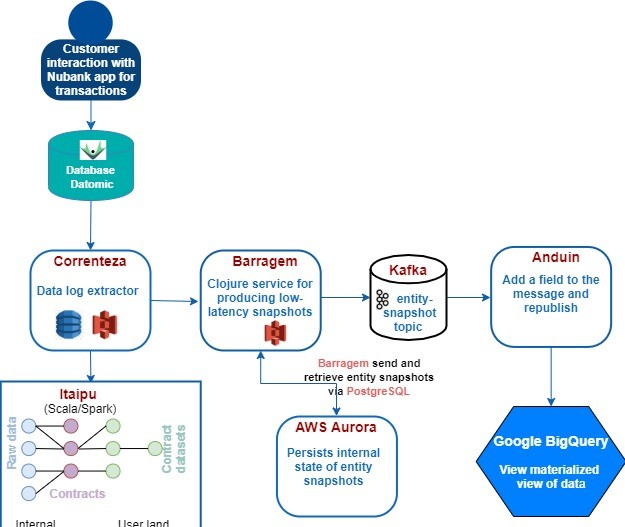

<!-- markdownlint-disable MD026-->

# How fresh data is processed and transformed?

The following diagram illustrates that the microservices ensure fresh data is processed, transformed into materialized views and then into contracts views, which are available in the Google BigQuery.

1. Correnteza, the data log extractor service, continuously extracts Datomic logs into avro files and saves the files on S3. The metadata of the logs extracted are saved on DynamoDB.

    !!! Note: When the data is available in Correnteza, an extraction is performed at least for every 15 minutes.

1. Barragem queries the Correnteza DynamoDB for every 15 minutes to retrieve the new log segments.

    - The log segments are processed and its internal state (which mirrors the original database's internal state) is persisted in AWS Aurora.
    - For each new transaction, entity snapshots representing the latest contract version of a transaction are published to a Kafka topic entity-snapshot.
1. Anduin then
    - Consumes messages from the entity-snapshot topic, transforms the messages into proper format by organising them into tables. Each row in a table will contain three attributes:
        - Meta
        - Attribute
        - BigQueryID
    - Using the BigQueryID, Anduin processes the data, and uploads entity snapshots into the Google BigQuery.
    - Creates the materialised views of data and the views are available in Google BigQuery.
1. Anduin pulls the schema of contracts from Itaipu to ensure that the schema of the contracts generated in Anduin are matched correctly.
1. The Google Cloud Storage in Google BigQuery stores the history of all the generated contracts data.

!!! Note: Consuming data from Barragem and uploading the pivoted data into Google BigQuery process happens throughout the day.
