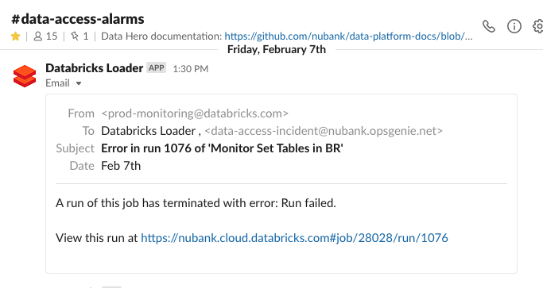
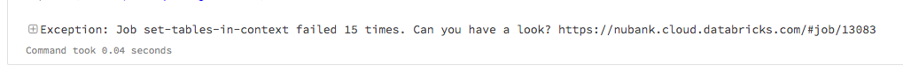
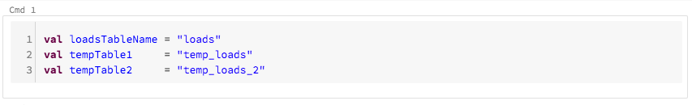

# Databricks Playbook

## Table of Contents

 - [A Databricks cluster is unhealthy](#A-Databricks-cluster-is-unhealthy)
 - [Identifying notebooks hogging the resources](#Identifying-notebooks-hogging-the-resources)
 - [Reaching out to Databricks](#Reaching-out-to-Databricks)
 - [Spinning a new cluster](#Spinning-a-new-cluster)
 - [Data Access' scheduled jobs](#Data-Access-scheduled-jobs)
     - [Manually run the autobump_itaipu_and_restart_clusters job
](#Manually-run-the-autobump_itaipu_and_restart_clusters-job)
     - [Monitor Set Tables in BR / MX](#Monitor-Set-Tables-in-BR--MX)
     - [Meta Loads](#Meta-Loads)

## A Databricks cluster is unhealthy

1. Check the Events page as well. The cluster must have scaled to the max numbers of workers before this happens. It should also be reporting errors of type - DRIVER_NOT_RESPONDING.
2. Open the Ganglia Metrics page of the cluster:
Databricks -> Cluster -> (Select the cluster) -> Metrics -> Live Metrics
3. Restart the cluster in the following scenarios:
    - If the load metrics are above the threshold then many jobs will start to fail.
    - If the cluster is out of memory then the notebooks will be stopping with GC errors.

It is possible that after restarting the cluster, the problem will start again. This is happening because there are notebooks that are hogging the resources of the cluster. Check the section on ["Identifying notebooks hogging the resources"](#Identifying-notebooks-hogging-the-resources)

## Identifying notebooks hogging the resources

1. Open the Spark UI
Databricks -> Cluster -> (Select the cluster) -> Spark UI
2. Go Inside Jobs and under active jobs you can see the list of jobs and the duration they have been running for.
3. The notebook with the outstanding duration should be the one you are interested in.
4. Either a single job is hogging the resources or there are a few heavy jobs holding the resources.
5. Based on the duration the jobs have been running, you identify them.
6. You can also further understand what's going on with the job, click on the link in description column and look at the stages that are active (not pending stages).
7. There will also be some job stages that might be stuck. They're the ones in which no further partition is being computed. These pending stages are blocking the query. This is a shuffling problem. Sometimes running the same job but by reducing the number of partitions.
`spark.conf.set("spark.sql.shuffle.partitions", "50")`
Check the number of default partitions here:
    List of clusters -> Select the cluster -> Configuration -> Spark -> spark.sql.shuffle.partitions
    In this case, isolate this notebook from the cluster by talking to the owner.
8. If there are lot of such jobs, ask the owners to move some of them to other databricks clusters. 

## Reaching out to Databricks
Under the current contract with Databricks, there are only two nubank email addresses allowed to create and ask support on the ticket. Though these email addresses can be changed anytime.
Contact #squad-data-access for this.

## Spinning a new cluster
The fastest way is to clone an existing cluster. For instance, if it's for general purpose use try cloning an existing `general-purpose-x` cluster.

Ensure this checklist applies:
1. Use the Standard Cluster Mode
2. Enable Autoscaling with a Min and Max depending 
3. Assign an IAM role to the cluster. If you have to add a new IAM role, create one in AWS prod account
4. Don't add permissions directly on the cluster. Rather use an existing user group or create one in 'Admin Console'. Add users to this group rather.
5. Check that the IAM role attached matches:

| Role                      	| Country 	| pii? 	|
|------------------------------	|----------	|------	|
| databricks-mx-pii         	| Mexico  	| Yes  	|
| databricks-mx-general     	| Mexico  	| No   	|
| databricks-br-general     	| Brazil  	| No   	|
| databricks-br-pii         	| Brazil  	| Yes  	|
| databricks-jobs-general   	| All     	| No   	|
| databricks-br-full-access 	| All     	| Yes  	|

6. Use the same Spark Config and Env Variables as the cluster you are cloning.

## Data-Access' scheduled jobs

| Job                                                                                   | Notebook                                              | Schedule            | Description                                                                                                                                                                                                                                                     |
|---------------------------------------------------------------------------------------|-------------------------------------------------------|---------------------|-----------------------------------------------------------------------------------------------------------------------------------------------------------------------------------------------------------------------------------------------------------------|
| [autobump_itaipu_and_restart_clusters](https://nubank.cloud.databricks.com/#job/8737) | [autobump_itaipu_parallel](https://nubank.cloud.databricks.com/#notebook/1510228) | Every day at 4:30am | 

Expand

This job fetches the latest itaipu fatjar available at runtime, detaches the old one from the clusters and attach the newly downloaded one. It also restarts each cluster after this to reflect the changes.

 |
| [set-tables-in-context](https://nubank.cloud.databricks.com/#job/13083)               | [national-load-two-names](https://nubank.cloud.databricks.com/#notebook/1321846) | Every 3 hours       | 

Expand

This job updates the tables context for the BR tables. It also here that we can filter long columns datasets, debug errors and read the execution logs.

                                                      |
| [mx-datasets-load](https://nubank.cloud.databricks.com/#job/19327)                    | [etl-international-load](https://nubank.cloud.databricks.com/#notebook/1223300) | Every 3 hours       | 

Expand

This job updates the tables context for the MX tables.

                                                                                                                                                       |
| [Monitor Set Tables in BR](https://nubank.cloud.databricks.com/#job/28028)            | [monitor-set-tables-in-context](https://nubank.cloud.databricks.com/#notebook/2378848) | Every 30 minutes    | 

Expand

This job monitors the `set-tables-in-context` job execution, which sends an alert to slack in case there is a failed run for the monitored job.

                                                              |
| [Monitor Set Tables in MX](https://nubank.cloud.databricks.com/#job/28047)            | [monitor-set-tables-in-context](https://nubank.cloud.databricks.com/#notebook/2378848) | Every 30 minutes    | 

Expand

This job monitors the `mx-datasets-load` job execution, which sends an alert to slack in case there is a failed run for the monitored job. 

                                                                  |

## Manually run the [autobump_itaipu_and_restart_clusters](https://nubank.cloud.databricks.com/#job/8737) job
This job runs [this notebook](https://nubank.cloud.databricks.com/#notebook/1510228) which updates the Itaipu version on the Databricks clusters.

It is scheduled to run daily 4h30 AM. 

**If this job fails then we have to run it manually.**
There are three parameters you need to pass:
1. `include_anotherbricks` - it is usually False. If you had to set it true you will know, check the link above for more information.
2. `itaipu_release_hash` - it takes the latest one by default but you can override it to install a particular build especially in case when a new build of Itaipu is failing. You can get the Hash from Quay.io under Itaipu Builds.
3. `clusters_to_bump` - This is a comma separated list of cluster names. If the field is empty, it will bump and restart every cluster. 

## Alarms

### Monitor Set Tables in BR / MX

In case we have many consecutives failed runs on the `set-tables-in-context` **for BR** or `mx-datasets-load` **for MX** the monitor will send a Slack message like this one:

When this happens we can either check the `set-tables-in-context` or `mx-datasets-load` job directly or we can access the link within the message.
It will also deem necessary to stop these alarms for the rest of the day until the dataset that are failing are fixed and merged on Itaipu in the next few days. For this go to the [notebook](https://nubank.cloud.databricks.com/#notebook/1321846/command/1321865) and in the last cell where it says checks for errorCount > 0 and fails, just increase the number to match the total number of loadErrors faced. But remember to revert the count back to 0 once the datasets are merged otherwise some errors will go unnoticed.

From there we can see exactly what happened and why it failed. We have most of the errors mapped out but sometimes we might get a new one, so we have to fix it and run the failed job again.

The recommended way of doing changes is by dupplicating the main notebook to your own workspace, that way you don't the original code but you have to keep track of the changes you make to apply it afterwards.

Whenever you have to manually run the notebook you will notice there are two parameters you can specify:

1. `env` - if it is different from `prod` it will not run the notebook.
2. `metapodTransactionId` - if it is blank it will fetch the latest. We can specify a valid one so it's datasets will be used.

### Meta Loads

For understanding's sake, we are basically backing up the table before doing changes to it, to two other tables.

If something goes wrong, the restoring should happen automagically.

| Job                  | Main table                 | Backup tables                                                  |
|----------------------|----------------------------|----------------------------------------------------------------|
| `set-tables-context` | `meta.loads`               | `meta.temp_loads`   `meta.temp_laods_2`                     |
| `mx-datasets-load`   | `meta.international_loads` | `meta.international_loads_1`   `meta.international_loads_2` |

The settings for each table are located in the first cell of each notebook.

