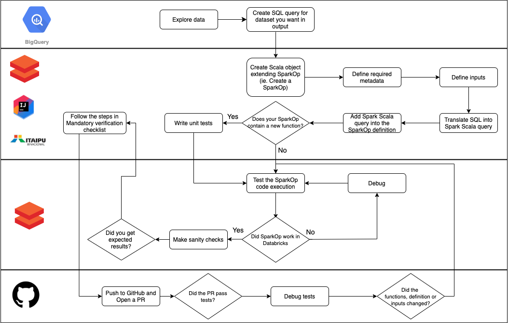

# Creating a Dataset

Using this guide, you will create a dataset that lists all calls made to Nubank's Ouvidoria. For your dataset, you will use contracts as input.

## Before you begin

There are different ways you can create a dataset. This means the input for your dataset (SparkOp) can be contracts that comes from services or, Dataset series (DSS), where the data comes from non-Datomic databases.

- Create a dataset with contracts as inputs
- Create a dataset using the existing dataset/s as input. It's recommended to use core dataset as an input for your dataset.
- Edit the existing dataset.

### High-level steps

There are many steps involved in creating a dataset, but the high-level steps are illustrated here:

You can find the detailed steps involved in creating a dataset in the following section, [Dataset creation Flow](#dataset-creation-flow) .

### Prerequisites

- [Basic machine setup, which will be taken care during your onboarding](https://github.com/nubank/playbooks/blob/8752e4d50535bf748435796e59ba4fb19f4d4d41/guilds/eng-onboarding/machine-setup/CHECKLIST.md). You can also reach out for help at #setup channel
- Access to Github, Databricks, Difizinho. If you don't already have access, check out the post on [Honey](https://honey.is/home/#post/857178). For Difizinho, reach out for access at #difizinho-help.
- [Setup](../../services/data-processing/itaipu/project_dev_setup.md) Itaipu
- Get yourself familiarize with the following:
  - Basics of Databricks - [Databricks Notebook](https://wiki.nubank.com.br/index.php/Databricks_Notebook) and [Databricks Tutorial](https://docs.databricks.com/onboarding/paths/index.html).
    - An overview of Apache Spark, a data processing platform
    - [Understanding the SparkOp class](create-dataset.md)

**Language fundemaentals**

- SQL, to be able to create your own queries. If you don't remember SQL, here is a refresher for you - [SparkSQL](https://docs.databricks.com/spark/latest/spark-sql/language-manual/sql-ref-syntax-qry-select.html) and [SQL](https://www.khanacademy.org/computing/computer-programming/sql)
- Just enough of Scala (an object-oriented and functional programming) programming language for creating your dataset.

### What you'll learn

- Important parts of the SparkOp
- How to transform SQL query into Scala code
- How to define input, definition and output for your SparkOp (dataset)
- How to rename columns using `.as` column method
- How to test your SparkOp/dataset
- Adding your dataset/SparkOp to Itaipu
- Things to be mindful of while creating a dataset

## Dataset creation Flow

- [Creating Dataset](create-dataset.md) - This guide describes the detailed steps involved in creating a dataset. It also provides tips to follow before and while creating a dataset and running your dataset on Databricks.
- [Testing Dataset](testing-dataset.md) - This guide describes the detailed steps involved in writing tests for your new dataset, adding it to Itaipu and creating a PR.
- [Verification checklist](dataset-verification-checklist.md) - This guide provides a quick check list before creating a PR with your dataset and tests.
- [Checking Dataset on ETL run](check-dataset-output.md) - This guide provides detailed information on how to check if your dataset has run on the ETL and committed, and is availble in Google BigQuery or Databricks for you to access.
