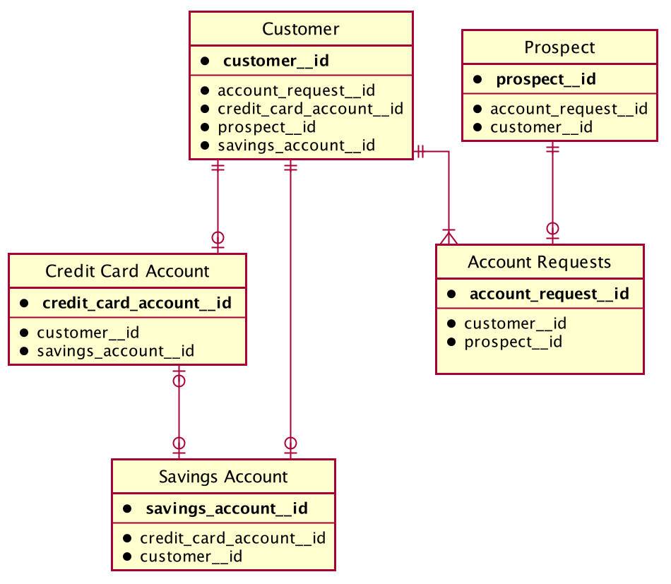

# Dimension Snapshots

## Objectives

The Snapshot datasets contain both the complete historical and most recent data for given dimensions. The historical data can be found in the daily datasets, while the most recent data will be stored in the current datasets. We expect the snapshots to centralize and materialize a lot of valuable information so that these transformations don't have to be built and processed in the ETL repeatedly.

### Approach

- The snapshots are generated using Dimensional Modeling which is a data modeling [set of techniques developed by Ralph Kimball](https://www.kimballgroup.com/data-warehouse-business-intelligence-resources/kimball-techniques/dimensional-modeling-techniques/).

## What are Dimension Snapshots

The Dimension Snaphot Datasets are datasets that result from a dimension, which is a set of reference information about an entity, eg. in the customer dimension we have a collection of references to customer attributes that will afterwards be materialized into a table.

### Connections

A dimension can have **connections** with other dimensions. When that happens, the attributes contained in the connected dimension get pulled into the first one, becoming part of it. In this case, it results in a _denormalized snapshot_. Otherwise, when there are no connections, the output is a _normalized snapshot_.
It is worth mentioning that the granularity will be determined by the main dimension.

This is the current entity relationship diagram present on the Core Data Mart:

The relationships are:

- 1 Customer can have 0 or 1 Credit Card Account
- 1 Customer can have 0 or 1 Savings Account
- 1 Customer can have 0 or many Account Requests
- 1 Prospect can have 0 or 1 Account Requests
- 1 Credit Card Account can have 0 or 1 Savings Account
- 1 Savings Account can have 0 or 1 Credit Card Account

Note: This relationships **do not** map directly to the entity relationships on services.
In every case that a entity relationship on the service realm is "reduced" on the core data mart
(for instance, in the service realm a customer can have multiple savings accounts
on the core datamart, they can have only one) we make the connection based on the "canonical" entity
(on that case, we would get the canonical savings account for that customer)

### Types of Dimension Snapshots

There are two types of snapshots that can be generated:

   1. The **Daily** Snapshot, which has entity-related attributes building a daily history of that entity. In other words, its grain is one row per entity id per day and the second dataset;

   2. The **Current** Snapshot, which is a dataset with the most recent records of the entity's attributes -- its grain is of one row per entity id. The current snapshot derives from the daily snapshot and they share the same schema with the exception of the `date` column.

### General Information

- **Daily dataset name**: `core/<dimension>-daily-snapshot`
- **Current dataset name**: `core/<dimension>-current-snapshot`
- [Code on Itaipu](https://github.com/nubank/itaipu/blob/master/src/main/scala/nu/data/br/core/dimensions/)
- [How to use it as an input for another SparkOp](https://github.com/nubank/itaipu/blob/master/src/main/scala/etl/warehouse/GUIDE.md#using-a-snapshot-as-an-input-for-another-sparkop)

### Snapshot Date/Time Columns

- **date**: date at which the snapshot refers to
- **snapshot_timestamp**: timestamp at which the snapshot was taken
