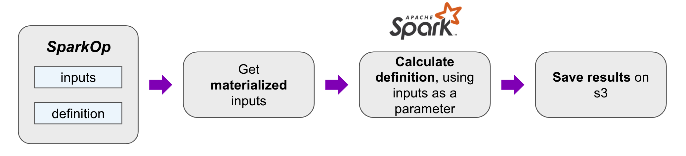
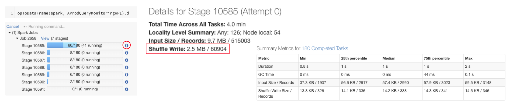
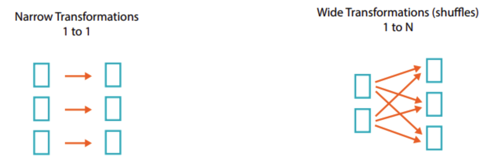

# SparkOp Best practices: Identify and address performance issues on SparkOps

This guide summarizes the best practices to follow while creating SparkOp. There is also a nice presentation on *[SparkOp best practices](https://honey.is/home/#post/875933)* with detailed explanation.

SparkOps are not from Apache Spark 😮. As we know, Apache Spark offers three data abstractions to handle sets of data: RDD, DataFrame, and Dataset with different APIs, performance, and ways of working. Picking the right data abstraction is fundamental for better Spark job execution and leveraging Spark's internal optimizations. While exploring the common ground between different problems from different domains, Nubank implemented an abstraction called “SparkOp” to work with Spark. SparkOp is a recipe for Spark transformations. The recipe is created by extracting Spark's underlying essence and coming up with a solution that adapts to different problems.

_*SparkOp is a Scala code designed to be executed during the Itaipu run in our ETL system. SparkOps are functions (the Op is an Operator), whereas datasets are concrete results (output of SparkOp) produced after SparkOp execution.*_ The output datasets are usually available on S3. In the Itaipu context, SparkOp is considered a Dataset. For more information on inputs to the SparkOps and how SparkOps are transformed to Datasets in Itaipu, refer to the *[How the data from data sources is ingested into ETL environment and transformed](https://github.com/nubank/data-platform-docs/blob/master/process-flows/data-transformation.md)* guide.

## SparkOp in Itaipu flow

 

### How to identify a heavy SparkOp

**Always test your SparkOp before adding it to Itaipu.**

Test your SparkOp using the [`opToDataFrame`](https://github.com/nubank/itaipu/blob/master/src/main/scala/etl/databricks/DatabricksHelpers.scala#L73) method. While running the test, you can see your SparkOp details and summary of metrics.

**One rule of thumb - Check the SparkOp performance on Databricks.**

Spark runs the job by breaking it into tasks and grouping the tasks into stages. If your SparkOp has multiple stages, consider it as a complex SparkOp. _*Usually,>20 stages can indicate a potential problem.*_

_*“If your SParkOp is slow on Databricks, it’ll almost always be slow on Itaipu; if your SparkOp is fast on Databricks, it will hopefully be fast on Itaipu (but not necessarily).”*_

- If your SparkOp is **running for more than 2 hours** on a general cluster in Databricks, consider it a heavy SparkOp(dataset).
- If your SparkOp never finishes running on Databricks, it will probably not run on Itaipu as well.

## Best practices to follow while creating a SparkOp

- Check each stage and verify the shuffle amount. If your SparkOp shuffles terabytes of data, it can then be flaky on Itaipu.
- If your SparkOp is heavy and running on Databricks for long hours (more than 2 hours), break your heavy SparkOp into multiple small SparkOps.
- Prefer creating SparkOp with narrow transformations vs. wide-transformations.

    Narrow transformations, Cost-efficient(no shuffles) - `filter,union,add column`;

    Wide transformations, Expensive (shuffles) - `join,reducebykey,groupbykey,distinct`.

    
- Reduce the number of joins in a single SparkOp
- Reduce shuffle operations on large datasets - groupbykey(), reducebykey() and join().

### Inputs for your SparkOp
You can create datasets using the following as inputs -

- Contracts
- Core datasets
- Existing other datasets

#### When to use Contracts, Core datasets, and reuse other datasets

Using Contracts, Core datasets, and reusing other datasets involves some trade-offs, and understanding these trade-offs will help you identify which one of them can be an input for your dataset.

Using contracts/core datasets is good because you are closer to the source of data, but it involves a lot other things. In terms of Contracts, you will always build a dataset from scratch, and have to understand the business logic of the service and chance for redundant calculations on the ETL.

On the other hand re-using datasets is good because it involves less calculations and is faster as your dataset is built using dataset/s that are already computed successfully during run. However, in case your dataset turned out to be flakier or failed, it is hard to debug, especially if you don’t own the input dataset. For example, if someone makes changes to the upstream datasets, which you have used in your dataset, it will then affect your dataset.

If you’d like to reuse the dataset/s, there are a few things to be mindful of, in order to avoid dataset failures -

- Use datasets that are owned by your Squad or BU
- Better performing datasets with in-time commits during run
- Datasets that don’t depend on too many datasets

### Points to consider while creating SparkOp(dataset)

Following are some recommendations that help you avoid dataset failure or long-running datasets during the Itaipu run.

- It's recommended to create a dataset that doesn't depend on too many datasets.
- It's recommended to use the [Compass tool](https://backoffice.nubank.com.br/compass/) to check the available datasets, column names, descriptions, types. Note that this tool displays datasets created with a declared schema.
- It's a mandatory step to ensure that your dataset passes through all the points mentioned in the [verification checklist](./basic-datasets/dataset-verification-checklist.md).
- If you intend to use a dataset as input and you need your dataset to commit in-time, check beforehand the input of your dataset commit time, historic stability.

    Use the following command to get the commit time of dataset/s:

    `nu etl info dataset/<dataset-name> --n=2`

    In google BigQuery, use the following queries to find successors and predecessors:

    `select name, <successors>
     from dataset.spark_ops
     where name = 'dataset/<dataset-name>'`

    `select name, successors
    from dataset.spark_ops
    where name = 'dataset/collections-late-financings'`

    `select name, predecessors
    from dataset.spark_ops
    where name = 'dataset/collections-late-financings'`

!!! Important
If you’re replacing or updating an existing dataset, it's recommended to use the [Difizinho tool](https://github.com/nubank/difizinho/blob/master/docs/GUIDE.md) to compare the previous dataset with the generated new dataset.
Insightful Dashboards on SparkOps

### Here are some dashboards that help you work with SparkOp

[UnderstandETL](https://nubank.looker.com/dashboards/2036): This dashboard provides the details of dataset commit times in recent runs. Inputs/Successors of SparkOp, size/shape of the DAG, execution time of the entire run. You can use this dashboard to pick the correct information for your SparkOp - by checking the desired SparkOp commit time, dependencies.

[Top 10 costly datasets in the previous run](https://nubank.looker.com/dashboards/2012?AirflowNode=&filter_config=%7B%22AirflowNode%22:%5B%7B%22type%22:%22%3D%22,%22values%22:%5B%7B%22constant%22:%22%22%7D,%7B%7D%5D,%22id%22:1%7D%5D%7D) - Use this dashboard to see how much it costs running SparkOps and owner squads.

[Data Governance visibility](https://nubank.looker.com/dashboards-next/etl::aprod-dgv?Bu=EXNP+%26+Growth&Squad=&Target+Date=yesterday): Use this dashboard to know about datasets with many predecessors, a list of high-impact datasets that need to undergo a maintenance check frequently, details about PII datasets, costly datasets, and more.

### See also

- [SparkOp best practices presentation](https://honey.is/home/#post/875933)
- [Optimizing SparkOp](../data-users/etl_users/optimizing_your_sparkop.md)
- [How the data from data sources is ingested into ETL environment and transformed](https://github.com/nubank/data-platform-docs/blob/master/process-flows/data-transformation.md)
