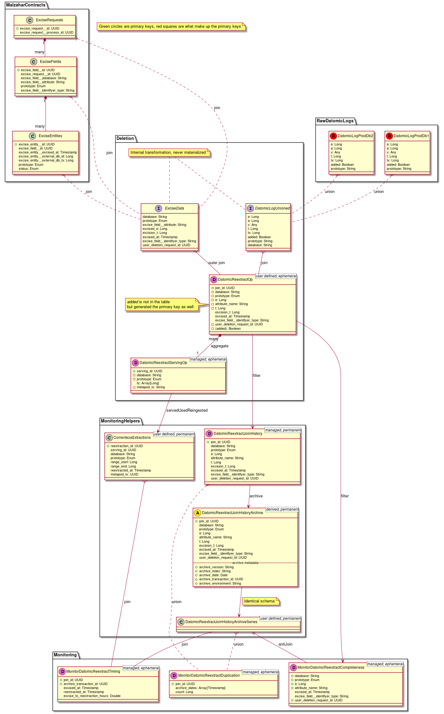

# Cookbook

## What this book covers

This playbook shows you how to set up data infra related parts of personally
identifiable information (PII) deletion from datomic databases. This includes
the mechanism to remove such information from the ETL as well as monitoring for
the removal process.

More specifically, it lists what you have to do in order to set this up for a
new country.

## Context: How datomic deletion works (in a nutshell)

First and foremost: Data infra does not delete PII data. Data protection has a
service called _Malzahar_ that creates excision requests for the datomic
databases. Once the excisions are performed on the production databases they
are not reflected in the ETL though. This is because in going with the normal
rationale of datomic where the database only ever grows and nothing is ever
lost, we already extracted the past of the database as logs and only extract
newer parts under normal circumstances. Until we re-extract the old logs after
the excisions have happened, the data will still be in the etl. Hence data
infra's part in the deletion is about _re-extraction_ in the case of datomic
databases.

Here is the flow:

* Malzahar does the excision requests
* Malzahar contracts give us information of what was scheduled for excision in
    which database and when
* We combine this information with our raw database logs which are used to
    create datomic contracts. As the deleted entities are still in those logs,
    the join with the malzahar contracts succeeds.
* We take the datomic `t` values from that join and send them to correnteza
    (our log extractor service). Correnteza figures out what needs to be
    reextracted and performs the reextractions.
* We update our log caches that merge older logs into larger parts and compute
    a recent snapshot of the database against which only new changes are
    computed each day.
* We get monitoring information about the entire process as described below.


## Getting ready

This playbook assumes that:

* The malzahar service already exists in your country and that its contracts
    are available
* You are comfortable with the process of contributing to itaipu: Adding a
    sparkOp and dataset series (DSS) contracts

Glossary of what needs to be known:

1. _Malzahar_: Data Protection Service that performs the excisions (datomic
   deletion) on the production databases.
2. _Correnteza_: Data Infra service that (re-)extracts datomic logs from the
   production databases.
3. _JoinOp_: Op that joins Malzahar contracts to our datomic raw logs to find
   which logs contain data that is supposed to be deleted and hence need to be
   reextracted. Also holds all the entities that cannot be joined for
   monitoring.
4. _JoinHistoryOp_: A filtered JoinOp with only successful joins. This op is
   archived to retain a history of what was found to be reextracted in the
   past.
5. _ServingOp_: Aggregation of the JoinOp that is sent to correnteza so that it
   can figure out which log parts to reextract.
6. _ReextractionDSS_: Dataset series about when correnteza reextracted what log
   parts and based on what serving layer information.
7. _MonitoringOps_: Ops that combine info from the JoinOp, the JoinOpArchive,
   the ReextractionDSS and Malzahar contracts to see if everything is working
   as expected.


## How to do it

Note: You can do all of these steps within a single PR. If you want to split it
into multiple smaller steps, you can do the last step separately. But the first
three steps need to be executed in the same PR, otherwise tests will fail.

### 1. Create the JoinOp

The op needs to know its country and a quality assessment, nothing more of the
normal attributes as they are all set in the abstraction.

Then the main task is to get the malzahar contract names and the raw logs of
the db's you are looking for.

The list of contracts/databases we excise from is as follows:

1. Acquisition
2. Bureau
3. Customers
4. KarmaPolice
5. Tubarao
6. Yellow pages

Not all of those exist for every country. Find the contracts that exist in the
countries respective `contracts` folder (e.g. `nu.data.mx.dbcontracts`) and add
those to your op. Here is a minimal example of the op that is needed for `mx`:

```scala
object DatomicReextractions extends DatomicReextractOp {

  override def country: Country                     = Country.MX
  override def qualityAssessment: QualityAssessment = QualityAssessment.Neutral(asOf = LocalDate.parse("2020-08-26"))

  override lazy val exciseRequestsName: String = DatabaseContractOps.lookup(ExciseRequests).name
  override lazy val exciseFieldsName: String   = DatabaseContractOps.lookup(ExciseFields).name
  override lazy val exciseEntitiesName: String = DatabaseContractOps.lookup(ExciseEntities).name

  override val v1Contracts: Seq[DatabaseContract] = Seq(Acquisition, Customers, KarmaPolice, BureauMX)
}
```

Don't forget to add your op to the package file: Unlike normally, this time you
add it to an attribute called `pii_deletion_datasets` instead of `all`:

```scala
// empty version of the attribute: fill your op into the Seq
def pii_deletion_datasets: Seq[DatomicReextractOp] = Seq(DatomicReextractions)
```

For a new country, this attribute still needs to be created.

Lastly, we have a simple unit test for ensuring the inputs are correct. Copy
that one from a country where the op already exists and adapt depending on
which contracts are used in the new country for deletion. `mx` example:

```scala
import org.scalatest.{FlatSpec, Matchers}

class DatomicReextractionsSpec extends FlatSpec with Matchers {

  "inputs" should "be correct" in {
    DatomicReextractions.inputs.toStream should contain allOf(
      "nu-mx/contract/malzahar/excise-fields",
      "nu-mx/contract/malzahar/excise-entities",
      "nu-mx/contract/malzahar/excise-requests",
      "nu-mx/raw/acquisition-s0/log",
      "nu-mx/raw/customers-s0/log",
      "nu-mx/raw/karma-police-s0/log",
      "nu-mx/raw/bureau-mx-global/log"
    )
  }

}
```

It is not a strict test but that is intentional: Just choose your initial set
to be tested against to be what is expected. As the sparkOp changes (more
prototypes, more contracts) this test _can_ be extended but does not fail if
it is not extended. The merits of keeping the list up-to-date in terms of
safety are too limited to enforce regular updates.

### 2. Add pii_deletion_datasets to the itaipu main

The `pii_deletion_datasets` attribute still needs to be picked up by itaipu to
include the ops for this country into the DAG. The place to do so is
[here](https://github.com/nubank/itaipu/blob/9f2a3dbc609d2183b8322440fa4de2948c580050/src/main/scala/etl/itaipu/Itaipu.scala#L67).
Add the package object and attribute for your new country once you have created
them.

### 3. Add mergulho anomalyChecks

Look for the
[DatasetSelector](https://github.com/nubank/itaipu/blob/69c98a87a082002497749f4b1346516222497bb8/common-etl/src/main/scala/common_etl/evaluator/steps/mergulho/DatasetSelector.scala#L35)
class of Mergulho. In the end you will find a `DefaultAllowList` where you can
add your dataset and the check you want to run. In this case, it should be the
`NewPIIDeletionAlertsCheck`. Add the three monitoring sparkOps to the list. You
should find the examples from `br` in there already.

In a future step we want to automate this as well, but getting the names in
here automatically isn't trivial for now.


## How it works

The first sparkOp you add in step 1 above is used in our `ManagedOps` section
to create 15 more sparkOps:

1. The ServingOp
2. The JoinHistoryOp
3. MonitorTiming: Check if reextraction of excised data is late
4. MonitorCompleteness: Check if every excised entity in malzahar is either
   served today or was joined in the past
5. MonitorDuplication: Check if any excised entity in malzahar is found in the
   current joins or the joinHistory twice: Indicating that it was served for
   deletion before but something went wrong
6. The JoinHistoryOpArchive DSS and predecessors (4 in total)
7. The ReextractionDSS and predecessors (4 in total)

The monitoringOps are set up in a way that they only contain rows for
errors/concerning information. We use mergulho row counts to check whether the
amount of lines in the monitoring tables has changed since yesterday. We alert
in our `#integrity-checks` slack channel in such cases.

## There's more

Here is a picture about the relation between the tables and their columns:



Legend:
* C: contract (also DSS contract)
* R: raw table
* I: internal table, never materialized. Here to make the flow of data more
    clear
* D: dataset
* A: archive
* Green circles: Primary keys. Red squares are what makes up the primary keys

## See also

[RFC for the monitoring system](https://honey.is/home/#post/865523)
