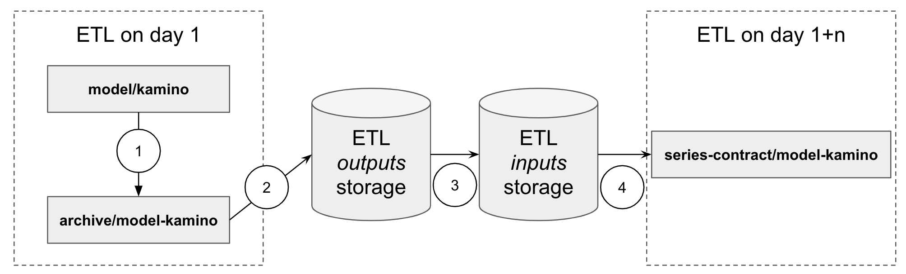

# Archive Series

The archive series system allows you to use outputs from a series of daily ETL runs as inputs to your datasets in the ETL. This document outlines the main features of this system, its guarantees and supported use cases.

## Overview

### Generating archives

For a dataset to be archived, you must set the `archiveMode` field to `ArchiveMode.CreateArchive` on the dataset's `SparkOp`.

During the ETL run, for any dataset marked for archiving in the version of Itaipu used by that run, a special `archive/` dataset will be generated. This dataset represents the archived data; it is enriched with special archive metadata columns (in particular, date of archiving and the unique identifier of the run that generated it) and its files are saved on a special permanent bucket where the files are not subjected to any lifecycle policy.

After computing the archive dataset and uploading its metadata to S3, Itaipu commits the archive dataset metadata to `metapod`, a service that manages metadata of the ETL *outputs*. Once the metadata is committed successfully, a notification is sent via Kafka to the `cutia` service. This service repackages the metadata of the archive datasets into a *dataset-series metadata* payload, which it forwards to `ouroboros`, a service that manages metadata for ETL *inputs*.  When `ouroboros` has consumed the payload, the archive is now available for any ETL run that starts thereafter.

### Reading the archives back into the ETL

Archives that were generated successuflly and saved in `ouroboros` are thereafter available in the ETL, where they can be accessed using the `DatasetSeriesContract` API. When setting up the `DatasetSeriesContract` , the users must ensure the schema declared on the contract is the same as the schema of the dataset being archived. In some cases, this can be automated.

The `DatasetSeriesContract` system also allows for schema evolution, including breaking schema changes. In this case, the contract can handle reconciling the different versions based on specifications set out by the user. **The `DatasetSeriesContract` does not perform automatic reconciliation,  and can only process schemas that it is aware of. If the schema of a dataset being archived is modified, users should take care to update the corresponding `DatasetSeriesContract` to ensure their data pulls through correctly to the ETL.**

Refer to the [DatasetSeriesContract documentation](../dataset_series.md) for more details.

### Example Flow

Visualisation of the simplified flow of archives for a hypothetical `model/kamino` dataset.

1. After `model/kamino` is computed, the ETL computes a special dataset called`archive/model-kamino` to contain the archive entry fo this dataset for this run. This dataset will contain additional columns containing metadata about the run that generated them, including date and the`metapod` transaction id.
2. When `archive/model-kamino` is computed successfully, its data is saved along with other outputs of the run.
3. The archive data is asynchronously made available in the ETL inputs storage.
4. When the a future ETL run starts, it queries the inputs storage and uses any archive data available in it, based on the schema specifications made available in the its `DatasetSeriesContract`. The output is the `series-contract/model-kamino` dataset which can be used as an input by other datasets in the ETL.

## How to use the archive system

- This is covered in the [archived dataset](../archived_datasets.md) documentation

## System behaviour, SLOs and failures

### SLOs

System SLOs are guarantees that Data Infra will try to maintain on the system on a best effort basis. When these SLOs are broken, Data Infra commits to proactively communicating this to the users and looking for speedy ways to resolve the issue.

- Data Infra guarantees that datasets computed correctly and marked for archiving will be archived. Exceptions:
  - datasets in the lineage of models may fail archiving if the schema of the model output does not match the declared schema of the archive. See common failure modes down below
- **Data Infra guarantees that the archive for a given day will be available with a lag of at most d+2, meaning an archive is not guaranteed to be available on the day immediately following the run in which it is generated.** At the time of writing this document, we estimate that only 95% of archives are available on the next day on average (this number should not be considered part of the SLO and is given for information purposes only)
- Data infra guarantees that once the archive for a day has been included in a run successfully, it will always be available to the following runs and will be included provided the `DatasetSeriesContract` is still correctly configured to pull it in.

As with all Data Infra SLOs we bring your attention to the fact that ETL stability depends on quite a few factors, and that issues unrelated to archives themselves may impede our ability to deliver on these SLOs during particularly severe ETL crashes. For this reason, we encourage users of this system to consider adding safeguards whenever using archives, to allow for skipping days for example.

### Risks and failure modes

The archive system involves a few moving parts and dependencies, and so is susceptible to various kinds of failures. It is recommended for users to familiarise themselves with these failure modes and attempt to build mitigations against these failures in datasets and flows which rely on archive datasets.

#### Archive generation failures

##### Archive generation does not take place due to the upstream dataset not being computed

While this failure mode may seem evident, we include it here nonetheless to stress that archives are ultimately the last item of a long chain of dependencies, and so are only as reliable as their most most fragile dependency. It's not uncommon for ETL datasets to suffer from bugs which may lead to them and their downstreams having to be committed empty for a given day, and flows depending on archives should be prepared for this possibility where possible.

###### Possibility to recover the archive

For critical use cases where the archive for that day should be recovered, a ticket should be opened in #squad-data-infra for further discussions. Depending on the type of failure and competing priorities, we cannot guarantee the archive will be recoverable.

###### Status of the data

If the archive is not recovered, the data is lost.

##### Archive generation fails due to archive schema error

The `SparkOp` of a dataset marked for archiving needs to implement the `DeclaredSchema` trait on Itaipu. For datasets produced by Itaipu, checks are in place to always guarantee that the data produced by a given `SparkOp` always matches the `DeclaredSchema`. However, some ETL flows involve data being introduced into the ETL from sources not managed by Data Infra, for which schema validation may not be in place.

In the case when a mismatch between the produced data and the declared schema is detected at runtime, archiving of the dataset is aborted and no archive is produced for this dataset on this day.

For this reason, users are encouraged to be aware of the lineage of their datasets being archived in case this lineage includes un-checked data sources. Datasets downstream of Python models are particularly susceptible to these kinds of issues.

###### Possibility to recover the archive

For critical use cases where the archive for that day should be recovered, a ticket should be opened in #squad-data-infra for further discussions. Depending on the type of failure and competing priorities, we cannot guarantee the archive will be recoverable. Note that failures from external schema mismatches are particularly hard to recover from in a timely manner.

###### Status of the data

If the archive is not recovered, the data is lost.

##### Archive generation is delayed

A new ETL run starts at 00:00 UTC every day. Since `DatasetSeriesContracts` are part of the input datasets of the run (they do not have upstream datasets), they are amongst the first to be computed. As soon as a `DatasetSeriesContracts` starts being computed, its source files are frozen in a snapshot, and no further data file will be added to this contract for the run of this day.

In cases when the ETL run of a given day is delayed, archive computing nodes may only be computed after 00:00 UTC of the next day, **meaning they may not be generated in time to be included in these file snapshots of the next run.**

###### Possibility to recover the archive

It will not be possible to re-include the archive into the run that it missed. However, it will be available in all runs moving forward without the need for any user intervention.

###### Status of the data

The data safe and will be available in the next run after the situation is back to normal, that is when the late archive node completes.

#### Archive consumption failures

##### Archive Series Contract ignores data due to schema mismatch

`DatasetSeriesContracts` allow users to specify both the expected schema of an archive dataset, but also any schema this dataset may have historically had, via the `alternativeSchema` API. In order to allow for proper integration testing of all the datasets in the ETL, only archives for which a schema is correctly declared in the `DatasetSeriesContracts` will be included in a given run. In the case when an archive has no matching schema on the `DatasetSeriesContracts`, it is simply ignored by Itaipu and its data will not be included in the current run.

###### Possibility to recover the archive

It will not be possible to re-include the archive into the run that it missed. However, it will be available in all runs moving forward once the user has fixed the mismatching schemas. Refer to the `DatasetSeriesContracts` [documentation for more information on schema management.](../dataset_series.md)

###### Status of the data

The data safe and will be available in the next run after the situation is back to normal, that is when the series contract is fixed to correctly match the schemas of the input data.

## Use cases

### Supported use cases

#### Expose or monitor historical views of a dataset output

The archive system allows you to build a historical view of the outputs of a given dataset.

#### Speed up the computing of a dataset

Archives can be used to lighten the load on Spark by allowing you to reuse data from previous run to some extent.

### Unsupported use cases

#### Incremental computations on strict daily basis

The archive series system described above could be used to compute a dataset in an incremental manner each day – reusing outputs from the previous run and adding onto them sparingly.

While this use case is technically possible with the archive series system, it is currently not recommended for users to to use it in this way, as Data Infra cannot currently guarantee that the archive of a dataset generated during a run will be available in the run following run.
