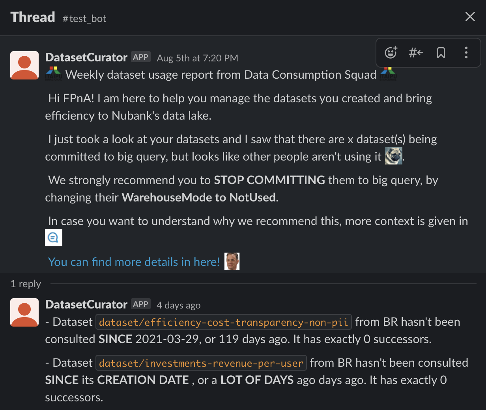

# Improving Quality and Discoverability by Reducing the Unused Datasets Available

1. [Project Context](#project-context)
    1. [How will we make suggestions](#how-will-we-make-suggestions)
    1. [Eligible datasets](#eligible-datasets)
        1. [Metrics](#metrics)
1. [Communication plan](#communication-plan)
    1. [Goals](#goals)
    1. [Non Goals](#non-goals)
    1. [What to do if I receive a message](#what-to-do-if-i-receive-a-message)

## Project Context

The quick and almost frictionless growth of datasets increased the number of datasets from nearly 30k in July/2020 to up to 87k by July/2021. This accelerated expansion has increased the issue of having a huge number of datasets being committed to several data platforms, without necessarily being consumed in all of them. Having a number of datasets returned in searches without a clear utility is one of the Data Quality and Discoverability issues mapped in a recent survey. This content can be found on the sources of [interview notes](https://drive.google.com/drive/folders/170t3HpCmQqRsrZRqFaQdTPZyFgkSp1R6) and [historical gathered data and details of the deep-dive in the problems](https://docs.google.com/spreadsheets/d/1_zCOVzIfZOsppe-9Z_Q33IxZHr-GNciqNxzB0scv6oo/edit).

The main focus with this experiment is to enhance Data Quality and Discoverability, with it there is also a nice side effect that comes which is to reduce the costs of multi-cloud data transfering. This is our expected outcome by suggesting folks to **not load unused datasets into Big Query**.

### How will we make suggestions?

A slack bot will be created to promote this communication. The goal is to add this bot into the main squad channels, every week it will send a message if there are any datasets of that squad that meet our eligible criteria. This way we can better scale the impact of our usability analysis.

### Eligible datasets

We will be performing this experiment in several stages, starting with a conservative group and gradually increasing it until an impact is observed on the global baseline we have. 

The experiment will begin by acting upon datasets that meet the following rules:
1. The dataset must have warehouse mode set to Loaded
2. The dataset has 0 successors
3. The dataset has 0 queries in Big Query in the last 30 days
4. The dataset must belong to BR
5. The dataset cannot be a contract
6. The dataset must have clearance set to General

After applying these rules, we arrive at a list of 11 datasets. We plan to understand if the suggestions are making sense before adjusting rules to be more flexible, thus impacting other stakeholders.

#### Metrics

Currently we have 6,733 datasets with 0 successors that are loaded to Big Query and 1,935 of these datasets were not queried in the last 30 days
[(source)](https://docs.google.com/presentation/d/1s2iUmfwep-Slg1U5KFWjNciF01vHsbxZifritc3moCw/edit#slide=id.ge5b454b294_0_9). 

We don't have a target, we will focus on increasing the population of datasets affected by our suggestions and with time stop the metrics mentioned from increasing (or even decrease).

## Communication plan

### Early bird (alpha)

We will make an announcement that the bot will be released and people that already use postinho could benefit from it just by inviting the bot to the channel.

Depending on adherence, we may get in touch with the stakeholders to make sure all the squads that fall into the rule will be properly communicated.

### Beta and after

After the initial feedbacks and perceived value in the bot, we will gradually tune the rules to contemplate more squads and add the bot to their channels.

Anyone that has doubts about the way it works can get in touch with us at #squad-data-consumption

### Goals
- Make consumers save time and enhance the discoverability experience by reducing the amount of datasets returned in search
- Promote the mindset of checking whether the warehouse mode is really needed for the use case of a dataset
- Make nubank more efficient as a whole by reducing the amount of unused data transfer 

### Non Goals
- We don't want people to remove those datasets from itaipu, just set the warehouse mode to NotUsed
- We don't expect to impact datasets that are consumed via databricks (since they shouldn't be 
affected by warehouse mode, only BigQuery), however  as we don't have its logs, 
it remains an unknown issue at the moment

### What to do if I receive a message?

If you receive a message like [this one](dataset_usage/bot_sample_message.png), it is expected that you:

1. Find the mentioned dataset in itaipu
2. Stop Commiting it to BQ by setting WarehouseMode to NotUsed
3. Investigate potential impacts (looker or any other process that could use information from BigQuery)
4. Later, please tell us if the suggestion makes sense (we appreciate your feedback!)
