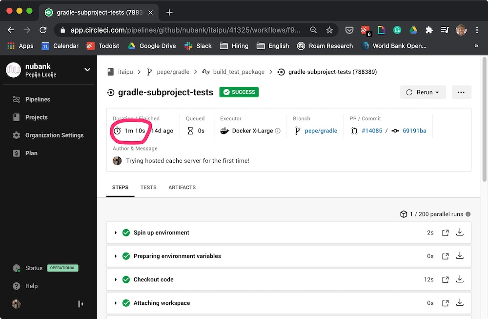
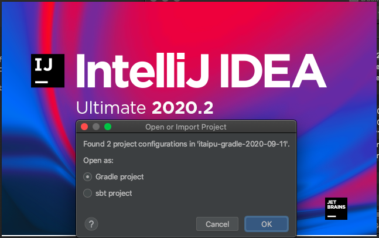

# Dratini

The project in which we explore options to tame the itaipu compile/test time dragon.
The initial announcement of the PoC happened on the [Data BU All-Hands 2020-08-19](#org7cc5b26).
The PoC concluded at the [Data BU All-Hands 2020-09-16](#orgc4c315d).

1. [Project Context](#orge62fea2)
2. [This PoC (Proof-of-Concept)](#org3d8b909)
3. [Results](#orgb57ce61)
4. [Next Steps](#org18fb17d)

## Project Context

1. [Why is the Data BU looking at itaipu's build performance?](#org4af3e6f)
2. [How can the Data BU shorten the itaipu cycle time?](#org89ddcbe)
3. [What do we need to make shorter cycle times a reality?](#orge045c51)

The project is related to the section on [Improvements to itaipu build times and Reliability of the Data BU 3 Year Strategy](https://docs.google.com/document/d/1mrNOS9PykTITC00iWFoCbyIISv71hpRpg32fDCVu6Fg/edit?ts=5f4d5641#heading=h.g07dcqtw46rg).

### Why is the Data BU looking at itaipu's build performance?

The performance of builds and tests affects the productivity of itaipu contributors.
Impacting not only those that are working on datasets, but also developers working on the platform (mostly inside the Data BU).

#### Cycle Time on Continuous Integration

Consider the concept of [software engineering cycle time](#org9887811).
Briefly, when contributors submit a pull request to itaipu, our continuous integration pipeline (currently running on Circle CI) starts.
The pipeline compiles all the code, runs all the tests and pings the contributor if there was a problem.
The problems vary from formatting issues to unit or integration tests failing.
The longer it takes before the contributor receives the automated feedback on their PR, the longer it takes until that contributor can merge their PR&#x2014;increasing the cycle time.

It can take minutes before the user receives the relatively simple formatting issue alerts.
Worse, integration test failures can take more than 30 minutes to surface.

##### TODO add circle ci examples

#### Cycle Time on Dev Machines

In addition to CI cycle times, we should also consider the local workflow of a contributor.
Imagine the scenario where a contributor pulls itaipu from master and starts changing a dataset.
The contributor then runs a test.
Surprisingly, this triggers a compilation of all the subprojects, even though they didn't change.
Wouldn't it be nicer if we treat itaipu subprojects similarly to how we treat library dependencies of JVM projects?
Not recompiling them.
Thereby shortening the cycle time.
Made possible by pulling a pre-compiled JAR from a hosted repository.

### How can the Data BU shorten the itaipu cycle time?

As stated in the [last section](#org8a64994), one of the problems in itaipu's build pipeline is that we build all code and run all the tests every time someone commits to itaipu.
We could slash cycle times by reusing compiled artifacts from prior builds.
We would compile only if the source code of a given subproject changes.
No changes?
We pull the previously cached artifact from a central server.
Similarly with tests: we save money by skipping tests when the underlying source code didn't change.

#### Simple downstream dataset change example

What happens currently when a contributor commits and pushes a small change to a very downstream dataset?
We recompile and retest `common-etl`, the library that contains the interfaces used in itaipu's main code.
Additionally, we also recompile and retest all other subprojects, such as `iglu`, `ab-toner`, `squidward`, etc.
We currently spend more than 5% of our Circle CI credits on these subproject tests, and even more on common-etl compilation and testing.

##### TODO we don't actually run all subproject tests on every commit

##### TODO add common-etl testing time

### What do we need to make shorter cycle times a reality?

We are currently not saving prior compilation results.
Yes, Circle CI has caching, but so far we have been unable to make it work well.
What's worse, it doesn't store test results.

Our current build tool, sbt, doesn't support centralized caching of artifacts.
We therefore set out to find a replacement of sbt&#x2014;one that supports a caching server.
By the way, [many find sbt needlessly complicated](#org4b93871).
Few Nubankers' tears will be shed should we move away from sbt.

## This PoC (Proof-of-Concept)

### Goals

- Lower the Circle CI time spent on itaipu `subproject-unit-tests` from 5% of total CI credits to 1%.

By:

- Reusing compilation artifacts across the company
- Not testing again that what did not change

As a bonus:

- Clearing the road towards a better grasp of Itaipu build tooling across the company

#### TODO Add details of the Circle CI benchmark

    |       Date | CI credits spent on subproject unit tests of total |
    |------------+----------------------------------------------------|
    | 2020-07-29 |                                        0.047502603 |
    | 2020-07-30 |                                         0.06871708 |
    | 2020-07-31 |                                        0.055326253 |
    | 2020-08-03 |                                        0.054067295 |
    | 2020-08-04 |                                         0.05426273 |
    | 2020-08-05 |                                        0.053715244 |
    | 2020-08-06 |                                         0.05351588 |
    | 2020-08-07 |                                        0.055068344 |
    | 2020-08-08 |                                        0.049929194 |
    | 2020-08-10 |                                         0.05765558 |
    | 2020-08-11 |                                         0.07546642 |
    | 2020-08-12 |                                         0.07374194 |
    | 2020-08-13 |                                         0.07737678 |

### Non-Goals

- Faster Scala compilation ([upgrading to Scala 2.12 seems to help with that](#org8571f78)).
- Replacing the build tool&#x2014;the purpose is to inform the Data BU.

### Approach

- Test another build tool than sbt
- Run a caching server
- Have successful builds of all itaipu subprojects

### Prior Work

Ex-Nubanker Gustavo Mendonca opened a PR in which he tried to get Bazel to work with Itaipu: <https://github.com/nubank/itaipu/pull/8055/files>.

## Results

1. [What became faster?](#orgbeff82a)
2. [Build tools considered](#org56179b5)
3. [Benchmark](#org2ec16f5)
4. [Getting a fresh clone](#org759c1c7)
5. [Diving in](#org2d7edb3)
    1. [Subprojects in Gradle](#orge48b859)
    2. [Running tests of common-etl](#org8298aa9)
    3. [Running tests of another subproject, iglu](#org960392e)
    4. [Final run, with all subproject tests](#org4115d28)
    5. [Parallel running with Gradle](#org8fbfd94)
    6. [show what happens when you change a file](#orgf3c552e)
    7. [Does it support building uberjars?](#orge487d2c)
6. [The cache](#org5b8bf22)
    1. [First attempt with cache server on AWS dev account](#orgca3273a)
    2. [Current server](#orgd20aa31)
7. [IDE integration](#orgde585f0)

<iframe src="<https://docs.google.com/spreadsheets/d/e/2PACX-1vSguoHTIUlXRcuP9T3NRmkiPiiC0SkidGfAFkZkEd0X-SXfe0rUruZ0ldl6V_vQ8SeM1TurP-UK1cnF/pubhtml?gid=0&amp;single=true&amp;widget=true&amp;headers=false>"></iframe>

### TODO What became faster?

- Initial development workflow doesn't get faster, because compilation is still slow
- Subsequent compilations or test runs are equal or slower in speed
- CI response times are faster

### Build tools considered

<table border="2" cellspacing="0" cellpadding="6" rules="groups" frame="hsides">

<colgroup>
<col  class="org-left" />

<col  class="org-left" />

<col  class="org-left" />

<col  class="org-left" />

<col  class="org-left" />

<col  class="org-left" />

<col  class="org-left" />
</colgroup>
<thead>
<tr>
<th scope="col" class="org-left">Build tool</th>
<th scope="col" class="org-left">Platform focus</th>
<th scope="col" class="org-left">Shared cache</th>
<th scope="col" class="org-left">Confusing</th>
<th scope="col" class="org-left">Incrementality</th>
<th scope="col" class="org-left">[Bloop Support](#org89e5fd1)</th>
<th scope="col" class="org-left">Adoption<a id="fnr.1" class="footref" href="#fn.1">1</a></th>
</tr>
</thead>

<tbody>
<tr>
<td class="org-left">Bazel</td>
<td class="org-left">Multi-language</td>
<td class="org-left">Yes</td>
<td class="org-left">No signal</td>
<td class="org-left">Yes</td>
<td class="org-left">No</td>
<td class="org-left">Broad</td>
</tr>

<tr>
<td class="org-left">Gradle</td>
<td class="org-left">JVM</td>
<td class="org-left">Yes</td>
<td class="org-left">No signal</td>
<td class="org-left">Yes</td>
<td class="org-left">Yes</td>
<td class="org-left">Broad</td>
</tr>

<tr>
<td class="org-left">Maven</td>
<td class="org-left">JVM</td>
<td class="org-left">Through Gradle</td>
<td class="org-left">No signal</td>
<td class="org-left">No</td>
<td class="org-left">Yes</td>
<td class="org-left">Broad</td>
</tr>

<tr>
<td class="org-left">SBT</td>
<td class="org-left">Scala</td>
<td class="org-left">No</td>
<td class="org-left">[Strong signal](#org4b93871)</td>
<td class="org-left">Yes</td>
<td class="org-left">Great</td>
<td class="org-left">Broad</td>
</tr>

<tr>
<td class="org-left">Pants</td>
<td class="org-left">Multi-language</td>
<td class="org-left">Yes</td>
<td class="org-left">No signal</td>
<td class="org-left">?</td>
<td class="org-left">No</td>
<td class="org-left">Narrow</td>
</tr>

<tr>
<td class="org-left">Mill</td>
<td class="org-left">Scala</td>
<td class="org-left">No</td>
<td class="org-left">No signal</td>
<td class="org-left">?</td>
<td class="org-left">Yes</td>
<td class="org-left">Narrow</td>
</tr>

<tr>
<td class="org-left">Fury</td>
<td class="org-left">Scala</td>
<td class="org-left">No</td>
<td class="org-left">No signal</td>
<td class="org-left">?</td>
<td class="org-left">Yes</td>
<td class="org-left">Narrow</td>
</tr>
</tbody>
</table>

##### TODO Why did Bazel not work out?

[Gradle vs Bazel for JVM Projects](#org796f1d0)

##### A Gradle vs Buck benchmark by Mobile Platform

<https://docs.google.com/spreadsheets/d/1r--DihvkBGGP6xQ0KA5cpa4fojdqiKfomm7GDeY8eqk/edit>

- Pure = current state.
- Tooling = some Gradle improvements.
- Cache = Gradle remote cache.

(thanks to Miguel Lemos)

### TODO Benchmark

<table border="2" cellspacing="0" cellpadding="6" rules="groups" frame="hsides">

<colgroup>
<col  class="org-left" />

<col  class="org-left" />

<col  class="org-left" />

<col  class="org-left" />

<col  class="org-left" />

<col  class="org-left" />
</colgroup>
<thead>
<tr>
<th scope="col" class="org-left">Job</th>
<th scope="col" class="org-left">(sbt) First</th>
<th scope="col" class="org-left">(sbt) Second</th>
<th scope="col" class="org-left">(Gradle) First</th>
<th scope="col" class="org-left">(Gradle) Second</th>
<th scope="col" class="org-left">Gain %</th>
</tr>
</thead>

<tbody>
<tr>
<td class="org-left">common-etl test</td>
<td class="org-left">&#xa0;</td>
<td class="org-left">&#xa0;</td>
<td class="org-left">&#xa0;</td>
<td class="org-left">&#xa0;</td>
<td class="org-left">&#xa0;</td>
</tr>

<tr>
<td class="org-left">all subproject tests</td>
<td class="org-left">&#xa0;</td>
<td class="org-left">&#xa0;</td>
<td class="org-left">&#xa0;</td>
<td class="org-left">&#xa0;</td>
<td class="org-left">&#xa0;</td>
</tr>
</tbody>
</table>

### Getting a fresh clone

Where are we?

    itaipu_dir="/tmp/itaipu-gradle-$(gdate --iso-8601)"
    
    rm -rf "$itaipu_dir"
    
    git clone https://github.com/nubank/itaipu --branch pepe/gradle --depth 1 "$itaipu_dir"
    
    cd "$itaipu_dir"
    
    pwd

Our working directory:

    /tmp/itaipu-gradle-2020-09-14

### Diving in

What is the last commit?

    git log -n 1

    commit 7b4e7c2fc0aeba2820bc814162870e3add4d2aed
    Author: Pepijn Looije <pepijn@users.noreply.github.com>
    Date:   Fri Sep 4 09:59:30 2020 -0300
    
        Merge branch 'master' into pepe/gradle

#### Subprojects in Gradle

What are the subprojects we have in Gradle?

    ./gradlew projects

The same subprojects we currently have in sbt:

    > Task :projects
    
    ------------------------------------------------------------
    Root project
    ------------------------------------------------------------
    
    Root project 'itaipu'
    +--- Project ':ab-toner'
    +--- Project ':brando'
    +--- Project ':common-etl'
    +--- Project ':iglu'
    +--- Project ':reconciliation'
    |    \--- Project ':reconciliation:heterogeneous_fixture'
    \--- Project ':squidward'
    
    To see a list of the tasks of a project, run gradlew <project-path>:tasks
    For example, try running gradlew :ab-toner:tasks
    
    BUILD SUCCESSFUL in 1s
    1 actionable task: 1 executed

#### Running tests of common-etl

Let's run the test suite of a subproject:

    ./gradlew common-etl:test

It finishes in very little time, thanks to getting results from the cache:

    > Task :common-etl:compileJava FROM-CACHE
    > Task :common-etl:compileScala FROM-CACHE
    > Task :common-etl:processResources
    > Task :common-etl:classes
    > Task :common-etl:compileTestJava NO-SOURCE
    > Task :common-etl:compileTestScala FROM-CACHE
    > Task :common-etl:processTestResources
    > Task :common-etl:testClasses
    > Task :common-etl:test FROM-CACHE
    
    BUILD SUCCESSFUL in 11s
    6 actionable tasks: 2 executed, 4 from cache

#### Running tests of another subproject, iglu

Where do the cached results come from? We can set `CACHE_DEBUG`.

    CACHE_DEBUG=true ./gradlew iglu:test

Check out the debug statements:

    > Task :iglu:compileJava NO-SOURCE
    
    > Task :iglu:compileScala FROM-CACHE
    --> GET https://staging-mobile-blue-gradle-cache.nubank.com.br/api/gradle/cache/f9bd34f723dad3e1bb29043e6c33639d
    X-Gradle-Version: 6.6.1
    X-Nu-Plugin-Version: 0.0.0
    Accept: application/vnd.gradle.build-cache-artifact.v1, */*
    --> END GET
    <-- 200 OK https://staging-mobile-blue-gradle-cache.nubank.com.br/api/gradle/cache/f9bd34f723dad3e1bb29043e6c33639d (847ms)
    Strict-Transport-Security: max-age=31536000; includeSubdomains
    X-Frame-Options: DENY
    X-Content-Type-Options: nosniff
    X-XSS-Protection: 1; mode=block
    X-Download-Options: noopen
    X-Permitted-Cross-Domain-Policies: none
    Content-Security-Policy: object-src 'none'; script-src 'unsafe-inline' 'unsafe-eval' 'strict-dynamic' https: http:;
    Content-Type: application/octet-stream
    Vary: Accept-Encoding, User-Agent
    Transfer-Encoding: chunked
    <-- END HTTP
    
    > Task :iglu:processResources NO-SOURCE
    > Task :iglu:classes UP-TO-DATE
    > Task :iglu:compileTestJava NO-SOURCE
    
    > Task :iglu:compileTestScala FROM-CACHE
    --> GET https://staging-mobile-blue-gradle-cache.nubank.com.br/api/gradle/cache/5484296bb780f66da25678f8acff8bd4
    X-Gradle-Version: 6.6.1
    X-Nu-Plugin-Version: 0.0.0
    Accept: application/vnd.gradle.build-cache-artifact.v1, */*
    --> END GET
    <-- 200 OK https://staging-mobile-blue-gradle-cache.nubank.com.br/api/gradle/cache/5484296bb780f66da25678f8acff8bd4 (150ms)
    Strict-Transport-Security: max-age=31536000; includeSubdomains
    X-Frame-Options: DENY
    X-Content-Type-Options: nosniff
    X-XSS-Protection: 1; mode=block
    X-Download-Options: noopen
    X-Permitted-Cross-Domain-Policies: none
    Content-Security-Policy: object-src 'none'; script-src 'unsafe-inline' 'unsafe-eval' 'strict-dynamic' https: http:;
    Content-Type: application/octet-stream
    Vary: Accept-Encoding, User-Agent
    Transfer-Encoding: chunked
    <-- END HTTP
    
    > Task :iglu:processTestResources NO-SOURCE
    > Task :iglu:testClasses UP-TO-DATE
    
    > Task :iglu:test FROM-CACHE
    --> GET https://staging-mobile-blue-gradle-cache.nubank.com.br/api/gradle/cache/01e3241ecd3751aa9d6e97c5cec7ca72
    X-Gradle-Version: 6.6.1
    X-Nu-Plugin-Version: 0.0.0
    Accept: application/vnd.gradle.build-cache-artifact.v1, */*
    --> END GET
    <-- 200 OK https://staging-mobile-blue-gradle-cache.nubank.com.br/api/gradle/cache/01e3241ecd3751aa9d6e97c5cec7ca72 (135ms)
    Strict-Transport-Security: max-age=31536000; includeSubdomains
    X-Frame-Options: DENY
    X-Content-Type-Options: nosniff
    X-XSS-Protection: 1; mode=block
    X-Download-Options: noopen
    X-Permitted-Cross-Domain-Policies: none
    Content-Security-Policy: object-src 'none'; script-src 'unsafe-inline' 'unsafe-eval' 'strict-dynamic' https: http:;
    Content-Type: application/octet-stream
    Vary: Accept-Encoding, User-Agent
    Transfer-Encoding: chunked
    <-- END HTTP
    
    BUILD SUCCESSFUL in 3s
    3 actionable tasks: 3 from cache

We are using Mobile Platforms' Gradle cache server for this PoC: <https://github.com/nubank/gradle-cache>
This server was already running (thanks to Miguel Lemos and Mateus Tanure), so it's low friction to use for this test.
In the future we probably want to use our own caching server, or think of another Nubank-wide approach perhaps?

One caveat: you have to be connected to the VPN to connect to the caching server.
This is why we can't really test this on Circle CI right now, since they don't offer static IPs for us to add to an allowlist: <https://support.circleci.com/hc/en-us/articles/115014372807-IP-Address-ranges-for-safelisting-Do-you-have-static-IP-addresses-available>-
Once we migrate to Tekton this should be fine.

    cat settings.gradle.kts

This is the config for the remote caching server:

    apply(plugin = "com.nu.caching")
    
    rootProject.name = "itaipu"
    include("common-etl", "reconciliation", "reconciliation:heterogeneous_fixture", "iglu", "ab-toner", "squidward", "brando")
    
    buildscript {
        repositories {
            mavenCentral()
    
            maven {
                url = uri("s3://nu-maven/gradle")
                authentication { create<AwsImAuthentication>("awsIm") }
            }
        }
    
        dependencies {
            classpath("com.nu.caching:http-cache:1.0.5")
        }
    }
    
    buildCache {
        // Let's keep a local cache because otherwise gradle defaults to ~/.gradle/caches,
        // which also caches JVM dependencies. Our custom directory should make it easier to instruct Nubankers in need of
        // help to destroy their local cache in case of trouble.
        local {
            directory = File(rootDir, "gradle-build-cache")
            removeUnusedEntriesAfterDays = 7
            isEnabled = true
        }
    
        // https://github.com/nubank/mini-meta-repo/blob/205986e3692e3f79cd4ac49833c2fa97d4e467fe/android/settings.gradle#L32-L48
        remote<com.nu.caching.NuBuildCache> {
            val isCI = System.getenv()["IS_CI"]?.toBoolean() ?: false
            val isCacheDebug = System.getenv()["CACHE_DEBUG"]?.toBoolean() ?: false
            val isCacheEnabled = System.getenv()["CACHE_ENABLED"]?.toBoolean() ?: true
    
            val nuToken = System.getenv()["GRADLE_CACHE_TOKEN"] ?: String(Runtime.getRuntime().exec("nu android gradle-token").inputStream.readBytes()).trim()
    
            url = "https://staging-mobile-blue-gradle-cache.nubank.com.br/api/gradle/cache/"
            token = nuToken
            isEnabled = isCacheEnabled
            isPush = isCI
            debug = isCacheDebug
        }
    }

#### Final run, with all subproject tests

    ./gradlew --parallel subprojectTests

    > Task :subprojectTests UP-TO-DATE
    > Task :common-etl:compileJava UP-TO-DATE
    > Task :common-etl:compileScala UP-TO-DATE
    > Task :common-etl:processResources UP-TO-DATE
    > Task :common-etl:classes UP-TO-DATE
    > Task :common-etl:jar
    > Task :ab-toner:compileJava NO-SOURCE
    > Task :ab-toner:compileScala FROM-CACHE
    > Task :ab-toner:processResources NO-SOURCE
    > Task :ab-toner:classes UP-TO-DATE
    > Task :ab-toner:compileTestJava NO-SOURCE
    > Task :ab-toner:compileTestScala FROM-CACHE
    > Task :ab-toner:processTestResources NO-SOURCE
    > Task :ab-toner:testClasses UP-TO-DATE
    > Task :ab-toner:test FROM-CACHE
    > Task :ab-toner:subprojectTests UP-TO-DATE
    > Task :brando:compileJava NO-SOURCE
    > Task :brando:compileScala FROM-CACHE
    > Task :brando:processResources NO-SOURCE
    > Task :brando:classes UP-TO-DATE
    > Task :brando:compileTestJava NO-SOURCE
    > Task :brando:compileTestScala FROM-CACHE
    > Task :brando:processTestResources NO-SOURCE
    > Task :brando:testClasses UP-TO-DATE
    > Task :brando:test FROM-CACHE
    > Task :brando:subprojectTests UP-TO-DATE
    > Task :common-etl:compileTestJava NO-SOURCE
    > Task :common-etl:compileTestScala UP-TO-DATE
    > Task :common-etl:processTestResources UP-TO-DATE
    > Task :common-etl:testClasses UP-TO-DATE
    > Task :common-etl:test UP-TO-DATE
    > Task :common-etl:subprojectTests UP-TO-DATE
    > Task :iglu:compileJava NO-SOURCE
    > Task :iglu:compileScala UP-TO-DATE
    > Task :iglu:processResources NO-SOURCE
    > Task :iglu:classes UP-TO-DATE
    > Task :iglu:compileTestJava NO-SOURCE
    > Task :iglu:compileTestScala UP-TO-DATE
    > Task :iglu:processTestResources NO-SOURCE
    > Task :iglu:testClasses UP-TO-DATE
    > Task :iglu:test UP-TO-DATE
    > Task :iglu:subprojectTests UP-TO-DATE
    > Task :reconciliation:compileJava NO-SOURCE
    > Task :reconciliation:compileScala FROM-CACHE
    > Task :reconciliation:processResources NO-SOURCE
    > Task :reconciliation:classes UP-TO-DATE
    > Task :reconciliation:heterogeneous_fixture:compileJava NO-SOURCE
    > Task :reconciliation:heterogeneous_fixture:compileScala FROM-CACHE
    > Task :reconciliation:heterogeneous_fixture:processResources NO-SOURCE
    > Task :reconciliation:heterogeneous_fixture:classes UP-TO-DATE
    > Task :reconciliation:heterogeneous_fixture:jar
    > Task :reconciliation:compileTestJava NO-SOURCE
    > Task :reconciliation:compileTestScala FROM-CACHE
    > Task :reconciliation:processTestResources
    > Task :reconciliation:testClasses
    > Task :reconciliation:test FROM-CACHE
    > Task :reconciliation:subprojectTests UP-TO-DATE
    > Task :brando:jar
    > Task :squidward:compileJava NO-SOURCE
    > Task :squidward:compileScala FROM-CACHE
    > Task :squidward:processResources NO-SOURCE
    > Task :squidward:classes UP-TO-DATE
    > Task :squidward:compileTestJava NO-SOURCE
    > Task :squidward:compileTestScala FROM-CACHE
    > Task :squidward:processTestResources NO-SOURCE
    > Task :squidward:testClasses UP-TO-DATE
    > Task :squidward:test FROM-CACHE
    > Task :squidward:subprojectTests UP-TO-DATE
    > Task :reconciliation:heterogeneous_fixture:compileTestJava NO-SOURCE
    > Task :reconciliation:heterogeneous_fixture:compileTestScala FROM-CACHE
    > Task :reconciliation:heterogeneous_fixture:processTestResources NO-SOURCE
    > Task :reconciliation:heterogeneous_fixture:testClasses UP-TO-DATE
    > Task :reconciliation:heterogeneous_fixture:test FROM-CACHE
    > Task :reconciliation:heterogeneous_fixture:subprojectTests UP-TO-DATE
    
    BUILD SUCCESSFUL in 11s
    28 actionable tasks: 4 executed, 15 from cache, 9 up-to-date

It finishes very quickly. :tada:
It's able to run this quickly because this code was compiled/tested before.
We'll have the CI push the compiled artifacts and test results to the caching server, after which contributors or subsequent builds on CI can download them as per this example.

Please refer to Circle CI to see the actual build times for the steps this replaces:

- `common-etl-tests`
- `subproject-unit-tests`
- some part of `build` (since it builds common-etl)

#### Parallel running with Gradle

Invoke with `./gradlew --parallel`.
Ensures proper usage of available resources.
Not supported by sbt today AFAIK, but [Bloop](#orgf514930) does.

    <====---------> 33% EXECUTING [1m 43s]
    > :common-etl:compileTestScala
    > :reconciliation:heterogeneous_fixture:compileTestScala
    > :iglu:compileScala
    > :brando:compileScala > Resolve files of :brando:incrementalScalaAnalysisFormain
    > :ab-toner:compileScala > Resolve files of :ab-toner:incrementalScalaAnalysisFormain
    > :reconciliation:compileScala > Resolve files of :reconciliation:incrementalScalaAnalysisFormain

#### TODO show what happens when you change a file

#### TODO Does it support building uberjars?

<https://docs.gradle.org/current/userguide/java_library_plugin.html>

### The cache

#### First attempt with cache server on AWS dev account

<https://app.circleci.com/pipelines/github/nubank/itaipu/41325/workflows/f950262d-8a9d-48be-aae4-c4a77756343b/jobs/788389>

Not secure, internet facing, killed quickly after started.

#### Current server

##### Read permissions

> As the `mobile-cache-read` is an staging scope any other engineer can give you this scope, except you (you can not give scopes to yourself).
> This way, feel free to ask any of your colleagues to run the following command changing the name.lastname for your own name and lastname.

<https://github.com/nubank/playbooks/blob/master/squads/mobile-platform/developer-environment/gradle-cache.md>

##### Write permissions

Pepijn has the 'CI token' that has writing permissions. Ping him if you want.

### IDE integration

Opening the project

## Next Steps

### TODO possible rollout scenarios

<table border="2" cellspacing="0" cellpadding="6" rules="groups" frame="hsides">

<colgroup>
<col  class="org-left" />

<col  class="org-left" />

<col  class="org-left" />

<col  class="org-left" />

<col  class="org-left" />

<col  class="org-left" />
</colgroup>
<thead>
<tr>
<th scope="col" class="org-left">Scenario</th>
<th scope="col" class="org-left">Contributor impact</th>
<th scope="col" class="org-left">Incremental compilation</th>
<th scope="col" class="org-left">Subproject dependency</th>
<th scope="col" class="org-left">CI effect</th>
<th scope="col" class="org-left">Local dev effect</th>
</tr>
</thead>

<tbody>
<tr>
<td class="org-left">"Cold turkey"</td>
<td class="org-left">High</td>
<td class="org-left">Not out of the box</td>
<td class="org-left">Native</td>
<td class="org-left">Faster and cheaper</td>
<td class="org-left">Faster clean build, slower incremental</td>
</tr>

<tr>
<td class="org-left">Nested build tools</td>
<td class="org-left">Small</td>
<td class="org-left">Yes, throught SBT</td>
<td class="org-left">SBT calling Gradle, then JARs</td>
<td class="org-left">Faster and cheaper</td>
<td class="org-left">Faster clean build, fast incremental</td>
</tr>

<tr>
<td class="org-left">CI only</td>
<td class="org-left">None</td>
<td class="org-left">N/A</td>
<td class="org-left">&#xa0;</td>
<td class="org-left">Faster and cheaper</td>
<td class="org-left">None</td>
</tr>
</tbody>
</table>

#### "Cold turkey"

Replace build tool completely.
Contributors need to change their IDE settings.

#### Nested build tools

Have SBT call Gradle&#x2014;installing it if missing&#x2014;and trigger builds of subproject JARs. Then depending on them.
Subproject developers need to switch to Gradle/Bloop though.
Itaipu main only contributors are unaffected.

#### CI only

Forget about changing local dev environments for now, but reap the CI speed/cost benefits.
Requires work to keep sbt and Gradle configs in sync.

#### There may be more options

Suggestions?

### "Modularization Revolution"

In order to get to super fast builds we need to split the main project of itaipu into smaller subprojects.
For this, I'm envisioning us to take a similar path as the **Guild Mobile Dev**: <https://app.slack.com/client/T024U97V8/CH8PP85JQ/thread/D2EGF043Y-1599841453.011600>
Analytics Engineers should take the lead in extracting their domain into subprojects.
They get faster local builds and tests while the total CI time decreases, benefitting all Nubankers as well.

### Think about the development workflow

An itaipu contributor should have instant (through caching) 'fresh' builds (e.g. pulling from master and running tests) and fast incremental compilation.
By switching to Gradle, we only get the former.
We do, however, have options towards incremental compilation.

As of writing during the development of the PoC, Gradle is not doing incremental Scala compilation on itaipu subprojects.
The documentation of Gradle’s Scala plugin mentions this feature, albeit with Scala 2.12 (we are currently using 2.11).
Whatever we do, it might be interesting to consider an actively developed and supported Scala-focused tool like [Bloop](#orgf514930) for the development workflow.

### Open Questions

#### What is the team structure for the follow-up of this project, if any?

TBD by Data BU.

#### Do we, and how do we convert all of itaipu contributors’ dev setups to the new build tool?

People are used to using SBT, either through IntelliJ, the command-line, or another setup.

#### Should we consider other build tools?

#### Integration test time still a problem

The PoC work won't affect the integration test time.

#### Worries about caching test results, will it not lead to problems?

##### TODO What happens in if you change a resources file in the project?

#### Bloop uses Coursier which has (had?) problems with private S3 maven repository

#### How difficult is it to replicate our uberjar from a non-sbt build tool

There were prior problems with replicating the current classpath when assembling the uberjar with a newer version of sbt.

##### TODO Replicate the uberjar from Gradle

## Appendix

### References

#### [Haoyi - SBT](https://www.lihaoyi.com/post/SowhatswrongwithSBT.html)

Haoyi is the author of many popular Scala projects, one of which is Ammonite.
He's a respected figure in the Scala community and doesn't like SBT.

#### [Lightbend - Scala 2.12](https://www.lightbend.com/blog/scala-compile-faster)

About Scala’s incremental Zinc compiler.

#### [Gradle vs Bazel for JVM Projects](https://blog.gradle.org/gradle-vs-bazel-jvm)

#### [Speedy Scala Builds with Bazel at Databricks](https://databricks.com/blog/2019/02/27/speedy-scala-builds-with-bazel-at-databricks.html)

#### <https://www.archunit.org/>

#### [Software Engineering Cycle Time](https://codeclimate.com/blog/software-engineering-cycle-time/)

#### [Bloop](https://scalacenter.github.io/bloop)

Bloop is a build server that's great for Scala development and under heavy development.

#### [Data BU All-Hands 2020-08-19](https://docs.google.com/presentation/d/1JWPu5ioXaIBpm3H9o2sTm0Ejy_HrIbittmD6eNXPRHk/edit#slide=id.g9175273ba6_4_0)

#### [Data BU All-Hands 2020-09-16](https://docs.google.com/presentation/d/11CHvwkZZ8ZDsvYcxbZE9TCyEhRCue1Qb2XkFyAh7v5w/edit#slide=id.g98f941548a_0_14)

### Project Name

By João Risso, Analytics Engineer.

### TODO Architecture diagram

How do CI, sbt, gradle, local dev, github, interact?

### TODO "developer productivity for large teams becomes critical, not merely important"

Add reference somewhere.

<https://codesync.global/uploads/media/activity_slides/0001/03/f2292f201aa6b04db8c4e0b9cfa191dd07c9ee14.pdf>

## Footnotes

<a id="fn.1" href="#fnr.1">1</a> Based on GitHub stars
