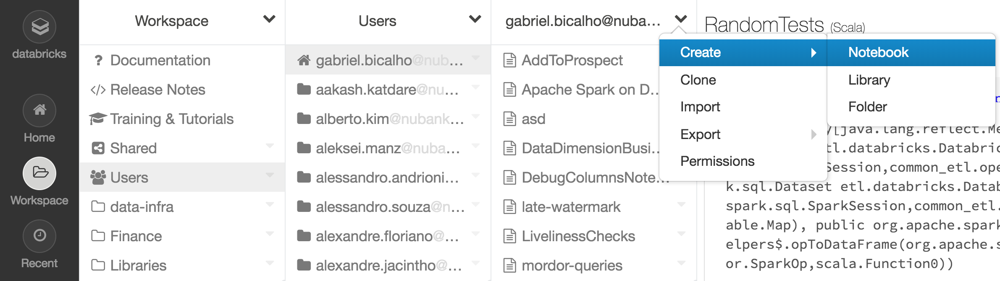

<!-- markdownlint-disable-file -->

# Creating a Dataset

### Summary
- [Preparation](#1---preparation) (Setting up Env/Scala/IDE)
- [Creating SQL Query in Databricks](#2---create-your-query-in-sql-in-databricks)
- [Understanding SparkOp Class](#3---understanding-the-sparkop-class)
- [Create your SparkOp class](#4---create-your-sparkop-class)
- [Extracting the correct input names](#5---extracting-the-correct-input-names)
- [Recreating your query in Scala](#6---recreating-your-query-in-scala)
- [Final Product](#7---the-final-product)
- [Testing](#8---testing)
- [Final Test](#9---final-test)
- [Running tests](#10---running-tests)
- [Adding it to Itaipu](#11---adding-it-to-itaipu)
- [Verification Checklist](#12---verification-checklist)
- [Finishing up and pushing](#13---finishing-up-and-pushing)

## 1 - Preparation

Follow the Itaipu [setup](../../services/data-processing/itaipu/project_dev_setup.md).

## 2 - Create your query in SQL in Databricks
Go to `https://nubank.cloud.databricks.com/` and create your own Notebook. There's this [Databricks Tutorial](https://docs.databricks.com/spark/latest/gentle-introduction/for-data-engineers.html) , designed for giving you a introduction to Spark running on Databricks. Also, the [entry on the wiki](https://wiki.nubank.com.br/index.php/Databricks_Notebook) is pretty useful. Feel free to read it to understand Databricks better.



Give it a nice name, because you're going to share with us later and we need to know what you're trying to do here.

Create it using `Scala` as the language and one of the `general-purpose-*` as the cluster.

In Databricks, if you want to use another language that isn't the default, you can simply begin your block with %name_of_language. In here, let us create a simple query to check on calls from Ouvidoria. It will be our example throughout the rest of the tutorial.

```sql
%sql
SELECT calls.call__started_at AS time
     , calls.call__id AS call_id
     , calls.call__our_number AS our_number
     , calls.call__reason AS reason
  FROM contract.stevie__calls AS calls
 WHERE calls.call__started_at > '2017-02-01'
   AND calls.call__reason IS NOT NULL
   AND calls.call__our_number = '08008870463'
```

## 3 - Understanding the SparkOp class

Every dataset you find in Itaipu is a SparkOp. The SparkOp class has six important parts:

- `name` property. It decides how your new dataset will be called in places such as Looker or Databricks once Itaipu runs. If `name = "dataset/name-of-dataset"`, then you'll be able to find it by querying dataset.name_of_dataset.

- `description` property. Description of what the dataset does, and why. This is useful to avoid confusion and help users to understand your dataset.

- `inputs` property. This is a set with the names of all the datasets you'll use in your query. **DON'T HARDCODE THEM.** Use the values we'll set further on.

- `definition` method. This is the core of your object. All the logic involved in creating your dataset will be placed here. Well, hopefully not **all** your logic, because you'll divide your code neatly into small functions that can be easily tested, won't you? Good.

- `attributes` property. This Set contains the definition of what your output will be. The column names, if any field is primary key or not, if it is nullable, the column **description** field etc.

- `ownerSquad` property. That's the squad that owns that dataset.

- [warehouseMode](https://github.com/nubank/itaipu/blob/master/common-etl/src/main/scala/common_etl/operator/WarehouseMode.scala) property. This is optional, and you should only set it to make your new dataset available for querying on the data warehouse (BigQuery), being the options:

|warehouseMode|Description|
|----------------|-------------------------------|
|WarehouseMode.NotUsed|This is the default option, and it makes the output data generated by your dataset to NOT be loaded to the data warehouse (BigQuery).|
|WarehouseMode.Loaded|When this option is used, the output data generated by your dataset is going to be loaded and available in data warehouse (BigQuery)|

- dataset names section. Here we'll get all the names of all the datasets we'll use and place them on variables with clear names. The reason why we do so will become apparent eventually.

## 4 - Create your SparkOp Class
In IntelliJ, go to `src/main/scala/etl/dataset` and see what folders there are. Choose your folder or, if there is none that fits your dataset, create a new one.

In it, create a new Scala class with the name of your new Dataset. The example below is  good template to follow.

*Tip: you can add the this to your IntelliJ templates by going to `IntelliJ > Editor > File and Code Templates` and save it with `Name: ETL - Scala Object` and `Extension: scala`*

```scala
package etl.dataset.${PACKAGE_NAME}

import etl.static.StaticOp

// if you are going to use some contract
import etl.contract.DatabaseContractOps
import etl.contract._folder_._contractFileName_

// If you are going to use some dataset, you need to import it if it isn''t on the same folder
import etl.dataset._folder_._subfolder_._datasetFileName_

// Imports you'll probably use. Remove the ones you don't, afterwards. 
import java.math.BigDecimal
import java.sql.{Date => SQLDate}
import java.text.SimpleDateFormat
import java.time.LocalDate
import java.util.{Date, UUID}

import common_etl.implicits._
import common_etl.metadata.{Country, Squad}
import common_etl.metadata.Squad.SquadName
import common_etl.metapod.{Attribute, MetapodAttribute}
import common_etl.operator.{SparkOp, WarehouseMode}
import common_etl.schema.{DeclaredSchema, DistConf, LogicalType}

import org.apache.spark.sql.{DataFrame, Row}
import org.apache.spark.sql.expressions.Window
import org.apache.spark.sql.functions._

object ${NAME} extends SparkOp with DeclaredSchema {
  //This is how you`ll access this database in the future, in Bigquery or Databricks
  //It must be on the form prefix-you-want-name-of-your-dataset
  override val name = "dataset/name-of-your-dataset"
  
  //Description of what the dataset does
  override def description: Option[String] = Some("Description Here")
  
  override val country = Country.BR
  
  //This sets the name of the squad who owns the dataset.
  //If your squad isn't in common_etl.metadata.Squad, please add it
  override val ownerSquad: Squad = SquadName

  //Optional. This is how you make the dataset available on BigQuery for querying
  override val warehouseMode: WarehouseMode = WarehouseMode.Loaded
  
  override val inputs: Set[String] = Set(fooName, barName, bazName)
  override def definition(datasets: Map[String, DataFrame]): DataFrame = {
    val foo = datasets(fooName)
    val bar = datasets(barName)
    val baz = datasets(bazName)

    myFunc(foo)
  }

  override def attributes: Set[Attribute] = Set(
    MetapodAttribute("some__id", LogicalType.UUIDType, nullable = false, primaryKey = true, description = Some("")),
    MetapodAttribute("another__id", LogicalType.UUIDType, nullable = false, description = Some("")),
    MetapodAttribute("some_amount", LogicalType.DecimalType, nullable = false, description = Some("")))

  // Defining a function in Scala
  def myFunc(df: DataFrame): DataFrame = df

  // If you want to use a contract, you get its name like this
  def barName: String = DatabaseContractOps.lookup(contractFileName).name
  
  // If you're using just another dataset, get the name like this
  def bazName: String = datasetFileName.name
  
  // Don't do this. Only villains do that.
  def fooName: String = "dataset/foo"
}
```
We'll explain everything that's in there in a bit. For now, just copy the contents of this file you've created, except the `package etl.dataset.${PACKAGE_NAME}`, into a new block in Databricks.

## 5 - Extracting the correct input names
We mentioned, in the `input` component of a SparkOp, that input names should not be hardcoded - there is a proper way to extract them, depending on the input type.
The overall flow is to find the ETL object that generates the dataset you want to use as an input, import it, and, then, extract the name from that specific object (sometimes, this will require usage of a special function). Usually, this name is stored into a value, since it will be used more than once in the code.

The most common entities you will come across on ETL are other SparkOps, contracts, core datasets and dataset series. For each of those, there is a different way of extracting names in order to use them as inputs:

- **SparkOps**

    SparkOps will usually be found under the `datasets` package. You just need to access their `.name` property. Below, we show how to extract the name of the `AmlConsultingCurrentPepList` SparkOp. The name you put under the `name` attribute of your SparkOp is what others will access when they use it as an input to their SparkOps.

    ```scala
    import etl.dataset.aml.restriction_lists.AmlConsultingCurrentPepList
    
    def AmlConsultingCurrentPepListName = AmlConsultingCurrentPepList.name
    ```

- **Dataset series**

    Dataset series will usually be found under the package `dataset_series`. In order to access their name, you need a special function, as shown below, where we extract the name of the `AmlConsultingPepDailyList` dataset series. For more information on dataset series, please refer to their [documentation](../../data-users/etl_users/dataset_series.md). 
    
    ```scala
    import nu.data.br.dataset_series.manual.aml.AmlConsultingPepDailyList
    import nu.data.infra.util.dataset_series.DatasetSeriesOpNameLookup
  
    val amlConsultingPepDailyListName = DatasetSeriesOpNameLookup.datasetSeriesContractOpName(AmlConsultingPepDailyList)
    ```
  
- **Core datasets**

    Core datasets will always be in the `core` package. In order to extract their names, you need to use special functions, depending on the kind of table you want to use as input. Below, you can see how to extract data for daily and current snapshot tables for the `CreditCardAccountDimension` core dataset. For more information on core datasets, please refer to their [documentation](./../../datasets/core-datasets/README.md).

    ```scala
    import nu.data.br.core.dimensions.credit_card_account.CreditCardAccountDimension
    import etl.warehouse.api.v1.DimensionNames
    
    val dailySnapshotName   = DimensionNames.dailySnapshot(CreditCardAccountDimension)
    val currentSnapshotName = DimensionNames.currentSnapshot(CreditCardAccountDimension)
    ```

- **Contracts**

    Contract datasets will always be in the `contracts` package. In order to extract their names, you need to use special functions, depending on the kind of table you want to use as input. Below, you can see how to extract data for the `Agreements` contract, as well as the history table for one its attributes, `agreement_status`. For more information on contracts datasets, please refer to their [documentation](./contracts.md).
    
    ```
    import nu.data.br.dbcontracts.sr_barriga.entities.Agreements
    import nu.data.infra.api.datasets.v1.Names
  
    val agreementsName              = Names.contract(Agreements)
    val agreementsStatusHistoryName = Names.entityAttributeHistory(Agreements, "agreement__status")
    ```

## 6 - Recreating your query in Scala
Jump back to your Databricks notebook and copy your class to a new cell. (Leave the package declaration out of it) e.g:

```scala
import ...
import nu.data.br.dbcontracts.stevie.entities.Calls

object OuvidoriaCalls extends SparkOp with DeclaredSchema {
  override val name = "dataset/ouvidoria-calls"
  override def description: Option[String] = Some("Dataset to list all calls made to Nubank's Ouvidoria.")
  override val country = Country.BR
  override val ownerSquad: Squad = Squad....
  override val inputs: Set[String] = Set(callsName)

  override def definition(datasets: Map[String, DataFrame]): DataFrame = {
    val calls = datasets(callsName)
    
    filterCalls(calls)
  }
  
  def filterCalls(calls:DataFrame) : DataFrame = {
  
  }
  
  override def attributes: Set[Attribute] = Set()

  def callsName: String = DatabaseContractOps.lookup(Calls).name
}
```
Pretty barebones, right? All we do is say we use the `ContractOp` `Calls`, located at `nu.data.br.dbcontracts.stevie.entities.Calls`. Then we call the `filterCalls` function, passing the `calls` Dataframe. But right now the `filterCalls` function is empty.

That `filterCalls` function is where we'll put our logic.

Let's make a query on our calls dataset, then. Let us add the first part of our `WHERE`.

```scala
def filterCalls(calls:DataFrame) : DataFrame = {
    calls where $"call__started_at" > "2017-02-01"
}
```
 There are a few things going on here, so let me break it down.
 
 First, there are no `return` keyword to be seen anywhere. That is because Scala returns the result of the last line of the function.
 
 Second, there is nothing connecting `calls` to `where`. That is because Scala does not care for `.`. `where` is a function of `calls` and we could have used `calls.where` in exactly the same way.
 
 Third, where are the parentheses? Calm down, this isn't Clojure. Often times in Scala, parentheses are optional. When the function you're calling only receives one parameter, for example, you can remove the parentheses.
 
 Fourth, what's up with the $"call__started_at"? That is our very special way of referencing columns. It basically means "Hey, go into the table you're in and get the column named call__started_at". However, you can also do it like this: `calls("call__started_at")`. The result is the same, and sometimes the second notation is necessary, such as when you're working on joins of tables with columns with the same name.
 
 Fifth, you can't compare a whole column to a string! That's not how types work! Why, yes you can. That is because `>` is actually a function, and that little space over there is actually a hidden `.`, just like in the `where` case above! `$"call__started_at" > "2017-02-01"` returns you which the lines of the column where the condition is true, comparing it value by value.
 
 So, if we take out all the Scala weirdness, the line
 ```scala
 calls where $"call__started_at" > "2017-02-01"
 ```
Becomes
```scala
return calls.where(calls("call__started_at").>("2017-02-01"))
```
Which just looks sad and horrible. So we'll use the Scala version because it is more readable and because if you don't we'll just deny your PR.
 
 Now, let's add the second part of our SQL's `WHERE`, the `AND calls.call__reason IS NOT NULL`:
 ```scala
 calls where $"call__started_at" > "2017-02-01" and $"call__reason".isNotNull
 ```
If you're testing it in IntelliJ instead of just copy-pasting it, you'll see that there's an error. It can't resolve the symbol `and`. Why? Because it doesn't know if you're trying to call `where($"call__started_at" > "2017-02-01").and()` or  `where(($"call__started_at" > "2017-02-01").and())`. We solve that by adding parenthesis on the right spots:
```scala
calls where($"call__started_at" > "2017-02-01" and $"call__reason".isNotNull)
```
Beautiful. Now onto `AND calls.call__our_number = '08008870463'`.
```scala
call where($"call__started_at" > "2017-02-01" and $"call__reason".isNotNull and $"call__our_number" === "08008870463")
```
Hey now, `===`? What's this, Javascript? No, thankfully. The `===` sign is used because you're a smart person that doesn't want to compare the column of a dataset to a string. The `===` sign means to compare each entry of the column individually with the string, and returns to you the entries that match.

And with that, our `WHERE` is done. Before we move on to the `SELECT`, lets break the line to find another problem.
```scala
call 
  where($"call__started_at" > "2017-02-01" and $"call__reason".isNotNull and $"call__our_number" === "08008870463")
```
If we do this, Scala won't recognize that `where` is a function call, so let's just wrap it all up with a couple of parenthesis, shall we?
```scala
(call 
  where($"call__started_at" > "2017-02-01" and $"call__reason".isNotNull and $"call__our_number" === "08008870463"))
```
Onto our select, then. We need the columns `calls.call__started_at`, `calls.call__id`, `calls.call__our_number` and `calls.call__reason`.
```scala
(call 
  where($"call__started_at" > "2017-02-01" and $"call__reason".isNotNull and $"call__our_number" === "08008870463")
  select($"call__started_at",  $"call__id", $"call__our_number", $"call__reason"))
```
Just like that. Now we need to rename the columns. The Dataset object has the method `.withColumnRenamed` which allows you to rename any column you want, but an easier way is to use the Column method `.as`.
```scala
(calls
      where($"call__started_at" > "2017-02-01" and $"call__reason".isNotNull and $"call__our_number" === "08008870463")
      select($"call__started_at" as "time",  $"call__id" as "call_id", $"call__our_number" as "our_number", $"call__reason" as "reason"))
```
Boom! Your definition is done!

We're still not done, though. Now we need to define what exactly are the types of the columns we output in our `definition` method. We do so in the `attributes`.
Take a look in the [LogicalType](https://github.com/nubank/common-etl/blob/master/src/main/scala/common_etl/schema/LogicalType.scala) class. It has all the types of objects you can have in your table. Our first field will be the `call_id`, which will be the primary key. As for the type, we check in the [Calls Contract](https://github.com/nubank/itaipu/blob/master/src/main/scala/etl/contract/stevie/Calls.scala) and see that the column `call__id` is of type UUIDType.
```scala
 override def attributes: Set[Attribute] = Set(
    MetapodAttribute("call_id", LogicalType.UUIDType, primaryKey = true)
  )
```
Next, the `time` column and the `our_number` column. They come, respectively, from the `call__started_at` and `call__our_number` columns in Calls, which are TimestampType and StringType.
```scala
 override def attributes: Set[Attribute] = Set(
    MetapodAttribute("call_id", LogicalType.UUIDType, primaryKey = true),
    MetapodAttribute("time", LogicalType.TimestampType),
    MetapodAttribute("our_number", LogicalType.StringType)
  )
```
Then... there is the reason field. The reason field is a bit different, because it is an EnumType. That means it has a restricted range of values it can posses. You *could* just copy and paste the values for it from the contract definition, but that would be **bad**. If someone ever alters the contract, your class will be broken. So we won't do that.
Instead we will get the possible values of the EnumType like this:
```scala
MetapodAttribute("reason", LogicalType.EnumType(enums = Calls.attributes.find(_.source == "call__reason") match {
      case Some(EnumAttribute(_, _, _, _, LogicalType.EnumType(possibleReason), _, _)) => possibleReason
      case _ => throw new Exception("Invalid Attribute in Calls")
    }))
```
Yeah, it isn't pretty, and we'll probably do something to wrap it neatly in a function in the future, but for now we got nothing.

Also, let's put a description on those fields, so to let people know what they're all about.

That finishes our definition.

## 7 - The Final Product
```scala
import common_etl.implicits._
import common_etl.metadata.{Country, Squad}
import common_etl.metapod.{Attribute, MetapodAttribute}
import common_etl.operator.{QualityAssessment, SparkOp, WarehouseMode}
import common_etl.schema.{DeclaredSchema, LogicalType}
import org.apache.spark.sql.DataFrame
import org.apache.spark.sql.functions._
import org.apache.spark.sql.{Column, DataFrame}
import etl.contract.DatabaseContractOps
import nu.data.br.dbcontracts.stevie.entities.Callse

object OuvidoriaCalls extends SparkOp with DeclaredSchema {
  override val name = "dataset/ouvidoria-calls"
  override def description: Option[String] = Some("Dataset to list all calls made to Nubank's Ouvidoria.")
  override val country = Country.BR
  override val ownerSquad: Squad            = Squad....
  override val inputs: Set[String]          = Set(callsName)
  override val warehouseMode: WarehouseMode = WarehouseMode.Loaded
  
  val dateToSearch = "2017-02-01"
  val phoneToFilter = "08008870463"

  override def definition(datasets: Map[String, DataFrame]): DataFrame = {
    val calls = datasets(callsName)
    filterCalls(calls)  
  }
  def filterCalls(calls:DataFrame) : DataFrame = {
    (calls
      where($"call__started_at" > dateToSearch and $"call__reason".isNotNull and $"call__our_number" === phoneToFilter)
      select($"call__started_at" as "time", $"call__id" as "call_id", $"call__our_number" as "our_number", $"call__reason" as "reason"))
  }

  override def attributes: Set[Attribute] = Set(
    MetapodAttribute("call_id", LogicalType.UUIDType, nullable = false, primaryKey = true, description = Some("Unique, UUID for each call")),
    MetapodAttribute("time", LogicalType.TimestampType, nullable = false, description = Some("UTC Timestamp for when the call started")),
    MetapodAttribute("our_number", LogicalType.StringType, nullable = false, description = Some("The number called to contact us")))

  def callsName: String = DatabaseContractOps.lookup(Calls).name
}
```
We've removed the date and the phone number we're searching for and put them into variables, se we don'have any "magical numbers" floating around. This way, if we ever need to change it, we won't have to scour the whole code looking for them.

Great! Run it on Databricks and see if it runs smoothly. Does it? Fantastic. Let's check it and see if we haven't done anything wrong.

The [DatabricksHelpers](https://github.com/nubank/itaipu/blob/master/src/main/scala/etl/databricks/DatabricksHelpers.scala) class has a few functions that can help us check if everything is alright with our Dataset. You can just run it and save it on memory with
```scala
import etl.databricks.DatabricksHelpers
val table = DatabricksHelpers.opToDataFrame(spark, OuvidoriaCalls)
display(table)
```
Or we can save it in a table in Databricks, so we can query it normally with SQL:
```scala
import etl.databricks.DatabricksHelpers
DatabricksHelpers.runOpAndSaveToTable(spark, OuvidoriaCalls, "your_folder_name", "ouvidoria_calls")
```
```sql
select * from your_folder_name.ouvidoria_calls
```
If check if everything looks good, if the table you just generated has the same amount of rows as the one you created with sql, etc. Check to see if it really does what you think it does.
Does everything look good? GREAT! Copy that beauty back into IntelliJ and format it using scalafmt!

But you're still not done. There are tests to be done.

## 8 - Testing
Imagine, the **distant future**. The apocalypse has happened! The machines have taken over the world! Aliens are invading! And they all have a single goal:
To mess your dataset up.
You can't let them do that, because that would be bad.
So you're going to make some tests to ensure that, even if the robot-aliens *do* mess your dataset, it won't actually be updated, because it won't pass the tests.
Or maybe someone updated the dataset and screwed something up. That could happen too.
So, anyway, here's what a test looks like. You can save this template IntelliJ under `Name: ETL - Scala Class Test` and `Extension: scala`
 ```scala
 package etl.dataset.${PACKAGE_NAME}

import etl.NuDataFrameSuiteBase
import etl.TestHelpers.checkDataFrameAssertion
import etl.implicits._
import org.scalatest.{FlatSpec, Matchers}

class ${NAME} extends FlatSpec with NuDataFrameSuiteBase with Matchers {
  import spark.implicits._

  "methodName" should "do something" in {
    val date   = nuSQLDate"2016-10-31"
    val number = 1L
    val amount = big"1337"
    val someId = "some-id"
    
    val input = ""

    val result = className.methodName(input)

    val expected = Seq(
      (1, "foo"))
      .toDF("num", "text")

    checkDataFrameAssertion(
      assertDataFrameEquals,
      expected,
      result)
  }
}
 ```
 The tests for your newly generated class are going into *almost* the same path as your class, except you're going to change the folder `main` to `test`. So if your class is in `src/main/scala/etl/dataset/folder_name/` then your test class will be in `src/test/scala/etl/dataset/folder_name/`. The test class should have the same name as the original class + Spec in the end. So `YourDataset` has the test `YourDatasetSpec`.
 
 When you decide to do real datasets, you'll divide your code into several functions, as to not create one single huge function that does everything. To ensure that every part works, you'll create tests for each one of these parts. In our case, though, since it is a small and simple query, we only have the filterCalls function to test.
 
 We do it like so:
 ```scala
 "filterCalls" should "take only calls from 08008870463 and from after 2017-02-01" in {

    //checkDataFrameAssertion(assertDataFrameEquals, expected, result)
  }
 ```
 
 What inputs does `filterCalls` need? Just the Calls ContractOp. So we're making a fake Calls table, with just the important fields, and feeding it to the function.
 
 What cases can we test? Well, we need test cases. What could make a record in our Calls table not appear in our OuvidoriaCalls table? 
 1 - It having happened after "2017-02-01"
 2 - It having a NULL call__reason
 3 - The number being different to "08008870463"
 So we'll create the following tests:
 
 | id  | time        | our_number  | reason                 |
 | --- |:-----------:| -----------:|:----------------------:|
 | 1   | 2016-10-13  | 11111111111 | call_reason__logistics |
 | 2   | 2017-10-13  | 11111111111 | call_reason__logistics |
 | 3   | 2016-10-13  | 08008870463 | call_reason__logistics |
 | 4   | 2017-10-13  | 08008870463 | call_reason__logistics |
 | 5   | NULL        | 08008870463 | call_reason__logistics |
 | 6   | 2017-10-13  | NULL        | call_reason__logistics |
 | 7   | 2017-10-13  | 08008870463 | NULL                   |
 
 1 won't pass because it has a wrong date and number. 2 has a right date, but wrong number. 3 has the right number, but wrong date. 4 should pass. 5 has NULL time, which is before "2017-02-01" , so it's out. 6 has a NULL number, so out too. 7 has a NULL reason, so out.
 
 So let us make our test. First thing to know is that, to create a date, you can use nuSQLDate"date_here" to create is easily. Second, when you have a null field, you have to worry about NullPointers. Anyone that has ever come a meter away from a Java programmer knows how bad those are. So, we don't use null when creating a table, we use None. But to make sure that the rest of the field has the same type, we have to wrap them in a Some. 
 We also have to transform it into a DataFrame and give the column names. Like this:
 
 ```scala
 val fakeCalls = Seq(
      ("1", Some(nuSQLDate"2016-10-13"), Some("11111111111"), Some("call_reason__logistics")),
      ("2", Some(nuSQLDate"2017-10-13"), Some("11111111111"), Some("call_reason__logistics")),
      ("3", Some(nuSQLDate"2016-10-13"), Some("08008870463"), Some("call_reason__logistics")),
      ("4", Some(nuSQLDate"2017-10-13"), Some("08008870463"), Some("call_reason__logistics")),
      ("5", None,                        Some("08008870463"), Some("call_reason__logistics")),
      ("6", Some(nuSQLDate"2017-10-13"), None,                Some("call_reason__logistics")),
      ("7", Some(nuSQLDate"2017-10-13"), Some("08008870463"), None)
    ).toDF("call__id", "call__started_at", "call__our_number", "call__reason")
 ```
 Now we pass this fake DataFrame to the `filterCalls` function.
 ```scala
 val result = OuvidoriaCalls.filterCalls(fakeCalls)
 ```
 We define what we expect as output, that being a table just with entry 4, with its fields properly renamed.
```scala
val expected = Seq(
      (nuSQLDate"2017-10-13", "4", "08008870463", "call_reason__logistics")
    ).toDF("time", "call_id", "our_number", "reason")
```
Then we compare them.
```scala
checkDataFrameAssertion(assertDataFrameEquals, expected, result)
```

## 9 - Final Test

Here's the final result.
```scala
import etl.NuDataFrameSuiteBase
import etl.TestHelpers.checkDataFrameAssertion
import etl.implicits._
import org.scalatest.{FlatSpec, Matchers}

class OuvidoriaCallsSpec extends FlatSpec with NuDataFrameSuiteBase with Matchers {

  import spark.implicits._

  "filterCalls" should "take only calls from 08008870463 and from after 2017-02-01" in {

    val fakeCalls = Seq(
      ("1", Some(nuSQLDate"2016-10-13"), Some("11111111111"), Some("call_reason__logistics")),
      ("2", Some(nuSQLDate"2017-10-13"), Some("11111111111"), Some("call_reason__logistics")),
      ("3", Some(nuSQLDate"2016-10-13"), Some("08008870463"), Some("call_reason__logistics")),
      ("4", Some(nuSQLDate"2017-10-13"), Some("08008870463"), Some("call_reason__logistics")),
      ("5", None,                        Some("08008870463"), Some("call_reason__logistics")),
      ("6", Some(nuSQLDate"2017-10-13"), None,                Some("call_reason__logistics")),
      ("7", Some(nuSQLDate"2017-10-13"), Some("08008870463"), None)
    ).toDF("call__id", "call__started_at", "call__our_number", "call__reason")

    val result = OuvidoriaCalls.filterCalls(fakeCalls)

    val expected = Seq(
      (nuSQLDate"2017-10-13", "4", "08008870463", "call_reason__collections_bills")
    ).toDF("time", "call_id", "our_number", "reason")

    checkDataFrameAssertion(assertDataFrameEquals, expected, result)
  }
}
```
Also, remember to format everything with scalafmt.

## 10 - Running tests
First, [install sbt](https://www.scala-sbt.org/1.0/docs/Setup.html).

Now that you have `sbt` installed, run it.
```
sbt
```
Then, in sbt, run
```
testOnly etl.dataset.folder.YourDatasetSpec
```
If the test runs successfully, run all the tests (to check if you have managed to somehow break something else) with
```
test
```
and
```
it:test
```

There's a chance that you will have problems with "GC overhead limit excedeed" errors. In order to solve that via terminal, you need to launch your sbt with `sbt -mem 9000` to set your GC memory limit. This number is arbitrary but should work for most cases.

Also, you can create a file on the `/usr/local/bin` directory with the name `sbtopts` and write `-mem 9000` inside it, so everytime you launch `sbt` it will automatically add the flag.

## 11 - Adding it to Itaipu
Thought we were done? Think again. Don't worry, though, we're almost there.
Now that we created the Dataset and its tests, we need to add them to Itaipu. There are two possibilities on what you needed to do, depending on where you put your new class.
 - [If you created a new folder](#111---if-you-created-a-new-folder)
 - [If you used an existing folder](#112---if-you-used-an-existing-folder)

### 11.1 - If you created a new folder
If when you were creating your new class you created a new folder, then you need to create a new file called `package.scala` in the same folder. It will be like this:
```scala
//If it is a subfolder of dataset, use this
package etl.dataset
//If not, use this
package etl.dataset.parent_folder_name

import common_etl.operator.SparkOp
package object folder_name {
  
  // only if the new class receives inputs, e.g., `referenceDate` (String), `targetDate` (String),
  // `referenceLocalDate` (LocalDate), `targetLocalDate` (LocalDate)
  def allOps(referenceDate: String): Seq[SparkOp] = {
    val fileNameOp = FileName(referenceDate)
    Seq(fileNameOp)
  }

  // only if the new class doesn't receive inputs: 
  def allOps: Seq[SparkOp] = {
    Seq(FileName)
  }
  
  // only if there are subfolders (assuming it receives `referenceDate` as input):
  def allOps(referenceDate: String): Seq[SparkOp] =
    subfolder1.allOps(referenceDate) ++
    subfolder2.allOps ++
    subfolder3.allOps(referenceDate)   
}
```
If you're a subfolder of a `dataset` subfolder, then you'll need to add folder_name.allOps to the allOps of the parent folder.
If you're simply a subfolder of `dataset`, Then you will need to add folder_name.allOps to opsToRun in [itaipu/src/main/scala/etl/itaipu/Itaipu.scala](https://github.com/nubank/itaipu/blob/master/src/main/scala/etl/itaipu/Itaipu.scala). 
Do try, in both cases, to simply add a new line and not change any of the existing ones. That means, if you have:
```scala
folder1.allOps ++
folder2.allOps ++
folder3.allOps)
```
Do this:
```scala
folder1.allOps ++
folder2.allOps ++
your_folder.allOps ++
folder3.allOps)
```
Instead of this
```scala
folder1.allOps ++
folder2.allOps ++
folder3.allOps ++
your_folder.allOps)
```
To try to avoid branch conflicts. Also, remember to format everything with scalafmt.

[Finishing up](#12---verification-checklist)

### 11.2 - If you used an existing folder
If you used an existing folder, all you have to do is go to the folder's `package.scala` file and add your subfolder.allOps to its allOps.

Do try to simply add a new line and not change any of the existing ones, and keep it into alphabetical order. That means, if you have:
```scala
a_subfolder1.allOps ++
b_subfolder2.allOps ++
d_subfolder3.allOps)
```
Do this:
```scala
a_subfolder1.allOps ++
b_subfolder2.allOps ++
c_your_subfolder.allOps ++
d_subfolder3.allOps)
```
Instead of this
```scala
a_subfolder1.allOps ++
b_subfolder2.allOps ++
d_subfolder3.allOps ++
c_your_subfolder.allOps)
```
To try to avoid branch conflicts. Also, remember to format everything with scalafmt.

## 12 - Verification Checklist
Here's a quick list to check before asking for a PR.

CHECKLIST FOR CREATING A NEW DATASET

MainClass:
 - Is the name of the Class you're going to create adequate?
 - Is the name of the folder you're going to store it in adequate?
 - Does the name of the Class matched the name of its file?
 - Is the attribute "name" int this format "dataset/folder-class-name"?
 - Are the Datasets you use imported? Are their name stored into a "datasetName" variable, which is then used to retrieve them from the "datasets" variable?
 - Is your code well partitioned in small functions?
 - Does your code return the columns with the names and types you declared in attributes?

TestClass
  - Do you have a test class?
  - Is it in the same folder as the main class, but in the test folder and with Spec added in the end?
		src/main/scala/etl/dataset/folder_name/MainClass.scala
		src/test/scala/etl/dataset/folder_name/MainClassSpec.scala
  - Does it test every function you use?
  - Are you sure it doesn't just test the final "definition" function, but every step of the way there?
  - Do you test for NULL values?
  - Do you test for duplicates?
  - Does your test actually test your class in a true, honest-to-god way?

Other things:
  - Did you add your new class to the folder's allOps?
  - If you've created the folder your new class is in, have you created the package.scala file? 
  	- Is the name of the package object equal to the folder name?
  	- Have you then added it to the opsToRun in itaipu/src/main/scala/etl/itaipu/Itaipu.scala ?
  - Did it pass in `sbt test` and `sbt it:test`?
  - Did you scalafmt format everything?

After you create the Pull Request:
  - Did it pass in all Circle-ci tests?

## 13 - Finishing up and pushing
Now that you've done all that, pass one more time if you've formatted everything with scalafmt, create a new branch and push your commit, then ask for a pull request. We'll try to review it as soon as possible, but please remember that we have other things to do. 

That is all for now! See you next dataset!
