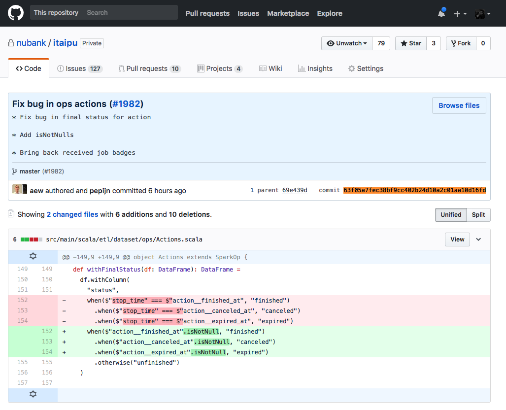

# How to deploy a new itaipu DAG

This document has the goal to provide a step-by-step tutorial about deploying a new itaipu DAG. This tutorial is divided into 4 sections:

- Making sure that no DAG is running
- Merging the new code to master branch on **Github**
- Publishing the DAG on **GoCD**
- Updating the new DAG version on **Airflow**

At the end of this tutorial, you should be able to understand how these tools are connected, what can possibly go wrong, the right time to deploy the new DAG and how to actually deploy it.

## Making sure that no DAG is running

When deploying a new DAG is pretty important to make sure that no other DAG is running.
Deploying a new DAG while other is running can harm our Metadata manager ([Metapod](https://github.com/nubank/metapod)).

To check:

1. Go to [Airflow](https://airflow.nubank.com.br/admin/)
2. Click on the **DAGs** tab and enter on the **prod-dagao** DAG

3. When inside **prod-dagao**, look to the execution information of the last tasks. To do it, just check the rightmost squares and match the colour with the legend. Light green means ***running***. If ***nothing*** is running, you can proceed with your deploy, otherwise contact **#data-help** channel on Slack. Remember to warn other engineers on **#guild-data-eng** by posting the message "***Deploying a new DAG***".

## Merging the new code to master branch on Github

Usually developers merge branches to master after a code review without deploying a new DAG. That's fine, however, it's important to emphasize that every code on master branch must be production code.

This can sound too obvious, but, if you merge code that is not healthy for production, a new DAG can be deployed by other developer with your code in it. This happens because a docker image of our master branch is automatically uploaded to ECR, and will be seen by [GoCD](https://go.nubank.com.br/go/) (more details below).

As an example:

- Master branch of itaipu after a merge:

- We can check its commit ID (***63f05a7fec38bf9cc402b24d10a2c01aa10d16fd*** in this case) on the right-hand side of the commit in the screen above or if we open the last commit:

- If you execute 'nu registry list-images nu-itaipu', you should be able to find part of the commit id under the `TAG` column (might take some minutes). This happens because the automatic process creates a docker image of this project, tags it with the initials from the last commit id and uploads it.

- Also, you can check what was going on behind the scenes on [GoCD](https://go.nubank.com.br/go/). Just find the itaipu project under pipelines and check the versions:

- If you click on the itaipu pipeline, you will see that `publish-container` column is green. It means that [GoCD](https://go.nubank.com.br/go/) successfully executed this step and your docker image is already on ECR, as you noticed before.

- If you open this revision, the steps of itaipu pipeline will appear on the screen. Here you can understand that Github merge is triggering this execution, and `publish-container` is being executed.

## Publishing the DAG on GoCD

Merging to the master branch on Github automatically triggers steps on [GoCD](https://go.nubank.com.br/go/), but it doesn't publish to **dagao**. You need to manually approve it.

If you visit the [dagao pipeline page](https://go.nubank.com.br/go/tab/pipeline/history/dagao), you will notice that more than a pipeline is being executed: `create-das`, `create-release` and `publish`. The first two steps are automatically executed when this pipeline receives the message from the itaipu pipeline (after the merge). However, `publish` will not be executed. You can also notice in the image below that not every revision has to be published. Some changes can wait for other important revisions to be published to production. In our case, the revision `1338` was not published, but the revision `1341` was, which means that all the changes below and including it were published together.

By clicking in the cog, you will be able to have a more detailed view of the stages in it:

If you are reading this tutorial, you probably want to publish your changes. You can do this by clicking on the arrows at the right side:

Make sure that everything is green and continue to the Airflow section.

## Updating the new DAG version on Airflow

When you publish your image using [GoCD](https://go.nubank.com.br/go/), the result will be loaded to AWS S3, and Airflow can now change its reference. In order to do that, you have to open the [DAGs sections on Airflow](https://airflow.nubank.com.br/admin/) and click on the **Trigger Dag** button for the `config_downloader` DAG.

The `config_downloader` DAG runs the [bootstrap_config.sh script](https://github.com/nubank/aurora-jobs/blob/master/airflow/script/bootstrap_config.sh), which updates the reference for our dagao nightly run. You can check the status of your trigger by opening the `config_downloader` DAG and looking at the status of the last run (your run). It's also a good idea to check the log of your run, by clicking on the square and then on the "View Log" button:

## Conclusion

If everything went well, you can rest and wait for the nightly run, which starts at 00:00:00 UTC. You can check the message from Aurora on the [#etl-updates](https://nubank.slack.com/messages/CCYJHJHR9/) channel.
