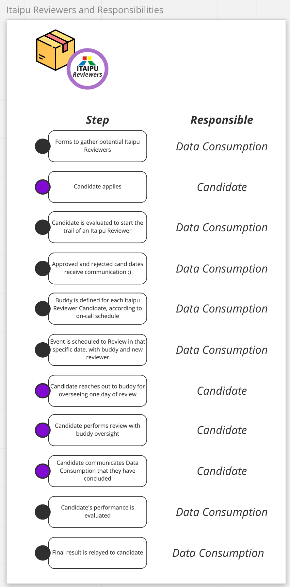

# Reviewing and Merging a PR on Itaipu

## Table of Contents

* [Workflow](#workflow)
* [Checklist](#checklist)
  * [General](#general)
    * [Dataset](#dataset)
    * [Contracts](#contracts)
    * [StaticOps](#staticops)
    * [DatasetSeries](#datasetseries)
* [Macros](#macros)
  * [Unsure about PII leakage in SparkOp](#unsure-about-pii-leakage-in-sparkop)
    * [Unsure about PII leakage in StaticOp](#unsure-about-pii-leakage-in-staticop)
    * [StaticOp command not correctly pasted](#staticop-command-not-correctly-pasted)
    * [StaticOp command not correctly pasted, but you did it for them](#staticop-command-not-correctly-pasted-but-you-did-it-for-them)
    * [Contract Migration to V1](#contract-migration-to-v1)
    * [Check for Global Services on Contracts](#check-for-global-services-on-contracts)
    * [PRs without Tags](#prs-without-tags)
    * [PR tagged with Ready For Merge, not reviewed by a Reviewer](#pr-tagged-with-ready-for-merge-not-reviewed-by-a-reviewer)
    * [Check if using current_date, current_timestamp](#check-if-using-current_date-current_timestamp)
    * [A new subproject is created](#new-subproject-created)
* [bors](#bors)
  * [Basic Usage](#basic-usage)
    * [Deploy](#deploy)
    * [Interface](#interface)
    * [Itaipu](#itaipu)
    * [CircleCI](#circleci)
    * [Permissions](#permissions)
    * [Commands](#commands)
    * [bors try](#bors-try)
* [Code Owners](#code-owners)
* [Itaipu Reviewers](#itaipu-reviewers)
  * [Itaipu Reviewers admission process](#itaipu-reviewers-admission-process)

## Workflow

The normal flow is:

1. PR WIP -> "you finish pushing all the changes and making sure the tests are passing"
1. PR Teammate Review Requested -> "teammate reviews"
1. PR Review Requested -> "itaipu reviewer reviews"
1. PR Ready For Merge -> "someone triggers bors to merge the PR"
1. PR Merged

You can use [this link](https://github.com/nubank/itaipu/issues?q=is%3Aopen+label%3A%22-PR+Review+Requested%22+sort%3Aupdated-desc) to see PRs that are waiting for approval.

Also, check [this link](https://github.com/nubank/itaipu/pulls?utf8=%E2%9C%93&q=is%3Apr+is%3Aopen+-label%3A%22-PR+WIP%22+-label%3A%22-PR+Changes+Requested%22+-label%3A%22-PR+Hold%22+-label%3A%22-PR+Teammate+Review+Requested%22+sort%3Acreated-asc+draft%3Afalse+-label%3A%22-PR+Review+Requested%22+) for PRs with no status, and use [this macro](#prs-without-tags) to respond.

You can read more about the tags [here](https://docs.google.com/document/d/1YRCKqAb0Zt0d_Hf5-xWxgNCXHi4Q5TtD1kMXlBe0pUY/edit?usp=sharing
).

## Checklist

### General

* When in doubt, ask [#itaipu-reviewers](https://app.slack.com/client/T024U97V8/GQU8K9RFF)
* A teammate has reviewed the PR
* PR description is clear (changes committed, affected datasets etc)
* PR is small (not a lot of files changed all at once)

### Dataset

* Metadata
  * Possible PII columns not properly tagged (email, cpf, etc)
  * Name makes sense
  * Description makes sense
  * Attribute names make sense given dataset's purpose
  * Attribute's name matches attribute's description
  * All attributes have descriptions (unless it is a model with 100s of attributes)
* Code
  * Functions are idempotent (no use of random, current_date, etc)
  * Added to package file in alphabetical order
  * Stop usage of hard-coded values in the middle of the code (magic numbers) and enforce that all fixed values are stored in variables that are passed by parameter
  * Enforce naming standards
* Tests
  * If a change is being made in an important dataset, or the logic inside the definition seems too complex, and there are no unit tests, ask for unit tests
  * Ensure no `null`s are used in tests
  * Ensure tests cover edge-cases
  * People change a function but do not change the test. This usually indicates the function is poorly tested.

### Contracts

* Using V1 API
* Global services must override `prototypes`
* Documentation on attributes

### StaticOps

* If you are a committer not from data-access squad, ask on #squad-data-access to run the cp command
Check for [PII](../../how-tos/data-deletion/pii_and_personal_data.md) columns
* People sometimes want us to delete the files from a StaticOp and replace them. We do not do that. Instead, whe ask them to change the `name` attribute of the StaticOp, putting the date of the change at the end, and upload the new files to the new folder.

### DatasetSeries

* Warn people about PII data (if a column is tagged as PII, only the hash value will be available) -> another solution for this is to tag the entire dataset as PII
* There shouldn't be many transformations inside the DatasetSeriesOp apart from renaming and replacing -> advise people to create a separate SparkOp for that

#### Archived DatasetSeries

* When building things that depend on archived dataset series, remember to **add fallback logic to avoid issues when the archive is not produced**.

This is particularly important for people that build logic based on the existence of an archive for policies / models.
This has been a failure mode for multiple times for the ETL, such as the example below, which had to be fixed in [this PR](https://github.com/nubank/itaipu/pull/12982/files#diff-4668190d5170d918ed92384ae30b151bL269).

```scala
    // DON'T DO THIS!
    archive
      .where($"archive_date" === targetArchiveDate)
```

In the case above, a possible solution could be taking the most recent archive up until the referenceDate instead of taking the archive from a given date.

## Macros

Since the issues faced when reviewing a PR are recurring and the changes requested in those cases are usually standard, there are some macros we can use. You can set up your github macros using [this tutorial](https://help.github.com/en/github/writing-on-github/creating-a-saved-reply).

### Unsure about [PII](../../how-tos/data-deletion/pii_and_personal_data.md) leakage in SparkOp

Does this sparkOp contain PII information? If so, it should have a clearance PII. Please also refer to: [PII](../../how-tos/data-deletion/pii_and_personal_data.md).

### Unsure about [PII](../../how-tos/data-deletion/pii_and_personal_data.md) leakage in StaticOp

Does this staticOp contain PII information? If so, it should have a clearance PII (and it would go to s3://nu-spark-static/pii/staticop-name/). Please also refer to: [PII](../../how-tos/data-deletion/pii_and_personal_data.md).

### StaticOp command not correctly pasted

Can you pass the exact command to copy the files? This helps a lot the person reviewing the PRs and speeds up the process =) (PR for reference <https://github.com/nubank/itaipu/pull/6851>)

The command follows the structure: aws s3 cp --recursive s3://path/to/my/staticop/staticop-name/ s3://nu-spark-static/general/staticop-name/

### StaticOp command not correctly pasted, but you did it for them

Next time, can you pass the exact command to copy the files? This helps a lot the person reviewing the PRs and speeds up the process =) (PR for reference <https://github.com/nubank/itaipu/pull/6851>)

Example: aws s3 cp --recursive s3://path/to/my/staticop/staticop-name/ s3://nu-spark-static/general/staticop-name/

### Contract Migration to V1

It would be really nice if you could follow these docs: <https://github.com/nubank/data-infra-docs/blob/master/how-tos/itaipu/contracts_migration_v0_to_v1.md> to migrate the contracts to the V1 (which includes country).

If you find that too be too much work, you can leave for later, it won't break anything 😉

### Check for Global Services on Contracts

I had a look on definition and it seems this service is global.

By our docs you need to add override val prototypes: Seq[Prototype] = Seq(Prototype.Global) to the contract or it won't work.

### PRs without Tags

Can you add a tag to this PR? I will preemptively add it as -PR WIP for now. You can also create a PR as a [draft](https://help.github.com/en/github/collaborating-with-issues-and-pull-requests/about-pull-requests#draft-pull-requests), in case you are not done with it.

### PR tagged with Ready For Merge, not reviewed by a Reviewer

Can you please add the tag `-PR Review Requested` when you are waiting for an itaipu reviewer to review your PR?

### Check if using current_date, current_timestamp

Please don’t use current\_timestamp, current_date or any other non deterministic function in Itaipu. It breaks the assumption that sparkOps are pure functions and when there are errors and we need to reprocess something you will have wrong data.

The recommended way is to use targetDate and/or referenceDate. You can see their implementation here: [https://github.com/nubank/itaipu/blob/4f89194ea3f42d9ca4bc946f578c3ffe395ac137/src/main/scala/etl/itaipu/CLI.scala#L155](https://github.com/nubank/itaipu/blob/4f89194ea3f42d9ca4bc946f578c3ffe395ac137/src/main/scala/etl/itaipu/CLI.scala#L155)

targetDate = today (the date Itaipu begins to run)
referenceDate = yesterday (the day where we have almost complete data)

here’s an example that uses targetDate [https://github.com/nubank/itaipu/blob/11237a945856f7481685e89e85e28c00e26328ff/src/main/scala/etl/dataset/policy/lending/LendingInputDataset.scala#L45](https://github.com/nubank/itaipu/blob/11237a945856f7481685e89e85e28c00e26328ff/src/main/scala/etl/dataset/policy/lending/LendingInputDataset.scala#L45)

### New subproject created

We have a playbook for creating new subprojects with a detailed recommendation
as to the naming and scoping of the subprojects
[here](./../../how-tos/itaipu/migrate-sparkop-to-subproject.md). Please ensure that
users don't create small subprojects for just a few ops or just for their team.
The idea is to have ~30 subprojects corresponding to larger business domains.

Other checklist things:

* Subprojects most not depend on other subprojects in the
    `user-defined-datasets` subproject space (exception: all subprojects depend
    on `shared-user-utils`)
* Users added their subproject to build.sbt
* Within the subproject, all ops are in a package object
* Within itaipu main project, all ops are listed in one or more
    `SparkOpBundle` s
* All external dependencies are listed in the
    `SparkOpBundle.internalToRealOpNames` attribute. Otherwise, integration
    tests will fail.

## bors

`bors` is a merge automation tool that helps merging several PRs at the same time. It's an open source tool available [here](https://github.com/bors-ng/bors-ng).

For an updated documentation on bors, please check: <https://bors.tech/>

### Basic Usage

After a PR is approved and ready for merge comment on the PR `bors r+`

### Deploy

`bors` is hosted on the Mobile Platform's Kubernetes cluster. It lives on the `staging` environment, stack id `indigo` and `mobile` prototype. To use the cluster you need specific certificates.

To update bors, you can follow the instructions [here](https://github.com/nubank/mobile-k8s-recipes/blob/master/recipes/bors/README.md) and simply killing the pod should be enough to update it to the latest version. `bors` maintain its state in a Database, so there isn't any problem in killing the pod.

### Interface

`bors` has an UI to interact with it and to check the queue status: <https://bors.nubank.com.br/repositories/8>

The [history tab](https://bors.nubank.com.br/repositories/8/log) should provide status and errors if there are any when interacting with `bors`. Feel free to reach #squad-data-access in Slack if you have any questions.

### Itaipu

Currently, `bors` is being used as the only to get a PR merged in [Itaipu](https://github.com/nubank/itaipu/). You can check the configuration used by `bors` here: <https://github.com/nubank/itaipu/blob/master/bors.toml>

`bors` enforces the [Github Labels](https://github.com/nubank/data-platform-docs/blob/master/how-tos/itaipu/opening_prs.md#github-labels) are properly set, if there are at least a [CODEOWNER](https://help.github.com/en/github/creating-cloning-and-archiving-repositories/about-code-owners) review before allowing a PR to enter its queue.

### CircleCI

We use CircleCI for ensuring tests are run for every PR on Itaipu. Currently, `bors` is responsible to ensure all the tests are run in CircleCI before merging to `master`.

`bors` uses the `staging` branch to batch PRs and run all the tests before merging the PR. We only run all the tests on this branch, so in the Github Interface you might not see all tests we run on `staging`. `bors` will report all the tests in a comment before merging your PR.

The reason we did this is because we have a lot of users creating PRs and pushing to several branches and running tests for everyone is very costly. So we reduced the amount of tests running in users' branches. That means if people do not use bors and merge directly to master some bad code could be merged, because not all tests run on the `master` branch.

### Permissions

Any user that has access to Itaipu, should be able to interact with `bors`. If you are not able to interact with it, bors will comment the following:

```
🔒 Permission denied

Existing reviewers: click here to make <user_name> a reviewer
```

This will redirect, to a page: <<https://bors.nubank.com.br/repositories/8/add-reviewer/<user_name>where>> you can just hit `ok` to add the user.

The user can also be added to the Reviewers list in the settings: <https://bors.nubank.com.br/repositories/8/settings>

Ask #squad-data-access for help if you can't be added to reviewers list.

### Commands

`bors` by receiving commands done by commenting in PRs. Any user can use any command:

| Syntax | Description |
|--------|-------------|
| bors r+ | Run the test suite and push to master if it passes. Short for "reviewed: looks good."
| bors merge | Equivalent to `bors r+`.
| bors r- | Cancel an r+, r=, merge, or merge=
| bors try | Run the test suite without pushing to master.
| bors try- | Cancel a try
| bors ping | Check if bors is up. If it is, it will comment with _pong_.
| bors retry | Run the previous command a second time.
| bors p=[priority] | Set the priority of the current pull request. Pull requests with different priority are never batched together. The pull request with the bigger priority number goes first.
| bors r+ p=[priority] | Set the priority, run the test suite, and push to master (shorthand for doing p= and r+ one after the other).

### bors try

`bors try` is a special command. In our setup, you only need to use if you working on subprojects inside of Itaipu and want to run the tests through Github/Circle CI.

## Code Owners

Itaipu uses a [CODEOWNERS](https://github.com/nubank/itaipu/blob/master/.github/CODEOWNERS) file to validate if a user can approve a PR or not . The later entries have precedence over the ones inserted first. You can check more about Code Owners [here](https://help.github.com/en/github/creating-cloning-and-archiving-repositories/about-code-owners).

## Itaipu Reviewers

[Itaipu reviewers](https://github.com/orgs/nubank/teams/itaipu-reviewers) is a group of people with merge rights on Itaipu. Currently, they are able to merge PRs involving files inside the folders dataset and dataset_series, as seen in [CODEOWNERS](https://github.com/nubank/itaipu/blob/master/.github/CODEOWNERS).

If you want to become an itaipu reviewer, the steps you must follow are:

* Do a self-assessment about how much you feel comfortable reviewing a PR by filling up some questions in this forms (<https://forms.gle/ptkK1ByKpjRChMSKA>)
* Pair up with another reviewer for one session of the daily PR review rotation
* Review PRs on your own for one session of the daily PR review rotation
* Expect to be required to participate on the review rotation for at least a month

This form will be regularly reviewed by either [#itaipu-reviewers](https://app.slack.com/client/T024U97V8/GQU8K9RFF) or [#squad-data-access](https://app.slack.com/client/T024U97V8/C84FAS7L6), who will check the requirements bellow, and also manage the pairing up between new reviewers and existing ones.

* Should have at least exited the onboarding period
* Should have actively contributed to the repo
* Should know about good practices and advocate for them (unit tests, readable code, etc)
* Should know about:
  * [StaticOps](https://github.com/nubank/ds-knowledge/blob/master/tutorials/dataset-tutorial/8-StaticOp.md)
  * [Dataset Series](https://github.com/nubank/data-platform-docs/blob/master/data-users/etl_users/dataset_series.md)
  * [Unit Tests](https://github.com/nubank/data-platform-docs/blob/master/how-tos/itaipu/create_basic_dataset.md#8---testing)
  * [PII](../../how-tos/data-deletion/pii_and_personal_data.md)
  * [Contracts](https://github.com/nubank/data-platform-docs/blob/master/how-tos/itaipu/contracts.md)
  * [Metapod](https://github.com/nubank/data-platform-docs/blob/master/how-tos/metapod.md)
  * [SparkOp](https://github.com/nubank/data-platform-docs/blob/master/how-tos/itaipu/create_basic_dataset.md#3---understanding-the-sparkop-class)
  * [Bors](https://github.com/bors-ng/bors-ng)
  * [Serving Layer](https://github.com/nubank/data-platform-docs/blob/master/infrastructure/data-infra/serving_layer.md)
  * [GitHub tags](https://github.com/nubank/data-platform-docs/blob/master/how-tos/itaipu/itaipu_reviewers.md#workflow)

### Itaipu Reviewers admission process

Nubank’s current PR evaluation pipeline occurs into two stages:

1. Peer review focused on business logic;
2. Itaipu Committers review focused on code good practices and scalability.

As Nubank grows exponentially, it’s expected that the amount of technical work and consequently PRs, are expected to increase as well. Thus, we must ensure the Itaipu Reviewing process is not hindered, as to negatively effect the Reviewers.

#### 0. Overview

**User journey and responsibilities**



#### 1. Gathering Interested Nubankers as Itaipu Reviewer Candidates

A message was widely broadcasted in #data-announcement, in which ~1k people are included (as of September/21).

Nubankers interested were expected to fill a forms with their intent;

[Forms to September/21 cohort application](https://forms.gle/NuoUzS7jr5m3Bbe67).

The amount of people that became interested in the process were **18 nubankers**;

In accordance to the number of people, Data Consumption requested some of the current Reviewers to aid in the process  - 8 reviewers.

#### 2. Qualifying those who become Itaipu Reviewer Candidates

* Identification - The candidates applications were collected through a formulary simply collecting simply the nubanker’s company e-mail and the GitHub username that should receive the reviewer’s scope;

* Requirements - We required that each candidate should have at least 6 months of Nubank so they would have context on Itaipu’s usage.
  Next, we analysed the candidate's contributions to the repository, ie. **amount of PRs opened and reviews made**: candidates should have more than a total of 100 contributions;
  In case candidates do not make the 100 cut, we request for a vouch in the #itaipu-reviewers slack channel.

* Responsibility - The responsibility of an Itaipu Reviewer as shared with the candidates, stating that:

  - They will be required to be on-call to review cross-company PRs and help keep the code quality in Itaipu;

  - Itaipu Reviewers are also expected, but not obligated to instruct new reviewers in present and future cohorts - just as this one was applied.

* Powers - As Itaipu Reviewers are responsible, they also have powers:
  be able to review PRs following the practices described in Reviewing and Merging a PR on Itaipu doc. Reviewers can also review PRs outside of the on-call rotation. This can help speed up the time to merge PRs in their BU.

* Amount - The amount of Itaipu Reviewer candidates were 15 nubankers.

#### 3. Training Itaipu Reviewer Candidates

The training was composed by 2 mentoring sessions focused on how to review Itaipu’s pull requests (PRs) and when to request changes with the candidate’s buddy.

In the first session, the mentor will guide the session walking through the PR reviewing process;
the second session is guided by the reviewer candidate, where they have the chance to debate cases with their mentor and act as a reviewer.

Obs: In this step, only the mentor has the Itaipu Reviewer scope; with that, in the second session, the candidate's PR approval is still not official, so the mentor should approve/disapprove the PR as well.

**Support material**

* [A guide to Itaipu Reviewers Buddies](https://nubank.atlassian.net/wiki/spaces/DC/pages/13717340213)

* [Reviewing and Merging a PR on Itaipu in Data Platform Docs](https://data-platform-docs.nubank.com.br/how-tos/itaipu/itaipu_reviewer/) (requires VPN).

#### 4. Evaluating Itaipu Reviewer Candidates

After the training sessions, we request that mentors to evaluate candidates in 5 dimensions, with grades ranging from 1 to 5:

- Code best practices;
- Itaipu ecosystem;
- CI/CD;
- Data Protection and Stewardship;
- Communication and PR review process;

#### 5. Providing feedback for Itaipu Reviewer Candidates

For not approved candidates - Those were communicated, after careful review of the buddy’s written evaluation, verbal understanding and finally, a next-steps/improvement agenda has been structured for the candidate;

For approved candidates - They were communicated of their admission, and the planning for the onboarding process.

#### 6. Onboarding New Itaipu Reviewers

After concluding all the steps in the admission process, the candidates [requested to create an account in OpsGenie](https://nubank.atlassian.net/servicedesk/customer/portal/53/group/238/create/1421) and were added to:

* Itaipu Reviewers team by the group’s administrators

* PR Review Hero Daily rotation to become an on-call reviewer

### Next-Steps as a Itaipu Reviewer

The on call rotation schedule is organized using the Ops Genie App. The reviewers save approximately 2 hours to review PRs. The frequency varies according to the number of reviewers active in the on-call PR Review Hero Daily rotation and it usually ranges from once every 3 to 4 weeks.

All folks in the Itaipu Reviewers GitHub group are expected to take part in the rotation.

### Itaipu Reviewers FAQ

* Is there an exact time when I should review PRs?

No. You are on-call for the day, and you can choose the time you have available to review PRs.

* How many PR reviews should I review in each day?

There is no pre-established amount, we require users to spend from 1h30min to 2 hours reviewing PRs tagged with the PR Review Requested label.

* What if I need to skip my on-call rotation day? What do I do when I go on vacations?

Send a message in the #itaipu-reviewers group to check if other people can switch with you and ask the rotation administrator to override your schedule.

* Can I review PRs outside my on call turn?

Yes, with that you remove PRs from the on-call reviewer of the day. Remember you should help keep code quality in Itaipu!
