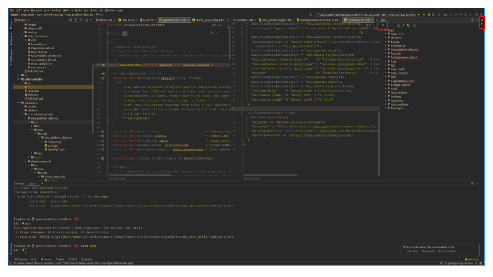

# Migrate user defined sparkops into subprojects

## Rationale

The purpose of this document is to explain how to move user defined sparkOps
out of itaipu into smaller chunks. The goal of this is to split itaipu into
smaller pieces so that users can work on smaller projects that will easily
compile on their machines.

**Is this for me?** Are you unable to run tests on your sparkOps locally? Do
you have to rely on githubs CICD to compile and test your code? Do you have a
horrible contribution experience with itaipu? Do you have 8GB of RAM on your
machine or even less? Then this is the solution for you!

**Disclaimer**: You can only move `SparkOp` and `SparkOp with DeclaredSchema`
out of itaipu. (Manual) Dataset series, contracts and other abstractions can
not be moved out. Working on what remains in itaipu will become a lot better
once the user defined sparkOps are moved out into subprojects.

## How to

### Find a subproject to put your ops into or create a new one

If there is already a subproject where you think your sparkOps belong, you can
skip this and jump right into [moving your ops](#move-your-op-out-of-itaipu).

If there is no suitable subproject yet, you need to create one. This is a bit
taxing for the intellij project importer and might seem scary to you as well.
But fear not! We have convenient tools to make it easy. And you only need to do
it once, not once per sparkop.

#### 1. Choose a project name

We do need to keep the number of subprojects in a manageable range. So do not
create subprojects for your small group of 10 ops. To achieve a reasonable
number for now, we recommend going for business domains for the split. The
level of detail on which to split is still pretty arbitrary, so
we propose the following 'grain': Pick a business domain that roughly
corresponds to the levels given in the following csv table:

```csv
org_level_2,org_level_3,org_level_4,num_sparkops
Analytics & Technology (BU),Consumer Lending (BU),Credit Card (BU),20362
Analytics & Technology (BU),Consumer Lending (BU),Lending (BU),6471
Analytics & Technology (BU),Consumer Lending (BU),Collections (BU),1853
Analytics & Technology (BU),Data Science (tribe),DS Core (squad),500
Analytics & Technology (BU),Engineering Horizontals (BU),Data (tribe),6947
Analytics & Technology (BU),Engineering Horizontals (BU),Foundation (tribe),1082
Analytics & Technology (BU),Engineering Horizontals (BU),Tribe InfoSec (tribe),709
Analytics & Technology (BU),Fraud (BU),,3694
Analytics & Technology (BU),Investments (BU),,179
Analytics & Technology (BU),Operations Platforms (BU),Platforms for Payment Methods (BU),893
Analytics & Technology (BU),Operations Platforms (BU),CXP (tribe),694
Analytics & Technology (BU),Operations Platforms (BU),Platforms for Regulatory Compliance (squad),659
Analytics & Technology (BU),Operations Platforms (BU),Banking as a Service (BU),399
Analytics & Technology (BU),Operations Platforms (BU),Cross Excellence Brazil (squad),57
External Affairs/Corporate Mkt (BU),Fanatical Customers (BU),Journey to Fanatical (squad),997
Finance (BU),Controllership & Tax (tribe),,513
Finance (BU),FP&A Tribe (tribe),FP&A Core (squad),3389
Internal Audit (squad),,,358
People and Culture (BU),,,162
Product & Design (BU),App Experience (BU),App Evolution (squad),5991
Product & Design (BU),App Experience (BU),,8
Product & Design (BU),EXNP & Acquisition (BU),Experimentation and Notification Platform (BU),85902
Product & Design (BU),EXNP & Acquisition (BU),Growth (BU),794
Product & Design (BU),Insurance & PJ (BU),Insurance (BU),1639
Product & Design (BU),Insurance & PJ (BU),PJ (BU),676
Product & Design (BU),NuConta (BU),,9182
Risk & Compliance (BU),AML (squad),,230
```

If you cannot find a reasonable choice here, don't worry. We know that this
snapshot of our business domains is already outdated as we write this. It's
just a guide to give you a feel for the grain at which you should split. In the
end, you know your domain better than we do. We trust that you choose an
accurate business domain responsibly. Just don't try to come up with small
domains that only encompass your own team. Subprojects are still shared between
teams. As we will see, projects can be partitioned with greater details within,
so don't worry about not having your own space to organise your ops.

#### 2. Create the folders

We have a nucli-command for creating the folders of your new subproject in the
right place. As many nucli commands do, this also assumes you have `itaipu` in
`$NU_HOME/itaipu`.

```sh
nu etl subproject --dry-run [your-project-name-with-dashes]
```

If you run this without the `--dry-run` option, it will create the folder
structure under `subprojects/user-defined-datasets/your-project-name`. We
recommend dry-running it first to make sure everything will turn out as you
imagine it to be and ensuring there are no naming conflicts. It will
also create a mandatory integration test and a package object file which we
will need in later steps.

#### 3. Update build.sbt

Next, you also need to change the main `build.sbt` to include the subproject.
Find the [line](https://github.com/nubank/itaipu/pull/21499/files#diff-5634c415cd8c8504fdb973a3ed092300b43c4b8fc1e184f7249eb29a55511f91R203) with the comment below and add your project like this

```scala
/* Add user-defined-datasets subprojects here */
...
lazy val `your-project-name` = defaultSettingsUDS("your-project-name")

// if you don't have dashes, drop the '`' around the val name
//lazy val example = defaultSettingsUDS("example")
```

Next, add your project to the
[aggregate](https://github.com/nubank/itaipu/pull/21499/files#diff-5634c415cd8c8504fdb973a3ed092300b43c4b8fc1e184f7249eb29a55511f91R199)
statement of the `subproject-aggregator1` project. If there are multiple
subproject-aggregator projects pick the one with the highest number.

Next, go to the definition of `itaipu` on top of the file and add your lazy val
to the [dependsOn](https://github.com/nubank/itaipu/pull/21499/files#diff-5634c415cd8c8504fdb973a3ed092300b43c4b8fc1e184f7249eb29a55511f91R119) list of itaipu.

NOTE: We will explore adding per-subproject build.sbt files in the future. For
now, to ensure a smooth migration, please refrain from creating them.

#### Reimport your projects

For the refactoring to work in the subsequent steps, you need to let intellij
reimport the `build.sbt` so it knows about the new subproject. This step takes
about 4-5 minutes during which we recommend you don't touch anything.

Here is where that button is:



If anything acts up, you might have to remove all `target` folders as well. To
do so, run this in the itaipu root folder: `rm -rf $(find . -name target -type d)`
Don't do it unless you have to, though!

### Move your op out of itaipu

**Important reminder**: You can only move `SparkOp` and `SparkOp with
DeclaredSchema` out of itaipu. (Manual) Dataset series, contracts and other
abstractions can not be moved out. Working on what remains in itaipu will
become a lot better once the user defined sparkOps are moved out into
subprojects.

Within your subproject create a subfolder structure as you see fit. The
structure could mirror what you have in itaipu: E.g. your subproject is
`fraud` and you want to migrate 5 ops relating to `exposure`, create an
`exposure` subfolder in your subproject (both under main and test). Now move
over the scala files defining your op to be moved out to `src/main/fraud/.../`
and the corresponding unit test file to `src/test/fraud/.../`. Intellij will
make sure the references of successors to your op will remain intact.

Next, we are going to change the class of your op to a new type, called
`BundleOp`. Why 'BundleOp'? Because we will organise our ops into smaller
packages or _bundles_ in itaipu. A BundleOp shares most attributes with a
SparkOp, so not much will change. The main reason we need a new abstraction is
the following: If all ops are in itaipu, then they can reference each other at
compile-time. So if `opA` has `opB` from another team/domain as input, it can
define its input as:

```scala
val inputs = Seq(opB.name)
```

If someone changes the name of `opB`, this link still works. All safe and
sound. Now, this is not possible anymore if opB lives in another subproject
that your subproject doesn't know about.

To solve this, we will separate our inputs into internal inputs (other ops in
the same subproject), which can still be defined as before, and external inputs.
For the latter, we will delay the actual wiring to runtime and define it within
itaipu. Within your scala file, we will give them an internal name (a plain
string) that will later be resolved. So this example op:

```scala
object MyOp extends SparkOp with DeclaredSchema {

   def myInternalInputName: String = MyOtherOpInTheSameSubproject.name
   def myExternalInput1Name: String = myExternalInput1.name
   def myExternalInput2Name: String = myExternalInput2.name
   override def inputs: Set[String] = Set(
     myInternalInputName, myExternalInput1Name, myExternalInput2Name
   )

   ...
   def definition(datasets: Map[String, DataFrame]): DataFrame {
     val df1: DataFrame = datasets(myExternalInput2Name)
   ...
}
```

Now becomes (compare [example PR](https://github.com/nubank/itaipu/pull/21499/files#diff-98f6bcf26f6638135248b39264e26aac6325b89b874378db37877068d938e382)):

```scala
object MyOp extends BundleOp {

   def myInternalInputName: String = MyOtherOpInTheSameSubproject.name
   override def internalInputs: Set[String] = Set(myInternalInputName)
   def myExternalInput1Name: String = "extInput1"
   def myExternalInput2Name: String = "extInput2"
   override def externalInputs: Set[String] = Set(myExternalInput1Name, myExternalInput2Name)

   ...
   def definition(datasets: Map[String, DataFrame], runParams: RunParamsForOps): DataFrame {
     val df1: DataFrame = datasets(myExternalInput2Name)
   ...
}
```

The name-strings you provide for your external inputs do not matter!
Specifically, they don't need to be the real names of the ops that are your
inputs. Choose descriptive and unique names. We will link them to the real
names with a map later. Just make sure they don't clash with names of internal
inputs. Note that `definition` can remain as it is in the body. It just gets an
additional argument `runParams` (see below, why).

In terms of the main changes we need to make subprojects work, that's already
it on the side of our ops. However, we took the opportunity to improve a few
other things about the metadata:

1. `description` is not optional anymore: Change from `Some("[your descritpion]")`
   to `"[your description]"`. Don't have a description yet? You need to add
   one! A few other recent additions like `qualityAssessment` and even older
   friends such as `ownerSquad` are mandatory as well.
2. `name` is not set explicitly anymore. Provide a `bundleOpName: String` that
   it **NOT** namespaced with country prefix and `dataset/`. We will add that
   for you automatically. There is already a test that will fail and let you
   know if you forgot to remove those prefixes.
3. You cannot set `permanence` anymore. Use archives for permanence. If you
   have a use-case that requires permanence without archives, let us know. We
   can talk about a solution.
4. RunParameters (transaction target/reference date or id, environment and
   itaipu-version) are now available by default. No need for a case class that
   get's runParams as an argument. Notice how `definition` now takes an
   additional argument. To see how to overwrite the automatic default for
   testing, check the [unit test section](#unit-tests)

**Important** If you are using **util** functions from itaipu that cannot be
imported anymore, see
[here](#my-dataset-uses-logic-from-other-datasets-in-different-subprojects-or-shared-utils)
for the solution. We have a dedicated subproject where those things now live.

#### Package file

Just as within itaipu, we will need to add our ops to a package object. The
purpose of this is to allow some integration tests to run over our ops and warn
us early in cases where the main integration tests in itaipu would fail. The
main package object is already created for you with the nucli command. The
`allBundleOps` sequence is still empty. Change this to a sequence that contains
your op [example PR](https://github.com/nubank/itaipu/pull/21499/files#diff-73177afc1c1061793eb8b654a7715dc898f8a860d18d630f7271cbcc12c5440fR4):

```scala
import common_etl.operator.BundleOp

package object [your_project_name_with_underscores] {
  def allBundleOps: Seq[BundleOp] = Seq(MyOp)

  //OR, if you have further package objects at lower levels
  //def allBundleOps: Seq[BundleOp] = subpackage.allBundleOps ++ anotherSubpackage.allBundleOps
}
```

As you can see in the commented lines, you can also create package objects at
lower levels and pass their `allBundleOps` up to this main object. This is a
good practice that we already use in itaipu and we recommend you follow it.

### Tests

#### Unit tests

In the normal case you should have to do very little: If your
`NuDataFrameSuiteBase` import is not found, please import it from
`import common_etl.NuDataFrameSuiteBase`.

If your sparkOp was a case class and imported runtime parameters such as
`TargetDate` or `ReferenceDate`, you will need to adjust to the fact that these
are now available by default:

1. Your original op now is an `object`, not a `case class`. So in your test,
   you don't need to create a test instance. Just remove that part from your
   test code.
2. Your original op references the runtime parameter directly since it used to
   be a dedicated argument. Now all run parameters are bundled in the
   `runParams` argument to `definition`. Change that to reference the version
   in the runParams attribute: `referenceDate` becomes
   `runParams.referenceDate` for example.
3. If one of your tests works with a run parameter, it can stay that way. Just
   pass it as a function parameter explicitly and you can feed it a different
   value in your test.
4. If you want to test `definition` function in your unit tests with
   overwritten runParams, you can pass custom runParams as a second argument to
   the function. So create custom runParams like so:

   ```scala
   val myRunParams: RunParamsForOps = RunParamsForOps(
    environment: EnvironmentType = EnvironmentType.Prod,
    referenceDate: LocalDate = LocalDate.parse("your-date-here"),
    targetDate: LocalDate = LocalDate.parse("your-date-plus-one-day-here"),
    itaipuVersion: String = "dummy value",
    txId: UUID = UUID.randomUUID() // or an explicit uuid if you need that
    )

   ...
   // when you tests `definition`
   val result = MyOp.definition([datasets map you build], myRunParams)
   ```

If there are any further issues, ask an Analytics Engineer close to you or in
the `#data-help` channel.

#### Integration tests

An integration test that makes sure all your ops are correct is already created
with the nucli command in your project. Nothing to do here! You should run that
test too during local development to see if your changes check out.
[See here how to do it](#sanity-checks-How-do-i-know-everything-worked)
It will be quick, we promise!


### Set up the wiring

**Bonus points**: If the package file listing your original SparkOp is under
`etl.datasets.[other.subpackages]` you can earn our eternal gratitude by taking
this opportunity to also move your bundle into the multi-country structure and
putting it under `nu.data.br.datasets.[other.subpackages]` in the following
step.

[Example PR: Move to new folder structure](https://github.com/nubank/itaipu/pull/21499/files#diff-7dc0ebdebd33ebc90ece996d061ad3cee9daa48ac565c53b913854af4a9e0bf1)

Now we go back to itaipu and into the package object, where you put your
sparkOp so that it will be found by itaipu (it's listed in an attribute
`allOps`). In here, we will create the wiring by means of a `SparkOpBundle`.
This new abstraction 'bundles' multiple related ops belonging to the same
subproject and provides them with a lookup map from their internal names for
external inputs to the real names of those inputs. So in our example, the
object you'd create looks like this:

```scala
package nu.data.br.datasets.[your.other.subpackages]

import your_project_name_with_underscores.your_subpackage

  object MyInformativeBundleName extends SparkOpBundle {
    lazy val internalToRealOpNames = Map(
      "extInput1" -> myExternalInput1.name,
      "extInput2" -> myExternalInput2.name
    )

    lazy val allOps = your_subpackage.allBundleOps

    override def bundleName: String                   = "a-name-for-your-bundle"
    override def description: String                  = "a description"
    override def country: Country                     = Country.BR
    override def ownerSquad: Squad                    = Squad.DataInfra
    override def qualityAssessment: QualityAssessment = QualityAssessment.Neutral(LocalDate.parse("2021-04-26"))
  }
```

Notice that we have put the internal names we used for the external inputs [up
here](#move-your-op-out-of-itaipu) as keys of a map and the values are the real
names. We have access to those in itaipu because itaipu depends on all
subprojects. At runtime, we will create on SparkOp from each BundleOp and use
this lookup to insert the real input names.

If you have multiple ops in a bundle (which is the intent), use the same
internal names so that the mapping can be reused.

NOTE: Bundles give a means to group ops that belong together on a lower level
than subprojects. So even if you share a subproject with other squads, you can
treat your bundles as yours. On the other hand, we encourage you to bundle ops
that belong to the same smaller business unit and depend on each other. But
there are (currently) no restrictions for ops in a bundle to be consistent.
For example, while we ask you to give an ownerSquad to the bundle, it can
contain ops from other squads. Again, we trust that users can make more
well-informed decisions on what to group in a bundle than we can with top-down
rules.


### Let itaipu know about your bundles

In the same package file within itaipu, add a new attribute that works like
`allOps` for ops, but this for bundles. Like this ([example PR](https://github.com/nubank/itaipu/pull/21499/files#diff-7dc0ebdebd33ebc90ece996d061ad3cee9daa48ac565c53b913854af4a9e0bf1R19)):

```scala
  def sparkOpBundles: Seq[SparkOpBundle] = Seq(
    MyInformativeBundleName
  )
```

Then, follow the usages of the `allOps` attribute all the way up to the package
file for `nu.data.[your-country].datasets` Build a path of `sparkOpBundles`
just like it's built with the `allOps` by passing your subproject packages
sparkOpBundles 'up'. Some parts of the path might already be defined from
other users. Those can be reused.

Lastly, remove the op from the `allOps` attribute. The compiler should already
complain that it now doesn't contain only sparkOps anymore but also a bundleop.
Make it happy again. [Example PR: Remove old op from old structure](https://github.com/nubank/itaipu/pull/21499/files#diff-20c1a8d741f0e436ff150c24c76d19bc2c05d566a02a523cd0d7337fb38a4413)

### Sanity checks: How do i know everything worked?

Here is a list of things to do/check:

1. Your intellij compiler is not complaining about any of the files you
   changed. Imports are working.
2. You can run your unit tests. If you want to be extra-careful, remove all
   target folders (`rm -rf $(find . -name target -type d)`) from itaipu and
   rerun from scratch.
3. You can run the integration test in the `src/it/scala/../BundleOpSpec.scala`
   file.
4. You can double-check this document quickly to ensure you haven't forgotten
   anything. Especially the adding of ops and bundles to the `package` files.

**NOTE**: We are talking about running your subproject tests here. Don't run
the entire itaipu test, because then you are back to the problems with time and
memory. You shouldn't have to run itaipu main project tests for local dev
anymore!

**How to run tests?**

You have two options:
* Go to the respective files in intellij and click on the green buttons next to
  the tests. (In `it` folders this sometimes does only work once you declare
  the `it/scala` folder a test folder for intellij. Right-click on it > chose
  `mark folder as` > chose `test sources root`. Then the green run buttons next
  to tests should appear)
* From the itaipu root folder in your terminal, run
  `sbt "; project [your-project-name-with-dashes]; test; it:test"`


If this works, you can push your PR. If the integration tests in itaipu work on
the CICD during the PR you should be good to merge.


## FAQ/ frequent problems

### Can i see an example from which i can copy?

Sure. You can always check the [Example PR](https://github.com/nubank/itaipu/pull/21499)
we have used in this document. If you want a more complex subproject structure,
check the subproject `data-platform-datasets` and the ops in there.
Especially `ContractsSLOMonitoring` should work well as it is the first op ever
moved. So it should be a prototype.

### My dataset uses logic from other datasets in different subprojects or shared utils

First and foremost: **Subprojects must never depend on other subprojects!**. So
please don't try to make your subproject depend on another subproject that has
your functions or even itaipu itself. Instead, you have two options:

1. If you don't think the utils you are taking from others are really for
   common usage, just copy them over to your project. Duplication has the merit
   that it decouples your work from that of another squad.
2. If you think the functionality is really something to share, then talk to
   the owners of that functionality and agree on moving them to a common space
   and also agree who maintains it in the future. We have created a dedicated
   subproject for such situations called `shared-user-utils`. You can move
   functions there and they are available for all subprojects. We only ask that
   you put the functions into a object that extends
   `UserMaintainedSharedUtils`. This trait simply forces you to set an
   ownerSquad so everyone is aware who is maintaining the functions.

If you think you have found something that is so generic that it should go into
`common_etl` and be maintained by data infra, talk to us. We can always discuss
this.

### I cannot move my SparkOp because it has special links to other sparkOps

Some ops have links to external Inputs that go beyond what the bundles cover.
The recommended solution for now is to keep such ops in itaipu as sparkOps. The
good thing about this migration is that BundleOps and SparkOps can coexist. We
can see what remains in itaipu and find generic solutions for common scenarios
later (e.g. relying on `Attributes` of a predecessor).

Also, as main itaipu shrinks, its unit tests will compile again even on small
machines. So you will get back into a place where you can work within itaipu
for such exceptions again.

Is this answer not satisfactory for your specific case? Talk to us. We are
happy to learn what's out there and what we can do to improve the situation.
Oftentimes, the issue is that we aren't aware of specific problems among the
60k ops we have.

### My sparkOp is a case class that gets dynamic parameters at runtime

Are those parameters run parameters (target and referenceDate, environmentType,
itaipu version or transaction_id)? Then look back above. They are availbable
by default now. If there are other parameters, again, talk to us. We can look
at what to do.
