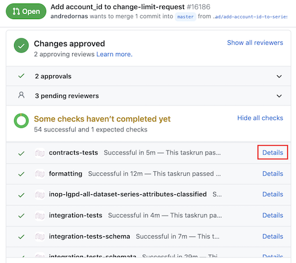
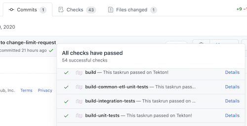
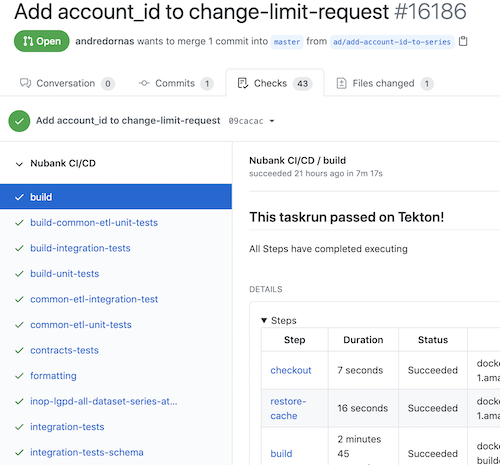
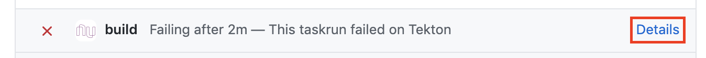
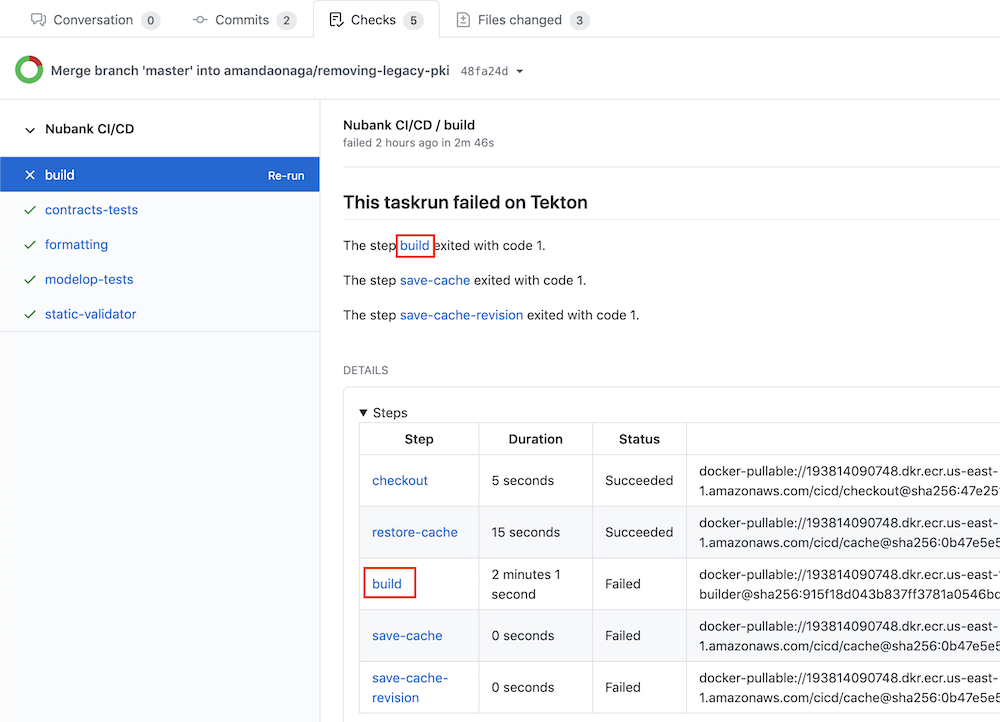
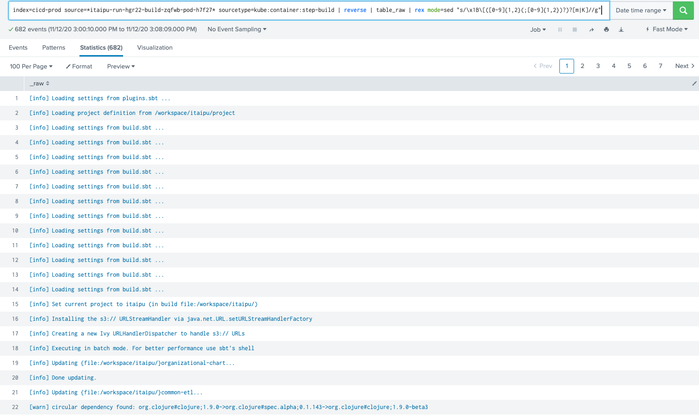

# Itaipu CI

## Overview

The integration between Github and Tekton was made through webhooks. 
How does it work? In each push event, Github sends an HTTP post payload to the Tekton webhook's URL. It will create a pipelinerun that starts the tasks defined on it.

As soon as the tasks start, they will be updated in the Checks tab on the Pull Request page. At the moment, inside Github page we can access this in three different ways:

- on each check on the Pull Request page, by clicking in `Details` link:



- in the popup on the `Commits` tab:



- and also in the `Checks` tab:



On the Checks page (image above), we can navigate through the tasks and visualize the details for each one of them. The task's details contain the steps, params, and the configuration defined for it at the moment of the execution.

## How to check the logs?

Logs are available for each step of each task. To access them, click on the link in step name, and it will redirect to the Splunk page with the query related to this specific step.

For example, to read the logs from a step that failed:

1. On the Pull Request page, click in `Details` link:



2. On the `Checks` tab, there is a summary and a table that are indicating whether something goes wrong. To investigate that in the logs, click on the step name link, as it is highlighted in the image, to access the Splunk page.



3. On Splunk, the logs showed belongs to the step selected. There advantage here is that all the features from Splunk can be accessed, such as the pagination bar, the format menu:



## Pipeline and task structure

Each commit made in the Itaipu's repository will be verified by the tasks that were set in the [itaipu-ci.yaml](https://github.com/nubank/tektoncd/blob/master/tekton/pipelines/itaipu-ci.yaml) file.

The tasks are defined in `yaml` files, they are located in [tektoncd's repository](https://github.com/nubank/tektoncd/tree/master/tekton/tasks/itaipu). Some tasks are dependents on others. And when the main task failed it will not start the dependent one.
To know more about the structure and its details, access [Itaipu CI documentation](https://github.com/nubank/tektoncd/blob/master/docs/pipelines/itaipu-ci.md).

## Debugging builds, stuck builds and getting telemetry

In certain cases a build can appear stuck or is indeed stuck. Given that the
build and test execution times in Itaipu are exceptionally long it's sometimes
not clear what is the matter. In this case we have the option to ssh into the
pod executing the build step and to collect the necessary information to analyse
the situation.

### Preqrequisites

For direct access to k8s containers you need to be in the `engineers-debugging`
group. To add an engineer to this role you need to raise a ticket to
`#foundation-tribe` asking CICD to add the user.

### Finding the Kubernetes POD which runs the build

From the git revision we can determine all the pods which are running the
individual build steps:

```terminal
> kubectl --context cicd-prod-a-context -n pipelines get pods -l nu/revision=65c2f1a458ba755217cb5e748d7142ad6e9d5d65

NAME                                                READY   STATUS      RESTARTS   AGE
itaipu-run-ftkqx-build-dcgrh-pod-djztq              3/5     NotReady    0          14m
itaipu-run-ftkqx-contracts-tests-f5f72-pod-phggg    0/2     Completed   0          14m
itaipu-run-ftkqx-formatting-qhpg7-pod-qhvvk         0/3     Completed   0          14m
itaipu-run-ftkqx-modelop-tests-swkbp-pod-xp4mg      0/2     Completed   0          14m
itaipu-run-ftkqx-static-validator-25kzx-pod-9db52   0/3     Completed   0          14m
```

Alternatively when you have the task id from Tekton (e.g.
`itaipu-run-ftkqx-build-dcgrh`) you can use the task id to find the pod:

```terminal
> kubectl --context cicd-prod-a-context -n pipelines get pods -l tekton.dev/taskRun=itaipu-run-ftkqx-build-dcgrh

NAME                                     READY   STATUS      RESTARTS   AGE
itaipu-run-ftkqx-build-dcgrh-pod-djztq   0/5     Completed   0          32m
```

You can also list all running containers for the pods for a revision:

```terminal
> kubectl --context cicd-prod-a-context -n pipelines get pods -l nu/revision=65c2f1a458ba755217cb5e748d7142ad6e9d5d65 -o jsonpath='{range .items[*]}{"\n"}{.metadata.name}{":\t"}{range .status.containerStatuses[?(.state.running.startedAt!="")]}{.name}{", "}{end}{end}'

itaipu-run-2ck9f-build-common-etl-unit-tests-mt88b-pod-s62g6:
itaipu-run-2ck9f-build-sh7qz-pod-lvb5n:
itaipu-run-2ck9f-build-unit-tests-2g45b-pod-gzb8t:
itaipu-run-2ck9f-common-etl-integration-test-5cdc2-pod-l9sbk:	step-common-etl-integration-tests,
itaipu-run-2ck9f-common-etl-unit-tests-mpnwh-pod-wvn4t:
itaipu-run-2ck9f-contracts-tests-9swnz-pod-f7xcj:
itaipu-run-2ck9f-formatting-prggd-pod-znrqg:	step-formatting,
itaipu-run-2ck9f-inop-lgpd-all-dataset-series-attributes--mwckp:	step-checkout, step-inop-lgpd-all-dataset-series-attributes-classified, step-restore-cache,
[...]
```

The first expression is the pod name, the list after the `:` is the running steps.

### Shelling into the tekton POD

Once we know the pod name and the tekton step which we want to inspect we can "shell"
into the pod and use the standard java tools to collect a thread dump:

``` terminal
> kubectl -n pipelines --context cicd-prod-a-context exec -it <pod-name> -c step-<step-name> -- bash
> jcmd -l # list all running java processes

45454 some.java.class.MainClass --foo --bar
> jcmd 45454 Thread.print > thread-dump.txt  # Trigger thread dump of JVM and redirect to file
> exit # leave pod
> kubectl -n pipelines --context cicd-prod-a-context -c step-<step-name> cp <pod-name>:thread-dump.txt thread-dump.txt # copy file locally
```

The thread dump file can then be inspected on the local machine to analyse the
JVM situation.

## situation need more information

If you still have questions or need additional information, please reach out to #data-help and you will have the appropriate support provided.
