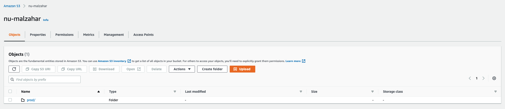

# S3 classification

This document aims to detail the S3 data classification within [Ryze](https://github.com/nubank/ryze). Before proceeding with the playbook, it is important that you read the documentation for the [PII classification](https://nubank.atlassian.net/wiki/spaces/DP/pages/1846313154/PII+Classification).

## S3 structure

Ryze contains all S3 buckets from all accounts mapped. They are located in [`resources/accounts/:account/s3`](https://github.com/nubank/ryze/tree/master/resources/accounts). Each bucket has its own folder, and inside it, there is a `classification.edn` containing the classification information related to that bucket.

Full path sample: `resources/accounts/br/s3/acquisition-tribe/classification.edn`.

The `classification.edn` will look like the following samples:

```clojure
{:name           "nu-babel"
 :category       :service
 :squad          :credit-strategy
 :metadata       {:services ["nu-babel"]}
 :countries      [:br :co :mx]
 :accounts-alias :dev
 :validated      false
 :paths          [{:path        "smiles-conciliation"
                   :description "bla ble"
                   :compliance  {:tags #{:cpf}}},
                  {:path        "serasa-scores"
                   :description "bla ble"
                   :compliance  {:tags #{:cpf :name}}}
                  {:path        "boavista-scores/processed"
                   :description "bla ble"
                   :compliance  {:tags #{:cpf :score}}}
                  {:path        "*"
                   :description "bla ble"
                   :compliance  {:tags #{}}}]}
```

```clojure
{:name           "www.nu.bank"
 :category       :site
 :squad          :marketing
 :metadata       {:services []}
 :countries      [:br :co :mx]
 :accounts-alias :dev
 :validated      true
 :paths          [{:path        "*"
                   :description "bla ble"
                   :compliance  {:tags #{}}}]}
```

### Details about each key

- `:name` - bucket's name
- `:category` - in order to better understand the use of the bucket and be able to handle the access and deletion of data in the bucket, we have defined some categories: **:ad-hoc, :backup, :etl, :infra, :log, :machine-learning, :metric, :secrets, :service, :site and :thrid-party-sharing** - [for more details](#bucket-categories)
- `:squad` - the squad who owns the bucket
- `:metadata :services` - contains the services that use given bucket. Services are the ones defined in [definition](https://github.com/nubank/definition/tree/master/resources/br/services)
- `:countries` - countries that uses the bucket - **accounts that are worldwide does not belong to a specific country. By default all the countries will be shown here, and you should remove or add countries based on your usage**
- `:accounts-alias` - the account alias where the bucket was created
- `:validated` - define if someone has validated all the information from the bucket
- `:paths` - One bucket may store data with different use cases. To improve the classification granularity of a bucket, you are allowed to define the use cases based on the path. You can add paths of different folders within the bucket and also of specific files in it.
  - `:path` - path inside the bucket
    - `:description` - description about the data is being stored
    - `:compliance :tags` - the classification itself, what kind of data (tags) we have, tags are defined for each country and you can find the tags for Brazil at https://github.com/nubank/ryze/blob/master/resources/br/compliance/tags.edn.

### Bucket categories

In order to be compliant with data protection laws, we must have a data inventory. We also need to provide some rights to the customers/prospects over their personal data, for instance, access to their data and deletion. Because S3 may store both structured and unstructured data, and Nubank has different use cases, we could not define a single solution to provide access and deletion for all the buckets. Therefore, we decided to break into different categories so that we could have a different solution for each one. 

Current categories:
- `:backup` - buckets used for backup
- `:etl` - buckets used by data-infra on our ETL/data lake
- `:infra` - buckets that store data related to infrastructure
- `:log` - buckets where we store logs
- `:machine-learning` - buckets used by machine learning engineers to train models
- `:metric` - buckets where we store metrics
- `:secrets` - buckets used to store secrets
- `:service` - buckets that belongs to a service, and knows how to write and read
- `:site` - buckets for sites
- `:third-party-sharing` - buckets used for sharing/exchanging data with third-parties
- `:ad-hoc` - other cases like buckets owned by squad to store/share some data in the squad


Depending on the category, we'll have different processes for deleting the data if necessary. When we talk about deletion for the `:service` category, we will delegate the responsibility to the owner of the service and for the `:etl` category, data-infra has provided some solutions already.

We may have different cases that are tricky, and we have some samples that may help yours:

- [ryze's buckets](https://github.com/nubank/ryze/blob/master/resources/accounts/br/s3/nu-ryze-br-prod/classification.edn) (the repository that you are working on) that contains our data inventory and `ryze` is responsible to write in this bucket and `thresh` just reads from it, and these buckets are in the `:service` category.
- nu-morpheus stores data that comes from `etl` and it has a service (`morpheus`), which does not belongs to `data-infra` (has it own business). Since nu-morpheus has a service that may store it's own data, the category would be service `:service`.

If the bucket is being used by a service, you can probably categorize it with `:service`.

### Tags

Tags are used to classify the path in the bucket if it has [PII data](https://nubank.atlassian.net/wiki/spaces/DP/pages/1818132529/PII+at+Nubank) in it. We have a file that contains all available tags in each country([BR](https://github.com/nubank/ryze/blob/master/resources/br/compliance/tags.edn), [CO](https://github.com/nubank/ryze/blob/master/resources/co/compliance/tags.edn) and [MX](https://github.com/nubank/ryze/blob/master/resources/mx/compliance/tags.edn)). 

We recommend taking the time and try to identify what kind of PII data is on the bucket and then use one of the available tags for it, if there's not a appropriate tag, you can create one([check the rules here](#rules-to-follow-while-naming-tags)).

If the above is not possible, since there maybe be ambigous tags(we're working on improving this) or it's too difficult to identify which kind of PII data is on the bucket, you can use the 
`:unknown-pii` tag.

## Step by step classification

#### 1. Clone Ryze repository
```
nu proj clone ryze
or 
git clone git@github.com:nubank/ryze.git
```
- If you've cloned the project before, make sure you executed the `git pull` in the `master` branch before creating the new one.

#### 2. Create a new branch
- Each branch should have the prefix identifying the person(username) who is classifying the database.
```
git checkout -b {username}/customer-classification
```
#### 3. Classifying the bucket
- Locate the S3 bucket that needs to be classified.
- Validate the values of the [keys](#details-about-each-key) in the edn file and correct them if necessary. 
- In `:paths`, we may have different folder/files with different classifications; it would be good to have a path here for each of them. If there is just one use case or you don't know which folder/file is PII, use the default `"*"` for the whole bucket. Keep in mind that the more specific you are on classifying, the better it will be to access or delete the file when required.
- Check [here](#tags) if you have any questions about what tags to use in `:paths :compliance :tags`.
- Make sure to update `:validated` to `true` once you have classified the bucket.

#### 4. Make the Pull Request
- Commit the changes:
```
git add .
git commit -m "write a message for the commit"
```
- Push it to your branch:
```
git push -u origin <branch-name>
```
- Create the pull request.
- When you finish, the pull request will be assigned to Ryze reviewers for some of them review your changes and approve it.

### Example of bucket classification

Here's an example of a classified S3 bucket with some comments explaining the rational for each key.

This is the view of the bucket on AWS S3:



```clojure
{:name "nu-malzahar",
 ;This is the name of the bucket.

 :category :service,
 ;This bucket is used by the malzahar service therefore we chose this category.

 :squad :data-protection,
 ;The bucket is owned by the data protection team.

 :metadata {:services #{:malzahar}},
 ;Since the malzahar service uses the bucket, we added it here.

 :countries #{:br},
 ;Bucket is in the BR account.

 :account-alias :br,
 ;This bucket was created with the br account alias.

 :validated true,
 ;After the classification was done, this was set to true.

 :paths
 [{:path "*",
   ;In this case we opted to classify the whole bucket on a single path since it holds only PII data and we know exactly what kind it is. This bucket holds a backup file of all the PII data we deleted from a customer.

   :description
   "Backup from personal data that it is going to be deleted. There is a lifecycle policy of 14 days.",
   ;Here's a description of what data the bucket holds.

   :compliance
   {:tags
    #{:external-bank-account-name :cpf :address :email :preferred-name
      :contact-name :external-bank-account-cpf :card-printed-name :ip
      :phone-number :mothers-name :address-postcode :employer-name :pan
      :external-bank-account :name :address-number :employer-cnpj
      :document-id-type :contact-phone-number :contact-email
      :complement :document-id-number :document-id-year :device-info
      :address-ref-point}},
    ;This is the list of tags that identify what kind of PII data is store on this bucket.

   :legal {:purposes nil, :personal-data-types nil}
   ;This is a new structure for classification that we're currently not using. You can ignore it for now.
   }]}

```

---
## Rules to follow while naming tags
- Lower case
- No spaces
- Always start with ":" (an example is :tax-id)
- Be aware that several tags were already created, they must be reused as possible:
    - BR - https://github.com/nubank/ryze/blob/master/resources/br/compliance/tags.edn
    - MX - https://github.com/nubank/ryze/blob/master/resources/mx/compliance/tags.edn
    - CO - https://github.com/nubank/ryze/blob/master/resources/co/compliance/tags.edn
- After the tag is created, add it in the `data-inventory` [action](https://github.com/nubank/ryze/blob/master/resources/br/compliance/actions.edn#L206)

## FAQ

## What if the bucket is not from my squad?

We have tried to set the squad based on what was defined in iam-policies/definition, but we may have some errors. If you encounter any issues, please reach out to us at #s3-data-classification slack channel.

## What if we do not use the bucket anymore?

Currently we are not enforcing the deletion of buckets that are no longer used, but we plan to work on this in the future. If you are not using the bucket, delete it and then do not classify it. If you don't classify, then the bucket will be removed from Ryze. Incase you are not planning to delete it, please do the classification. In any case send us a message on #s3-data-classification Slack channel, so we can be aware of these cases :).

## What if I have a use case that may have a different category?

The categories were based on our current knowledge and discussions we had with some squads. If you have any special cases that require access, deletion or any security concern, please send us a message on #s3-data-classification Slack channel explaining your use case so that we can evaluate.

## What if I have a bucket with multiple categories?

If your bucket has a service that is responsible to store/read data from a bucket, then the given bucket falls under `:service` category. If your bucket stores general data from `infra` and `secret` then the given bucket falls under  `:secret` category.
If you're not finding the right category or have further questions, please send us a message on #s3-data-classification explaining your use case.

## Does the classification have any side effects on the bucket? (e.g. policy change)
In the current version, the classification will not change the bucket settings.

## Help
If you need some help about the classification that was not covered by the questions above, for instance "which tag should I use?", send a message on #data-classification Slack channel. 
