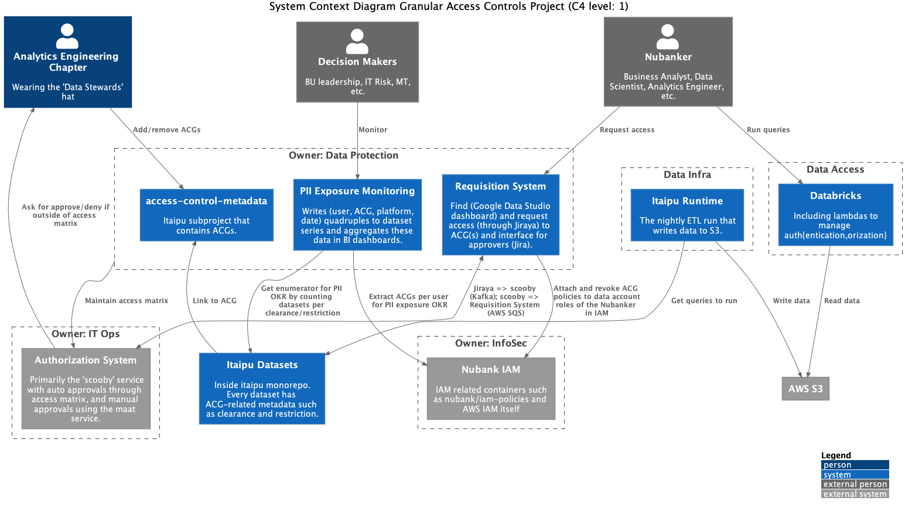
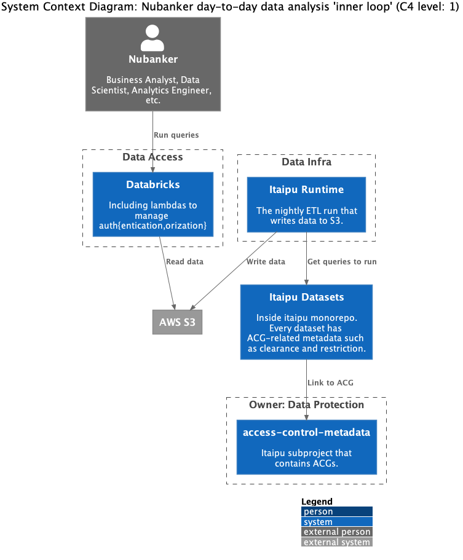

# Granular Access Control Project

This is the homepage of the Granular Access Control project.
As of now, this serves only as an index to all documents related to the project.
We'll commit content from the linked Google Docs/Sheets to this repository during the implementation phase.

## Document Index

- General
    - [Initial RFC, proposing work split into 6 subprojects (G1-G6)](https://docs.google.com/document/d/1jJimtAZrYilA8moeK9tfKulfKHIUBGpf0JxXx5w4VB0/edit) 
        - [Companion system context diagram](https://miro.com/app/board/o9J_lVJNWbI=)
    - [Simplified proposal and team boundaries](https://docs.google.com/document/d/1qxG90DgmHQlEuA6IO8eiv6-jgJBP_OxcD2JjbPfvuq0/edit)
        - [Companion system context diagram](https://miro.com/app/board/o9J_lUxZkV4=/)
    - [Data BU All-hands 2021-03-05](https://docs.google.com/presentation/d/12n7-VGYP6FjfpEA-PYHrS5fCr5SANty1s0nxKVQ3ZSE/edit#slide=id.g98f941548a_0_2)
    - [Common Tech Platforms All Hands 2021-05-12](https://honey.is//home/#post/888944)
- Metadata and rollout
    - [GAC metadata propagation specification](https://docs.google.com/document/d/1wtsdZM557suAt2kZouXTPOeq30h8nhnCpm5smA6fE1A/edit)
- Approval flow
    - [(WIP) RFC: Granular Access Control ACG Granting Flow based on Maat](https://docs.google.com/document/d/1NBvmGvVliB6YGfIkdVTb0Qc7nqv31rDtTGo0AmX2mlg/edit)

## Architecture Snapshot

In addition to the fast-paced feedback cycles on Google Docs and Slack, this page serves as a eventually consistent snapshot of the architecture.
We constantly evolve this page so that it offers a ['ubiquitous language'](https://martinfowler.com/bliki/UbiquitousLanguage.html).

The following diagrams use the [C4 model](https://c4model.com/).
This page considers high level architecture only.
For that reason we only include level 1 here, the [system context diagram](https://c4model.com/#SystemContextDiagram).
The teams that own the systems have the autonomy to create diagrams for the remaining C4 levels.

### Full Overview

In this architecture, we identify two loosely connected subgraphs (left and right).
They connect through systems in the Data Protection squad.
For better readability, we cut the diagram in two and name the resulting subgraphs.

### Subgraph 1: Nubanker day-to-day data analysis 'inner loop'

This subgraph contains four squads and one person.
The squads are all part of the Data BU.
The one dependency between squads is from Data Infra to Data Protection and relates to the S3 prefix where PII live.
The person represents any Nubanker.
They access systems owned by many different squads for their PII data needs. 

### Subgraph 2: ACG Governance & Access Flows

This subgraph contains four squads and two people.
Three squads are part of the Engineering Horizontals BU, while IT Risk is not.
Just like in the other subgraph, we find the (any) Nubanker. 
Also, take note of the Analytics Engineering (AE) Chapter.
Since the AE take cares Data Governance tasks, they will also play an important role in Granular Access Controls.
They interact with systems owned by all aforementioned squads in this subgraph.

#### Requisition System

The following sequence diagram zooms in on the requisition flow.

The dependency of the 'Requisition System' and the  `maat` service above is the desired final state.
Since the endpoint on `maat` is not yet implemented, however, we need an alternative.
In the sequence diagram below you can see that alternative.

#### Guidelines to validade a new ACG policy

When you create an ACG you need to be aware that the policy you'll write must not allow any kind of data leakage. Currently AWS policies have a size limit, so to fit its length it is common to use wild cards. However, if this is not made with caution you can accidentally give permissions to buckets with sensitive data.
To avoid that we recommend you to validate it using [aws simulator](https://docs.aws.amazon.com/IAM/latest/UserGuide/access_policies_testing-policies.html). We created a nucli command to make this test easier: `nu data-protection s3-iam-test check-access`

Since the command is in early stages there's a few manual steps that you need to do:
1) Specify the [policy name](https://github.com/nubank/nucli/blob/f4f48ba/nucli.d/data-protection.d/s3-iam-test.d/impl/src/s3_policy_test/core.clj#L42) you want to test
2) Specify the [action](https://github.com/nubank/nucli/blob/f4f48ba/nucli.d/data-protection.d/s3-iam-test.d/impl/src/s3_policy_test/core.clj#L43) you want to test
3) Specify the [bucket names](https://github.com/nubank/nucli/blob/f4f48ba/nucli.d/data-protection.d/s3-iam-test.d/impl/src/s3_policy_test/core.clj#L13) you want to test against

You can do that locally on your machine. No need to submit a PR.

### Changelog

#### 2021-05-06

- Added the requisition flow sequence diagram

#### 2021-03-25

- Added the
  [business agnostic approval endpoint of the `maat` service](https://docs.google.com/document/d/1Ouwf9mjdqG2U4DTWsfrZ78TS11igwiotIrW0XDfjKCQ/edit).

#### 2021-03-05

- First iteration of architecture diagrams ahead of the Data BU All-hands presentation.

### Contributing to Diagrams

Please update the PlantUML files directly inside the `src/` directory.
Then run `make` to update the PNGs.
