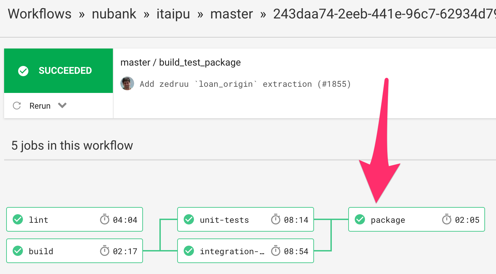
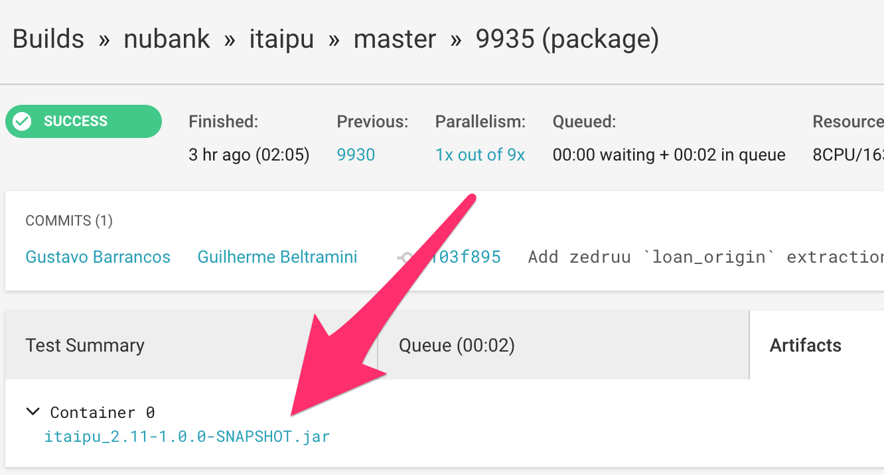
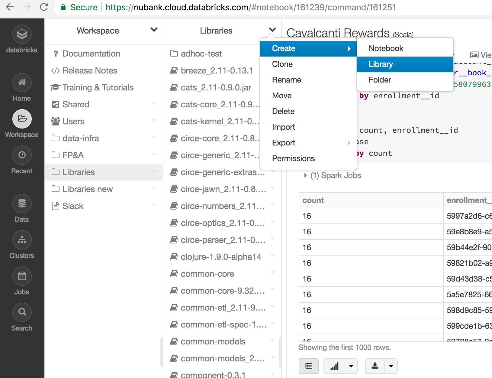

# Bumping Itaipu on Databricks

Bumping the version of Itiapu that's running on Databricks involves three
steps. First, we need to get a packaged JAR of Itaipu. Second, we need to
install this library into Databricks. Last, we need to restart the cluster(s).

## Getting a JAR

The easiest way to get a JAR is through Circle CI. Circle CI packages Itaipu
during every build that successfuly ran its tests. Generally you want to grab
the JAR from the last successful master build, which you can find here:
https://circleci.com/gh/nubank/itaipu/tree/master. Go to the last one.

Next, you navigate to the `package` step in the workflow. Do this by clicking
the link beneath 'Workflow', which is (currently) called
`build_test_package`. You will see something like this:

Click the `package` node--it should be green.

Last, download the JAR by going to the 'Artifacts' tab:

## Install into Databricks

Go to Databricks and open the Workspace browser. Navigate to Libraries in the
root and create a new library: 

Don't enter a name for the new library yet, but drag the JAR into the page
instead. The correct name will apear automatically after uploading. Temporarily
suffix the Library Name if you get a naming conflict. Go to the next page and
check 'Attach automatically to all clusters' (note: sometimes when people run
custom Itaipus this could be undesirable; so this requirement is
debatable). Last, delete the previous Itaipu from the Libraries list.

## Restart cluster(s)

Go to the Clusters page in Databricks and restart the clusters that need access
to the new Itaipu.
