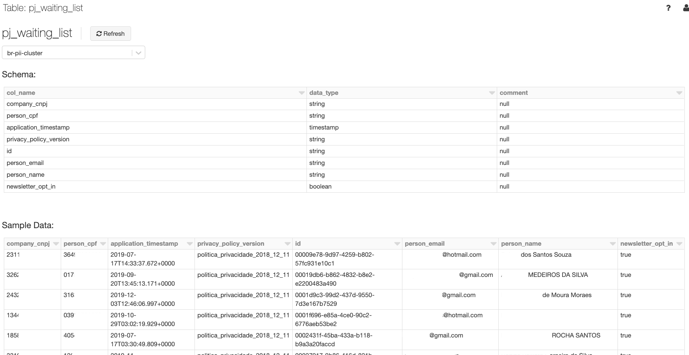
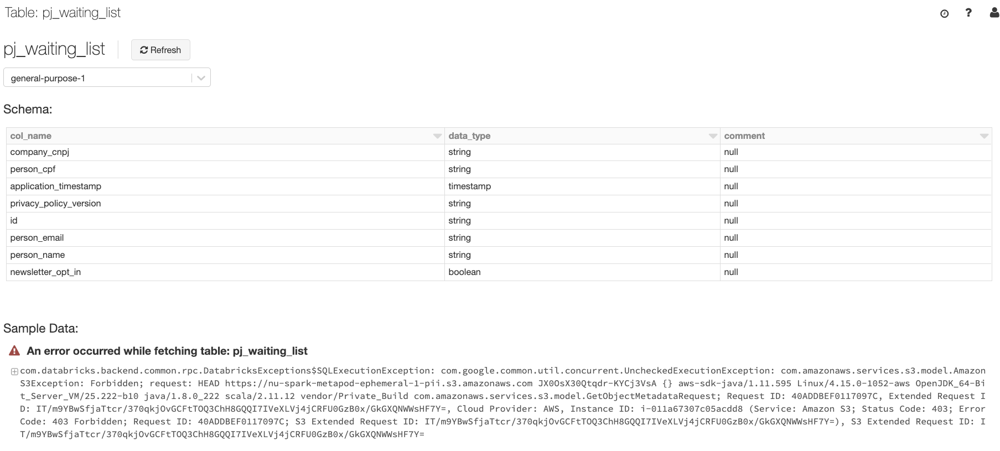

# Pii and Personal Data

 ***Abstract***:
This document aims to provide relevant terms definitions for data privacy and protection and non exhaustive list of Pii and Personal data types. 

## Relevant definitions from the Internet:

* **Pii** - Personally identifiable information (PII) is any data that could potentially identify a specific individual. Any information that can be used to distinguish one person from another and can be used for de-anonymizing anonymous data can be considered PII
* **Personal Data** - According to the law, personal data means any information relating to an identified or identifiable individual; an identifiable person is one who can be identified, directly or indirectly, in particular by reference to an identification number (e.g. social security number) or one or more factors specific to his physical, physiological, mental, economic, cultural or social identity (e.g. name and first name, date of birth, biometrics data, fingerprints, DNA…)
* **Anonymization** - It is a type of information sanitization whose intent is privacy protection. It is the process of either encrypting or removing personally identifiable information from data sets, so that the people whom the data describe remain anonymous
* **Pseudonymization** - Pseudonymisation enhances privacy by replacing most identifying fields within a data record by one or more artificial identifiers, or pseudonyms. There can be a single pseudonym for a collection of replaced fields or a pseudonym per replaced field. Pseudonymous data still allows for some form of re-identification (even indirect and remote), while anonymous data cannot be re-identified.

## Example of Pii and Personal Data:
**KEEP IN MIND THIS IS A NON EXHAUSTIVE LIST AND NEW Pii MAY APPEAR OVER TIME.**

Now that we know the definition of Pii, here is a NON exhaustive list of Pii data we have on Nubank's environment: 

* Tax identifier or social identifier numbers (such as CPF, RG, Driver License in Brazil)
* Passport number
* Biometric information
* Contact information (such as email, phone or mobile number)
* Complete Address (note that if we do NOT have the street name, for example, we would not be able to identify the person; same if we only have the CEP)
* Complete name 
* Credit card number
* Account number 
* Geolocation
* Pictures from the customer onboarding

Besides the Pii data, we also have the personal data, which would be any kind of information associated with an identified or identifiable person. Below we have a non exhaustive list of personal data (only if they are associated to an identified or identifiable person): 

* Credit card transactions, bill, installments etc. 
* Nuconta transactions, balance, transferences etc. 
* Credit scores and general bureau data 
* Travel notification
* Profession
* Income
* Birth date
* Nationality 
* Gender
* Relatives info (such as Mother's name)
* Device information

There are still ongoing discussion between privacy authorities if the following should be considered as personal data: 

* IP address
* Device ID

## Identifying and Classifying Pii in Itaipu:
One of the ways of identifying Pii in a dataset is by checking column names and their contents for information that could potentially identify a specific individual, such as CPF, Name, precise geolocation, etc. 
Once you have identified that the SparkOp you are working on contains Pii, you should categorize it as Pii by setting the clearance attribute to PII. 

```scala
override val clearance: ClearanceType = ClearanceType.PII
```

In a more real case, the dataset "pj-waiting-list", contains Pii information, which we can identify by their column names and their contents:



This dataset should then be categorized as Pii, by setting the flag clearance to Pii, as in:

```scala
package nu.data.br.dataset_series

import java.time.LocalDate

import common_etl.operator.{ClearanceType, QualityAssessment}
import common_etl.operator.dataset_series.{DatasetSeriesAttribute, DatasetSeriesContractOp, SeriesType}
import common_etl.schema.LogicalType
import common_etl.metadata.{Country, Squad}

object PJWaitingList extends DatasetSeriesContractOp {

  override val seriesName: String          = "pj-waiting-list"
  override def country: Country            = Country.BR
  override val seriesType: SeriesType      = SeriesType.Events
  override val ownerSquad: Squad           = Squad.Pejota
  override val description: Option[String] = Some("List of company prospects")
  override val qualityAssessment: QualityAssessment =
    QualityAssessment.Neutral(asOf = LocalDate.parse("2019-07-10"))
  override val clearance: ClearanceType = ClearanceType.PII

  override val contractSchema: Set[DatasetSeriesAttribute] = Set(
    DatasetSeriesAttribute("id", LogicalType.UUIDType, isPrimaryKey = true, description = Some("Register Identifier")),
    DatasetSeriesAttribute("company_cnpj", LogicalType.StringType, description = Some("Company's CNPJ")),
    DatasetSeriesAttribute("person_name", LogicalType.StringType, description = Some("Name of company's owner")),
    DatasetSeriesAttribute("person_email", LogicalType.StringType, description = Some("Email of company's owner")),
    DatasetSeriesAttribute("person_cpf", LogicalType.StringType, description = Some("CPF of company's owner")),
    DatasetSeriesAttribute("privacy_policy_version",
                           LogicalType.StringType,
                           description = Some("Version of accepted privacy policy")),
    DatasetSeriesAttribute("newsletter_opt_in",
                           LogicalType.BooleanType,
                           description = Some("Opt in for newsletters mailing")),
    DatasetSeriesAttribute("application_timestamp",
                           LogicalType.TimestampType,
                           description = Some("Timestamp of registration"))
  )
}
```

This will make the materialized table inaccessible to those without the clearance needed, and avoid possible Pii leakage. In Databricks, for instance, this dataset would be made unavailable if you are trying to access it without proper permissions:



## I need more information
If you still have questions or need additional information, please reach out to [#data-privacy](https://app.slack.com/client/T024U97V8/CLLFJMEBZ) or [#squad-data-access](https://app.slack.com/client/T024U97V8/C84FAS7L6) and we will provide appropriate support. 
