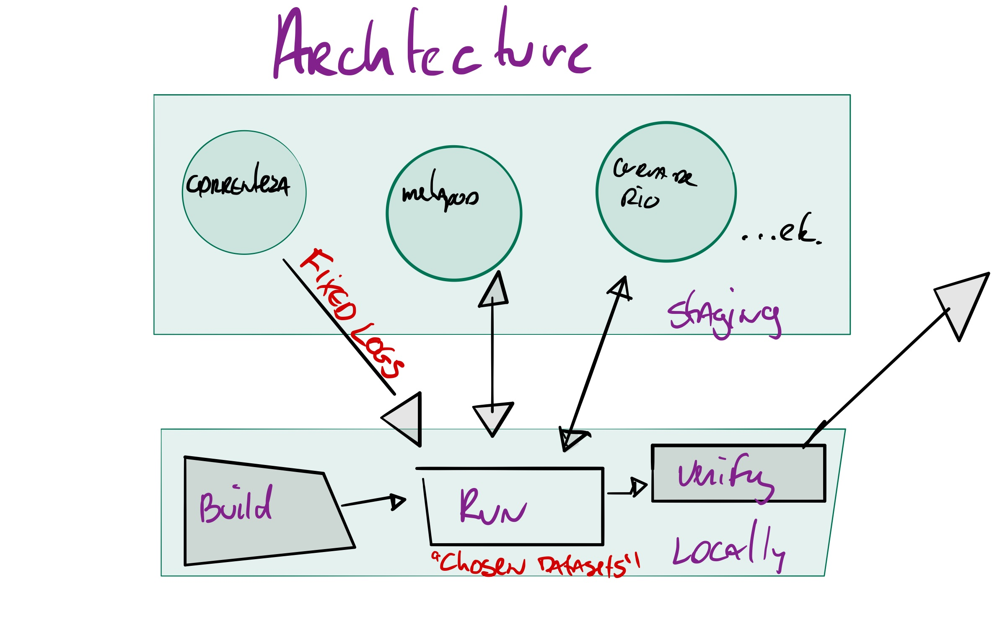
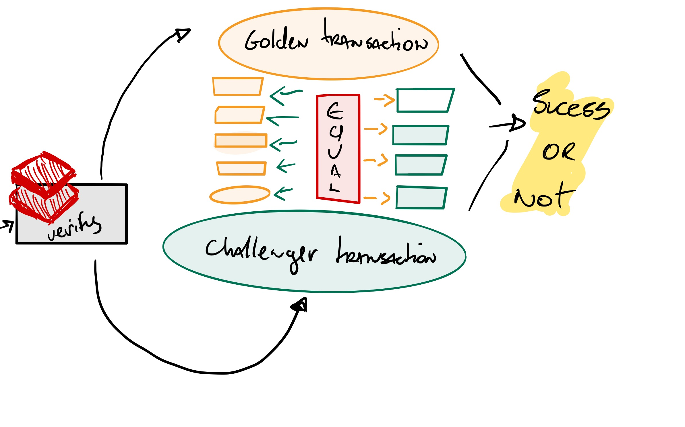

## Pororoca


It is a simple command line for improving cycle-time and reducing mistakes whenever changing platform/infra/core code on common-etl and itaipu. 

### How to run

```bash
cd itaipu
./pororoca local
```

### Setup

- [joker][1] installed.
- Spark installed and available on $SPARK_HOME. **Pororoca will try to install that for you**.
- [nucli][2] installed and updated.
- `staging` access token an certificate.
  - required **metapod-admin** scope on *staging*.
- `databricks` token available on `$DATABRICKS_TOKEN`. see: [generating a token][3]

### Implicit dependencies

- Metapod is running on staging
    - with pororoca's default `golden-transaction` available, check the version on pororoca's `--help`
    - `golden-transaction`: is a manually verified transaction that we trust to be accurate and represent properly the data
- Correnteza's dynamo-db table on staging
    - with **analytics** extracted


### Workflow

 

 1. Pororoca will build itaipu locally
 2. Pororoca will run a `spark-submit` pointing to staging services and data
 3. Pororoca will trigger a `databricks` notebook matching the current transaction against the `golden-transaction`
 

 ### Verify


To verify the transaction the databricks notebook compare the `challenger-transaction` against the `golden-transaction` validating
only the resulting contracts (contract,pii,history tables) as not to couple with intermediate results. Pororoca will return the job status but you can also check the progress on the link displayed by the cli.

### Running on a cluster

```bash
cd itaipu
./pororoca cluster --version SHA
```

To run in a cluster, a version that was pushed to quay.io must be provided. By default it will run sabesp using the `cantareira-dev` cluster, the verification step is the same.
 


[1]: https://github.com/candid82/joker  
[2]: https://github.com/nubank/nucli
[3]: https://docs.databricks.com/api/latest/authentication.html#generate-a-token