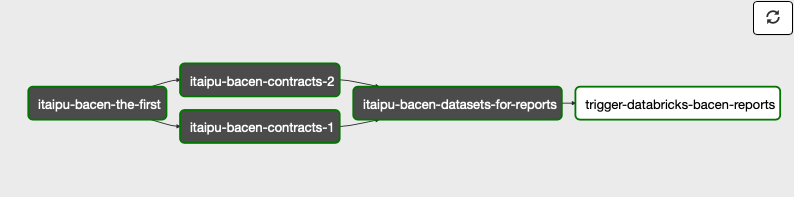

# BACEN reports DAG playbooks

## Context

The BACEN reports DAG has the goal to compute the [datasets](https://github.com/nubank/aurora-jobs/blob/master/airflow/bacen_reports.py#L91) used for the creation of the regulatory reports that are sent to BACEN during the weekdays.

### The BACEN reports `Transaction`

- It uses a `Custom` Transaction.
- The transaction ID generated is different from the transaction ID used by DAGAO or DAGUITO DAGs.

### The DAG composition



- `itaipu-bacen-the-first`: Used for created the `Custom` transaction.
- `itaipu-bacen-contracts-1`: Computes a batch of contracts needed for the datasets used by the reports.
- `itaipu-bacen-contracts-2`: Computes a second batch of contracts needed for the datasets used by the reports.
- `itaipu-bacen-datasets-reports`: Computes the datasets used by the reports.
- `trigger-databricks-bacen-reports`: Triggers the execution of a job in Databricks that creates the reports.

## Playbooks

### Airflow failure: itaipu-bacen-<[job-name]>

#### Overview

A job in the [BACEN reports DAG](https://airflow.nubank.com.br/admin/airflow/graph?dag_id=prod-bacen-reports) failed after all attempts were exhausted. There are (2 retries/ 3 attempts in total)

Considerations to have:

- The BACEN reports DAG is scheduled to run at `01:00 hours BRT time`, meaning hausmeisters in Berlin could get alerted from `05:00 hours CET time`.
- The BACEN reports DAG is meant to compute datasets for reports that are sent during `weekdays`, so alerts during the weekend can be disregarded and don't need action.

#### Alert Severity

The severity of this alert is **CRITICAL**.

The impact of having one of the airflow nodes in the BACEN reports DAG as failed compromises the computation
of the [datasets](https://github.com/nubank/aurora-jobs/blob/master/airflow/bacen_reports.py#L91) needed for creating the regulatory reports on time `06:00 hours BRT/ 09:00 hours UTC`.

#### Verification

Access [Airflow BACEN reports](https://airflow.nubank.com.br/admin/airflow/graph?dag_id=prod-bacen-reports) and confirm the failed node and the downstream nodes affected.

#### Troubleshooting

##### Check reason for the failure in Aurora job logs

The jobs for the BACEN reports run in [Cantareira](https://cantareira-stable-aurora-scheduler.nubank.com.br:8080/scheduler/jobs/prod) with the prefix `itaipu-bacen`

The debugging steps follow the same procedure like for other DAGs. Follow this [steps](https://github.com/nubank/data-platform-docs/blob/master/on-call/data-infra/on_call_runbook.md#check-reason-for-the-failure-in-aurora-job-logs)

##### Check reason for the failure in Airflow

It is possible that a failure happens before the task is created in Aurora. Network/connectivity issues are usually the problem. To verify that:

1. Access [Airflow BACEN reports](https://airflow.nubank.com.br/admin/airflow/graph?dag_id=prod-bacen-reports),
2. Follow the debugging steps the same way for other DAGS. Follow this [steps](https://github.com/nubank/data-platform-docs/blob/master/on-call/data-infra/on_call_runbook.md#checking-errors-directly-in-airflow)

##### Check datasets statuses in Metapod

1. Identify the metapod transaction used for the BACEN reports, the id is generated in Airflow.

   1. Open the [BACEN reports DAG](https://airflow.nubank.com.br/admin/airflow/graph?dag_id=prod-bacen-reports) graph in Airflow
   2. Click into `itaipu-bacen-the-first` node
   3. Click into `Zoom into Sub DAG` button
   4. Click into `itaipu-bacen-the-first` sub node
   5. Click into `Rendered` button
   6. The rendered template shows the variable `metapod_transaction` and the value of the transaction id

2. Query Metapod with the transaction id and identify the state of the datasets:

Example of query, the list of datasets are the targeted datasets used by the reports, list reference from [here](https://github.com/nubank/aurora-jobs/blob/master/airflow/bacen_reports.py#L91).

``` graphql
{"query": "{
  transaction(transactionId: \"a465395d-b088-5a7e-8917-4377cdac08d3\") {
    id
    name
    type
    startedAt
    targetDate
    referenceDate
    datasets(datasetNames: [\"dataset/nufinanceira-ccs\",
                            \"dataset/nufinanceira-ccs-representatives\",
                            \"dataset/nufinanceira-ccs-representatives-pf\",
                            \"dataset/nuconta-ccs\",
                            \"dataset/nuconta-ccs-representatives\",
                            \"dataset/nuconta-ccs-representatives-pf\",
                            \"dataset/ccs-nufinanceira-incremental\",
                            \"dataset/ccs-nufinanceira-incremental-representatives\",
                            \"dataset/ccs-financeira-incremental-representatives-pf\",
                            \"dataset/ccs-nuconta-incremental\",
                            \"dataset/ccs-nuconta-incremental-representatives\",
                            \"dataset/ccs-nuconta-incremental-representatives-pf\"],
             countries: [BR]) {
      name
      country
      committedAt
      path
    }
  }
}"
}
```

##### Solution

###### Solutions to problems with the following components can be handled by DI

- [Airflow troubleshooting](https://github.com/nubank/data-platform-docs/blob/master/on-call/data-infra/on_call_runbook.md#restart-an-airflow-task)
- [Metapod troubleshooting](https://github.com/nubank/data-platform-docs/blob/master/on-call/data-infra/on_call_runbook.md#job-failed-due-to-timeouts-communicating-with-metapod)

###### Datasets issues solutions

Requires escalation.

##### Escalation

For any datasets issues escalate it to P4RC, the owners of the datasets.

People to contact:

- Maria Rodrigues maria.rodrigues@nubank.com.br
- Julio Oliveira julio.oliveira@nubank.com.br

The owners should have the awareness that the reports need to be sent during the weekdays so it's expected that they react accordingly.

### Reports do not include all data from previous brazilian day

#### Overview

BACEN reports DAG is scheduled to start at 01:00 hours BRT time, which should provide 1 hour window for having all data ingestion from previous Brazilian day.
If the reports are missing data it could be possible that reports did not use all data from the previous day.

#### Alert Severity

No alert defined in DI.

PR4C, owners of the datasets used for the reports, escalates to DI in case they identify missing data in the reports based on validations they have.

#### Verification

##### Validate if contracts do not include missing data

PR4C can provide customer ids or some other attributes that can be queried in the contract sources and identify if they are not present.

1. Query metapod with the transaction id

```graphql
{"query": "{
  transaction(transactionId: \"a465395d-b088-5a7e-8917-4377cdac08d3\") {
    datasets(countries: [BR], committed: ONLY_COMMITTED) {
      name
      country
      committedAt
      path
      abortedAt
    }
  }
}"
}
```

2. From the result of the query, find the S3 paths of all committed datasets.

3. Use a databricks notebook to inspect data based on the s3 paths of contracts

Example inspecting data from `contract-savings-accounts/savings-accounts`

```scala
var customTXSavaingsAccountsData = sqlContext.read.parquet("S3_CONTRACT_PATH")
customTXSavaingsAccountsData.printSchema
// from the schema validating if an attribute value is present
customTXSavingsAccounts.filter(customTXSavingsAccounts("savings_account__id") === "SOME_ID").show()
```

##### Validate ingestion layer

1. Verify there was no recent incident in the ingestion Layer like Correnteza
2. Verify the ingestion of a specific contract with the help of [Correnteza monitoring](https://prod-grafana.ist.nubank.world/d/A8ULVDTmz/correnteza-datomic-extractor-service?orgId=1&from=1637626414000&to=1637659488000&var-stack_id=All&var-host=All&var-database=savings-accounts&var-prototype=s16&var-prometheus=prod-thanos)

#### Troubleshooting

#### Contracts committed to Metapod do not include expected data

1. Retrigger the BACEN reports DAG to recreate the contracts and re compute the datasets.  
2. Wait the computation to finish and ask for feedback from PR4C team.

##### Ingestion layer problems

Look into [On call runbook](https://github.com/nubank/data-platform-docs/blob/master/on-call/data-infra/on_call_runbook.md) that includes playbooks for Correnteza

#### Escalation

In case the verification of `Validate if contracts do not include missing data` or `Validate ingestion layer` did not show
evidence of possible missing data, escalate it to P4RC team.

### Datasets used by reports are aborted

#### Overview

Datasets used for the reports are classified as **TIER 1**, meaning that they can be aborted as part of the self healing mechanism DI provides in case there is an `integrity check failure`.

#### Alert severity

No alert defined in DI.

PR4C, owners of the datasets used for the reports, escalates to DI in case they identify reports cannot be created due to datasets aborted.

Datasets aborted don't throw exceptions thus there are no Airflow nodes failures and no alerting triggered. It's a valid use case to have the DAG as succeeded when there are aborted datasets.

Still given the critically of the reports, DI needs to provide support.

#### Verification

Look into Splunk logs to confirm and get all the details.

```bash
index=cantareira "integrity check error" job="aurora/prod/jobs/itaipu-bacen-*"
```

#### Solution

1. PR4C would need to submit a fix to Itaipu
2. Itaipu needs to be hot deployed
3. The [BACEN reports DAG](https://airflow.nubank.com.br/admin/airflow/graph?dag_id=prod-bacen-reports) needs to be retriggered in Airflow. That would create a new custom `transaction` in Metapod and retrigger the creation of reports.

** It's expected that if there are integrity checks failures, the datasets also failed in DAGAO. DAGAO would not need to be hot deployed since the datasets neeeded run in BACEN reports DAG.
