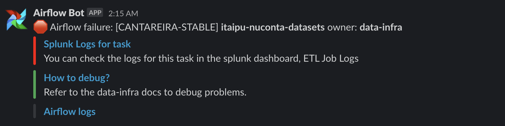
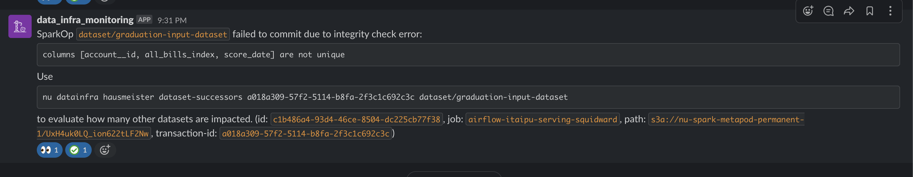
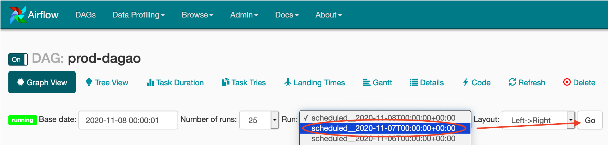
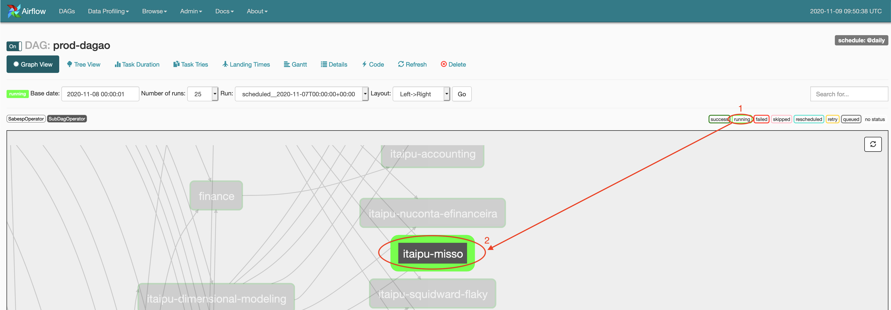
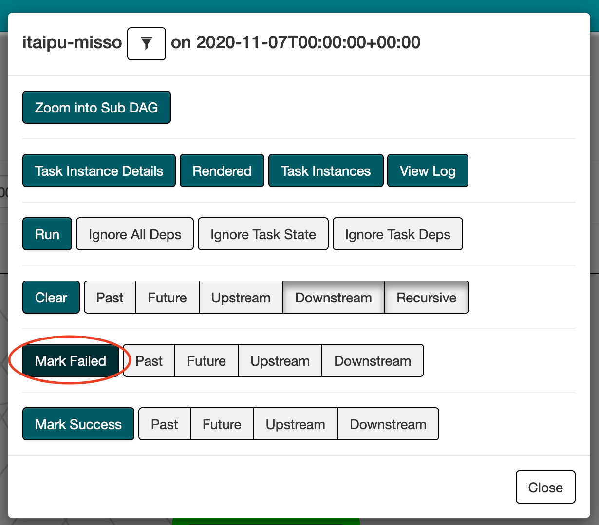

# Data Infra On-call runbook

[TOC]

This document is a resource for engineers *on-call*.

The general layout of the Alerts part is “alert, reason, action”. All the alert entries here should be linked with the alerts being dispatched from our alerting platform. The "ALERT" string should be verbatim the same string that is dispatched.

The frequent dataset failures should enumerate the symptoms of the particular failure, along with the best known way to mitigate it. Links to Slack threads about the previous failures are appreciated for traceability.

*Before contributing, please keep in mind [the following guidelines](../../writing/writing_runbooks.md).*

## Incident response

The Data Infra issue response procedure is loosely modelled after [Nubank's incident response procedure](https://github.com/nubank/playbooks/blob/master/incident-response/incident-response-procedure.md). The reason that it's different is that Data Infra issues are mostly of the [severity levels](https://github.com/nubank/playbooks/blob/master/incident-response/incident-severity-levels.md) SEV-4 or SEV-5.

When an issue arises, it is expected that you mention the failure, communicate updates and actions taken in [#data-crash](https://nubank.slack.com/messages/CE98NE603/). This allows people to follow along and contribute suggestions.

For serious incidents, also perform these steps:

- find someone to actively communicate updates about the incident, referred to as the "comms" person. if you're alone, you can take that role.
- you are the "point" person, which means you're the first responder and primary person acting on the issue
- change the [#data-crash](https://nubank.slack.com/messages/CE98NE603/) channel topic to ":red_circle: -short description of the failure- | point:  -your-name- comms: -comms-person-" e.g. "itaipu-dimensional-modeling not finishing"
- move any discussions about the issue to this channel (no need for threads)
If the incident affects the time which data will be available for users at Nubank, or availability of some user-facing service (e.g. BigQuery, Looker, Belo Monte, Databricks), post a short message about what is being affected in [#data-announcements](https://nubank.slack.com/messages/C20GTK220/). This way, users know we are aware of the issue. Note that this channel serves a wider audience than engineers, so describe the issue in plain terms and at a high level.

After the incident has been taken care of and resolved, change the topic back to ":green_circle:" (and post an update for users in #data-announcements, if applicable).

## Alarms

### Airflow failure: <[stack-id]> itaipu-<[job-name]> owner: data-infra

#### Example



#### Overview

A job failed after all attempts were exhausted. Airflow retries 2 times, so in total the job was attempted 3 times before failing.
The impact of such failure depends on where the job is positioned within the DAG:

- A job in the early hours that processes contracts, typically identified with the prefix `itaipu-*-contracts-*`; These are a dependency to every single node in the DAG. They should be fixed ASAP - the HM will get paged.
- A job at the end of the run that processes ServingLayer or Archive datasets; These are typically identified with the prefix like `itaipu-*-serving-*` or `itaipu-*-serving-*`; They have few dependencies and are situated at the end of the DAG - but the HM will get paged because failing to process ServingLayer or Archive datasets can lead to SLO degradation, meaning it directly impacts our users.
- A job that processes Flaky or non-critical datasets; These typically do not have successors, the HM will not get paged. We should still investigate, as this might affect different nodes which might lead to a crash.

_You need VPN access to follow the steps below._

#### Verification

##### Check reason for the failure in Aurora job logs

Check what was the reason for the failure, by following these steps:

1. Access the Aurora UI, [link for Cantareira](https://cantareira-stable-aurora-scheduler.nubank.com.br:8080/scheduler/jobs/prod), [link for Foz](https://prod-foz-aurora-scheduler.nubank.world/scheduler) Cantareira is the environment where we compute everything BR, and Foz is the environment where we compute everything else, e.g., MX, CO, and Data.
1. Search for the name of the failed job e.g `itaipu-contracts-contracts-1`
1. Click on "Completed Tasks". Check if the first entry has failed around the time you got the alarm.
1. To see the logs, click on the link that is an IP address that starts like `10.` 
1. Click the `stderr` link in the right end of the screen that will appear. `stdout` might also have useful info.
1. Check the logs for any errors you can read, in some cases there could be an error message or an exception type that makes it clear what is the specific cause for the failure.
1. Check the `#crash` channel in Slack for possible ongoing outages that might cause the DAG run to fail.

> If there is no content in that page or if you get a connection error, that means the task host machine is down and we can't get to the logs that way. In this case, we need to resort to Splunk. Use [this search](https://nubank.splunkcloud.com/en-US/app/search/etl_job_logs?form.the_time.earliest=-60m%40m&form.the_time.latest=now&form.search=*&form.job=aurora%2Fprod%2Fjobs%2Fitaipu-contracts)

##### Checking errors directly in Airflow

It is possible that a failure happens before the task is created in Aurora. Network/connectivity issues are usually the problem. To verify that:

1. Access Airflow, [link for Cantareira](https://airflow.nubank.com.br/admin/airflow/graph?dag_id=prod-dagao), [link for Foz](https://prod-airflow.nubank.world/admin/airflow/graph?dag_id=prod-daguito)
1. Click on the failed node, e.g, `itaipu-contracts`, in the graph, and you will see a pop-up appear. Click "Zoom into Sub DAG".
1. In the graph that will appear, click on failed Itaipu node, e.g, `itaipu-contracts`, node. Then, click "View Log".
1. You'll be seeing the log of the last attempt to start that task. If there was a failure, you'll see a stack trace, and right before that, a line that starts with:

`
{base_task_runner.py:98} INFO - Subtask: [2018-03-22 00:32:36,584] {create.py:52} ERROR - job failed with status FAILED and message [...]
`

- What is logged after "status FAILED and message <message>" is the reason why the task failed. If it reads simply `Task failed`, that means the task was started in Aurora, but the actual failure should be inspected via the Aurora logs. For that, jump back to the [Check reason for the failure](#check-reason-for-the-failure-in-aurora-job-logs) step for this alarm.
- In other cases, you might see a message such as: `Subtask: 401 Client Error: Unauthorized for url`. This means there was an error fetching credentials to talk to the Aurora API. Restarting the task should be enough. To achieve that, follow the steps in the [Restart the task](#restart-an-airflow-task).

#### Solution

##### Common reasons for job failure

###### Health check failure

* What is the health check and how it works

Health checks are specific to Apache Aurora; They are composed of custom code that Aurora uses to verify if a given task is healthy or not. "Healthy" in our context means that Spark is computing datasets, they are making progress, i.e., not stuck. Tasks that do not have enough successful health checks within the first N attempts, are moved to the FAILED state.

* What can cause our jobs to not have enough successful health checks

1. Data Skew. The computation of a dataset is either not making progress or is very slow. A dataset with heavy data skew might spend dozens of minutes, if not hours, trying to compute a single task. Our health check mechanism will see no progress, and will fail the task. If this happens you should try to parse the logs to identify which dataset failed; It is usually the last one you will see in the logs. Identifying this can get tricky, Splunk or Bash can help :rindo-de-nervoso:
1. Connectivity issues. The health check works by accessing the Spark UI to get the latest state of what is running (Curl command); If the UI is not accessible after N tries Aurora might fail the task.
1. We spent too much time computing root datasets. These datasets do not involve Spark computations, and for that reason the Spark UI will be empty -- no progress is being made from a Spark perspective. This is why our health checks have a `initial_interval_secs` of 35 minutes; The health check only starts after this period is over, therefore allowing all root datasets to be computed. This is a rare issue that we don't see happening often.

* What you should do

Let's focus on the first point from the section above: Data Skew. Assuming you were able to identify which dataset is causing the health check to fail the job.

1. Understand how critical the dataset is by checking how many and which successors it has.
1. Check if the dataset has already been committed by a different node `nu-br etl info <dataset-name> --n 2`
1. If the dataset hasn't been committed: let the users know (#data-tribe) that said dataset is failing, communicate that we are considering [committing empty](ops_how_to.md#manually-commit-a-dataset-to-metapod); If possible let the users comeback to you, in rare occurrences we might need to revert a PR and hot-deploy Itaipu, this might happen if the dataset is critical for business operations. Commit empty or revert PR.
1. Restart the Job.

Extra, but complementary steps:

1. Check if recent changes were made to the dataset you just identified
1. Let's assume it is Saturday, you identified a broken dataset, it has thousands of successors, and you've also identified a PR from the day before changing said dataset. Reverting the PR and hot-deploying Itaipu might be the way to go.
1. Reverting but not hot-deploying Itaipu. Remember that this will only apply from next day run onwards. This is usually helpful so you don't have to commit datasets empty through the weekend.

**Remember. Use your best judgement. Escalate when unsure.**

###### Broken dataset failing integrity checks

* Example



* What you should do

A dataset is broken. Committing empty is the way. You must let the users know.
Although committing empty is the default approach, we might need to revert a PR and hot-deploy Itaipu.
Always commit empty if this is blocking critical jobs, e.g, serving or archives, from starting (or finish).
Integrity check failures are usually sent to #etl-integrity-checks. Restart the job.

###### Manual dataset series contract broken due to schema mismatch

In case logs point out to
```
Caused by: org.apache.spark.SparkException: Failed merging schema:
root
 |-- account__id: string (nullable = true)
 |-- current_max_limit: decimal(38,18) (nullable = true)
 |-- final_limit: double (nullable = true)
 |-- append_timestamp: timestamp (nullable = false)
Caused by: org.apache.spark.SparkException: Failed to merge fields 'current_max_limit' and 'current_max_limit'. Failed to merge decimal types with incompatible scala 9 and 18
```

1. Datasets with this failures typically are manual dataset series, this is caused by recent manual appends with data that is not compliant with the schema. Confirm the failed dataset is a manual dataset series type and follow [Instrunctions in how to retract manual dataset series](ops_how_to.md#retracting-manual-appends-to-dataset-series)
2. Once the manual dataset series was retracted, go to airflow and clear the failed node, typically those errors happen in `itaipu-manual-dataset-series`, the job will be queued to start again.


##### Other, not so common reasons, why jobs fail

###### Dataset partition not found on s3

In case logs point out to `java.io.FileNotFoundException: No such file or directory`. An exception thrown on a Spark executor for a file on S3.
The partition file in question is accounted for in the mentioned bucket via the AWS console web UI (because the AWS CLI is usually unable to find it either), and it has no permissions listed then it's most likely this issue.

Some instances of this happening include:

- https://nubank.slack.com/archives/CE98NE603/p1566893108104300
  - https://nubank.slack.com/archives/CE98NE603/p1566115955069000?thread_ts=1566105267.068700&cid=CE98NE603
  - https://nubank.slack.com/archives/CE98NE603/p1573363471193700


  1. [Retracting](ops_how_to.md#retracting-datasets-in-bulk) the inputs for the failing datasets in order to recompute the inputs and re-store them on s3 usually fixes it.

###### Job failed due to timeouts communicating with Metapod

In case the log points out to the error `Resiliently getOrCreate transaction failed after 3 tries with error`:

  1. This transient failure could be recover by restarting the task.

  1. If the failure persist, investigate health of Metapod:

- [Metapod GraphQL metrics, particularly the query response time of `GetTransactionsWithDatasets`](https://prod-grafana.nubank.com.br/d/000000260/graphql-monitoring?orgId=1&from=now-1h&to=now&var-PROMETHEUS=prod-thanos&var-prototype=global&var-service=metapod&var-resolver=All&var-stack=blue&var-percentile=0.95&var-interval=$__auto_interval_interval)
  - [JVM metrics](https://prod-grafana.nubank.com.br/d/000000276/jvm-by-service?orgId=1&from=now-1h&to=now&var-ENVIRONMENT=prod&var-PROMETHEUS=prod-thanos&var-SERVICE=metapod&var-PROTOTYPE=global&var-STACK_ID=All&var-POD=All)


###### Raw contract job fails for inexplicable reason
 
There is a known, very rarely occurring bug, where the data from the `unified-materialized-entities` (e.g. `raw-metapod/materialized-entities`) dataset created as part of contract generation is corrupted on disc. This usually results in the raw contract tables (e.g. `raw-metapod/partitions`) failing with obscure errors, such as:
 - failure to coerce a field to its datatype due to its value being unparseable for that data type (e.g. `Caused by: java.time.format.DateTimeParseException: Text '2021o@nubank.com.br' could not be parsed at index 4`)
 - job failing due to losing too many executors (this should never happen in normal circumstances as the raw contract jobs merely filter data and perform some light, highly parallelisable transformations)
 
In both cases, investigation of the `unified-materialized-entities` table will reveal either a field with very strange looking data (which would lead to the data type coercion error) or a field with an abnormally big value on one of its attributes (which would lead to losing executors which cannot hold this value in memory while attempting to parse it). The investigation is usually done via Databricks (see the end of the entry).

It is not currently known what causes this bug. The only known guaranteed remediation is to retract all its contracts and raws, and compute it again.
1. Using BigQuery or a tool of your choice, query for the names of the contract datasets for the affected contract database, for example if `rewards-ledger` is affected:
```
SELECT name 
FROM `nu-br-data.dataset.spark_ops` 
WHERE name LIKE "contract-rewards-ledger/%"
```
2. Retract all contracts + raws for the database using the list of contracts obtained in the previous step.
```
nu-br datainfra hausmeister dataset-uncommit --include-predecessors today contract-rewards-ledger/purchase-metas contract-rewards-ledger/event-metas contract-rewards-ledger/attribute-schema contract-rewards-ledger/partner-ref-metas contract-rewards-ledger/movements contract-rewards-ledger/book-accounts contract-rewards-ledger/entries
```
 
Once the retraction is completed, restart the node, and normally the job should succeed.

**Note**: the reason we retract everything is that while the transition from `unified-materialized-entities` to raw contract is where the symptoms appear, the corruption can sometimes be coming from one of of the prototype-specific materialized-entities tables. For most databases, it's probably quicker to just retract and recompute everything. However, for bigger databases (such as `ledger` or `double-entry`), you may want to try to dig into the data so that you may retract only the materialized-entities table that contains the corrupt field. One approach, using Databricks, is to isolate the faulty rows so that you may find which prototype they're coming from, and only retract the materialized-entities table of that prototype. Below is an example taken from a crash where the issue was manifesting for `raw-sr-barriga/tx`, when coercing the `db__tx_instant` field:
```scala
import org.apache.spark.sql.functions._
import java.math.BigDecimal
import java.sql.{Date => SQLDate}
import java.time.{Instant, LocalDateTime, ZoneId}
 
// This is for the case when you're trying to parse a date. Adapt to whatever data type is failing in your context.

val parseUDF = udf { arr: Seq[String] =>  
  try {
    java.sql.Timestamp.from(Instant.parse(arr.head))
  } catch {
    case e: Exception => null
  }
}

val unifiedMaterializedEntitiesTable = spark.read.parquet("s3://nu-spark-metapod-ephemeral-1-raw/wp7mX80YQEOe-XraQ6kMTA") // this can be obtained by querying Metapod

val faultyRows = unifiedMaterializedEntitiesTable
  .filter($"prospective_primary_key" === "db__tx_instant")  // the primary key of the contract entity, can be found in the contract on Itaipu. This steps serves to reduce the amount of data we need to process
  .withColumn("db__tx_instant", parseUDF($"attributes.db__tx_instant")) // apply the parse udf to the column 
  .filter($"db__tx_instant".isNull) // find rows for which the parsing failed
 
display(faultyRows) // for parsing failures, this will allow you to see specifically what is wrong
display(faultyRows.drop($"attributes")) // for executor failures, you should first drop the attributes column, as otherwise the Databricks executors will also fail when trying to display it to you
```
 
 
### Restart an Airflow task

1. Access [Airflow in Cantareira](https://airflow.nubank.com.br/admin/airflow/graph?dag_id=prod-dagao), or [Airflow in Foz](https://prod-airflow.nubank.world/admin/airflow/graph?dag_id=prod-daguito)
1. You'll see the state of the entire DAG in this page. The status of each node in the graph is represented by its stroke color. There is a reference on the upper right corner. Search for the node name that failed, e.g `itaipu-contracts`, it should have a red stroke color.
1. Click on the failed node, and you will see a pop-up appear with some buttons. Click the "Clear" button (dark green), while making sure the "Downstream" and "Recursive" options are pressed (which means enabled) beside it.
_What you just did is "clearing" the state of the node. This will effectively make Airflow try to figure out the next steps to try to get the state to a "succeeded" state, which is first transitioning into a "running" state by executing the task_
1. After a few seconds, the node stroke color should be back to light green. If not, refresh the graph view after a few seconds via the refresh button in the upper-right corner.

After executing these steps, there is a possibility that the task fails once more. In this case, escalate to the next layer of on-call and coordinate with another engineer to figure out next steps.

### Alph - No file upload in the last hour

This alert means that [Alph](https://github.com/nubank/alph) is not properly consuming, batching and uploading incoming messages.

#### Solution

- First, check on Grafana if that's really the case [Grafana Dashboard](https://prod-grafana.nubank.com.br/d/000000301/dataset-series-ingestion)
- If that's the case and files upload is actually 0 in the last couple hours you should cycle alph, `nu k8s cycle global alph`
- After a while check if it gets back to normal.
- If it doesn't start working again, check for further exceptions on Splunk.

### Alph - kafka lag above threshold

This alert means that [Alph](https://github.com/nubank/alph) is not consuming messages on at least one partition on the prototype. This is usually caused by one of two things: either Alph is under-provisioned, or one of the consumers/partitions got temporarily stuck somehow. A third event that can create a significant lag, which is related to the previous one, is that we might have a series whose messages are too big and therefore are not being processed.

#### Solution

Open [Alph Grafana Dashboard](https://prod-grafana.nubank.com.br/d/000000301/dataset-series-ingestion) as well as the [Kubernetes CPU and Memory dashboard](https://prod-grafana.nubank.com.br/d/000000268/kubernetes-cpu-and-memory-pod-metrics?orgId=1&from=now-6h&to=now&refresh=1m&var-PROMETHEUS=prod-thanos&var-namespace=default&var-container=nu-alph&var-PROTOTYPE=All&var-stack_id=All). Make sure to correctly set the prototype to whatever prototype is alarming on both dashboards.

- First, check on the Kubernetes dashboard for frequent restarts; this is usually visible for example on the memory usage graph where you'll see a lot of new lines appearing through time as new processes are added. Under normal circumstances the memory usage lines should be mostly stable.
- If there are frequent restarts, check the memory usage of the pods (both average and per pod) on the same dashboard to see whether Alph may be under-provisioned on that shard. If it is, you'll need to bump memory by submitting a PR on [definition](https://github.com/nubank/definition) or, if you want to go fast or if there isn't anyone around to approve your PR, directly by editing the k8s deployment with `nu-"$country" k8s ctl --country "$country" --env "$env" "$prototype" -- edit deploy "$env-$prototype-$stack-alph-deployment"`.
- If there are no restarts, the next step is to check directly the alph dashboard to see if the issue is occuring on all partitions or only on a single one. Usually if the issue is not due to provisioning, there'll be a single stuck partition. In this case the fix is to cycle alph: `nu-$country k8s cycle --env prod $prototype alph`. It'll take some time for processing to resume, usually between 10 minutes and an hour, but you should eventually see a dip in the lag.

### compaction triggered on Airflow

This alert means that the Compaction DAG encountered an error. The Compaction DAG is expected to run every day, and so errors in its execution are unexpected and should be treated with some urgency. Below are a few steps you can take to investigate the issue:

- Open the [Compaction DAG view on Airflow](https://airflow.nubank.com.br/admin/airflow/graph?dag_id=ouroboros-compaction) and confirm that the node marked `compaction` is the one failing (and not the scale-up/scale-down nodes)
- Check the [job logs](https://nubank.splunkcloud.com/en-US/app/search/etl_job_logs?form.the_time.earliest=-24h%40h&form.the_time.latest=now&form.search=*&form.job=aurora%2Fprod%2Fjobs%2Fcompaction) for any error

### Correnteza database-claimer is failing

If you see a `ops_health_failure` alarm on `#squad-di-alarms` for `component: database-claimer` then you can get more info by running

```bash
nu ser curl GET global correnteza --env prod /ops/health/database-claimer | jq .
```

Usually this means that the database claimer, which is responsible for acquiring zookeeper locks that correspond to datomic databases, has somehow failed to acquire the appropriate number of locks. The claimer state contains two metrics that are important to us: `locked` indicates how many databases this instance of correnteza has acquired, and `lowest_acceptable` indicates how many it needs to acquire to be considered healthy (it's normally the same as the total number of existing databases for this shard). In other words `database-claimer` will be unhealthy when `locked` is below `lowest_acceptable`.

The most common cause is for a given instance of `correnteza` to finish boostrapping before all locks were released. As a result, it reaches a state where it no longer attempts to get new locks, without having acquired all of them.

In this context, the first thing you'll want to do is run:

```bash
nu k8s ctl <prototype> --env prod -- get pods -l nubank.com.br/name=correnteza
```

and verify that there is only a single instance of `correnteza` running for this protoype. If there are two, you will need to either wait for it to get back to a normal number of pods (1 in the current setup), or force a scale down with:

```bash
nu k8s scale <prototype> --env prod correnteza 1 --min 1 --max 1
```

To monitor the scale down, you can use:

```bash
watch -n 10 'nu k8s ctl <prototype> --env prod -- get pods -l nubank.com.br/name=correnteza'
```

Once there's only one instance, and if it's still unhealthy, you can:

- run `nu ser curl POST <prototype> correnteza --env prod /ops/database-claimer/acquire-new` which will schedule a new round of lock acquisition attempts. Depending on how many locks it needs to catch up on, this may take up to 30 minutes. Use `watch -n 10 'nu ser curl GET <prototype> correnteza --env prod /ops/health | jq ".[1].database_claimer.checks"'` to monitor whether the count increases. Remember that you want `locked` to become equal to `lowest_acceptable`

- cycle the service with `nu ser cycle <prototype> correnteza --env prod`. Bear in mind that this has the potential of making correnteza more unstable (due to the above-mentioned issue of having several instances up at the same time), so you really should first attempt the `acquire-new` approach first.

If the above doesn't solve the issue, you may need to dig into which specific locks are not being acquired are not being extracted, using Splunk to find any error messages which may help you understand what's going on, for example with the query: `source=correnteza prototype=<prototype> error`.

### Correnteza attempt-checker is failing

Correnteza has several instances that coordinate via zookeeper to extract from all the datomic databases discovered. If for some reason these instances fail to connect to a datomic database it has extracted from in the past it means that either: there is a bug or the database has been deprecated. In order to check for this we always log in a little docstore when we try to extract from a database. Then every 20 minutes we have a healthcheck that ensures that every database listed in that docstore has had an extraction attempt in the last 10 minutes.

When this healthcheck fails you'll see a `ops_health_failure` alarm on `#squad-di-alarms` for `component: attempt-checker`. For more info run:

```bash
nu ser curl GET global correnteza /ops/health/attempt-checker | jq .[1].attempt-checker
```

The output will give you a list of which databases haven't had any recent extractions. The first thing you can do is to run `nu ser curl POST <prototype> --env prod correnteza /ops/attempt-checker/force` to force a refresh of the component and verify that it wasn't a temporary issue.

If the component is still unhealthy, the first thing you should check is whether the `database-claimer` component may also be unhealthy, using `nu ser curl GET global correnteza --env prod /ops/health/database-claimer | jq .`. If it is the case, then it's very likely the issues may be related, and you should fix the `database-claimer` first. Use the section above about the `database-claimer` to do this. Don't forget to run `nu ser curl POST <prototype> --env prod correnteza /ops/attempt-checker/force` again once you've fixed the `database-claimer` to get the `attempt-checker` into a fresh state.

If/once the claimer is healthy, and if the `attempt-checker` is still failing, you'll need to investigate each database listed in the health-check message individually. The first thing to check is Splunk, using a query such as `source=correnteza prototype=prototype error <database>`. A common thing to look for here is messages indicating issues when attempting to connect to these databases, such as:

- `... :error :connecting, :url "datomic:ddb://sa-east-1/prod-<database>-datomic/<database>" ...`: usually means the table doesn't exist.
- `Could not find <database> in catalog`: usually means the table does exist, but the service is still being bootstrapped and hasn't started transacting anything yet.

You can then look through the commit of the service's repo, or of their definition file for their datomic transactor, to assess whether this is likely a service under construction. You can also ask the owner squad directly (use `nu ser owner <service>` to find out who it is), though depending on the time of the day this may not be the most efficient way to get information.

If you strongly suspect, or discover that the database that isn't being extracted from has been deprecated or isn't really live yet, you can remove it from the attempt checker list:

`nu ser curl DELETE --env prod <prototype> correnteza /api/admin/delete-attempt/<database>`

You can then force the healthcheck to recompute its state via:

`nu ser curl POST <prototype> --env prod correnteza /ops/attempt-checker/force`

If the service in question has been live for a long time, or if you know it to be a critical service AND if the last extraction attempt is more than 1 day old, you should reach out to the owner squad urgently to find out what's going on and work with them to solve the situation.

### Barragem - segment handling time above threshold

This alert means that [Barragem](https://github.com/nubank/barragem) is not able to process segments in time (10 minutes SLO), for at least one prototype and one database. This can mean that big or faulty segments are being submitted to Barragem (e.g. files generated on a backfill job were too big and may be slowing down Barragem overall) or the service is under provisioned.

#### Solution

- First, check Splunk for any errors or big delays using `source=barragem error` or `source=barragem timing_ms>600000` (you can also specify a prototype by adding `prototype=s0` to the query, for example). Any exception here may indicate faulty segments or integration issues with other components (ex: AuroraDB). This [troubleshooting] playbook section can be consulted for more info about possible errors at this point. If there are no exceptions or errors, continue to the steps below.
- Then, open the [Barragem Grafana Dashboard](https://prod-grafana.nubank.com.br/d/ApXjNMwZk/barragem) as well as the [Kubernetes CPU and Memory dashboard](https://prod-grafana.nubank.com.br/d/000000268/kubernetes-cpu-and-memory-pod-metrics?orgId=1&refresh=1m&var-PROMETHEUS=prod-thanos&var-namespace=default&var-container=nu-barragem&var-PROTOTYPE=All&var-stack_id=All). Make sure to correctly set the prototype to whatever prototype is alarming on both dashboards. Check the service resource comsumption on the Kubernetes dashboard. If the pods are caped on CPU or RAM, seems unresponsive, or if there are frequent restarts, Barragem may be under-provisioned on the observed shard. In this case, you'll need to bump resources (CPU and/or memory) by submitting a PR on [definition](https://github.com/nubank/definition/blob/master/resources/br/services/barragem.edn) or, if you want to go fast or if there isn't anyone around to approve your PR, you can bump resources directly by editing the k8s deployment with `nu-"$country" k8s ctl --country "$country" --env "$env" "$prototype" -- edit deploy "$env-$prototype-$stack-barragem-deployment"`. For example, for the `global` prototype on `br`, and the `staging` env: `nu-br k8s ctl --country br --env staging global -- edit deploy staging-global-blue-barragem-deployment`
- If there are no restarts, the next step is to check [AuroraDB dashboard on AWS](https://sa-east-1.console.aws.amazon.com/cloudwatch/home?region=sa-east-1#dashboards:name=barragem_aurora) (pay attention to check the AWS account on the correct country) to see if the database instances is struggling for resources, which would affect write- and read-throughput and thus slow-down the processing of segments. If this is the case, you will need to bump the size of the writer DB instance by clicking on the _Modify_ button on the [prod-global-barragem-aurora-instance](https://sa-east-1.console.aws.amazon.com/rds/home?region=sa-east-1#database:id=prod-global-barragem-aurora-instance;is-cluster=false) dashboard. Bump one or more instance types and evaluate if it was of any help.

### Barragem - segment processing errors

#### Overview

This error means Barragem is not being able to process a given Correnteza segment from a given datomic database. This also means that the streaming contract is not being processed correctly, and therefore the BigQuery table is not being updated.

#### Troubleshooting

The best way to troubleshoot and better understand what is happening, is by using [Splunk](https://nubank.splunkcloud.com/en-GB/app/launcher/home). Initially you should be looking for ["error-processing-segment" errors](https://github.com/nubank/barragem/blob/master/src/barragem/diplomat/consumer.clj#L76), i.e., `source=barragem "error-processing-segment" "acquisition"`.
Alternatively you can look for "barragem.diplomat.consumer/exception-consuming", i.e., `source=barragem "barragem.diplomat.consumer/exception-consuming"`, this will give you the whole stack trace and allow you to find the root cause.

#### Solution

If a bug is found, a fix needs to be put in place as soon as possible. BQ tables are not being updated and we are breaking the streaming contacts 1h SLO.

#### Escalation

Please consider informing our users (#data-announcements) about the ongoing issue.

### Barragem - not receiving requests from scheduler

#### Overview

This error means that Barragem is not able to receive requests from the scheduler (currently, [Tempo](https://github.com/nubank/tempo)) for a certain amount of time. As consequence, missing those requests will make Barragem not consume new files deployed by Correnteza and no contract will be update meanwhile.

#### Troubleshooting

This problem can be caused by either issues or down times on Tempo, or by problems while receiving Tempo requests on Barragem side. You can the check logs of both components by using [Splunk](https://nubank.splunkcloud.com/en-GB/app/launcher/home), where you should look for exceptions of any kind, i.e., `source=tempo OR source=barragem exception`.

#### Solution

If a bug is found on Barragem side, a fix needs to be put in place as soon as possible. BQ tables are not being updated and we are breaking the streaming contacts 1h SLO.

#### Escalation

Please consider informing Foundation (#foundation-tribe) in case of any issue on Tempo side.

### tapir PARTITION-TO-SERVE deadletter_count_above_threshold

#### Overview

 By consuming this Topic, tapir loads data to the serving layer.
 The alert happens if an Exception is thrown while consuming a Kafka message.
 Usually the deadletters in this Topic is related to transient communication errors with S3 or DynamoDB. We need to verify if that's the case before acting on it.

#### Alert Severity

Usually not urgent, but it should be dealt in the same day.

#### Verification

You can click on "See on Prometheus" to check if the metric is still above threshold.

#### Troubleshooting

Check if the error is transient and related to S3 or DynamoDB connection issues.
Check "Related Links" on how to see deadletters.

An example of an error caused by DynamoDB communication:

```
  {:type java.net.SocketTimeoutException
   :message Read timed out
   :at [java.net.SocketInputStream socketRead0 SocketInputStream.java -2]}]
 :trace
 [[java.net.SocketInputStream socketRead0 SocketInputStream.java -2]
 ...
  [com.amazonaws.http.AmazonHttpClient execute AmazonHttpClient.java 530]
  [com.amazonaws.services.dynamodbv2.AmazonDynamoDBClient doInvoke AmazonDynamoDBClient.java 6164]
  ...
```

A second important check is on the deadletter's timestamp. You can get the timestamp from the payload of it.

If the deadletter is thrown today, it can be safely replayed.

If the deadletter is thrown a day ago, the deadletter can be stale and a new message could have already loaded newer data. If this stale message is replayed, it will overwrite the newer data. In this case, you need to check if the dataset in question has already been loaded today.

#### Escalation

No need to escalate.

#### Related Links

How to replay deadletters: https://github.com/nubank/data-platform-docs/blob/master/on-call/data-infra/ops_how_to.md#replaying-deadletters


### Warning: [PROD] correnteza_last_t_greater_than_basis_t

#### Context

Correnteza tracks the extractions from the Datomic databases by storing the `last-t`
that it extracted from each of those databases.
The actual last `t` stored on those databases is referred to as `basis-t` in Correnteza.
This alarm goes off when Correnteza thinks that it is ahead of the original database, which
means that it won't extract any new data from that database.

The condition described above seems impossible to reach, and so far, it has only happened when
people destroy and re-create databases for the production services.

#### Solution
Note that this solution only applies for the cases described above, **so please confirm
with the service owners that the database was re-created**.

The solution involves 3 steps:

##### Delete all the extractions for the databases that the alarm is going off for

There is an admin endpoint in Correnteza exactly for this purpose, but it's protected with
the scope `correnteza-extraction-delete`.
If you have to execute this command, make sure to ask for this scope in #access-request.

```bash
# parameterised with database name (skyler) and prototype (s0)
nu ser curl DELETE --env prod s0 correnteza /api/admin/extractions/s0/skyler -- -v
```

The command runs asynchronously, so the expected response is `HTTP 202 Accepted`. To check if
the extractions were actually deleted, query the [Correnteza docstore](https://sa-east-1.console.aws.amazon.com/dynamodb/home?region=sa-east-1#tables:selected=prod-correnteza-docstore;tab=items) in the AWS console. To check the items corresponding to the command above, the filter would
be `db-prototype = skyler-s0`.

##### Cycle Correnteza in the corresponding prototype

After the extractions are deleted, the next step is to cycle the instances of Correnteza that
are connected to that DB prototype. This is necessary to refresh the `last-t` kept by
Correnteza for that database prototype, which happens at service startup.

Correnteza is sharded and it connects to the databases within the same prototype, so we have
to cycle the same one that we deleted the extractions for.

```bash
# parameterised prototype (s0)
nu k8s cycle s0 correnteza
```

To check the progress of the service cycling, run this command:

```bash
# parameterised with service name (correnteza) and prototype (s0)
watch --differences --interval 10 nu k8s ctl s0 -- get po -l nubank.com.br/name=correnteza
```

##### Monitor re-extractions

After the service has cycled, wait for a few minutes. Correnteza's startup is noticeably
slow because it has to discover and connect to many Datomic databases.
Then, check the status of the Datomic extractor using
[Correnteza's extractor dashboard](https://prod-grafana.nubank.com.br/d/A8ULVDTmz/correnteza-datomic-extractor-service?orgId=1&var-stack_id=All&var-host=All&var-database=skyler&var-prototype=s0&var-prometheus=prod-thanos) on Graphana.


The dashboard has a lot more useful information about Correnteza's extractions, but the
important bits for this purpose are highlighted in the screenshot.

[correnteza-extractor-dashboard]: https://prod-grafana.nubank.com.br/d/A8ULVDTmz/correnteza-datomic-extractor-service?orgId=1&var-stack_id=All&var-host=All&var-database=skyler&var-prototype=s0&var-prometheus=prod-thanos

### Ouroboros - Number of newly created manual series resource groups higher than expected

Please consult the [MDSS alerts playbook](https://github.com/nubank/data-platform-docs/blob/master/on-call/data-infra/mdss_alerts_playbook.md).

### Itaipu/Aurora/Mesos/Spot: Job has not accepted any resources

#### Alert Severity

Critical

#### Overview

This error indicates that the cluster has insufficient resources to run the current job; This is usually related to a scale up issue, i.e., Spot not being able to spin on-demand instances in a certain availability zone.

#### Verification

In order to verify this, you should

1) Open the Aurora logs, and you will probably see several messages like this one `job has not accepted any resources; check your cluster UI to ensure that workers are registered and have sufficient resources`. This means that there are no nodes available to run the current job on.
2) Open the Spot UI and look at the logs from the faulty job (Okta -> Spotinst -> Elasticgroup -> Groups -> filter by job name, for example `itaipu-brando` -> Log -> select the time period), and you might see something like `08/26/2020, 18:44:02, ERROR, Can't Spin On-Demand Instance: Code: InsufficientInstanceCapacity, Message: We currently do not have sufficient r5.4xlarge capacity in the Availability Zone you requested (us-east-1c). Our system will be working on provisioning additional capacity. You can currently get r5.4xlarge capacity by not specifying an Availability Zone in your request or choosing us-east-1a, us-east-1b, us-east-1d, us-east-1f.` This indicates that `Spot` is not working as expected and failing to create on demand instances.

#### Solution

Since a random AZ is selected every time we run a scale-up job, re-triggering the entire Airflow SubDag from scratch will hopefully fix it.

### Ouroboros lag is too high

This alert is triggered when Ouroboros is behind consuming messages
from the topic `NEW-SERIES-PARTITIONS`.

Impact: Depending of the size of the lag, some data that was ingested
for any dataset series type (events, manual or archives) would not be
included in the next daily run to be processed.

Underlying causes and therefor solutions for this problem are
potentially many, so it’s not unlikely you’ll have to troubleshoot it
from scratch, after the suggestions described below are exhausted. In
any case, usually this problem is caused either by a bug in the logic
causing lots of retries or it can be due to rebalancing.

#### Verification

Check the obvious. Is the service up at all? We
should have received at least some alarms about it, but a preliminary
check shouldn’t hurt.

```
nu-<country> k8s ctl global --env prod -- get pods -l nubank.com.br/name=ouroboros
```

and then, if everything looks normal:

```
nu-<country> ser curl GET global ouroboros --env prod /ops/health | jq .
```

[Check Splunk for
exceptions](https://nubank.splunkcloud.com/en-US/app/search/search?q=search%20source%3Douroboros%20%7C%20search%20error&sid=1622095053.2452457_164C9620-A673-43A2-A341-29A4F0940D31&display.page.search.mode=verbose&dispatch.sample_ratio=1&earliest=-30m%40m&latest=now).
This should help you validate the hypothesis about too many retries.

About Kafka rebalancing. Ouroboros is shard aware, so the alert
aggregates the lag from all shards. Check Ouroboros Kafka lag metrics
to check if the problem is happening with one specific shard or is a
general problem. [Kafka lag dashboard in Grafana](
https://prod-grafana.nubank.com.br/d/000000222/kafka-lags-topic-view?orgId=1&from=now-2d&to=now&refresh=1m&var-PROMETHEUS=prod-thanos&var-GROUP_ID=OUROBOROS&var-TOPIC=NEW-SERIES-PARTITIONS&var-PROTOTYPE=All&var-STACK_ID=All)
and [Kafka rebalancing dashboard in Grafana](https://prod-grafana.nubank.com.br/d/000000222/kafka-lags-topic-view?viewPanel=17&orgId=1&refresh=1m&var-PROMETHEUS=prod-thanos&var-GROUP_ID=OUROBOROS&var-TOPIC=NEW-SERIES-PARTITIONS&var-PROTOTYPE=global&var-STACK_ID=blue)

Finally, [check Ouroboros
dashboard](https://prod-grafana.nubank.com.br/d/XEIhxKHMz/ouroboros-monitoring?orgId=1)


#### Solution

The following list is just a suggestion, since the set of potential
problems is open-ended.

- Cycle the service
- Check provisioning of the service, if you have reasons to believe
  the service needs more resources.

If you have reasons to believe Ouroboros needs more resources, you can
use one of the following commands:

```
nu-<country> k8s scale --env prod global ouroboros <baseline> --min <min> --max <max>
```

Or change CPU `requests` and `limits` in the k8s definition:

```
nu-<country> k8s ctl global --env prod -- edit deploy prod-global-<color>-ouroboros-deployment
```

_NB You can use `nu stack current` to find the color._

Or a combination of both.

After this you need to monitor the lag. If your changes proved
successful, you want to change [the
definition](https://github.com/nubank/definition/blob/master/resources/br/services/ouroboros.edn)
for the country (here, Brasil).


### Itaipu OutOfMemory error

#### Alert Severity

Soft alert.

#### Overview

While computing a dataset, an Itaipu node fails with `java.lang.OutOfMemoryError`. This error is usually thrown during a Spark stage when there are insufficient resources to process said dataset. It is a Soft Alert because **usually**, these datasets get eventually computed and succeed, as they end up running on a different node.

#### Verification

The OOM check runs every hour, and we get alerted only once - within a 45 minute window - per job name. The issue is still ongoing if we get subsequent alerts for the same job name, 45m after the first one.
If OOM happens in two jobs within the 45m window, two alerts - one per each job - are sent.

#### Troubleshooting

First things first, we are going to need to understand which dataset has failed, and you can do this by parsing the Itaipu logs (*stderr* from the Aurora page). This is not very straightforward, because multiple threads log to that file, and for that reason, it might not be easy to identity which dataset is the culprit, but you should at least be able to narrow it down to a few candidates.

And now, it is time to understand if said dataset was already committed (potentially in different node), by running, for example, `nu-br etl info <dataset-name>`, e.g., `nu-br etl info nu-br/dataset/customer-eavt-pivotted`; if yes, you should still warn the users (see the Escalation section), informing them that the dataset failed, and that its stability might not be the best.

#### Solution
Even though sometimes no action needs to be taken (as the dataset often succeeds in a different node), **you should consider committing the faulty dataset empty if it keeps failing, and a critical part of the run is getting blocked by it.**
Something else worth trying is to isolate the faulty dataset in a different node, i.e., `itaipu-other-flaky-datasets`, and see if its behaviour changes during the next run.

Most of the time, our users are the ones coming up with the long term solutions for these kind of problems, and it usually involves them optimizing their SparkOP or even breaking it down in multiple ones.

We do have one known event that can cause these issues, and that we can try to solve on our side: a combination of a Spark listener event queue being too big (we control their size) for a given job, and an issue with a Dataset - user behaviour, this can cause the node to OOM and we can try to fix it by reducing the size of the queue. We do this by changing a variable called `spark_listener_bus_capacity` inside `dagao.py`. You can set a smaller value in the order of tens of thousands. The default set by Spark is 10k. You must hot deploy `dagao` if you want these changes to take effect right away.

#### Escalation
If the problem is found to originate from user behaviour, we should leave a message in #data-tribe, informing our users that a specific dataset(s) is having OOM issues. We should inform them that the dataset succeeded on a different node, but that we are concerned about its long term stability. Please follow our [communication templates](https://docs.google.com/document/d/1L5MwBH2OZ0uvr5sTHG-LrLQTFRtx44Az8HyeN46rnc8/edit). They should investigate.

#### Relevant links

* https://spark.apache.org/docs/latest/configuration.html, `spark.scheduler.listenerbus.eventqueue.capacity` field.

### No space left on device

#### Symptoms

No real symptoms. This alert directly points to the real cause: one or
more EC2 instances running Spark Executors are out of disk space.

#### Solution

* Consider decreasing the workload. For example if the job is a periodic
    maintenance job like `pollux-auto` consider [decreasing the number of databases](https://github.com/nubank/castor/blob/master/resources/castor_config.json.base)
    it updates the cache for at a time, as long it can still maintain the service
    SLO.
  * Change the storage class for the instances assigned to that job in
    `aurora-jobs`. See [this
    PR](https://github.com/nubank/aurora-jobs/pull/1232) for an
    example. Please note: at the time of the PR, we had three storage
    classes defined: `low`, `standard`, `high`. Also, see [this Slack
    thread](https://nubank.slack.com/archives/CP3F163C4/p1591794519178600)
    to trace back to the context leading to that PR.
  * If the job is critical, run it manually with this override.

### Dagao is using an out-of-date version of itaipu's release branch

#### Context

The alert is telling us that the version being deployed is different
from the current top of the tree in Itaipu’s `release` branch. For
more context see [How Itaipu is deployed to the
Dagao](/itaipu/workflow.md#how-itaipu-is-deployed-to-the-dagao).

#### Solution

* Set release back to the correct version
      *If we know there were no hotdeploys that day, we can get the
        correct release from
        [`#etl-updates`](https://nubank.slack.com/archives/CCYJHJHR9/p1597104023128200),
        otherwise the user should go check out the commit history to
        find the latest commit for that day's run.
      * And use it to revert the `release` branch to that value.
  * Push the changes and wait for the `dagao` pipeline to finish.
  * Once it’s done, trigger a hot-deploy by triggering the gated step
    in `dagao`, i.e. [the `>|>` arrow after the `create-release`
    step](https://go.nubank.com.br/go/tab/pipeline/history/dagao).
  * Restart the failing jobs
    * Kill the job with `nu-<country> datainfra sabesp -- --aurora-stack <stack-name> jobs kill jobs prod <job-name>`
      * [Clear the nodes in Airflow](/airflow.md#triggering-a-DAG-vs-clearing-a-DAG-and-its-tasks)

  * Change the storage class for the instances assigned to that job in
    `aurora-jobs`. See [this
    PR](https://github.com/nubank/aurora-jobs/pull/1232) for an
    example. Please note: at the time of the PR, we had three storage
    classes defined: `low`, `standard`, `high`. Also, see [this Slack
    thread](https://nubank.slack.com/archives/CP3F163C4/p1591794519178600)
    to trace back to the context leading to that PR.
  * If the job is critical, run it manually with this override.

### Escafandro - responses with empty data points above threshold

Escafandro - responses with empty data points above threshold

#### Overview

The purpose of this alert is to hint On-Call Engineers that there are more responses with empty datapoints than expected. This means that Itaipu is not being provided with enough data to perform `(Strictly)IncreasingRowCountCheck` checks, an anomaly check that helps our users to make sure the output of our ETL is behaving in a sane manner.

#### Alert Severity

Soft alert.

#### Verification

To verify whether there is an on-going situation, access [Escafandro Monitoring](https://prod-grafana.nubank.com.br/d/b3gOJwFMz/escafandro-monitoring?orgId=1)  Grafana dashboard, more especifically checking the [Range Endpoint - Empty Responses](https://prod-grafana.nubank.com.br/d/b3gOJwFMz/escafandro-monitoring?orgId=1&viewPanel=2) chart. This dashboard gives you an overview of empty responses that Escafandro usually sends back to Itaipu. One reasonable explanation for empty responses to be provided is when a new dataset is added to the ETL. Once this happens, Escafandro will not have any datapoints for the very first run of the recently-added dataset.

#### Troubleshooting

Before jumping into problem solving mode, it's important to understand whether there actually is something to be fixed in the current situation.

One important aspect to keep in mind is the fact that many new datasets might have been added to the ETL at the same day, and since Escafandro will not have historical metrics about these, there is nothing that can be done about it.
One way to check whether this is the case, you can collect the name of some dataset samples using the following search query in Splunk: `source=escafandro "metric-query-response" ":datapoints ()"`

To kick-start troubleshooting this, your first stop is again accessing [Escafandro Monitoring](https://prod-grafana.nubank.com.br/d/b3gOJwFMz/escafandro-monitoring?orgId=1) Grafana dashboard. Compare the [Persist Endpoint - Metric created](https://prod-grafana.nubank.com.br/d/b3gOJwFMz/escafandro-monitoring?orgId=1&viewPanel=4) pane with the [Range Endpoint - Empty Responses](https://prod-grafana.nubank.com.br/d/b3gOJwFMz/escafandro-monitoring?orgId=1&viewPanel=2). There should be an inversely proportional relationship between the number of metrics created vs the number empty datapoint responses. Meaning, the less metrics being created on a given day the higher is the likelyhood of the number of empty datapoints response on the upcoming day. E.g., On 1st October if `nu-br/important-dataset` does not create metrics, the execution of `nu-br/important-dataset` on 2nd October will return empty datapoints.

So, look for possibly big gaps in the metrics creation over the past days. If that's the case, you might have to start digging into why did this happen by checking the following Grafana dashboards:

- [Datomic Transactor Metrics](https://prod-grafana.nubank.com.br/d/XbZytFTWk/datomic-transactor-metrics?orgId=1&var-PROMETHEUS=prod-thanos&var-PROTOTYPE=All&var-TRANSACTOR=escafandro-1-datomic)
- [Kubernetes CPU and Memory pod metrics](https://prod-grafana.nubank.com.br/d/000000268/kubernetes-cpu-and-memory-pod-metrics?orgId=1&refresh=1m&var-PROMETHEUS=prod-thanos&var-namespace=default&var-container=nu-escafandro&var-PROTOTYPE=All&var-stack_id=All)
- [JVM by Service](https://prod-grafana.nubank.com.br/d/000000276/jvm-by-service?orgId=1&var-ENVIRONMENT=prod&var-PROMETHEUS=prod-thanos&var-SERVICE=escafandro&var-PROTOTYPE=global&var-STACK_ID=All&var-POD=All)
- [Escafandro Monitoring - Custom metrics](https://prod-grafana.nubank.com.br/d/b3gOJwFMz/escafandro-monitoring?orgId=1)

It's also possible to use Splunk to assert [Escafandro](https://github.com/nubank/escafandro/)'s behavior from the perspective of the consumer of the API, in this case [Itaipu/Mergulho](https://github.com/nubank/itaipu/). [This link](https://nubank.splunkcloud.com/en-US/app/search/search?q=search%20index%3Dcantareira%20step%3DCheckAnomaliesUsingMetricValues&display.page.search.mode=verbose&dispatch.sample_ratio=1&earliest=-24h%40h&latest=now&sid=1602083082.13899927_441E883E-2B06-437D-97A4-B78C146189E2) should take you to Splunk with the following initial search query `index=cantareira step=CheckAnomaliesUsingMetricValues`. From there, one can refine the search to validate potential hypothesis. E.g. Is the anomaly check being correctly performed over the critical dataset `xyz`? If not, it's worth escalate to the owners of the datasets. (see: [Escalation](#escalation-2) section)

#### Solution
As mentioned above, there might be cases where too many new datasets might have been added on the same day, and therefore there is nothing to worry about.

In case this alert is firing too ofen throughout the days, It could mean that the threshold set for this alert is too low and we should consider increasing it.
The current state of this alert can be found [here](https://github.com/nubank/definition/blob/master/resources/alert-templates/escafandro-empty-data-points-above-threshold.edn).

If it has not been possible to draw any conclusion about the actual problem by checking the above mentioned elemets for troubleshooting, you might have to look for recent changes over either [Escafandro](https://github.com/nubank/escafandro/) or [Itaipu/Mergulho](https://github.com/nubank/itaipu/).

#### Escalation

Whenever you find yourself in doubt, escalating to the L2 Engineer should be your first step.

As mentioned in the [Troubleshooting](#troubleshooting-2) section above, in case we clearly detect issues from any of the infrastructure resources like Datomic or Kubernetes, the escalation path should be reaching out to Foundation tribe through their Slack channel `#foundation-tribe`

**Important**: Ensure that you inform our users via #data-announcements slack channel about the ongoing issue.

#### Relevant links

Escafandro's relevant links are:

- [README](https://github.com/nubank/escafandro/)
- [Datomic Transactor Metrics](https://prod-grafana.nubank.com.br/d/XbZytFTWk/datomic-transactor-metrics?orgId=1&var-PROMETHEUS=prod-thanos&var-PROTOTYPE=All&var-TRANSACTOR=escafandro-1-datomic)
- [Kubernetes CPU and Memory pod metrics](https://prod-grafana.nubank.com.br/d/000000268/kubernetes-cpu-and-memory-pod-metrics?orgId=1&refresh=1m&var-PROMETHEUS=prod-thanos&var-namespace=default&var-container=nu-escafandro&var-PROTOTYPE=All&var-stack_id=All)
- [JVM by Service](https://prod-grafana.nubank.com.br/d/000000276/jvm-by-service?orgId=1&var-ENVIRONMENT=prod&var-PROMETHEUS=prod-thanos&var-SERVICE=escafandro&var-PROTOTYPE=global&var-STACK_ID=All&var-POD=All)

### Aurora "More than one prod-dagao running"

#### Overview

The purpose of this alert is to hint On-Call Engineers that there is more than one dagao running at the same time, and there is currently a hard cap of 2 running DAGs in Data-Infra's Airflow. Whenever it in this state, we are at risk of not properly scheduling the next day's DAG. If we have a DAG running over into the next day it usually means something is wrong with some jobs and it needs to be addressed.

Let’s say the ETL runs late on day D1, and continues running throughout D2 (maybe due to a node getting stuck). If the D2 run is also late, then at the start of D3 we’ll have already 2 DAGs running (D1 + D2) and so the D3 DAG will not get scheduled.

#### Alert Severity

Soft alert.

#### Verification

To verify whether there is an on-going situation, [open the Airflow](https://airflow.nubank.com.br/admin/) running `Dagao`. Notice that the DAG `prod-dagao` will be marked with red. Indicating that there are already two DAGs running at the same time.


By clicking at [prod-dagao](https://airflow.nubank.com.br/admin/airflow/graph?dag_id=prod-dagao) link listed in the list of DAGs, you should be able to see the current day running DAG.

#### Solution

To prevent Aurora job failing due to name clashes, or even Airflow failing to schedule the following day's DAG, the usual actions required in this case are:

- Inspect the previous day’s DAG to figure out what’s still running

- Identify the remaining running nodes

- Left click on the running node a pop-up will be displayed
- Mark the running node as failed


It may happen that Aurora fails to automatically finish some of the scheduled or running jobs. If needed, manually kill jobs that are still running by using `nu-br datainfra sabesp -- --aurora-stack cantareira-stable jobs kill jobs prod name.of.the.running.job`

Alternatively, one can also perform the same through Spotinst UI by accessing the service through your Okta account.

#### Escalation

Whenever you find yourself in doubt, escalating to the L1 or L2 Engineer should be your first step.


### Airflow: Dagão run failed

#### Diagnosis

- Check for errors on the failed aurora tasks.
- Check for recent commits and deploy on Go, to make sure if they are related to the recent commits.
- If nothing seems obvious and you get lots of generic errors (reading non-existent files, network errors, etc), you should then follow the steps in the solution.

#### Solution

 1. Cycle all machines (eg `nu ser cycle mesos-on-demand --env cantareira --suffix stable --region us-east-1`)
 2. Get the transaction id from [#etl-updates](https://nubank.slack.com/archives/CCYJHJHR9/p1538438447000100)
 3. Retry rerunning the dagão with the same transaction (eg `sabesp --verbose --aurora-stack=cantareira-stable jobs create prod dagao --filename dagao "profile.metapod_transaction=$metapod_tx"`)
 4. If that fails, increase the cluster size (eg `sabesp --aurora-stack=cantareira-stable jobs create prod scale  --job-version "scale_cluster=4945885" MODE=on-demand N_NODES=$nodes SCALE_TIMEOUT=0`)
 5. Retry dagão.
 6. If it still doesn't work, rollback to a version that worked and retry dagão.


### Airflow more than one instance

#### Diagnosis

It should be pretty straightforward: Someone spun up a new
CloudFormation stack and forgot to delete the old one.

#### Solution

[Delete the old stack](../../tools/airflow.md#updating-airflow).

### Decrease in row count on databases

#### Context

 Sometimes, you will be notified or alarmed about the decrease in row count on production databases, whereas the current run seems to be normal. Some possible reasons for this is,

- duplicate rows in the previous day run or
- data is deleted from some databases.

Currently, the anomaly detection system checks only for the significant increase in row count and cannot count the duplicate rows / keep track of deleted rows on DB. Even if the current day run is processing well and shows the correct row count, an alarm raises as there is a decrease in row count from previous day to current day.

#### Reason for duplicate rows

In case the cache creation time in Pollux happens simultaneously at the same time of contracts computation (commit-time of the last contract computed in the run) in Itaipu, there is a time overlap during the run, which led to creating duplicate rows.

#### Diagnosis

1. Check the row count variations of all the affected DBs in Escafandro using the following sample `curl` query:

    `nu-br ser curl GET --env prod global escafandro '/api/metrics/raw-dementor-s6%2Flog/row-count/last-n?count=10&to=2020-11-26' | jq`
1. Then check if the cache creation time in Pollux is same as the contracts computation time.
    - To find the cache creation time (which is stored in castor service), use the following `curl` query:

      `nu-br ser curl GET --env prod global castor /api/active-snapshot/BR/<shard>/<name of the database> | jq .`

      Ex - `nu-br ser curl GET --env prod global castor /api/active-snapshot/BR/s6/chargebacks | jq`
    - To find the commit-time of the last contract computed in a day’s transaction, query Metapod using the graphql.

    <pre>
      {
        transaction(transactionId: "<transaction-id>") {
          id
          startedAt
          datasets(
            countries: BR,
            committed: ONLY_COMMITTED
          ) {
            id
            committedAt
            name
          }
        }
      }
    </pre>

      You can find the `transaction-id` in the #etl-updates slack channel.

    - Filter the result and look for the latest `committedAt` value.

      `$.data.transaction.datasets[?(@.name.match(/^contract-/))].committedAt`

    or Check the end time of the node in the Airflow.

1. Then, check when the cache is refreshed lately.

If the alarm is raised because of the data deleted from the DBs (as per data deletion requests), consider it as a false alarm.

#### Solution, a Work around

To avoid the problem that arises due to time overlap, Pollux's cache creation time is changed to 1 pm UTC, whereas the computation of all the contracts is done by 12 pm UTC usually.

### Host alerts
#### Overview
A number of alerts is set to go off if anything looks weird on the OS level. Most of the alerts are safe to postpone to a later date for investigation. The exception is the alerts that tell you the disk will fill soon.

#### Troubleshooting
The disk issue indicates that Spark is creating too many temporary files and is not able to clean them up in timely manner (although it [shoud](https://spark.apache.org/docs/latest/rdd-programming-guide.html#removing-data)).

Most probably the error messages will therefore be on Spark level (log messages in Aurora), but you can also investigate the syslog messages in [Splunk](https://nubank.splunkcloud.com/en-US/app/search), by checking the host msg in format `host=ip-10-130-0-80.ec2.internal`

#### Solution
If error messages do not yield meaningful results on which we can act upon, it should be relatively safe to plain drop the node through AWS UI. The Spotinst autoscaling group should take care of spinning up a new node and connecting to the cluster.

### OOM kill detected
This is not a critical issue and you can allow the job to restart and finish(even though it may restart several times).
In the context of itaipu, OOM tends to happen when the memory allocated to a process is not enough. So far this has only been the case for driver processes, which run on `mesos-fixed` nodes. You can search for these in [Splunk](https://nubank.splunkcloud.com/en-US/app/search/search) using the query `KILLED .*slave-type:mesos-on-demand-itaipu`. Default driver size (currently 20G) is not enough, so another option is 50G for bigger loads.

### Mesos master is down
#### What is the impact?
Existing itaipu jobs will continue to run, but no more will be accepted for processing.

#### How to fix

Simply [restart the Mesos master](ops_how_to.md#restart-mesos).

If, for some reason, you cannot use the method above, you can use the [deploy repository](https://github.com/nubank/deploy) and re-deploy the master with current configuration.


### Mesos master cannot select a leader
#### How to investigate

A good first step is to ssh into the mesos-master or a mesos-fixed instance: see steps [here](ops_how_to.md#ssh-to-a-service)

Once on the machine, the logs can be accessed with:
```
journalctl -u mesos-master ### You can add `-f` to tail the logs as they are produced
```

If you can't see anything obviously wrong in the logs, you can try the following:
- while still ssh'd into the instance, restart the mesos process with `systemctl restart mesos-master`
- if the above doesn't work, consider cycling the master node. The quickest way to do this is to go to the AWS console and terminate the instance. The auto-scaling group will take care of creating a new one.

Note that these actions may cause instabilities on currently running jobs.

Possible things that can be affecting the connection:
- Misconfigured security group/firewall rules.
- Issues with the Zookeeper cluster

Mesos is generally supposed to be fairly stable, so if the problems aren't fixed by restarting/cycling and the logs don't give you any clear way forward, consider escalating.

### Other mesos alerts
Other mesos alerts are aimed at investigation, rather than urgent issues to be fixed.

#### How to debug
Most of the alerts are associated with a specific job and you can get logs for this job either by looking in Aurora UI, or by querying Splunk,
ex `job=aurora/prod/jobs/itaipu-without-models`

### Docker daemon is not starting

This alert is about potential problems with Docker in newly started
on-demand nodes and it fires when we detect metrics from the node, but
not from Mesos exporter, which runs in a container.

[More info here](https://github.com/nubank/definition/pull/13978)

#### How to debug

_NB These debug instructions assume you have the time and the need to
understand what’s going on, otherwise you can skip to the solution._

  * Log into [Spot console](https://console.spotinst.com)
  * Search for the corresponding Elastigroup: it has the same name as
    the job
  * Once you found it, select it and click on the “INSTANCES” tab
  * Now you need to select an instance showing the problem. Most of
    the times it is widespread enough that you can pick any instance
    at random. If that’s _not_ the case, you then have to select all
    of them so that you can find a faulty one.
  * Note their IDs. You will need them to avoid terminating the
    instance you are going to detach.
  * Execute `Detach` from the `Actions` menu (the one above the list).
  * SSH into the instance(s) and check what’s going on: after you
    login, systemd should greet you with the list of faulty units.
    Start from there.

#### Solution

Assuming the problem is transitory, i.e. it can be fixed by simply
retrying, and it is severely impacting the job or, even worse, the
whole run, you have two choices.

##### If you detached some instances

If you detached some instances for debugging purposes you cannot use
the command showed below, instead, you need to
- Log into AWS with account tied to the origin of the alert: if it’s
  `cantareira` it’s Brazil, if it’s `foz` it’s `nu-data`.
- Navigate to the EC2 section of the console.
- Filter the nodes running job(s) reported in the alert except the
  ones you detached.
- Terminate them.

##### If you didn’t detached any instances

You need the following command:

```
nu datainfra ec2 scale_down cantareira stable <job name>
```

If that fails, please refresh your tokens; if it stills fails, you can
always use the AWS console, as showed above. In this case, of course
there won’t be any detached instance to skip.

In both cases, after you scaled down the machines, Spot’s Elastigroup
logic will kick in and spin up new machines.

### Airflow is down

#### How to debug

This can be tricky, because both Airflow’s UI and systemd units can
appear fine and dandy. At the same time, since this alert is coming
from the load balancer in front of the service, the EC2 instance will
be replaced with a new one within five minutes if the health check
(which hits the `/admin/` endpoint) keeps failing. At the same time,
it’s also good to remember that all the jobs that were already running
are safe: only _new_ won’t be scheduled.

In any case, assuming you have the opportunity, the surest sign of
Airflow’s distress is the _ABSENCE_ of lines like the following

```
[2021-04-07 09:27:16,819] {logging_mixin.py:95} INFO - [2021-04-07 09:27:16,819] {jobs.py:2100} INFO - [backfill progress] | finished run 0 of 1 | tasks waiting: 2 | succeeded: 1 | running: 1 | failed: 0 | skipped: 0 | deadlocked: 0 | not ready: 2
```

from the logs of a task -- you can pick any or [use
Splunk](https://nubank.splunkcloud.com/en-US/app/search/search?q=search%20source%3Dairflow%20tasks%20waiting&display.page.search.mode=verbose&dispatch.sample_ratio=1&earliest=-30m%40m&latest=now&sid=1617796546.111715_DE08CBB6-443D-4023-8E7E-1C4456F2B708)--
that is running. If do _NOT_ see lines like this, Airflow is probably
hanging.

You can also cross check with monitoring data from [the load
balancer](https://console.aws.amazon.com/ec2/v2/home?region=us-east-1#LoadBalancers:search=airflow;sort=loadBalancerName).

#### Solution

If the instance is indeed being marked as unhealthy by the load
balancer, the first best option is simply to wait until the EC2
instance got replaced. At that point, the jobs that were currently
running will get retried (this is normal), so it’s a good idea to
follow the events to make sure you don’t have to manually clear (i.e.
restart) them further because all the automatic retries have been
executed (and in this case you might get paged).

More importantly, though, you should keep an eye on Airflow to make
sure _new_ jobs are scheduled.

## Issues related to services


### Queued Jobs in PENDING state - [aurora web UI](https://cantareira-stable-aurora-scheduler.nubank.com.br:8080)

#### Symptom

[aurora web UI](https://cantareira-stable-aurora-scheduler.nubank.com.br:8080) leaving tasks in PENDING state for more than 20 minutes. Currently, we don't have a mechanism to detect the Aurora Jobs in PENDING state for long time and indicate the hausmeister about it.

#### Solution

1. SSH into aurora-scheduler, via `nu ser ssh aurora-scheduler --suffix stable --env cantareira --region us-east-1` and look at the aurora logs via `journalctl -u aurora-scheduler` to find out why the jobs are not being scheduled. Often these will be in the form of exceptions.
2. If the logs seem normal, kill one of the pending jobs via sabesp. Run the following to kill each job:

    `nu datainfra sabesp -- --aurora-stack cantareira-stable jobs kill jobs prod <job-name>`
3. Do a sanity check to ensure that no job is scheduled.
4. If the issued is not fixed using the above steps, [Restart Mesos](ops_how_to.md#restart-aurora)
4. If the issue still persists, [restart Aurora](ops_how_to.md#restart-aurora). It takes ~5 mins to resume the jobs.
5. If the jobs are not resumed, then [restart Airflow](/airflow.md#restarting-the-airflow-process).

**Important** The result of restarting aurora is an orphaned mesos framework. You must delete orphan mesos frameworks as indicated in the [Operations Cookbook](ops_how_to.md#restart-aurora) doc.

### Non-responsive Aurora

Every once in a while, Aurora goes down. `sabesp` commands, such as ones involved in running the DAG, won't work in this case.

#### Symptom

- The [aurora web UI](https://cantareira-stable-aurora-scheduler.nubank.com.br:8080) does not load, but the [mesos web UI](https://cantareira-stable-mesos-master-bypass.nubank.com.br) does.

#### Solution

1. SSH into `aurora-scheduler`, via `nu ser ssh aurora-scheduler --suffix stable --env cantareira --region us-east-1` and look at the aurora logs via `journalctl -u aurora-scheduler` to find out why the jobs are not being scheduled. Often these will be in the form of exceptions.
2. If the logs seem normal, kill one of the pending jobs via sabesp. Run the following to kill each job:

`nu datainfra sabesp -- --aurora-stack cantareira-stable jobs kill jobs prod <job-name>`

3. [Restart Mesos](ops_how_to.md#restart-aurora).
4. If the issue still persists, [restart Aurora](ops_how_to.md#restart-aurora).

### Itaipu serving jobs haven't started

These jobs are critical and if they are not started at 18:00UTC, yet,
something is really broken.


#### Verification and diagnosis

1. Check all the jobs with the name starting with `itaipu-serving` in
   [Airflow][https://airflow.nubank.com.br/admin/airflow/graph?dag_id=prod-dagao].
   If the alert has fired correctly, all of these nodes should be in
   either a blank or `upstream_failed` state.
2. Follow their dependency path backwards and check their state, too.
   There are two possibilities here:
    1. An upstream node is still running, delaying the execution of all
       its children, including the “serving” jobs.
    2. The state of an upstream node has been updated _without_ the
       `Downstream` option

#### Solution

- In the first case, you need to find out why the upstream node is so
  late. A likely reason could be there has been a big crash during the
  day and we are just late. There’s nothing to do, other than
  considering the mitigations listed in the next entry.
- In the second case, we have different options, depending on the
  actual state of the upstream node.
    - Failed :: Check the actual extent of the failure. If negligible,
      see below; if not, you need to first fix the problem with the
      upstream node and then [clear its
      state](../../tools/airflow.md#triggering-a-dag-vs-clearing-a-dag-and-its-tasks)
      _without_ the `Dowstream`.
    - Successful :: Check if it’s really safe to manually start the
      downstream nodes and, if so, see below.
    - Once the state of the upstream has been verified and reached a
      stable state, you need to manually start only the Airflow nodes
      that are really critical, because at this point we are already
      so late that we need to be selective and compute only what’s
      strictly necessary.
