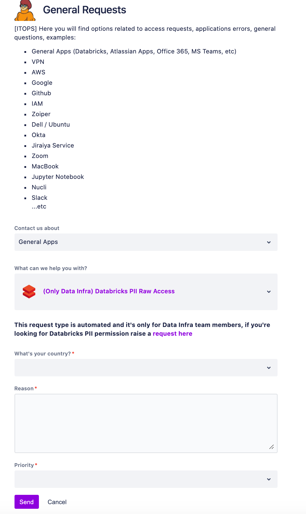

# Raw PII data access permissions

This document is intended for Data Infra On-call Engineers (Hausmeisters) who need raw PII data for debugging a data crash (for instance, debugging issue with raw contracts data).

Protecting PII data is a critical aspect of data privacy regulations and crucial for organizations to gain customer's trust, especially for highly regulated companies such as Financial Services. Therefore, Nubank must comply with the security standard and compliance certifications such as GDPR and CCPA to prevent data breaches. As the data is vital to make decisions, create new services, debug issues, etc., and for it to be used internally, the data needs to remain compliant with the certifications mentioned earlier.

Currently, the Data Infra team members  involved in On-call rotation can access the raw PII data using **Hausmeister_SU_ Cluster** on Databricks at any point in time, contrary to the data compliance regulations. Therefore, the IT RIsk team requested Data Infra, Infosec and IT ops to implement a safer process which wouldn't create friction for the on-call engineers.  This is to balance the integrity, confidentiality, and availability of raw PII data.

## How to request access for raw PII data

By default, no one will have access to raw PII data. In order for On-call Engineers ( Hausmeisters) to access raw PII on Databricks -

1. You'll need to raise an access request using the [form](https://nubank.atlassian.net/servicedesk/customer/portal/53/group/238/create/1351).
1. Select **(Only Data Infra) Databricks PII Raw Access** from the list of options.
1. In the **Reason** field, you must provide the link to data crash or briefly describe the reason.

The automated pre-approval system is configured for the requests from Data Infra On-call Engineers, so you don't need to wait for the ITOps team for approval. Also, you can set any priority for the request.

**Important:**

When a request is approved, all the Data Infra Engineers will be granted access to raw PII data for 24 hours only. To access after 24 hours, one has to request again by filling out the form.

After requesting access to raw PII data on Databricks, the request datails will automatically be posted in the #di-hausmeister channel. This is to keep track of those reasons in addition to Databricks audit logs. The Hausmeister should check that there was indeed an event triggering the access request.

**Note:** For teams other than Data Infra, there is a different [request form](https://nubank.atlassian.net/servicedesk/customer/portal/53/group/238/create/918) for asking the access permission to PII data on Databricks.

### How to access raw PII data on Databricks

1. In Databricks, ensure that you have **Hausmeister_SU_ Cluster**.
2. Find the path of the raw data that you need to access by querying Metapod or using the `nu etl info` command.
3. Load path/s by running the following command in Databricks -

    `val df = spark.read.parquet("<path>")`
