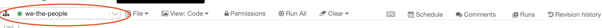
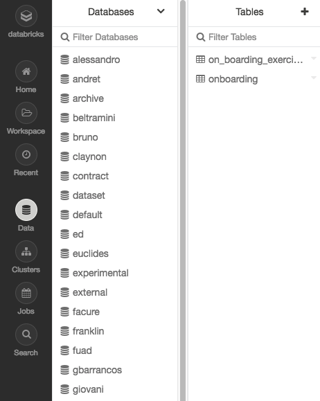
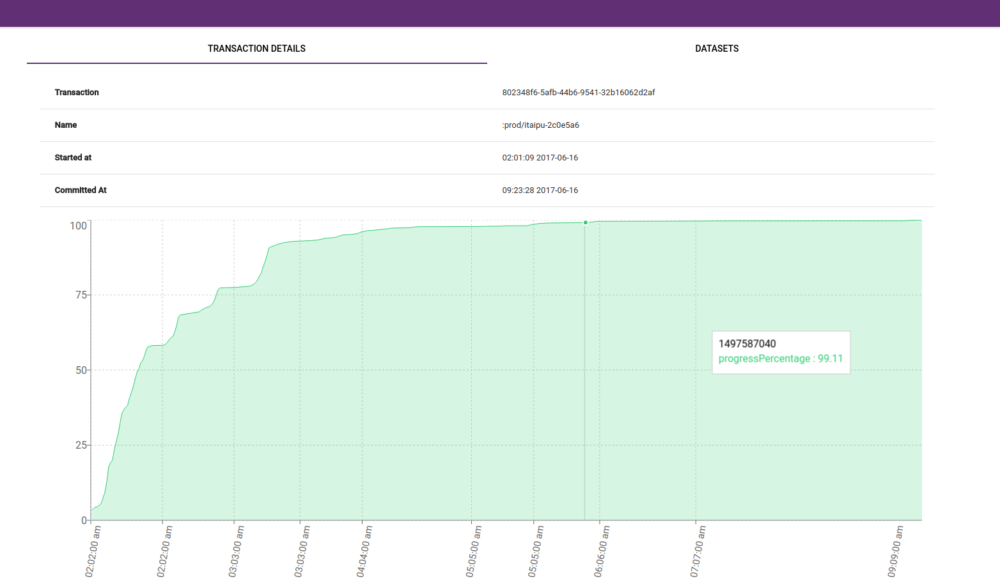
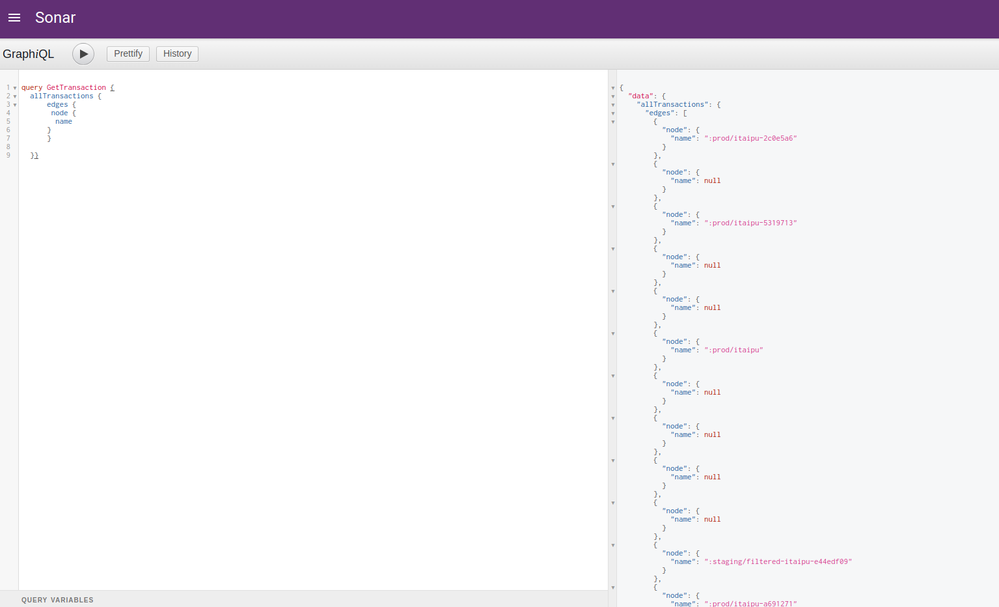
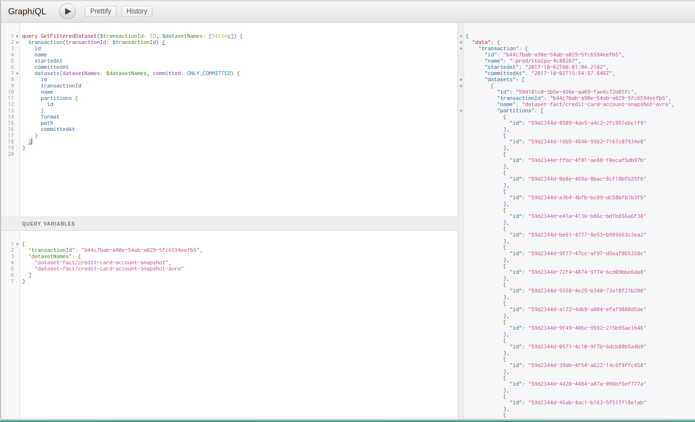

# Onboarding Exercise Part I: Creating a Dataset

The goal of this exercise is to make you familiar with data-infra specific technologies. It's going to touch on our core abstraction, the [**SparkOp**](https://github.com/nubank/common-etl/blob/master/src/main/scala/common_etl/operator/SparkOp.scala) (short for spark operation), and guide you through how to write a new SparkOp, how to run it on Databricks and to consume it in a Clojure service.


 **TODO - Creating the Dataset**

- [ ] Figure out which datasets should we use to build the derivative dataset
- [ ] Write a SQL query that represents the dataset on Databricks
- [ ] Transform that Query into Scala code
- [ ] Write a SparkOp with the definition of our dataset
- [ ] Run the SparkOp on Databricks
- [ ] Add the new dataset to Itaipu
- [ ] Writing Tests to the Dataset
- [ ] Build Itaipu locally
- [ ] Run it on a Cluster
- [ ] Query metapod to get the path were the dataset was written to
- [ ] Read the written dataset on Databricks to check it.

### Prerequisites:

##### Permissions:

For this walkthrough, you'll need to obtain the following permissions:

* Databricks: admin rights (or at least to be added to the engineers cluster) – ask `#squad-data-infra`
* quay.io: get added to the `data-infra` team – ask `#squad-infosec`
* AWS – ask `#access-request`:
  *  `data-infra-aurora-access` 
  * `data-access-ops`
  * `eng`
  * `prod-eng`
  * `data-infra` 
  * `belomonte`
* Metapod
  * `metapod-admin` scope – ask `#access-request` (any engineer can also provide it for you on staging)
  * ensure your certs are set up properly by running `nu certs setup --env staging`

We recommend you get all these permissions right away to avoid getting stuck during the tutorial.

##### Language Fundamentals

To go through this document, it is recommended you understand:

* SQL
* Basic Scala syntax & concepts

##### Getting to know Spark & databricks

This tutorial uses Spark & Databricks heavily, so it's a good idea to get familiar with both prior to diving in. Thankfully Databricks provides some great resources:

* First, make sure you have access to [Databricks](http://nubank.cloud.databricks.com)

* Then, go through these Databricks tutorials:

  * [A Gentle Intro to Apache Sparks](https://docs.databricks.com/spark/latest/gentle-introduction/gentle-intro.html) (you can skip if you're already familiar with Spark)

  * [Apache Spark on Databricks for Data Engineers](https://docs.databricks.com/spark/latest/gentle-introduction/for-data-engineers.html) (NB: As of 09/10/2018 the code in this tutorial is broken half-way through. It's still a good idea to at least read through it even without interacting with the code though.)

  * Note that both tutorials above can be imported as interactive notebooks, which allow you to run and play with the code as it's introduced to you. In order to use the tutorials interactively:

    * Open the tutorial from one of the links above, and use the 'Get notebook link' button to obtain the notebook url.
    * Log in to Databricks and in the sidebar go to: Home -> Users -> <your.name>
    * Click on the drop down next to your name in the last panel and select *Import*, then paste in the url you just copied.

    

    * Click on the 'Detached' dropdown right below the title and select the `engineers-cluster` (if you don't see it you might need the right [permissions](#permissions))

    


Go through that notebook and come back here :)

## Problem Statement

---

Nubank has a problem with dealing with bills. For some unknown reason, it has become really difficult to query what is the due amount of past bills for a given customer. To solve this issue, we want to create a new service that will read data produced by the ETL, build a cache from it, and serve the data using a GraphQL API.

This tutorial will focus on designing and spinning up the ETL pipeline which will produce data for the app to serve.


## Creating the Dataset

---

**Goal: Figure out which Datasets should we use to build the derivative dataset** 

For this exercise, we want information about the customer and their bills. Our data warehouse is organized into facts and dimensions, using the terminology from [Kimball's DW books](https://github.com/nubank/data-infra-docs/blob/master/dimensional_modeling/kimball.md).

In our case, our main *fact* will the *bill*, and our main dimensions will be *customer* and *date*.

Let's look at the tables available in Databricks. Tables can be queried like so:

```sql
%sql

-- List all tables from the `dataset` schema
show tables from dataset

-- List all tables from the `dataset` schema starting with the word 'fact'
show tables from dataset like "fact*"

-- List all tables from the `dataset` schema starting with the word 'dimension'
show tables from dataset like "dimension*"
```

So, let's figure out which is the table that we should use:


Running the command above gives you the `fact__billing_cycle` table as the only option. Let's check what's in it and see if it makes sense for our problem:


It does! Now you can do the same thing to figure out which **dimension ** table we'll need to join onto our `fact__billing_cycle`  table  (hint: our join keys will be `customer_key` and `due_date_key`).

---

## Write a SQL query that represents the dataset on Databricks

Now it's time to join both tables to generate a new dataset. Do this using SQL.

The schema of the dataset should be:

* `customer__id`
* `bill__id`
* `bill_index`
* `due_date`
* `amount_on_bill`

If you don't remember much SQL, get a refresher [HERE](https://docs.databricks.com/spark/latest/spark-sql/language-manual/select.html)

---

## Transform your query into Scala code

Now you should have a nice SQL query that returns the data for our service.

But... it's SQL and we shouldn't throw SQL out to other people have to read, because we're nice to each other.

So let's transform that SQL query into Scala code!

The first step to do that is to get the inputs that you need as Dataframes, you do that by using the method `.table` from the `SparkSession` which is available on Databricks as the value `spark` 

So for the bill fact, the code would look like this:

```scala
%scala

val billsFact = spark.table("dataset.fact__billing_cycle")
```

You can then do the same for the customer and date tables.

Once you have all Dataframes, you need to change the SQL functions to SparkSQL functions. For this, useful documentation includes:

* [Dataset](http://spark.apache.org/docs/latest/api/scala/index.html#org.apache.spark.sql.Dataset) (have all functions for when you have a Dataframe/Dataset and you do dataframe.function, **join** and **select** are there for example)

* [sql.functions](http://spark.apache.org/docs/latest/api/scala/index.html#org.apache.spark.sql.functions$) (this is where the aggregations and statistical functions are, as well as bunch of other helpful functions like ones related to dates)

* [Column](http://spark.apache.org/docs/latest/api/scala/index.html#org.apache.spark.sql.Column) (when you need to do operations using columns like column + column)

* [NuWiki](https://wiki.nubank.com.br/index.php/Apache_Spark) (Our own documentation on useful functions)

Now, go for it, change your code to Scala :)

---

## Write a SparkOp with the definition of our dataset

You're probably questioning WTF is a SparkOp :) – you can see for yourself [HERE](https://github.com/nubank/common-etl/blob/master/src/main/scala/common_etl/operator/SparkOp.scala#L7)

Feel free to see some [examples of datasets](https://github.com/nubank/itaipu/tree/master/src/main/scala/etl/dataset) that extend SparkOp, in particular (for this onboarding) the datasets: [BillingCycleFact](https://github.com/nubank/itaipu/blob/master/src/main/scala/etl/dataset/fact/BillingCycleFact.scala), [CustomerDimension](https://github.com/nubank/itaipu/blob/master/src/main/scala/etl/dataset/dimension/CustomerDimension.scala) and [DateDimension](https://github.com/nubank/itaipu/blob/master/src/main/scala/etl/dataset/dimension/DateDimension.scala).

SparkOp is the core abstraction behind our data-platform, the important things are:

* **Name:** You have to grant your dataset a name so others can use your dataset as dependency.

* **Inputs:** The list of inputs that you're going to need, you just need the name of them, and you can find which are the name of your dependencies by looking at its SparkOps.

* **Definition:** That's where the magic happens, the inputs above are going to get injected at runtime to this function in this **Map[String, Dataframe]** so the name of your input is the key on the map and its Dataframe is the value.

* **Format:** That's where you define which format you're going to get as output, in our case let's use [**Avro**](https://avro.apache.org/docs/1.2.0/) because it'll be easier to consume from the service side.

Now import the **SparkOp** trait on Databricks:

```scala
%scala

import common_etl.operator.SparkOp
```

and create a new `object` that `extends` the `SparkOp` and implement the methods :)

---

## Run the SparkOp on Databricks

Once you have your SparkOp done, you can use the function on [DatabricksHelpers](https://github.com/nubank/itaipu/blob/master/src/main/scala/etl/databricks/DatabricksHelpers.scala#L40):

```scala
%scala

DatabricksHelpers.runOpAndSaveToTable(spark, op, "**schema**", "the_name_of_dataset")
```

For  `**schema**` we normally use our own names when saving the table to Databricks.

 

Run it! And then query your dataset to see if everything pulled through correctly!

To make it easier to do the service exercise save the avro files to s3 once again (itaipu will do that, but we're doing it again in case anything goes wrong there). This will save the dataset on `s3://nu-spark-devel/onboarding/**schema**/`:

```scala
import com.databricks.spark.avro._

spark.table("**schema**.the_name_of_dataset").write.avro("/mnt/nu-spark-devel/onboarding/**schema**/")
```

---

## Add the new dataset to Itaipu

Now that you have a SparkOP ready is time to add it to Itaipu.

**IMPORTANT**: We just want a sample of the data, otherwise adding it to Kafka and datomic will take forever. Add `.limit(10000)` at the end of your `definition` method, to only keep 10k records. The `limit` method adds all the data into a single partition, so you'll also need to add `.repartition(10)` after the `limit` call.

Create `itaipu/src/main/scala/etl/dataset/<YourDatasetName>.scala`(If you do this through IntelliJ it will add the package information for you. (Right-click on the `dataset` directory > new > `Scala Class`).

Then just paste the code there!

Now, you need to add the dataset to the list of all **SparkOps** that are run by Itaipu. This dataset fits the category of "general dataset" so you add it [**here**](https://github.com/nubank/itaipu/blob/master/src/main/scala/etl/dataset/package.scala#L23), all other lists of datasets can be found **[here](https://github.com/nubank/itaipu/blob/master/src/main/scala/etl/itaipu/Itaipu.scala#L46)**.

To check if everything is right you can run:

```shell
sbt it:test
```

Itaipu has an [ItaipuSchemaSpec](https://github.com/nubank/itaipu/blob/master/src/it/scala/etl/itaipu/ItaipuSchemaSpec.scala#L35) class that runs all **SparkOps** with fake data, and checks if all inputs match the expected results. This is possible thanks to Spark's lazy model, which allows us to manually call the `definition` method on arbitrary dataframes and compare the results to a set of `expected` dataframes. This allows us to ensure all operations run as expected and return the correct columns.

More information about creating a new dataset can be found [HERE](https://github.com/nubank/data-infra-docs/blob/master/itaipu/workflow.md#creating-a-new-dataset).

---

## Writing tests for your Dataset

For writting tests we use two libraries, [ScalaTest](http://www.scalatest.org/) and [SparkTestingBase](https://github.com/holdenk/spark-testing-base) .

First, create a test class mirroring your dataset class in  `itaipu/src/test/scala/etl/dataset/<YourDatasetName>Spec.scala`

Add the following extensions to your class:

```scala
extends FlatSpec with NuDataFrameSuiteBase with Matchers
```

Then, you can write some tests to check that the dataset computes as expected. You can look at [DailyDeltasLogSpec](https://github.com/nubank/itaipu/blob/master/src/test/scala/etl/dataset/ledger/double_entry/mutable/DailyDeltasLogSpec.scala) for inspiration.

For running the tests, follow the documentation [HERE](https://github.com/nubank/data-infra-docs/blob/master/itaipu/workflow.md#running-tests) (**Tip**: run `testOnly` on your specific file before running the complete test suite.

---

## Build Itaipu locally

Time to run it!

*Achtung: this is not how we run code in our day to day work. We use an automated CI pipeline, but to make the exercise more interesting and with less waiting for CI pipelines we are doing it in this way.*

Make sure that you were added to the `data-infra` group on `quay.io` (ask **#squad-infosec**). We use Docker for running basically everything here at Nubank, so it's not a surprise that you'll need to build Itaipu's docker container.

To do that just use:

```shell
$NU_HOME/deploy/bin/docker.sh build-and-push $(git rev-parse --short HEAD)
```

The `docker.sh` script is inside the `deploy` project. It's a standard script for building docker images. It will run the script `prepare.sh` (which will run `sbt assembly`) and then run build and push the docker image using the name of your project as the name. e.g. for `itaipu`, it will be `quay.io/nubank/nu-itaipu:{SHA}`. 

Look for the following line in the script's output. You will use this tag for the next step:
`Successfully tagged nu-itaipu**repository_tag**`

Done, now we can run it!

---

## Run it on a Cluster

This is where the real fun begins :)

We'll split the work into 4 parts:

* Get used to `sabesp`
* Scale the cluster
* Run Itaipu
* Downscale the cluster

`sabesp` is a wrapper over the [`aurora-client`](http://aurora.apache.org/documentation/latest/reference/client-commands/) so we don't have to write a bunch of things manually. It allows us to specify which Aurora cluster we wish to run our commands on. (Take a look at [cli-examples](../cli_examples.md) to get a sense of how running sabesp commands look like).

In the following steps, we're going to use just a single command that looks like:

```shell
sabesp --aurora-stack=cantareira-dev jobs ...
```

Which translates to: create a job on the `cantareira-dev` stack. All jobs definition are inside the [aurora-jobs](https://github.com/nubank/aurora-jobs) project. If you don't have `aurora-jobs` cloned, please do it (inside the $NU_HOME directory), because `sabesp` will look for the definitions from there. Also, make sure that you were added to the *data-infra-aurora-access* group in AWS (**#access-request**).

#### Scale, Run and downscale the Cluster

Using the up-to-date version of `sabesp`, you should be able to scale, run and downscale the cluster using just one command:

`sabesp --aurora-stack=cantareira-dev jobs itaipu staging **your_name** s3a://nu-spark-metapod-test/ s3a://nu-spark-metapod-test/ 100 --itaipu=**repository_tag** --filter-by-prefix **dataset_name**`

eg:
`sabesp --aurora-stack=cantareira-dev jobs itaipu staging rodrigo s3a://nu-spark-metapod-test/ s3a://nu-spark-metapod-test/ 100 --itaipu=be24227a --filter-by-prefix dataset/on-boarding-exercise-part-i`

You can check if the instances are running on the [AWS Console](https://console.aws.amazon.com/ec2/v2/home?region=us-east-1#Instances:tag:Name=cantareira-dev-mesos-on-demand-;sort=instanceId) and check the status of your jobs [here](https://cantareira-dev-mesos-master.nubank.com.br:8080/scheduler/jobs). Now wait, it will take quite a while for the data to compute. If you're part of data infra, you should move on to [the service exercise](./service-exercise.md) and use the avro files you computed from Databricks as your input. You can come back later once your Itaipu run is done.

If your proccess fails, you can run the same command again adding your `transaction_id`. The process will start again from where it stopped.

**Tip**: Actually, save the transaction ID somewhere or keep it accessible. You'll need it on the next steps.

eg:
`sabesp --aurora-stack=cantareira-dev jobs itaipu staging rodrigo s3a://nu-spark-metapod-test/ s3a://nu-spark-metapod-test/ 100 --itaipu=be24227a --filter-by-prefix dataset/on-boarding-exercise-part-i --transaction 56078219-e6e0-43ec-a7a0-0bcc59600473`

**IMPORTANT**: Make sure that your [AWS instances are terminating](https://console.aws.amazon.com/ec2/v2/home?region=us-east-1#Instances:tag:Name=cantareira-dev-mesos-on-demand-;sort=instanceId) at the end of the process.

---

## Query Metapod to get the path were the dataset was written to

[`Metapod`](https://github.com/nubank/metapod) is the service on which we track the metadata about the run. It receives from Itaipu all information related to:

* where the datasets were committed;
* what our dataset's partitions are;
* what's its schema;
* and so on.

Since we used the staging environment for our run, we need to make sure to query Metapod on that environment to get the results.

The simplest way to query to do that is via the Sonar UI, which can be accessed at https://backoffice.nubank.com.br/sonar-js/ for the production data. Unfortunately, the version of this service on staging also points to production data, so we'll need to run it locally:

```shell
nu service clone sonar-js
cd $NU_HOME/sonar-js
git checkout staging # the staging branch has been modified to point to staging data

# Then it gets tricky
npm install # let it run, it should fail at some point. That's normal™
yarn start # normally this should open sonar in your browser
```

(**Tip**: You might need to run `npm install` and `yarn start` a couple times interchangeably to get your app into the correct state.)

When you have the local Sonar app open in your browser, log in and open the *Monitoring* view in the left side menu. Find and click on your transaction there to get information about the run and its progress.



Another option is to use the GraphQL interface on Sonar and do a query:



Just open the menu and click on `GraphiQL`, it'll open the editor above.

The query to get a specific dataset from a transaction is the one below:

```
query GetFilteredDataset($transactionId: ID, $datasetNames: [String]) {
  transaction(transactionId: $transactionId) {
    id
    name
    startedAt
    committedAt
    datasets(datasetNames: $datasetNames, committed: ONLY_COMMITTED) {
      id
      transactionId
      name
      partitions {
        id
      }
      format
      path
      committedAt
    }
  }
}
```

You'll need to bind the query-parameters to the ones in the query like:
```
{
	"transactionId": "b44c7bab-a90e-54ab-a029-5fc6594eefb5",
	"datasetNames": [
		"dataset-fact/credit-card-account-snapshot",
		"dataset-fact/credit-card-account-snapshot-avro"
	]
}
```



Now you have all the information needed to query the dataset on Databricks.

---

## Read the written dataset on Databricks to check it

After you get the path for the dataset from metapod (through the graphql at Sonar), let's read it on Databricks to check if everything is as expected.

So, go back to you notebook and read it.

For dealing with avros, we need to import one library:

`import com.databricks.spark.avro._`

and then read it.

```
val df = spark.read.avro("dbfs:/mnt/your-path-without-s3://")
df.count()
display(df)
```

On Databricks we read from S3 through DBFS, the s3 buckets are mounted on `/mnt` you can see the buckets there by using the dbfs api.

```
%fs
ls /mnt
```

---

PS: if you get stuck, you can get all steps done in [this](https://nubank.cloud.databricks.com/#notebook/138371) notebook, but, don't cheat :)

## Next up

_Part II_ of the exercise, ["Creating a service to expose a dataset via API"](service-exercise.md), is building a Nubank microservice to serve data from the dataset you created in this page.
