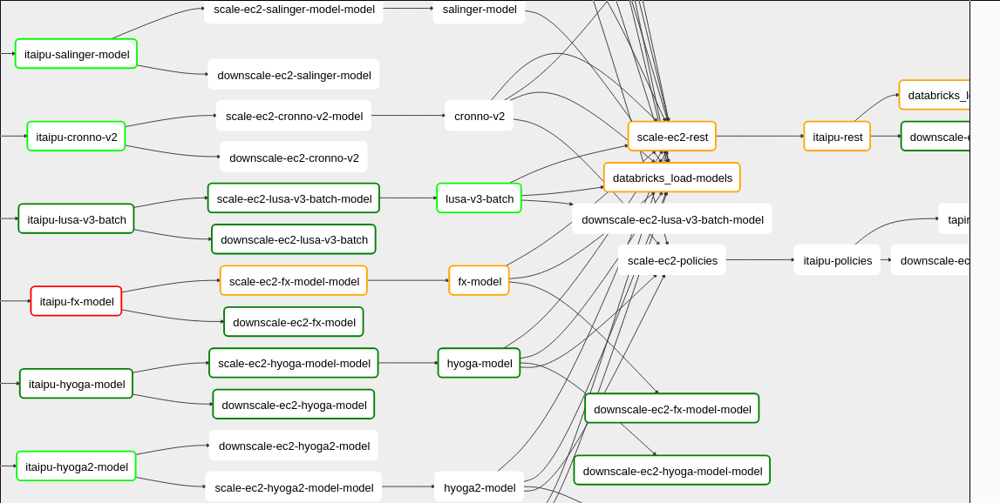
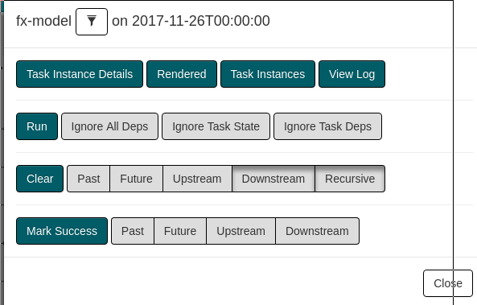
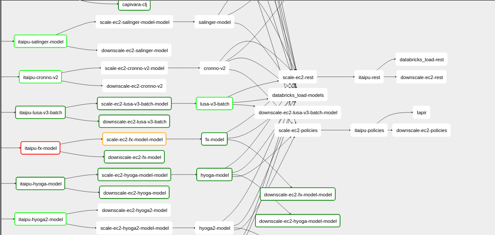
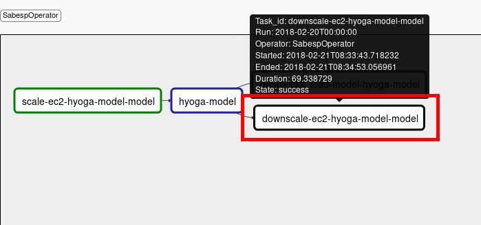
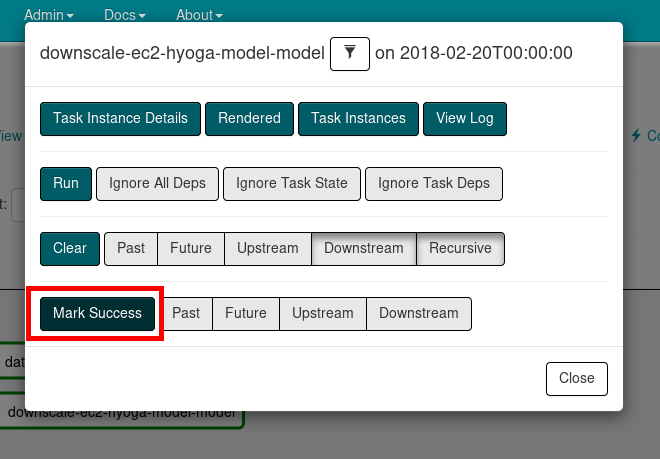
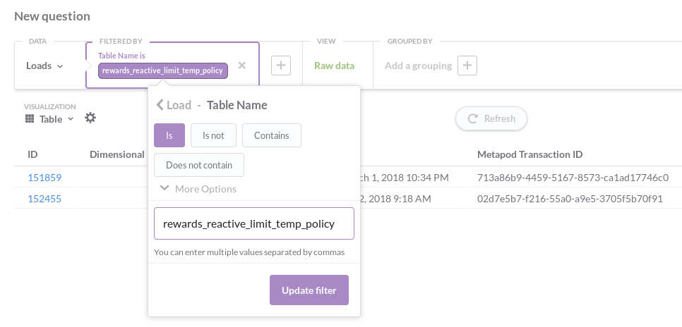

# Operations HOWTO

* [Restart redshift cluster](#restart-redshift-cluster)
* [Restart aurora](#restart-aurora)
* [Hot-deploying rollbacks](#hot-deploying-rollbacks)
* [Re-deploying the DAG during a run](#re-deploying-the-dag-during-a-run)
* [Controlling aurora jobs via the CLI](#controlling-aurora-jobs-via-the-cli)
* [Basic steps to handling Airflow DAG errors](#basic-steps-to-handling-airflow-dag-errors)
* [Recover from non-critical model build failures](#recover-from-non-critical-datasetmodel-build-failures)
  * [Determining if a dataset or model is business critical or can be fixed without time-pressure](#determining-if-a-dataset-or-model-is-business-critical-or-can-be-fixed-without-time-pressure)
  * [Determining if it was the dataset or model that failed](#determining-if-it-was-the-dataset-or-model-that-failed)
  * [Dealing with dataset failures](#dealing-with-dataset-failures)
  * [Dealing with model failures](#dealing-with-model-failures)
  * [Making downstream jobs run when an upstream job fails](#making-downstream-jobs-run-when-an-upstream-job-fails)
* [Keep machines up after a model fails](#keep-machines-up-after-a-model-fails)
* [Manually commit a dataset to metapod](#manually-commit-a-dataset-to-metapod)
* [Checking a dataset loaded](#checking-a-dataset-loaded)
* [Removing bad data from Metapod](#removing-bad-data-from-metapod)
  * [Retracting datasets in bulk](#retracting-datasets-in-bulk)
* [Dealing with Datomic self-destructs](#dealing-with-datomic-self-destructs)
* [Load a run dataset in Databricks](#load-a-run-dataset-in-databricks)

## Restart redshift cluster

When `capivara-clj` loads data into Redshift it creates temporary tables, loads the data into them, drops the old tables and renames the temp ones.
This requires `capivara-clj` to get a lock on all tables to then be able to drop them.
It will kill any open connections then run the commit transaction.
There is a small chance that a query is made in between these two steps. This will cause `capivara-clj` to hang forever.
The logs will indicate this by showing something like the following. It is hanging because it has a `0` in `wip-count` (what is left to do), so it has reached the drop/rename command.

```
2018-01-18T09:02:49.654Z [CAPIVARA:main] INFO capivara.components.redshift - {:line 124, :cid "DEFAULT", :log :killing-schema-query, :pid 19805, :username "sandrews"}
2018-01-18T09:02:49.790Z [CAPIVARA:main] INFO capivara.components.redshift - {:line 91, :cid "DEFAULT", :log :execute-statement, :statement ["DROP SCHEMA IF EXISTS fact CASCADE"]}
2018-01-18T09:03:01.133Z [CAPIVARA:main] INFO capivara.components.redshift - {:line 91, :cid "DEFAULT", :log :execute-statement, :statement ["DROP SCHEMA IF EXISTS dimension CASCADE"]}
2018-01-18T09:03:06.077Z [CAPIVARA:async-dispatch-8] INFO capivara.components.progress - {:line 20, :cid "DEFAULT", :log :progress-reporter, :wip {}, :done-count 24, :wip-count 0, :transaction-info {:total-count 24, :transaction-id "556b5e98-60a1-5743-ad2e-da82d4798170", :target-date "2018-01-18"}}
2018-01-18T09:03:36.077Z [CAPIVARA:async-dispatch-1] INFO capivara.components.progress - {:line 20, :cid "DEFAULT", :log :progress-reporter, :wip {}, :done-count 24, :wip-count 0, :transaction-info {:total-count 24, :transaction-id "556b5e98-60a1-5743-ad2e-da82d4798170", :target-date "2018-01-18"}}
2018-01-18T09:04:06.078Z [CAPIVARA:async-dispatch-2] INFO capivara.components.progress - {:line 20, :cid "DEFAULT", :log :progress-reporter, :wip {}, :done-count 24, :wip-count 0, :transaction-info {:total-count 24, :transaction-id "556b5e98-60a1-5743-ad2e-da82d4798170", :target-date "2018-01-18"}}

...
```

The easiest fix is to restart Redshift for `cantareira-k-redshift-redshiftcluster-...` via AWS ([here](https://console.aws.amazon.com/redshift/home?region=us-east-1#cluster-list:))

Other way, if you have superuser access (e.g. `sao_pedro`), is to run `pg_terminate_backend( pid )` on the appropriate transaction `pid`s ([details here](https://docs.aws.amazon.com/redshift/latest/dg/PG_TERMINATE_BACKEND.html))

NOTE: this issue can be addressed by fixing `capivara` to have a timeout to the transaction and retrying the connection kill + table drop logic together.

## Restart Aurora

Every once in a while, aurora goes down. This will prevent anything that uses `sabesb` to work, like running the DAG.

You can tell when aurora is down when the [aurora web UI](https://cantareira-stable-mesos-master.nubank.com.br:8080) won't load, but the [mesos web UI](https://cantareira-stable-mesos-master.nubank.com.br) will.

Try to look into the issue, potentially by ssh'ing into `mesos-master`, via `nu ser ssh mesos-master --suffix dev --env cantareira --region us-east-1` and looking at the aurora logs via `journalctl -u aurora-scheduler`.

To get aurora back up, cycle `mesos-master`:

`nu ser cycle mesos-master --env cantareira --suffix stable --region us-east-1`

## Hot-deploying rollbacks

If a buggy version gets deployed of a service that lives in the non-data-infra production space (like `metapod`, `correnteza`, etc.), you can rollback to a stable version using [these deploy console instructions](https://wiki.nubank.com.br/index.php/Hot_deploying_a_service).
You can also do this directly from `CloudFormation`:

* __Make sure there isn't a `to-prod` running and no stacks are being spun!__ The reasoning for this is [explained here](https://wiki.nubank.com.br/index.php/Hot_deploying_a_service)
* Access `CloudFormation` and search for your service (say `metapod`)
* Select the entry that looks something like `prod-global-k-metapod`. If your service doesn't live in `global` you will need to repeat the following steps for every shard it operates on.
* Click `Update Stack` in the top right
* On the `Select Template` page leave the default setting as `Use current template` and select `Next`
* On the `Specify Details` page under parameters, find the prod environment with 0 instances (either `Blue` or `Green`), and update the version to the short SHA of the last non-buggy git commit that was built via Go. You can get this version by looking at the [service's build history on Go](https://go.nubank.com.br/go/tab/pipeline/history/metapod); each build should be the `build-number:full-commit-SHA`. This SHA can be cross-referenced with pull requests to find the desired point to go back to. The shortened SHA can be obtained via `git rev-parse --short 6c957ed851d82103e2b151b04aa8a5ede042c3c5`.
* Click through the following pages confirming your stack changes.
* After a few minutes check that the new version has spun up and is healthy. The hacky way to do this is to hit `nu ser curl GET global metapod --suffix k /api/version` several times (due to the load balancer) and see if you eventually get the right SHA.
* Now you need to take down the buggy version. You can do this by going through the `Update Stack` process and setting the instance size for the buggy versions to 0. This will result in no down-time. If you don't care about having downtime (like if you are data-infra and everything is already gone to shit), you can can do an in-place update of version of the running stack. This will result in the running instances spinning down and a new ones being spun up with the new version, causing ~5min downtime.

## Re-deploying the DAG during a run

If the DAG is using a buggy version of a program and you want to deploy a fix, in certain cases you can deploy the fix to the running DAG.

Make sure you aren't pulling in non-fix related changes since the last DAG deployment. If datasets changed in `itaipu`, you should revert them to deploy the DAG. Not doing so may create inconsistencies in the datasets.

In some cases, you will want to retract datasets before re-running jobs with the newly deployed version. For example, if `itaipu-contracts` is broken (the first job in the DAG) and you need to deploy a fix for it, kill the job and retract all the committed datasets before restarting with the new `itaipu` version ([see here](ops_how_to.md#retracting-datasets-in-bulk)).

1. Push the fix through the pipeline as described [here](airflow.md#deploying-job-changes-to-airflow)

2. You can't simply clear the running DAG nodes to restart jobs, because this will pull in the old configurations. Instead, you should kill the job via sabesp:

```shell
sabesp --aurora-stack cantareira-stable jobs kill jobs prod itaipu-contracts
```

3. Once the jobs have been killed manually, you should clear them and let airflow start them anew.

## Controlling aurora jobs via the CLI

[see sabesp cli examples](cli_examples.md)

## Basic steps to handling Airflow DAG errors

The dagão run failed. What can you do?

- Check out for errors on the failed aurora tasks
- Check out for recent commits and deploy on go, to check if they are related to that
- If nothing seems obvious and you get lots of generic errors (reading non-existent files, network errors, etc), you should:
 1. Cycle all machines (eg `nu ser cycle mesos-on-demand --env cantareira --suffix stable --region us-east-1`)
 2. Get the transaction id from [#guild-data-eng](https://nubank.slack.com/messages/C1SNEPL5P/)
 3. Retry rerunning the dagão with the same transaction (eg `sabesp --verbose --aurora-stack=cantareira-stable jobs create prod dagao --filename dagao "profile.metapod_transaction=$metapod_tx"`)
 4. If that fails, increase the cluster size (eg `sabesp --aurora-stack=cantareira-stable jobs create prod scale  --job-version "scale_cluster=4945885" MODE=on-demand N_NODES=$nodes SCALE_TIMEOUT=0`)
 5. Retry dagão
 6. If it still doesn't work, rollback to a version that worked and retry dagão.

## Recover from non-critical dataset/model build failures

Datasets and models, especially newer ones, may have bugs that lead to build failures on Airflow that block downstream jobs.
There are two things to do to recover from these failures:
 * Prevent the failure in subsequent runs
 * Retrigger downstream jobs if they can be successfully run in the presence of upstream failures. For example, in the case of a single model failing and causing all of `itaipu-rest` from not running.

There are two types of jobs that can fail, datasets, which are then used to generate downstream models, or the models themselves. Each have different but similar ways to recovery.

### Determining if a dataset or model is business critical or can be fixed without time-pressure

If the model is a [`policy model`](https://github.com/nubank/aurora-jobs/blob/000ba9f8b8ac4b06408bf3783971351d7916e912/airflow/main.py#L256), then it is important to fix the root issue immediately. Otherwise, you can comment it out using the instructions below and let the owner fix it when they get a chance.

### Determining if it was the dataset or model that failed

Get the transaction id for the run ([here is how](https://github.com/nubank/data-infra-docs/blob/master/monitoring_nightly_run.md#finding-the-transaction-id)).
Then find uncommitted "`datasets`" for that transaction by using [sonar](https://backoffice.nubank.com.br/sonar-js/#/sonar-js/graphiql) run this GraphQL query:

```
{
  transaction(transactionId: "f7832a01-001b-56f7-a4fe-b3a417f8f654") {
    datasets(committed: ONLY_UNCOMMITTED) {
      name
    }
  }
}
```

Which will output something like this:

```
{
  "data": {
    "transaction": {
      "datasets": [
        ...
        if the run is still going there will be lots of other entries here
        ...
        {
          "name": "model/fx-model-avro"
        },
        {
          "name": "dataset/fx-model"
        },
        {
          "name": "model/fx-model"
        },
        {
          "name": "dataset/fx-model-csv-gz"
        }
      ]
    }
  }
}
```

Given this output, the dataset failed, also causing the dependent model to fail, so we need to address both using the following steps.

### Dealing with dataset failures

If a dataset is erroring and causing an job node to fail on airflow, we should check to see if it is a critical dataset (current best way is to ask somebody).
If the dataset is non-critical, we can comment out the dataset from `itaipu` to stop it from failing in subsequent runs. Here is an [example PR that does this](https://github.com/nubank/itaipu/pull/1603). You will also want to clear downstream jobs that were marked as failures to allow them to run (see [Making downstream jobs run when an upstream job fails](#making-downstream-jobs-run-when-an-upstream-job-fails)).

### Dealing with model failures

Non-critical models can be removed from the DAG definition ([example PR here](https://github.com/nubank/aurora-jobs/pull/483)) so that it doesn't block future runs. The owner of the model can then fix it without blocking other models.

Removing model will only take affect tomorrow, when in the next run is triggered.

Hence, there are two things you can do to get things building today:

- To get downstream jobs to build today, we can do some Airflow manipulations. Note that the failing model will show up as empty in those downstream jobs.
- If there are no downstream dependencies for a dataset, you can [manually commit an empty dataset for a specific dataset id](#manually-commit-a-dataset-to-metapod).

Lastly, be sure to [deploy job changes to airflow](airflow.md#deploying-job-changes-to-airflow) once the current run finishes.

### Making downstream jobs run when an upstream job fails

Say `itaipu-fx-model` causing the downstream [`fx-model`](https://github.com/nubank/aurora-jobs/blob/000ba9f8b8ac4b06408bf3783971351d7916e912/airflow/main.py#L254) and `itaipu-rest` to fail.



In this case you can select `fx-model` and mark it as successful:



Then select the downstream nodes that have failed due to the upstream `fx-model` failure and clear them so that when other running dependencies finish, they will run these nodes. In this case, clear both `databricks_load-models` and `scale-ec2-rest`. The resulting DAG should look like this:



## Keep machines up after a model fails

Usually when a model job fails, you will want to look at the mesos logs for the machine that ran the model job. Unfortunately, those machines are scaled down, which means access to the logs are lost.

You can get around this by disabling the scale-down logic on Airflow for a job.

 - Restart the job.
 - Find the downscale node



 - Mark the downscale node as success



 - After the job fails and you get the logs, clear the downscale node so that airflow will re-run the downscale and machines will be taken offline

Note: this tactic mostly applies to models. For Spark, most of the interesting logs live in the driver, which runs on a fixed instance. In the rare cases where you want the Spark executor logs, you can also apply this downscale delay strategy.

## Checking a dataset loaded

When datasets are loaded into redshift the load is logged in the `Loads` table.
To check if a dataset has been loaded, look it up in `Belo Monte - Meta - Loads` on metabase, filtering by `Table Name`.
For a dataset called `policy/fraud-report-policy` the table name will be `fraud_report_policy`.



## Manually commit a dataset to metapod

In specific cases, when a dataset that doesn't have downstream dependencies fails, you can commit an empty parquet file to the dataset.
This allows buggy datasets to be skipped so that they don't affect the stability of ETL runs.

- Get the `metapod-transaction-id` from `[#guild-data-eng](https://nubank.slack.com/messages/C1SNEPL5P/)`.
- Find the name of the failing dataset (`dataset-name`) from the SparkUI page.
- Get the `dataset-id` from sonar with the following GraphQL query:

```
{
  transaction(transactionId: "<metapod-transaction-id>") {
    datasets(
      datasetNames: [
      "<dataset-name>"]) {
      id
      name
      committed
    }
  }
}
```

- Run the following `sabesb` command to commit a blank dataset for a specific dataset in a given run:

```shell
sabesp metapod --token --env prod dataset commit <metapod-transaction-id> <dataset-id> parquet s3://nu-spark-us-east-1/non-datomic/static-datasets/empty-materialized/empty.gz.parquet
```

## Removing bad data from Metapod

If bad data has been committed to Metapod, there are some migrations that can be run to *retract* (the Datomic version of *deleting*) certain parts of a transaction, like the committed information about a dataset, attributes and more. The way they work is similar: send a `POST` request with an empty body to an endpoint that starts `api/migrations/retract/:kind-of-stuff-you-want-to-retract/:id`. The currently available things to be retracted are:

* Attributes: via `api/migrations/retract/attribute/:attribute-id`, where `:attribute-id` is the `:attribute/id` of the attribute you want to remove.
* Indexed attributes: via `api/migrations/retract/indexed-attribute/:indexed-attribute-id`, where `:indexed-attribute-id` is the `:indexed-attribute/id` of the indexed attribute you want to remove.
* Committed information of a dataset: via `api/migrations/retract/committed-dataset/:dataset-id`, where `:dataset-id` is the `:dataset/id` of the dataset you want to remove. Note that this does not remove the dataset from the transaction, only the information committed about this dataset (path, format, partitions, etc).

_For example_:

Say you suspect there is an issue with the schema associated with the `archive/policy-proactive-limit-v3` dataset.
You can query the schema on [sonar](https://backoffice.nubank.com.br/sonar-js/#/sonar-js/graphiql) via this query:

```
{
  transaction(transactionId: "319703ce-b90d-5a07-8195-33df0de911c8") {
    datasets(
      datasetNames: [
      "archive/policy-proactive-limit-v3"]) {
      id
      name
      committed
      schema {
        attributes {
          name
        }
      }
    }
  }
}
```

This query shows duplicate attributes in the schema, which is invalid, so the dataset should be retracted.
Run the following, where `5a5d411b-e41a-4a30-ab34-bac476b95761` is the dataset id returned in the query:

```
nu ser curl POST global metapod /api/migrations/retract/committed-dataset/5a5d411b-e41a-4a30-ab34-bac476b95761
```

(if this fails, with a dns resolution issue, try `nu cache bust stack`)

If you then re-run the query you will see that the `schema` is now `null`.

### Retracting datasets in bulk

If you are retracting all datasets, use the following query
```
{
  transaction(transactionId: "f7832a01-001b-56f7-a4fe-b3a417f8f654") {
    datasets(committed: ONLY_COMMITTED) {
      id
      name
    }
  }
}
```

Save the results in a file called `result.json` then run the retraction in parallel for every dataset id (make sure the `jq` command is correct for your query)

```shell
cat result.json | jq -r ".data.transaction.datasets | .[].id  " | xargs -P 10 -I {} nu ser curl POST global metapod /api/migrations/retract/committed-dataset/{}
```

You can track the number of committed datasets with the following query

```
{
  transaction(transactionId: "713a86b9-4459-5167-8573-ca1ad17746c0") {
    datasetConnection {
            numCommittedDatasets
        }
  }
}
```


## Dealing with Datomic self-destructs

If you see frequent Datomic self-destructs alarms, a common cause is lack of provisioned capacity in the DynamoDB table which contains the Datomic database. In order to check if this is happening:
* Open the AWS DynamoDB console
* Search for the table for the service (the naming scheme is `$env-$prototype-$service-datomic`, although `$prototype` is ommitted for most tables in S0 and Global), e.g. `prod-s3-analytics-datomic`, and click on it.
* Go to the Metrics tab and see if there are any throttled write requests or throttled read requests.
* If there are, go to the Capacity tab and increase the Read capacity units and the Write capacity units.

## Load a run dataset in Databricks

### Find the path to the dataset

Datasets are associated with Metapod transaction ids for (nightly) DAG runs ([see here on how to find the transaction id](monitoring_nightly_run.md#finding-the-transaction-id)).
To find a dataset, load the metapod transaction on Sonar.

On Sonar click the `Datasets` tab and:

 - Locate the dataset you want, if you want the avro version look for `{your dataset name}-avro` and for parquet it is just `{your dataset name}`
 - There are two paths, the `S3 Path` corresponds to the direct file path on S3, and the `Databricks Path` to the mounted version on databricks. In this case, we want the `Databricks Path`


### Load it in databricks
Now that you have the path, open up a databricks notebook ([here is a nice example](https://nubank.cloud.databricks.com/#notebook/131424/command/131441))

#### parquet

```scala
val x = spark.read.parquet("dbfs:/mnt/nu-spark-metapod/10b090f0-fda6-4ef3-b091-9b8fec7c45fc")
```

#### avro

```scala
import com.databricks.spark.avro._
val x = spark.read.avro("dbfs:/mnt/nu-spark-metapod/UIeeQn58Qi6_6OLQH6li2w")
```
