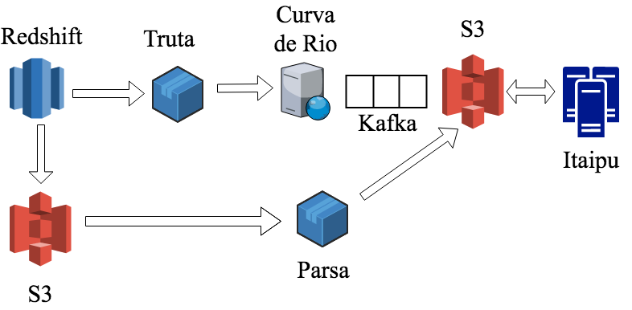

# Data Infra Primer

## Big picture
* [Onboarding Berlin](https://docs.google.com/presentation/d/1GD-poZ9GpIVZypFKQ_g_evAgml0Pzio-jBJNgZ-D2MM/edit?ts=5a0566c5#slide=id.g2296c22905_0_0)
* [2017Q4](https://docs.google.com/document/d/1Mkl2EhJa6Zo3jAZBX5s_dWoEzMI9cd_yKIoQN9F48DY/edit?ts=5a0db010)
* [Architecture Decision Record](https://github.com/nubank/data-infra-adr)
* [Post-mortems](https://github.com/nubank/morgue)
* [Infrastructure Overivew](infrastructure/guide-to-the-runtime-environment.md)

## Languages/stack overview

We currently use three different programming languages for most of our work, each of them with a certain purpose:

* [Clojure](https://clojure.org/) is our main language, as usual for Nubank. All our services are written in Clojure, and we usually try to use it as much as we can. The [Learn Clojure](https://clojure.org/guides/learn/syntax) section of the documentation is a good starting point to know more about it.
* [Scala](https://www.scala-lang.org/) is the language we use to write Spark data processing jobs in [itaipu](https://github.com/nubank/data-infra-docs/blob/master/primer.md#itaipu-overview). We decided to use Scala to be able to fully utilize all of Spark's capabilities without having to write many layers of translations between Scala and Clojure.
* [Python](https://www.python.org/) is used mostly for small AWS snippets of code, working with our scheduler ([Airflow](https://github.com/nubank/data-infra-docs/blob/master/primer.md#airflow-overview)), our jobs framework ([Aurora](https://github.com/nubank/data-infra-docs/blob/master/primer.md#aurora-overview)) and our CLI ([sabesp](https://github.com/nubank/data-infra-docs/blob/master/primer.md#sabesp-overview)), as well as machine learning models.

Some of the external projects underlying our platform are:

* [Datomic](http://www.datomic.com/), the main database used by Nubank as a whole, and the biggest source of incoming data.
* [Apache Spark](https://spark.apache.org/), a distributed processing framework.
* [Apache Airflow](https://airflow.apache.org/), a DAG scheduler.
* [Apache Mesos](http://mesos.apache.org/), a cluster resource management framework.
* [Apache Aurora](http://aurora.apache.org/), a Mesos framework for running services and jobs.
* [Amazon Redshift](https://aws.amazon.com/redshift/), a managed data warehouse we use to allow the rest of Nubank to easily analyze our data.
* [Metabase](https://www.metabase.com/), a dashboarding/visualization/BI front-end for Redshift.

## Datomic Log overview

[Datomic Log Documentation](http://docs.datomic.com/log.html)

A Datomic log has an `EAVT Tx Added` structure, which stands for:
* E = entity (Alessandro)
* A = attribute (Age)
* V = value (27)
* T = time (logical time, t-value from Datomic, monotonically increasing)
* Tx = transaction - a collection of facts that were written atomically
* Added = added or retracted

We rely on the monotonically increasing t-value for the ETL. We extract from the last t-value we already extracted (extracting via transactions, not datoms - we always keep transactions together) up until the current t-value.

Updates to historical facts (rendering them no longer true) are modeled as a pair of datoms, one that retracts the historically true fact, and one that asserts the fact that is now true, from this t-value forward.

We can traverse a t-value to get the transaction entity, and from the transaction entity we can get to the UTC timestamp and other metadata like `:audit/cid` or `:audit/user`.

In the raw Datomic storage format, attribute names (and enum values) are not stored as strings, but rather as entity ids (longs), and these entity ids can be traversed using `:db/ident` to get to the human readable name of the attribute.

## Correnteza overview
  * Always-on Datomic log extractor (Clojure service). Correnteza feeds the "data lake" with Datomic data extracted from lots of different Datomic databases across Nubank.
  * Correnteza has a blacklist of databases that it DOES NOT extract that is stored on DynamoDB. If a database is not on the blacklist, then it will be automatically discovered and extracted.
  * At the moment, correnteza can only have a single EC2 instance running, as having more than one instance causes it to kill itself. There is some WIP on common-zookeeper to enable more than one instance. The requirement to have a single instance also complicates our normal blue-green deployment process, because this causes multiple instances of a service (old version + new version) to be up simultaneously. Fixing the restriction of having exactly 1 correnteza instance live will make it possible to treat correnteza deploys in a standard way (like any other service).
  * See [service README](https://github.com/nubank/correnteza) for additional details

## Itaipu overview
  * [Itaipu](https://github.com/nubank/itaipu) is where we compute data, including everything from raw -> contract -> dataset -> dimension / fact, declaring the dependencies as inputs to each SparkOp (aka dataset). It's basically a mini-DAG within the broader Airflow DAG
  * Raw & contract - see: https://github.com/nubank/data-infra-docs/blob/master/itaipu/primer.md#structure
    * Converts from Datomic's data model to a tabular SQL data model (a subset of what Datomic is capable of)
    * Users generally access contracts as the lowest level of abstraction which already eliminates sharding-related fragmentation
  * Dataset (SparkOp)
    * We want people at Nubank to be able to create new tables as a function of existing tables
    * The contracts are the source for all downstream datasets (and the contract definitions are hardcoded and statically checked within Itaipu)
    * SparkOps are pure - they don't control how they are run, in what order, where their inputs are stored, or where their outputs will be stored. Itaipu orchestrates this to ensure that dependencies are scheduled in the correct order (and optimized). Itaipu also manages how many partitions to use when writing dataset output to metapod and S3.
  * Itaipu's mini-DAG
    * Because datasets depend on contracts and other datasets, this produces a directed acyclic dependency graph. Confusingly, this is a mini-DAG. The overall DAG is a superset of the Itaipu mini-DAG.
  * Dimensions & fact tables
    * [Kimball principles](dimensional_modeling/kimball.md)
  * Unit testing approach
    * [Unit tests in Itaipu](itaipu/styleguide.md#unit-test-style) are designed to [test any non-trivial transformation step in isolation](itaipu/styleguide.md#transform-test-granularity). Generally we do not test the entire SparkOp on a unit basis.
  * Integration test
    * The Itaipu integration test is able to statically check the entire Itaipu mini-DAG and raise errors if there are any broken column references, incorrect type signatures, unconventional names, etc. This allows us to catch errors sooner (which is important, because catching an error after the nightly run has been running for 5 hours is very high cost).
  * Workflow for building a new dataset
    * https://github.com/nubank/data-infra-docs/blob/master/itaipu/workflow.md#creating-a-new-dataset
  * TODO: How is target date used, and is it relevant for Itaipu?

## Metapod overview
  * [Metapod](https://github.com/nubank/metapod) is a Clojure service with a Datomic database that stores metadata about our data, including when any given dataset was computed, where is was stored on S3 (and with which partitions), the schema, which grouping "transaction" it is part of, etc.
  * Metapod is a normal service deployed in sa-east-1 (Sao Paulo) in production in the `global` prototype (as opposed to in a specific shard, for example). That means that after a pull request is merged to master, it will build and then go through the e2e flow to staging, and then to prod. You can check what version of metapod is deployed in production using `curl https://prod-global-metapod.nubank.com.br/api/version`, and you can see whether the service is healthy in real time at `http://prod-global-watchtower.nubank.com.br/#services-health`.
  * To know how to retract portions of a Metapod transaction (for example, to recompute a dataset), [please consult the section on how to remove bad data from Metapod in the ops how to guide.](https://github.com/nubank/data-infra-docs/blob/master/ops_how_to.md#removing-bad-data-from-metapod)

## Aurora overview
  * [Aurora](http://aurora.apache.org/) is a resource manager that schedules and runs jobs across a [Mesos](http://mesos.apache.org/) cluster. All our jobs run inside Docker containers, so each job can execute arbitrary code written in separate languages/frameworks, as long as they are able to run on Linux.
  * The job definitions are written as a `.aurora` files and stored in the [aurora-jobs](https://github.com/nubank/aurora-jobs/tree/master/jobs) repo. `.aurora` files are [Pystachio](https://github.com/wickman/pystachio) templates that generate Python code to define the jobs themselves. A good reference to start understanding how they are structured is [the official tutorial](http://aurora.apache.org/documentation/latest/reference/configuration-tutorial/).
  * A short description of the jobs:
    * `itaipu-*` jobs run Spark driver nodes to run datasets defined in [itaipu](#itaipu-overview). The Spark driver nodes talk directly to Mesos to get more resources, so only the driver node is managed via Aurora.
    * `scale-ec2-*` and `downscale-ec2-*` jobs add more machines to the Mesos cluster to run other jobs. Since AWS charges us per second of running time per instance, we scale up separate pools of machines for each `itaipu` job and Python machine learning model to have better isolation and debugging. The code to scale up and down the instances is in a small Python project we wrote called [scale-cluster](https://github.com/nubank/scale-cluster).
    * `capivara-clj` is a job to run [capivara-clj](#capivara-clj-overview), which loads datasets generated by Itaipu to Redshift.
    * `*-model` are a set of jobs to run Python machine learning models. Most of them are defined in [batch-models-python](https://github.com/nubank/batch-models-python), a project maintained by the data scientists.

## Airflow overview

Airflow is the thing that actually trigger the run of our jobs. It's main abstraction is around the DAG (Directed Acyclic Graph), and what's nice about airflow is that all it's definition is in code, so no weird Json or even weirder format.

All code related to Airflow is a normal python code and is in aurora-jobs repo on the [airflow](https://github.com/nubank/aurora-jobs/tree/master/airflow) directory.

More stuff at [Airflow maintenance](./airflow.md)

## Sabesp overview
  * Command line utility for interacting with data infra ([sample commands](cli_examples.md))
  * The [`sabesp`](https://github.com/nubank/sabesp) command line utility is separate from the [`nu cli`](https://github.com/nubank/nucli) because `nu cli` is written in Bash, while `sabesp` is written in Python and we haven't done the work to make them interoperate.
  * Typically sabesp is called by other tools, like Airflow, but it can be run manually in a terminal, either for development or to address problems with a production run.

## Capivara-clj overview
  * [Capivara](https://github.com/nubank/capivara) is a Redshift data-loader written in Clojure. The -clj suffix is there to disambiguate from an older SQL runner project.
  * We load Redshift from avro files that are computed by Itaipu. While the default dataset storage format for Itaipu is Parquet, we use the "avroize" function to create a copy of the dataset in Avro format, because Redshift can load directly from Avro (and not from Parquet).
  * Capivara runs simultaneously with Itaipu (reacting to committed datasets via SQS messages published by Metapod) and after Itaipu (batch job to do the cutover once everything is ready). We use SQS for this reactive flow because Metapod is on our production stack (in AWS São Paulo) and Capivara runs in AWS US East (where Redshift runs).

## GO deployment pipeline overview [UPDATE REQUIRED]
  * We use [GoCD](https://www.gocd.org/) for continuous delivery build pipelines
  * [Nubank's GoCD server](https://go.nubank.com.br/go/pipelines) (requires VPN)
  * [Data Infra Environment on Go](https://go.nubank.com.br/go/environments/data-infra/show)
  * TODO: explain environments (test, devel, prod)
  * TODO: explain build and deploy process for:
    * metapod
    * aurora-jobs
    * capivara
    * itaipu
    * sabesp
    * correnteza
  * TODO: dev workflow overview

## Sonar overview
  * [Sonar](https://github.com/nubank/sonar-js) is a static frontend (written in pure JavaScript) that interfaces with Metapod's GraphQL API to give visibility into the datasets that are tracked by Metapod.
  * To access Sonar, you need to have `metapod-user` scope, which you can request in #access-request channel on Slack.
  * [Nubank's Sonar URL](https://backoffice.nubank.com.br/sonar-js/) (requires VPN)
  * You can access the sonar output for a given metapod transaction by placing the transaction id in the URL: https://backoffice.nubank.com.br/sonar-js/#/sonar-js/transactions/2d1a7d12-0023-5de5-a437-36409b45f4c2

## Monitoring run latency / cost
  * We currently store metrics on how much total CPU time it costs to compute each dataset in the DAG using InfluxDB, and we use Grafana to visualize the data stored there. [Our ETL-focused Grafana dashboard](https://prod-grafana.nubank.com.br/dashboard/db/etl)
  * We also have [another dashboard in Grafana](https://prod-grafana.nubank.com.br/dashboard/db/cantareira-cluster-status) tracking CPU, memory and disk utilization in the cluster.
  * To monitor the costs in production, please consult [our dashboard in the AWS Cost Explorer](https://console.aws.amazon.com/cost-reports/home?#/custom?groupBy=TagKeyValue:Name&forecastTimeRangeOption=None&hasBlended=false&excludeRefund=true&excludeCredit=true&excludeRIUpfrontFees=true&excludeRIRecurringCharges=true&excludeOtherSubscriptionCosts=true&excludeSupportCharges=true&excludeTax=true&excludeTaggedResources=false&chartStyle=Stack&timeRangeOption=Custom&granularity=Daily&reportName=Mesos%20spend%20per%20job%20in%20production&reportType=CostUsage&isTemplate=false&startDate=2017-10-01&endDate=2017-12-15&filter=%5B%7B%22children%22:null,%22include%22:true,%22values%22:%5B%22us-east-1%22%5D,%22dimension%22:%22Region%22%7D,%7B%22children%22:%5B%7B%22children%22:null,%22include%22:true,%22values%22:%5B%22cantareira-stable-mesos-fixed%22,%22cantareira-stable-mesos-master%22,%22cantareira-stable-mesos-on-demand%22,%22cantareira-stable-mesos-on-demand-cache-test%22,%22cantareira-stable-mesos-on-demand-cache-test-new%22,%22cantareira-stable-mesos-on-demand-cache-test-small%22,%22cantareira-stable-mesos-on-demand-charlotte-v3-batch%22,%22cantareira-stable-mesos-on-demand-charlotte-v3-batch-model%22,%22cantareira-stable-mesos-on-demand-contextual-model%22,%22cantareira-stable-mesos-on-demand-contextual-model-model%22,%22cantareira-stable-mesos-on-demand-contracts%22,%22cantareira-stable-mesos-on-demand-cronno-model%22,%22cantareira-stable-mesos-on-demand-cronno-model-model%22,%22cantareira-stable-mesos-on-demand-cronno-v2%22,%22cantareira-stable-mesos-on-demand-cronno-v2-model%22,%22cantareira-stable-mesos-on-demand-dimensional-modeling%22,%22cantareira-stable-mesos-on-demand-finance%22,%22cantareira-stable-mesos-on-demand-fx-model%22,%22cantareira-stable-mesos-on-demand-fx-model-model%22,%22cantareira-stable-mesos-on-demand-hyoga-model%22,%22cantareira-stable-mesos-on-demand-hyoga-model-model%22,%22cantareira-stable-mesos-on-demand-hyoga2-model%22,%22cantareira-stable-mesos-on-demand-hyoga2-model-model%22,%22cantareira-stable-mesos-on-demand-lusa-survival-model%22,%22cantareira-stable-mesos-on-demand-lusa-survival-model-model%22,%22cantareira-stable-mesos-on-demand-lusa-v3-batch%22,%22cantareira-stable-mesos-on-demand-lusa-v3-batch-model%22,%22cantareira-stable-mesos-on-demand-mat-new%22,%22cantareira-stable-mesos-on-demand-midea%22,%22cantareira-stable-mesos-on-demand-model%22,%22cantareira-stable-mesos-on-demand-models%22,%22cantareira-stable-mesos-on-demand-policies%22,%22cantareira-stable-mesos-on-demand-quigon-model%22,%22cantareira-stable-mesos-on-demand-quigon-model-model%22,%22cantareira-stable-mesos-on-demand-rest%22,%22cantareira-stable-mesos-on-demand-salinger-model%22,%22cantareira-stable-mesos-on-demand-salinger-model-model%22,%22cantareira-stable-mesos-on-demand-snorlax-model%22,%22cantareira-stable-mesos-on-demand-snorlax-model-model%22%5D,%22dimension%22:%22Name%22%7D%5D,%22include%22:true,%22values%22:null,%22dimension%22:%22TagKeyValue%22%7D%5D&reportId=d74c9ef2-0a20-456a-8fd6-fdfce6b1bdce), which includes cost per cluster.
  * There is currently no universal way of measuring the run total runtime, but two good proxy measurements are:
    * Time taken to run the whole transaction, i.e. generate all datasets. That time can be measured on Sonar by using the transaction start and finish times.
    * Time taken to between the start of the run and `itaipu-rest` to finish, can be seen on Airflow by mousing over the `itaipu-rest` node (the daily run starts at midnight UTC).
  * To track our Dimensional Modeling SLA there is [a question on Metabase](https://metabase.nubank.com.br/question/5144) with the dimensional modeling deployment times. They have to finish before 10h30 a.m. UTC to be considered a success. The times shown on Metabase are already in UTC.

## Metabase
  * Metabase is an open source frontend for storing and visualizing data warehouse queries
  * [Nubank's Metabase server](https://metabase.nubank.com.br/) (requires VPN)
  * Metabase has a broad user base within Nubank and it is fairly easy for non-technical users to write queries and create charts. Metabase is backed by a PostgreSQL database that stores questions (SQL) and other metadata about the schema of the data warehouse. Metabase queries Redshift, our data warehouse. All queries initiated from the Metabase UI have the `metabase` user.

## Belo Monte
_[TODO: add useful queries]_
The name for our Redshift cluster. The most used interface to it is Metabase, described above. For more info, see the [Wiki page about Belo Monte](https://wiki.nubank.com.br/index.php/Belo_Monte).

To get access credentials, the path of least resistance for everyone involved is when the Data Infra engineer follows the guide on the wiki for normal nubankers (using IAM-based authentication). After that is set up, another Data Infra engineer can attach a password to the Redshift user that was created through the IAM path, in order to make it easier to use GUI tools like DataGrip.

In Data Infra, we can use an admin user for administrative tasks (e.g. querying for load errors in the `stl_load_errors` table). Ask for another Data Infra engineer to get you the credentials for the admin user.

## Quay.io overview
  * Nubank uses [Quay.io](https://quay.io/) as our Docker container image store
  * Whenever we build a new version of a service, for example, a Go pipeline will build a Docker container and upload it to Quay.io. The images uploaded to Quay.io are conventionally tagged with the first 7 characters of the Git commit SHA of the repository that generated the build.
  * When we deploy a new service version, the deploy code will get the relevant image from Quay.io via its tag

  

## Parsa and Truta overview

**[Parsa](https://github.com/nubank/parsa)** works together with **[truta](https://github.com/nubank/truta)** and **[curva-de-rio](https://github.com/nubank/curva-de-rio)** to serve data for **[itaipu](https://github.com/nubank/itaipu)**. By directly querying redshift, truta sends the result to curva de rio that saves the result in S3. Parsa does something similiar, but gets the information generated by redshift from S3 and save it in a comprehensive format, again in S3. Itaipu can now get the data and merge it during a dataset creation.

## Monitoring and caring for DAG runs
  * See: [Monitoring the Nightly Run](monitoring_nightly_run.md)

## Other relevant ETL repositories
  * [common-etl-spec](https://github.com/nubank/common-etl-spec) - Repository of clojure specs shared across ETL-related services
  * [metapod-client](https://github.com/nubank/metapod-client) - Clojure client library for communicating with the Metapod
  * [metapod-client-python](https://github.com/nubank/metapod-client-python) - Python client library for communicating with Metapod
  * [finance-reports](https://github.com/nubank/finance-reports) - Saving reports for third party partners to places where they can access them
  * [curva-de-rio](https://github.com/nubank/curva-de-rio) - ETL ingester for non-Datomic data
  * [tapir](https://github.com/nubank/tapir) - Batch data loader for the serving layer
  * [conrado](https://github.com/nubank/conrado) - Serving layer production service
  * [aqueduto](https://github.com/nubank/aqueduto) - Online machine learning models framework

## Relevant machine learning models
  * [lusa](https://github.com/nubank/lusa) - Acquisition stage credit risk
  * [charlotte](https://github.com/nubank/charlotte) - Acquisition stage credit limit
  * [rataria](https://github.com/nubank/rataria) - Acquisition stage fraud
  * [cronno](https://github.com/nubank/cronno-model) - Customer management spend
  * [hyoga](https://github.com/nubank/hyoga-model) - Customer management risk
  * [contextual](https://github.com/nubank/contextual) - Customer contact reason
  * [batch-models-python](https://github.com/nubank/batch-models-python) - Various experimental Python models

## Permissions / accounts needed to contribute on data infra
  * IAM permissions (groups)
    * `data-access-ops data-infra-aurora-access eng infra-ops prod-eng data-infra belomonte`
  * Quay.io permissions needed, and when to do direct quay.io builds
  * Databricks access - ask on #access-request channel on Slack
  * Datagrip license (or some other SQL client)
  * Join user groups: `belomonte` and `analyst`
  * Redshift user for etl@cantareira-redshift.nubank.com.br (or `sao_pedro` superuser) (TODO: how are these users managed?)
  * Metabase admin (TODO: what is this needed for, and how do we get it?)
  * CircleCI - for building code on branches, such as the pull request build indicator on Itaipu. Login with Github.
  * metapod-admin scope - for accessing Sonar-JS (ask on #access-request channel on Slack)
