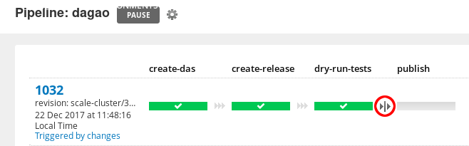

# Data Infra Primer

## Big picture
* [Onboarding Berlin](https://docs.google.com/presentation/d/1GD-poZ9GpIVZypFKQ_g_evAgml0Pzio-jBJNgZ-D2MM/edit?ts=5a0566c5#slide=id.g2296c22905_0_0)
* [2017Q4](https://docs.google.com/document/d/1Mkl2EhJa6Zo3jAZBX5s_dWoEzMI9cd_yKIoQN9F48DY/edit?ts=5a0db010)
* [Architecture Decision Record](https://github.com/nubank/data-infra-adr)
* [Post-mortems](https://github.com/nubank/morgue)
* [Infrastructure Overivew](infrastructure/guide-to-the-runtime-environment.md)

## Datomic Log overview

[Datomic Log Documentation](http://docs.datomic.com/log.html)

A Datomic log has an `EAVT Tx Added` structure, which stands for:
* E = entity (Alessandro)
* A = attribute (Age)
* V = value (27)
* T = time (logical time, t-value from Datomic, monotonically increasing)
* Tx = transaction - a collection of facts that were written atomically
* Added = added or retracted

We rely on the monotonically increasing t-value for the ETL.  We extract from the last t-value we already extracted (extracting via transactions, not datoms - we always keep transactions together) up until the current t-value.

Updates to historical facts (rendering them no longer true) are modeled as a pair of datoms, one that retracts the historically true fact, and one that asserts the fact that is now true, from this t-value forward.

We can traverse a t-value to get the transaction entity, and from the transaction entity we can get to the UTC timestamp and other metadata like `:audit/cid` or `:audit/user`.

In the raw Datomic storage format, attribute names (and enum values) are not stored as strings, but rather as entity ids (longs), and these entity ids can be traversed using `:db/ident` to get to the human readable name of the attribute.

## Correnteza overview
  * Always-on Datomic log extractor (Clojure service).  Correnteza feeds the "data lake" with Datomic data extracted from lots of different Datomic databases across Nubank.
  * Correnteza has a blacklist of databases that it DOES NOT extract that is stored on DynamoDB.  If a database is not on the blacklist, then it will be automatically discovered and extracted.
  * At the moment, correnteza can only have a single EC2 instance running, as having more than one instance causes it to kill itself.  There is some WIP on common-zookeeper to enable more than one instance.  The requirement to have a single instance also complicates our normal blue-green deployment process, because this causes multiple instances of a service (old version + new version) to be up simultaneously.  Fixing the restriction of having exactly 1 correnteza instance live will make it possible to treat correnteza deploys in a standard way (like any other service).
  * See [service README](https://github.com/nubank/correnteza) for additional details

## Itaipu overview
  * [Itaipu](https://github.com/nubank/itaipu) is where we compute data, including everything from raw -> contract -> dataset -> dimension / fact, declaring the dependencies as inputs to each SparkOp (aka dataset). It's basically a mini-DAG within the broader Airflow DAG
  * Raw & contract - see: https://github.com/nubank/data-infra-docs/blob/master/itaipu/primer.md#structure
    * Converts from Datomic's data model to a tabular SQL data model (a subset of what Datomic is capable of)
    * Users generally access contracts as the lowest level of abstraction which already eliminates sharding-related fragmentation
  * Dataset (SparkOp)
    * We want people at Nubank to be able to create new tables as a function of existing tables
    * The contracts are the source for all downstream datasets (and the contract definitions are hardcoded and statically checked within Itaipu)
    * SparkOps are pure - they don't control how they are run, in what order, where their inputs are stored, or where their outputs will be stored.  Itaipu orchestrates this to ensure that dependencies are scheduled in the correct order (and optimized).  Itaipu also manages how many partitions to use when writing dataset output to metapod and S3.
  * Itaipu's mini-DAG
    * Because datasets depend on contracts and other datasets, this produces a directed acyclic dependency graph.  Confusingly, this is a mini-DAG.  The overall DAG is a superset of the Itaipu mini-DAG.
  * Dimensions & fact tables
    * [Kimball principles](dimensional_modeling/kimball.md)
  * Unit testing approach
    * [Unit tests in Itaipu](styleguide.md#unit-test-style) are designed to [test any non-trivial transformation step in isolation](styleguide.md#transform-test-granularity).  Generally we do not test the entire SparkOp on a unit basis.
  * Integration test
    * The Itaipu integration test is able to statically check the entire Itaipu mini-DAG and raise errors if there are any broken column references, incorrect type signatures, unconventional names, etc.  This allows us to catch errors sooner (which is important, because catching an error after the nightly run has been running for 5 hours is very high cost).
  * Workflow for building a new dataset
    * https://github.com/nubank/data-infra-docs/blob/master/itaipu/workflow.md#creating-a-new-dataset
  * TODO: How is target date used, and is it relevant for Itaipu?

## Metapod overview [UPDATE REQUIRED]
  * [Metapod](https://github.com/nubank/metapod) is a Clojure service with a Datomic database that stores metadata about our data, including when any given dataset was computed, where is was stored on S3 (and with which partitions), the schema, which grouping "transaction" it is part of, etc.
  * Metapod is a normal service deployed in sa-east-1 (Sao Paulo) in production in the `global` prototype (as opposed to in a specific shard, for example).  That means that after a pull request is merged to master, it will build and then go through the e2e flow to staging, and then to prod.  You can check what version of metapod is deployed in production using `curl https://prod-global-metapod.nubank.com.br/api/version`, and you can see whether the service is healthy in real time at `http://prod-global-watchtower.nubank.com.br/#services-health`.
  * TODO: How is target date used, and is it relevant for Metapod?
  * TODO: How to retract a portion of a Metapod transaction to enable datasets to be recomputed (for intance, after a patch has been applied)?

## Aurora jobs overview [UPDATE REQUIRED]
  * [Aurora](http://aurora.apache.org/) is a resource manager that schedules and runs jobs across a [Mesos](http://mesos.apache.org/) cluster.  Some of the jobs that Aurora schedules use Spark (which tends to consume all of the resources on the machine it is running on), but other jobs are written in Python or other languages.
  * [aurora-jobs](https://github.com/nubank/aurora-jobs) stores our job definitions

## Airflow overview [UPDATE REQUIRED]
  * Airflow is a platform to author, schedule, and monitor workflows.  We define our workflow (commonly referred to as  "the DAG" or "the Dagão").  Airflow configuration is done via Python code, and we keep our configuration code in [aurora-jobs](https://github.com/nubank/aurora-jobs/blob/master/airflow/main.py).
  * [Airflow on Github](https://github.com/apache/incubator-airflow)
  * [Nubank's Airflow server](https://airflow.nubank.com.br/admin/airflow/graph?dag_id=prod-dagao)
  * TODO: We need to come up with a safety mechanism to avoid borking a running DAG
  * TODO: How is target date used, and is it relevant for Airflow?
  * TODO: How to retry a given node?
  * TODO: How to look at the run for a prior date if airflow borks

[How to deploy airflow?](infrastructure/guide-to-the-runtime-environment.md#airflow)

### Deploying job changes to Airflow
When a job is changed on `aurora-jobs`, we need to be careful about how we update the workflow on Airflow because Airflow does not have isolation between runs, so a change to the workflow could affect the *currently running* DAG accidentally if we are not careful.
 1) The [`aurora-jobs` Go Pipeline](https://go.nubank.com.br/go/tab/pipeline/history/aurora-jobs) will build automatically
 2) When the `aurora-jobs` pipeline completes it'll trigger the [`dagao` Go Pipeline](https://go.nubank.com.br/go/pipeline/history/dagao). This needs to be manually `release` in order for Airflow to have access to it.  *Don't do this during an active DAG run.*
 
 3) On the [Airflow admin page](https://airflow.nubank.com.br/admin/) we need to click the "refresh" button on the `config_downloader` DAG. This will make Airflow suck in the new configuration.
 

## Sabesp overview
  * Command line utility for interacting with data infra ([sample commands](cli_examples.md))
  * The [`sabesp`](https://github.com/nubank/sabesp) command line utility is separate from the [`nu cli`](https://github.com/nubank/nucli) because `nu cli` is written in Bash, while `sabesp` is written in Python and we haven't done the work to make them interoperate.
  * Typically sabesp is called by other tools, like Airflow, but it can be run manually in a terminal, either for development or to address problems with a production run.

## Capivara-clj overview
  * [Capivara](https://github.com/nubank/capivara) is a Redshift data-loader written in Clojure.  The -clj suffix is there to disambiguate from an older SQL runner project.
  * We load Redshift from avro files that are computed by Itaipu.  While the default dataset storage format for Itaipu is Parquet, we use the "avroize" function to create a copy of the dataset in Avro format, because Redshift can load directly from Avro (and not from Parquet).
  * Capivara runs simultaneously with Itaipu (reacting to committed datasets via SQS messages published by Metapod) and after Itaipu (batch job to do the cutover once everything is ready).  We use SQS for this reactive flow because Metapod is on our production stack (in AWS São Paulo) and Capivara runs in AWS US East (where Redshift runs).

## GO deployment pipeline overview [UPDATE REQUIRED]
  * We use [GoCD](https://www.gocd.org/) for continuous delivery build pipelines
  * [Nubank's GoCD server](https://go.nubank.com.br/go/pipelines) (requires VPN)
  * [Data Infra Environment on Go](https://go.nubank.com.br/go/environments/data-infra/show)
  * TODO: explain environments (test, devel, prod)
  * TODO: explain build and deploy process for:
    * metapod
    * aurora-jobs
    * capivara
    * itaipu
    * sabesp
    * correnteza
  * TODO: dev workflow overview

## Sonar overview
  * [Sonar](https://github.com/nubank/sonar-js) is a static frontend (written in pure JavaScript) that interfaces with Metapod's GraphQL API to give visibility into the datasets that are tracked by Metapod.
  * To access Sonar, you need to have `metapod-admin` scope, which you can request in #access-request channel on Slack.  The reason for this is that the same scope gives you access to run mutations via Metapod's GraphQL API (potentially destructive).  TODO: We can separate the query path from the mutation path in the future to relax this requirement.
  * [Nubank's Sonar URL](https://backoffice.nubank.com.br/sonar-js/) (requires VPN)
  * You can access the sonar output for a given metapod transaction by placing the transaction id in the URL: https://backoffice.nubank.com.br/sonar-js/#/sonar-js/transactions/2d1a7d12-0023-5de5-a437-36409b45f4c2

## Monitoring run latency / cost [UPDATE REQUIRED]
  * We currently store metrics on how much total CPU time it costs to compute each dataset in the DAG using InfluxDB, and we use Grafana to visualize the data stored there.
  * [Our ETL-focused Grafana dashboard](https://prod-grafana.nubank.com.br/dashboard/db/etl)

## Metabase
  * Metabase is an open source frontend for storing and visualizing data warehouse queries
  * [Nubank's Metabase server](https://metabase.nubank.com.br/) (requires VPN)
  * Metabase has a broad user base within Nubank and it is fairly easy for non-technical users to write queries and create charts.  Metabase is backed by a PostgreSQL database that stores questions (SQL) and other metadata about the schema of the data warehouse.  Metabase queries Redshift, our data warehouse.  All queries initiated from the Metabase UI have the `metabase` user.

## Belo Monte
_[TODO: add useful queries]_
The name for our Redshift cluster. The most used interface to it is Metabase, described above. For more info, see the [Wiki page about Belo Monte](https://wiki.nubank.com.br/index.php/Belo_Monte).

To get access credentials, the path of least resistance for everyone involved is when the Data Infra engineer follows the guide on the wiki for normal nubankers (using IAM-based authentication). After that is set up, another Data Infra engineer can attach a password to the Redshift user that was created through the IAM path, in order to make it easier to use GUI tools like DataGrip.

In Data Infra, we can use an admin user for administrative tasks (e.g. querying for load errors in the `stl_load_errors` table). Ask for another Data Infra engineer to get you the credentials for the admin user.

## Quay.io overview
  * Nubank uses [Quay.io](https://quay.io/) as our Docker container image store
  * Whenever we build a new version of a service, for example, a Go pipeline will build a Docker container and upload it to Quay.io.  The images uploaded to Quay.io are conventionally tagged with the first 7 characters of the Git commit SHA of the repository that generated the build.
  * When we deploy a new service version, the deploy code will get the relevant image from Quay.io via its tag

  

## Monitoring and caring for DAG runs
  * See: [Monitoring the Nightly Run](monitoring_nightly_run.md)

## Other relevant ETL repositories
  * [common-etl-spec](https://github.com/nubank/common-etl-spec) - Repository of clojure specs shared across ETL-related services
  * [metapod-client](https://github.com/nubank/metapod-client) - Clojure client library for communicating with the Metapod
  * [metapod-client-python](https://github.com/nubank/metapod-client-python) - Python client library for communicating with Metapod
  * [finance-reports](https://github.com/nubank/finance-reports) - Saving reports for third party partners to places where they can access them
  * [curva-de-rio](https://github.com/nubank/curva-de-rio) - ETL ingester for non-Datomic data
  * [tapir](https://github.com/nubank/tapir) - Batch data loader for the serving layer
  * [conrado](https://github.com/nubank/conrado) - Serving layer production service
  * [aqueduto](https://github.com/nubank/aqueduto) - Online machine learning models framework

## Relevant machine learning models
  * [lusa](https://github.com/nubank/lusa) - Acquisition stage credit risk
  * [charlotte](https://github.com/nubank/charlotte) - Acquisition stage credit limit
  * [rataria](https://github.com/nubank/rataria) - Acquisition stage fraud
  * [cronno](https://github.com/nubank/cronno-model) - Customer management spend
  * [hyoga](https://github.com/nubank/hyoga-model) - Customer management risk
  * [contextual](https://github.com/nubank/contextual) - Customer contact reason

## Permissions / accounts needed to contribute on data infra [UPDATE REQUIRED]
  * IAM permissions (groups) 
    * `data-access-ops data-infra-aurora-access eng infra-ops prod-eng data-infra belomonte`
  * Quay.io permissions needed, and when to do direct quay.io builds
  * Databricks access - ask on #access-request channel on Slack
  * Datagrip license (or some other SQL client)
  * Join user groups: `belomonte` and `analyst`
  * Redshift user for etl@cantareira-redshift.nubank.com.br (or `sao_pedro` superuser) (TODO: how are these users managed?)
  * Metabase admin (TODO: what is this needed for, and how do we get it?)
  * CircleCI - for building code on branches, such as the pull request build indicator on Itaipu.  Login with Github.
  * metapod-admin scope - for accessing Sonar-JS (ask on #access-request channel on Slack)
