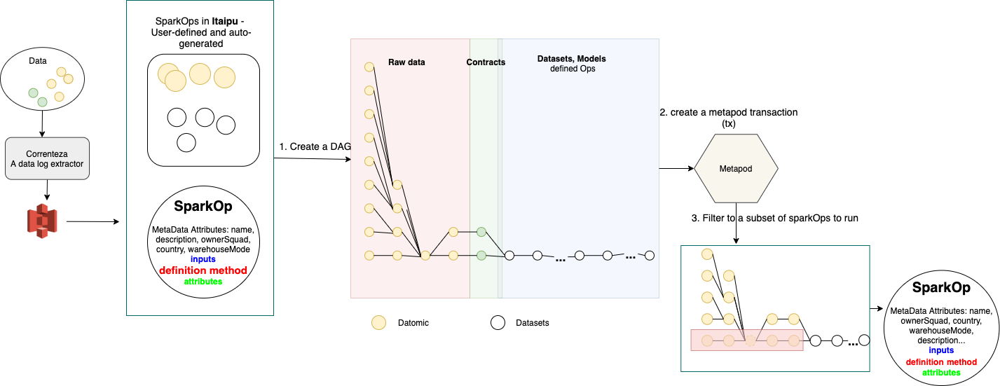
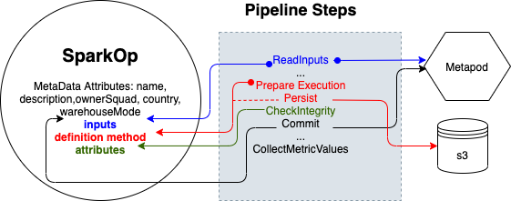
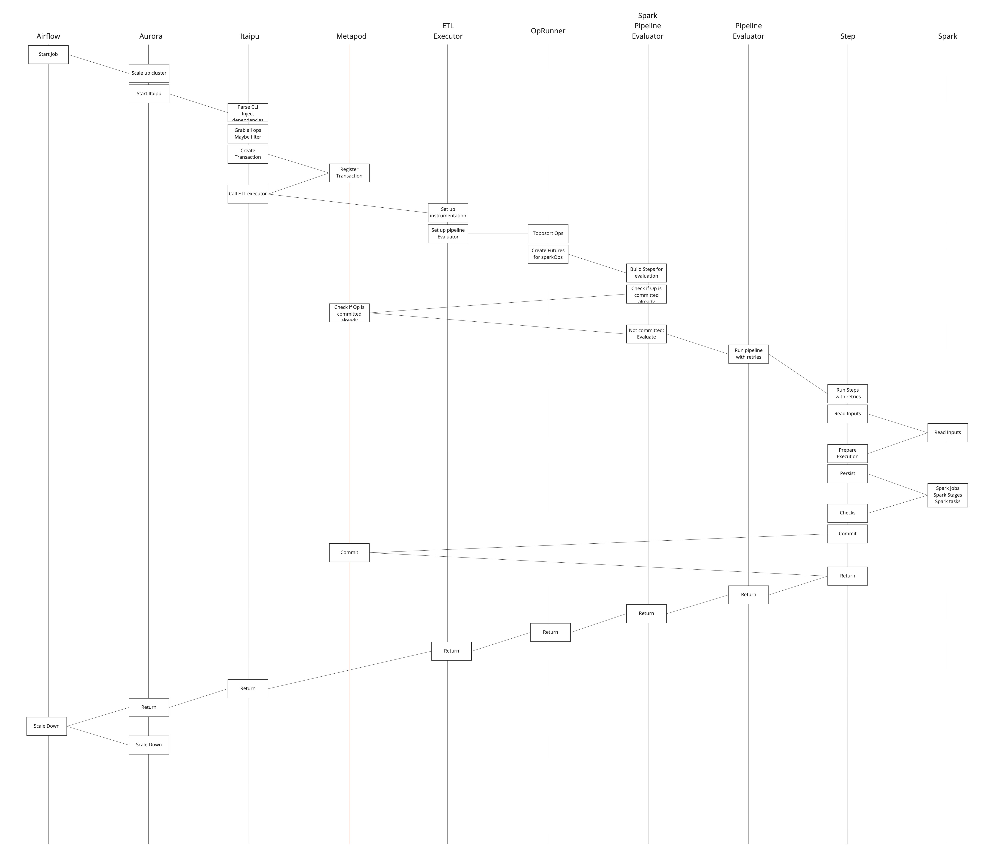

# How the data from data sources is ingested into ETL environment and transformed

## Preparing your service for ingesting data into ETL

If a new service (a datasource) is created and the data from that service has to be transformed and availble in analytical environment, then Data Infra provides a contract dataset. This contract is auto-generated from layers of transformations on raw data (rootOp). To understand the intricate details about layers involved before generating a contract, refer to the [pre-contract layers](https://nubank.cloud.databricks.com/#notebook/3012827/command/3106150) documentation.

Let's say you have a new service called `credit-card-accounts` and a contract_main.clj file in the repo, which auto-generates the contracts and then a defined skeleton for the service database.

```
(ns contract-main
  (:require [common-datomic.contract.gen-helpers :as contract.gen-helpers]
            [accounts.db.datomic.config :as db.config]
            [schema.core :as s]))

(defn -main [country & args]
      (let [country' (keyword country)]

  (s/with-fn-validation (contract.gen-helpers/generate-contracts! db.config/db-name db.config/contract-skeletons country'))))
```

When you call the contracts main function, it auto-generates files (Scala files) and are available in `resources>nu>data` folder in the service repo.

You will then copy those files and place in appropriate place in Itaipu and create a Contract (Scala file), say `CreditCardAccounts.scala` at Itaipu/src/main/scala/nu/data/br/dbcontracts/credit_card_accounts and provide the details such as, your service name, list of Scala files that are auto-generated, squad, and country.

Here is an excerpt that shows the details:

```
 private[br] object CreditCardAccounts extends DatabaseContract {
  override val name: String                            = "credit-card-accounts"
  override val prototypes: Seq[Prototype]              = Prototypes.nonGlobal
  override val dynamoDBNameMap: Map[Prototype, String] = prototypes.map(p => p -> "cc-accounts").toMap
  override val country: Country                        = Country.BR
  override val entities: Seq[DatomicEntity] =
    Seq(Accounts,
        Cards,
        Comments,
        IncreaseLimitRequests,
        OptimalProactiveLimits,
        OptimalReactiveLimits,
        ProtoCards,
        TemporaryLimits)
  override def ownerSquad: Squad = Squads.lending
```

When the PR with Contract datasets is merged into Itaipu, Data Infra ensures that tables for each entity are created.

!!! Note: This ContractOp generates other SparkOps and during the run, all these SparkOps are run automatically before the contractOp runs. This to ensure that all the inputs that are needed are ready.

`raw-logs -> log-caches -> materialized-entities -> unified-mat-ent -> pivoted-ent -> contract.`

Here is an illustration that helps you understand the auto-generation of SparkOps in the operational layer (internal).



## Input data to the SparkOps

We now have the contractOps, and rawOps & otherOps that are auto-generated in the Itaipu world. Let's see how the initial rootOp (SparkOp) gets its input data. In fact, SparkOp has a capability to know from which metadata store that it has to get the input and it will then get the data.

Incase of Datomic data, it fetches the data from [Correnteza](#datomic-data), whereas for the dataset series data, the SparkOp fetches the input data from the [Ouroboros](#dataset-series-data).

### Datomic data

Correnteza is the service that extracts the customer sensitive data in EAVT format from the Datomic database and saves as avro files.

- S3 stores the avro files.
- DynamoDB stores the metadata of the extracted datomic data.

The collection of datomic logs (avro files and metadata) written to the Datomic database at time intervals (T0 to T1) are considered as the **extractions**.

!!! Note
    These extractions are provided as input to the rawlogs (rootOps) in Itaipu.

### Dataset series data

Data such as manually ingested data, data to be archived, data from external providers/partners, events/instrumentation, click-stream etc. is sent to Alph service as a Kafka message and Ouroboros is the service that consumes the data produced by the Alph service. Ouroboros stores the data on S3.

## SparkOps to Dataset transformation in Itaipu

Most of the datasets that you find in the Itaipu world are [SparkOps](https://github.com/nubank/data-platform-docs/blob/4364d66520fde5b30d03ad89a5bf7b3a5fe080ea/how-tos/itaipu/create_basic_dataset.md#3---understanding-the-sparkop-class). The other kinds of Ops that exist in Itaipu are StaticOps, RootOps, ContractOps, and more.

Itaipu pulls the raw logs (which are called root ops in Itaipu environment) stored on S3 and provide that data as an input to the initial SparkOp i.e rootOp. Then that data undergoes necessary transformations and a Contract dataset is generated. Incase of dataset series, contract dataset series is generated.

!!! Note
    **A dataset life starts at the time SparkOp is being computed.**

The users then create the datasets (SparkOps) with required transformations that involves multiple auto-generated contracts as base contracts. The user-defined datasets are computed when the spark-code defined in the sparkOp's `definition` function is executed. The base datasets that are used in the `definition` function are defined in `inputs`.

Whenever Itaipu computes a new SparkOp, it persists its output to S3 and sends the relevant metadata to Metapod to be marked as **committed**.

!!! Note
    By default, the datasets produced each day by Itaipu (after transformations) are stored in an ephemeral S3 bucket, and are deleted from the bucket after 2 weeks. This is done to save storage space as the computation happens every day on the entire data in buckets.

1. Itaipu runs multiple jobs which are independent from each other. Whenever a job starts, it queries Metapod to get the information about resuming the computation process.
1. Metapod's primary function is to query the datasets on S3 that are organized by the transactions. As the datasets on s3 are the goal of our ETL run, you can also use the Metapod to track the progress of the run.

When the query runs, Metapod checks for the committed datasets and provides Itaipu with the information from where it should resume the computation process.

!!! Note
    The dataset (metadata information about the dataset), which is stored in Metapod’s datomic is never deleted. So, even after 2 weeks, we’ll still have a record of that data (SparkOp) existence, but the data itself won’t be there anymore.

### SparkOps pipeline steps in Itaipu

The following image illustrates the high-level overview of the pipeline steps involved during the SparkOp run.



The Spark pipeline evaluator performs sequence of steps over each sparkop to generate datasets. You can find the complete list of steps in the **[`DefaultMetapodSparkStepsBuilder.scala`](https://github.com/nubank/itaipu/blob/master/common-etl/src/main/scala/common_etl/evaluator/DefaultMetapodSparkStepsBuilder.scala#L29-L53) file**.

#### Detailed steps involved in generating datasets during run

.

The Dataset which is generated after transformation during the daily run is loaded into data warehouse if the `warehousemode` property is set for a dataset.

## Data Serving

The transformed data is then processed through the next steps involved in the serving layer. To know how the data is served, refer to the [Serving Layer](https://github.com/nubank/data-platform-docs/blob/4364d66520fde5b30d03ad89a5bf7b3a5fe080ea/services/data-serving/serving-layer.md) documentation.

## Data Archiving

In some cases, users need to keep track of records of data that was computed each day, and for some datasets the data should not be deleted, and must be available for later Itaipu runs.

For example, policies, transaction data etc should be available in production and usually have a direct impact on customers; we often want to keep track of the contents of a policy for each day, and the history of a policy’s outputs are compiled into a single dataset against which various checks are run.

1. Cutia is a service that consumes the kafka messages marked as “archive” ( a dataset marked as “archived” in Itaipu definition) from the `All-datasets-committed` topic and stores the data (a derived SparkOp) in permanent bucket on S3.

    It validates the schema of the parquet files in the permanent bucket against the dataset series contract that was created already. If the validation is successful, Cutia transforms the metadata output from Metapod into a format and publishes to the `New-Series-Partitions` topic for Ouroboros to consume.

For more information on archive datasets, refer to [How archiving datasets work behind the scenes](https://honey.is/home/#post/851235) and [Archive Dataset series documentation](https://github.com/nubank/data-platform-docs/blob/master/data-users/etl_users/archived_datasets.md).
