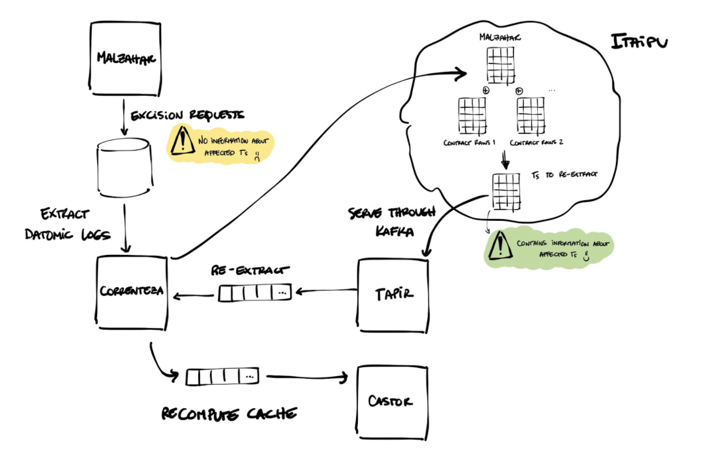

# Datomic Data Deletion flow

### From production services

For deleting data from production services on Datomic databases, a centralized approach has taken - data protection will directly delete the designated data on Datomic databases, regardless of who owns the database.

### Malzahar

Malzahar is the data protection service responsible for deleting production data from datomic databases. Malzahar does that by,

- connecting to all datomic databases, across all shards of the Brazilian (and Mexican) environments
- creating resolvers to the locations of specific types of data given, a customer/prospect identifier
- triggering excise operations for a given database.

## Datomic data deletion process

This section describes part of the Data Deletion process where the data deletion request received from the data subject is propagated to the ETL. The Data Platform ensures that all the data subject data that was deleted from the Datomic data sources is deleted from the ETL accordingly.

There are two main data sources that ingests data into the data platform - Datomic and Kafka. The data platform is the primary system of record for data ingested through Kafka and a secondary system of record for Datomic. Therefore,

- In Datomic, deletion is implemented by invalidating caches and re-ingesting the data to catch up with deletions made upstream.
- For Kafka, a new service, Lethe is created for managing deletion requests and their lifecycle, while reusing the already existing compaction mechanism to carry out the deletions.

### Deleting Personal data from Datomic cache

Deleting the datomic data from the production environment does not guarantee the data removal from the data platform. This is because the services on the data platform use replicas of a production database (Datomic database) and perform ETL operations to transform and make the data available in the analytical environment. In other words, the services keep copies of datomic data (caches) to speed up the ETL process. When a delete operation is performed on the production database, the data deletion needs to be mirrored on the data platform.

**Important:** We delete personal data of each entity. All PII data can be considered as personal data but not all personal data is considered as PII. There may be cases where a PII attribute is used as a primary key and referenced elsewhere - it will still be deleted. All the entities associated with that PII key will not be available in the analytical environment.

### Datomic Data Deletion Process

The data deletion happens in two phases -

**Re-extraction**: Delete the user data from our core sources, i.e change logs extracted from datomic.
**Re-computation of caches**: Then a few days later, delete user data from caches that speed up the contract layer of the ETL.

When a prospect/customer data is deleted in production, then in the analytical environment, the latest data will be partially removed from the datomic logs for a few ETL runs, and then a few days later, the data will be completely removed, once caches are recomputed.

The following illustration shows how the Datomic data is deleted from the ETL and served:

### Data Deletion on ETL

1. Ryze contains all the details of PII data stored in various databases. When a deletion request is raised for a data subject, the data needs to be deleted for this Identifier. Malzahar is a service that deletes the data from all databases and stores the details of deletion requests and the affected databases.
1. Correnteza processes the deletion requests received from Malzahar, a service created and maintained by the Data Protection team.
1. As part of the ETL process, the datasets (for MX,nu-mx/contract/malzahar/excise-requests and nu-mx/contract/malzahar/excise-fields; for BR, contract-malzahar/excise-requests and contract-malzahar/excise-fields) in Itaipu use the contract datasets from the Malzahar service in the ETL to view the deletion requests that have been registered. Each deletion request has datomic entities associated with them. Using these entities, the dataset finds the datomic log entries corresponding to the entity (i.e, it finds the T values that need to be re-extracted). This happens by scanning raw datomic logs for the affected datasets. This dataset is computed everyday in Itaipu manually.
1. The dataset produced by Itaipu is published to the serving layer for dataset propagation through Tapir. Tapir will publish, via Kafka, messages that contain the name of affected databases and affected Ts.
1. Correnteza listens to the messages Tapir produces via Kafka and uses them to trigger re-extractions. It deletes the affected extractions and creates new data.

Everyday new database contracts are created and this ensures that the data is completely removed from the ETL.

#### Data Deletion from Caches

This process is about deleting the data from the Datomic raw caches. As the deletion process happens in batches in Castor, **it takes upto 7 days to delete data from Caches**.

After Correnteza re-extracts, it sends a HTTP request to Castor, a system that owns the metadata of Datomic raw caches. The caches are processed in batches for every 7 days, to invalidate the cache it has and create a new cache. If a database has at least one data deletion request in the batch, then Castor schedules re-caching operations for the database that is affected and recreates the entire cache.

### Deletion on Serving Layer

This section describes part of the Data Deletion process where the deleted data from ETL is propagated to the Serving Layer to make it available for the Analytical environment. The Data Platform ensures that all the data subject data that was deleted from the ETL is deleted from the Serving Layer accordingly.

After deleting the data from ETL, the data platform ensures that the same data is deleted from the Serving layer as well. This is because the data in the ETL, which is propagated to the Serving layer, is consumed by the users in an analytical environment.

The following are the services involved in serving layer:

**Tapir**, a service that sends the served data through Kafka messages. For Tapir, the Kafka setup already has a defined retention policy after which the data is automatically deleted. This retention period is 15 days.

**Conrado**, a service that loads data into a DynamoDB database, so that the client services can query to get their served data. For Conrado, since the data is loaded into DynamoDB, the default behaviour is that the data stays there forever. However, DynamoDB has a TTL functionality, which can be used to set the expiry time for the data, such that the data can be deleted after a defined period.

**Note:** TTL - three days for all datasets served with a mode of *LoadedOnly* or *LoadedAndPropagated* and a clearance type as PII.

In addition, we will enforce the same TTL (three days) for:

- all newly created datasets with a clearance type, PII.
- existing datasets whose clearance type changes to PII (for example, from General to PII).

This enforcement applies only to the datasets served with either of the modes - *LoadedOnly* or *LoadedAndPropagated*.

### References

- [PRD for Data Deletion](https://docs.google.com/document/d/1mpBnYd5PbogXLJ6zHwbHT845LCbba3wPQABBDjg-eTI/edit?ts=5f17efa4#)
- [PII and personal data](../how-tos/data-deletion/pii_and_personal_data.md)
