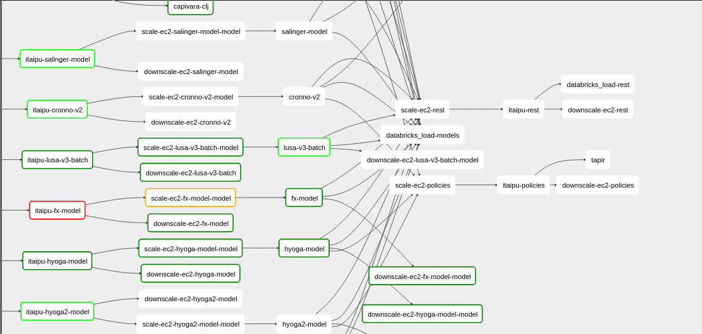

# Runbook

* [Recover from non-critical model build failures](#recover-from-non-critical-model-build-failures)
  * [Determining if a dataset or model is business critical or can be fixed without time-pressure](#determining-if-a-dataset-or-model-is-business-critical-or-can-be-fixed-without-time-pressure)
  * [Determining if it was the dataset or model that failed](#determining-if-it-was-the-dataset-or-model-that-failed)
  * [Dealing with dataset failures](#dealing-with-dataset-failures)
  * [Dealing with model failures](#dealing-with-model-failures)
  * [Making downstream jobs run when an upstream job fails](#making-downstream-jobs-run-when-an-upstream-job-fails)

## Recover from non-critical dataset/model build failures

Datasets and models, especially newer ones, may have bugs that lead to build failures on Airflow that block downstream jobs.
There are two things to do to recover from these failures:
 * Prevent the failure in subsequent runs
 * Retrigger downstream jobs if they can be successfully run in the presence of upstream failures. For example, in the case of a single model failing and causing all of `itaipu-rest` from not running.

There are two types of jobs that can fail, datasets, which are then used to generate downstream models, or the models themselves. Each have different but similar ways to recovery.

### Determining if a dataset or model is business critical or can be fixed without time-pressure

If the model is a [`policy model`](https://github.com/nubank/aurora-jobs/blob/000ba9f8b8ac4b06408bf3783971351d7916e912/airflow/main.py#L256), then it is important to fix the root issue immediately. Otherwise, you can comment it out using the instructions below and let the owner fix it when they get a chance.

### Determining if it was the dataset or model that failed

[Get the transaction id for the run](https://github.com/nubank/data-infra-docs/blob/master/monitoring_nightly_run.md#finding-the-transaction-id).
Then find uncommitted "`datasets`" for that transaction by using [sonar](https://backoffice.nubank.com.br/sonar-js/#/sonar-js/graphiql) run this GraphQL query:

```
{
  transaction(transactionId: "f7832a01-001b-56f7-a4fe-b3a417f8f654") {
    datasets(committed: ONLY_UNCOMMITTED) {
      name
    }
  }
}
```

Which will output something like this:

```
{
  "data": {
    "transaction": {
      "datasets": [
        {
          "name": "model/fx-model-avro"
        },
        {
          "name": "dataset/fx-model"
        },
        {
          "name": "model/fx-model"
        },
        {
          "name": "dataset/fx-model-csv-gz"
        }
      ]
    }
  }
}
```

Given this output, the dataset failed, also causing the dependent model to fail, so we need to address both using the following steps.

### Dealing with dataset failures

If a dataset is erroring and causing an job node to fail on airflow, we can comment out the dataset from `itaipu` to stop it from failing in subsequent runs. Here is an [example PR that does this](https://github.com/nubank/itaipu/pull/1603). You will also want to clear downstream jobs that were marked as failures to allow them to run (see [Making downstream jobs run when an upstream job fails]).

### Dealing with model failures

Non-critical models can be removed from the DAG definition ([example PR here](https://github.com/nubank/aurora-jobs/pull/483)) so that it doesn't block future runs. The owner of the model can then fix it without blocking other models.

Removing model will only take effect tomorrow, when in the next run is triggered.
Hence, to get downstream jobs to build today, we can do some Airflow manipulations. Note that the failing model will show up as empty in those downstream jobs.

### Making downstream jobs run when an upstream job fails

Say `itaipu-fx-model` causing the downstream [`fx-model`](https://github.com/nubank/aurora-jobs/blob/000ba9f8b8ac4b06408bf3783971351d7916e912/airflow/main.py#L254) and `itaipu-rest` to fail.


In this case you can select `fx-model` and mark it as successful:


Then select the downstream nodes that have failed due to the upstream `fx-model` failure and clear them so that when other running dependencies finish, they will run these nodes. In this case, clear both `databricks_load-models` and `scale-ec2-rest`. The resulting DAG should look like this:


