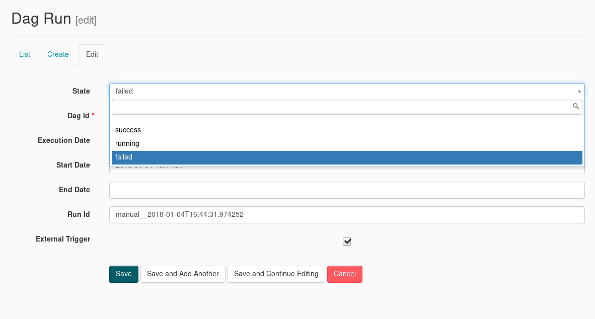
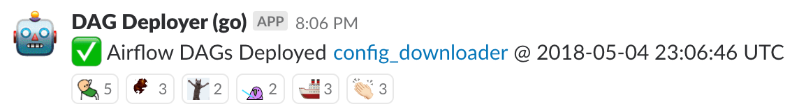
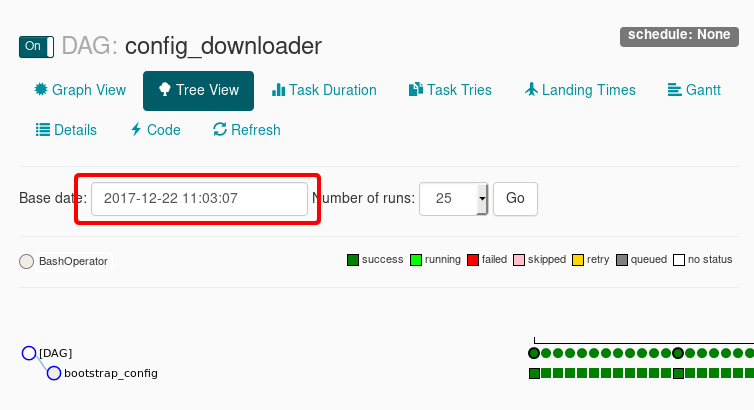
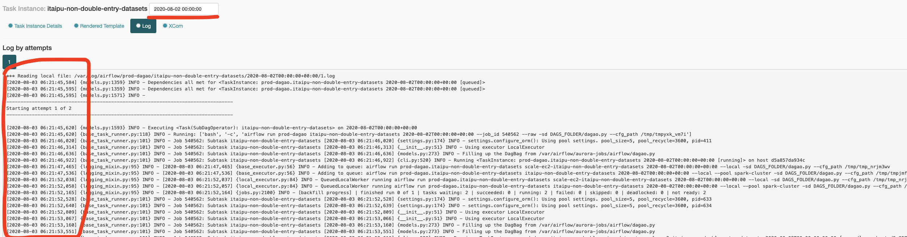

# Airflow

Table of contents

* [Useful links](#useful-links)
* [Manually stopping a run](#manually-stopping-a-run)
* [Deploying job changes to Airflow](#deploying-job-changes-to-airflow)
* [Updating Airflow](#updating-airflow)
* [Restarting the Airflow process](#restarting-the-airflow-process)
* [Dry run tests](#dry-run-tests)

## Useful links

* [Monitoring the run on Airflow](../on-call/data-infra/monitoring_nightly_run.md)
* [Airflow DOCS on Creating a new DAG](https://airflow.apache.org/tutorial.html), Basically you need to create a python file, that has the definition of your DAG inside the airflow directory, then just follow the `Deploying job changes to Airflow`

## Manually stopping a run

Sometimes a run hangs and you will want to manually stop it. Or a manual run is overwritten by the scheduled run.

1. on the root airflow page, under the `DAG Runs` column for `prod-dagao` click the light green 'running' circle

2. Click the _edit_ icon for the run you want to stop (See the _execution date_ or look for `manual__` in the _Run Id_)

3. Set the Dag Run _State_ to `failed`

4. Kill manually all tasks left
   1. Get the list of tasks that needs to be killed from the task list. Click the green 'running' circle in the `recent_tasks` tab, and filter by your dag, and by it's execution date.
   

   2. For each `task_id` execute the following command
   `sabesp --aurora-stack=cantareira-stable jobs kill jobs prod {{task_name}}`

## Deploying job changes to Airflow

When a job is changed on [`aurora-jobs`](https://github.com/nubank/aurora-jobs), we need to be careful about how we update the workflow on Airflow because Airflow does not have isolation between runs, so a change to the workflow could affect the *currently running* DAG accidentally if we are not careful.

   1. The [`aurora-jobs` Go Pipeline](https://go.nubank.com.br/go/tab/pipeline/history/aurora-jobs) will build automatically
   1. When the [`aurora-jobs`](https://github.com/nubank/aurora-jobs) pipeline
     completes it'll trigger the [`dagao` Go
     Pipeline](https://go.nubank.com.br/go/pipeline/history/dagao). The main test
     that is run in this pipeline is called [`dry-run-tests`](#dry-run-tests). This needs to be
     manually `release` in order for Airflow to have access to it.

     *Don't do this during an active DAG run unless you know what you are doing ([see below](#additional-details-on-deploying-a-new-dag)).*

      

   1. You can check that the configuration was loaded into airflow by clicking the link that will arrive on the [#etl-updates](https://nubank.slack.com/messages/CCYJHJHR9/) channel
       
   1. After clicking the link you can check the log and the execution date.
       

### Additional details on deploying a new DAG

You can re-deploy the `dagao` DAG while it is running as long as there aren't changes from upstream dependencies (`aurora-jobs`, `itaipu`, models, etc.) that would effect the run.
You can check this by comparing the versions of repositories to the versions in the DAG run message on [#etl-updates](https://nubank.slack.com/messages/CCYJHJHR9/).
All upstream dependencies to `dagao` are built off their `master` branches, except for `itaipu`, which uses the `release` branch.

When a DAG is deployed while another is running, airflow will use the current state of the running DAG on the new DAG. Every new task will use the service versions provided by the newly deployed DAG.

#### Some dangerous `itaipu` changes to deploy while the DAG is running include

- Adding new datasets `itaipu` after the transaction that has already started. You can't register or remove datasets from a transaction that has already been started
- A change that affects multiple datasets where half the datasets affected have already been committed in the transaction. This can lead to data being in an inconsistent state. In this case you should retract all datasets and rerun them with the new changes.
- A change to core `itaipu` processes or cross-service communication logic that might require coordinated deploys with other code.

## Updating Airflow

To update Airflow you need to first bump the `base-airflow` [Dockerfile](https://github.com/nubank/dockerfiles/blob/master/base-airflow/Dockerfile), merge it and wait until the GoCD pipeline is done building and publishing it. Once it is done, you need to change its version on [deploy](https://github.com/nubank/deploy/blob/master/lib/recipes/airflow.rb#L21). You can find the latest tag by running `nu registry latest-tag nu-base-airflow`.

*Before proceeding further*. It’s important to remember that we are
updating Airflow _service_, not the database. This means that,
during the operations described below, at some point, there will be
_two_ Airflow instances interacting with the same database. Nothing
bad will happen, provided that you don’t keep running both of them for
more than the few minutes needed to perform the update.

You can now open the `deploy` console in the cantareira environment (`cd $NU_HOME/deploy; ./console cantareira`) and run

`Airflow.create!("x")`

Wait until it's created, make sure you can access (might take a while given DNS propagation times)
https://cantareira-x-airflow.nubank.com.br/admin/ and then you can:

* Test the new deployment by re-running one of the already finished nodes, but first, make sure you understand what the implications of re-running a DAG are: [triggering a DAG vs clearing a DAG and its tasks](#triggering-a-DAG-vs-clearing-a-DAG-and-its-tasks). **It is recommended to re-run a DAG that has minimal impact on the daily run**, but at the same time, we need to test the correctness of the new updated Airflow, and for that reason, it is important that this DAG is scheduled by Airflow (to verify Airflow correctness) and submits and waits for an Aurora job (to verify Aurora correctness). A DAG like `data-announcements` might be what you are looking for here.

* Upsert the new airflow to the main DNS with `Airflow.upsert_alias!("x")`

If the service is not responding correctly, try to ssh (instructions below) into the new instance and see if there are any units that failed to start (there is a concurrency issue here).

`$ systemctl list-units --state=failed`

If there is any, try to restart them. Example for the `nginx.service` unit:

`$ sudo systemctl restart nginx.service`

The final step is to delete the old airflow stack, you can do it by running,

`Airflow.delete!("y")`

Go to AWS CloudFormation and delete the old roles stack named `cantareira-y-airflow-roles`

Don't forget to commit the changes you made to deploy, so that we have
an up to date view of the changes in a version-control system.

If you bumped Airflow to use a new version of Sabesp, SSH into the new Airflow machine and run the following command to double check that the new Airflow is running the correct version of `sabesp`: `docker exec <container_id> cat /usr/local/lib/python3.7/dist-packages/sabesp/resources/VERSION`

### Updating Airflow in `nu-data`

Things are bit rougher in `nu-data` because it‘s still a work in
progress. Preparatory steps

* Set `AWS_ACCESS_KEY_ID` and `AWS_SECRET_ACCESS_KEY` to your
    corresponding credentials for `nu-data`
* [Rataria Alert] If the previous step does not work, go ahead and create a new temporary profile inside `~/.aws/credentials`. Call it `data` and use the exact same configuration as `data-prod`.
* Check out the branch
    `giorgio-valoti/ch125837/spin-new-airflow-from-deploy`

After this you can start the console:

`./console <either prod or staging>`

And then use:

`AirflowService.create!(ENVIRONMENT, "foz", "<your new color>")`

After that, you need to update DNS entries manually in Route 53 by
updating the alias from the old color to the new one. Route53 -> Hosted zones -> Domain nubank.world -> edit "staging-foz-airflow.nubank.world" to route traffic to new stack

Finally, you can delete the old stack with:

`AirflowService.delete!(ENVIRONMENT, "foz", "<the old color>")`

## Restarting the Airflow process

If you try clearing an airflow dag node and it doesn't actually restart the node, something on airflow may be messed up.
The way forward is to cycle the airflow process.

Ssh into the machine

`nu ser ssh airflow --region us-east-1 --user phillip.mates --env cantareira --suffix t`

and restart the process

`sudo systemctl restart airflow`

This should get things going again.

## Understanding Airflow run dates and schedule intervals

This section assumes that the reader has some basic knowledge about Airflow.

The Airflow schedule interval could be a challenging and difficult concept to grasp that results in a few, confusing questions that arise every now and then: "why is the run date the 30st if today is the 31st?", "why is my DAG not running as expected?", "is the DAG running for today or yesterday?". The Airflow scheduler is one of the most misunderstood and complicated areas of Airflow; With that in mind we will try to explain how the schedule interval works and how it relates to the run date.

The first thing that we should clearly understand is that Airflow was built with the concept of ETL in mind. This basically means that Airflow is commonly used to perform an action after a certain period of time has ended. Let's say that this period of time is 24 hours and the action is uploading some data to an S3 bucket. We wait for the 24 hour period to be over, and then we upload all the data. When a DAG that represents this behaviour is running during, let's say, on the 20th of January, it does not make sense for the run date to be the 20th of January, because the day is not over yet! The run date should be the 19th, because it always corresponds to the beginning of the previous completed time period.
In other words, if you run a DAG on a schedule interval of one day, the run with the run date of 2020-01-20 will be triggered after 2020-01-20T23:59 - always at the end of the time period.
Let's now take a look at one final example: let's assume that some requirements change, and the previous DAG will now have to run on a weekly schedule (every Monday at 1pm), what exactly will change with the execution date? Well, the idea is pretty much the same, assuming "today" is Monday the 3rd of August some time after 1pm, and that the DAG is already running, the DAG will have the execution date that corresponds to the beginning of the previous completed time period (a week in this case), and therefore the execution date will be the 27th of July, 1PM, i.e., 27-07-2020T13:00:00, exactly 7 days before.

### Why is this important, and why should we care

When fixing an issue with one of the runs, be it `dagao`, `daguito` etc., it is important to understand which run are we looking at. You should always keep in mind that the run you are looking at might not be one for yesterday, but the one for today. When in doubt, you should always open one of the tasks, and take a look at the log lines. They will always have the current "real" date. Let's take a look at the next figure. This example was taken on the 3rd of August 2020; This particular task `itaipu-non-double-entry-datasets` has a run date of 2020-08-02 (the last completed 24 hour period), but the log lines, that represent the task being run inside the Airflow machine, display the 3rd of August as date. Although this task might seem to be the one for yesterday, it is actually the one for today, the 3rd of August.

## Triggering a DAG vs clearing a DAG and its tasks

Triggering an Airflow DAG means creating a new DAG run outside of the DAG normal schedule. This means that the rules we covered in the previous section no longer apply here; Since the new DAG is outside of its the normal schedule, the execution date will be the exact "real" time that the DAG was triggered and its run ID will include the keyword "manual" to distinguish this DAG run from the normal "scheduled" ones.

Re-running a node by **clearing** its status represents a very different behavior: here we are **not** creating a new DAG run, we are simply telling Airflow to ignore whatever previous status it had stored about this task(s), and upon **clearing** them (using the UI's button), the Airflow scheduler will behave like these tasks have never run before, and therefore, will start them again, because according to the scheduler they should indeed be running or be done by that time.

### Why is this important, and why should we care

As we covered before, triggering a DAG (**not** clearing a DAG), will create a totally new DAG run; We can think of this as creating a new *dagao* or a new *daguito* run. One of the first things we do during the first task in one of the DAGs is creating a new Metapod transaction, so yes, creating a new DAG run will result in creating a new transaction, which is something that we do not want, as it might confuse our users on why we have multiple production transactions for the same day.

## Running tests for the Airflow DAGs

Running the command below, will spin a environment similar to the production one, and will run and check all tasks in the `main.py` dag.

`./script/test integration`

## Dry run tests

The main thing that we want to test before deploying a new DAS to our Airflow
instance is the integration between Airflow and Aurora. Airflow starts the
Aurora jobs using sabesp, passing arguments as binds. The past has shown that
bindings are a likely target for runtime failures. For instance, typos in one of
the bindings on either the Airflow or the Aurora side, will result in a runtime
failure (in the middle of the night).

Fortunately we have an instrument that allows us to test the bindings between
Airflow and Aurora jobs. This instrument is Sabesp's `--dryrun` flag. We use
this flag, and only this flag, to distinguish production job instantiations from
test ones.

You can find the code for the dry run tests in the
[`deploy-airflow`](https://github.nubank/deploy-airflow) repository. Instead of
going through the topologically sorted DAG, it simply iterates through all the
tasks that are present in the DAG. For every task that it finds, such as
`itaipu-contracts`, it invocates Sabesp exactly like in production with the only
exception being the dry run flag enabled (very simple--using xargs).

The main pain point with this approach is that we have multiple nested docker
containers during this test. Our CI instance, which is a Go Docker container,
spawns the Airflow docker container, which spawns multiple Sabesp containers
during the test (one for every SabespOperator task in the production DAG). This
is an artifact of our move from factotum to Airflow (our testing worked
differently in the past).

Side note: obviously the docker in docker in docker approach is
undesirable. Because of this, I think that this part of our architecture should
be considered for a refactoring soon.
