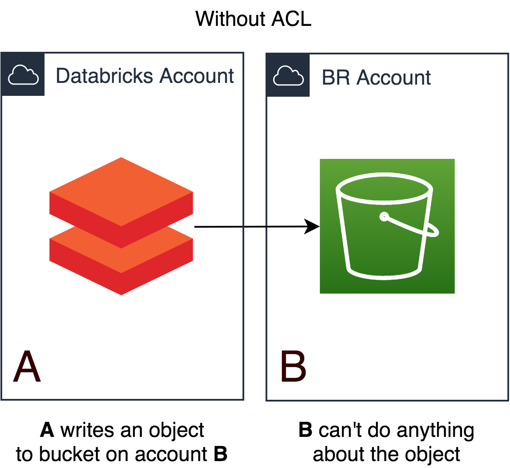
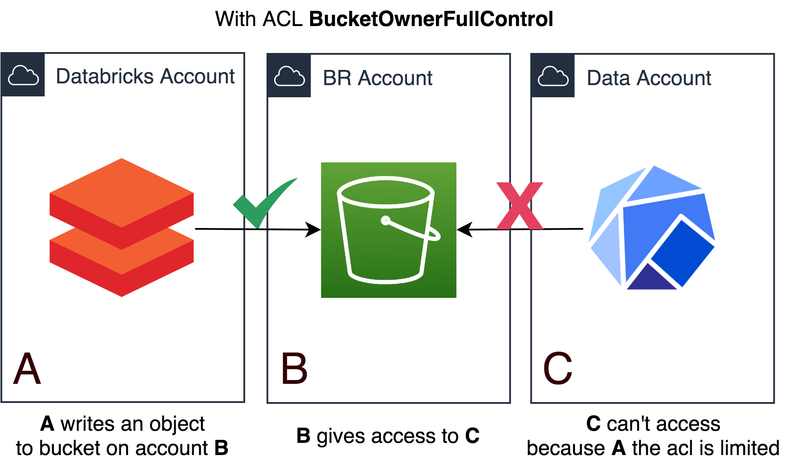

# S3 Cross account Access Issue (between Databricks and Kubeflow)

## Explanation

When creating a bucket on S3 the obvious owner, is the account that the
bucket was created with. But this is also true when uploading objects,
even when uploading to an external bucket, that was not created by your
account. This means that if I upload an object to an external bucket, I
still own that object and the account that owns the bucket can't do
anything with it, not even read it.



It is possible to allow access to account **B** by simply uploading the
object with the ***bucket-owner-full-control*** ACL:

  
```bash
aws s3 cp s3://source/myobject s3://destination/ --acl bucket-owner-full-control
```

But a bigger problem happens when involving 3 accounts, which is our
case.

To simplify, let's call the accounts **A**, **B** and **C**.

Account **A** is writing objects in account **B** with
***bucket-owner-full-control*** acl. Those objects will be inaccessible
from account **C** even if we set up **Bucket Policies**.



We have buckets in **BR Account** that should be accessed through
**Databricks Account** (Single User Clusters) and **Data Account**
(Kubeflow).

More information in this
[article](https://aws-blog.de/2020/06/s3-cross-account-adventures.html).

## Proposal

Until October these were the options we had:

1. Create a lambda to rewrite the objects;

2. Move all data related buckets to the Data Account;

Now we have a 3rd (and better) option (release recently, [Oct
2nd](https://aws.amazon.com/about-aws/whats-new/2020/10/amazon-s3-object-ownership-enables-bucket-owners-to-automatically-assume-ownership-of-objects-uploaded-to-their-buckets/))
which is changing the bucket ownership to **BucketOwnerPreferred**
combined with **BucketOwnerFullControl**

```bash
aws s3api put-bucket-ownership-controls --profile databricks --cli-input-json '{"Bucket": "nu-test-bucket-owner", "OwnershipControls": { "Rules": [{"ObjectOwnership": "BucketOwnerPreferred"}]}}'
```

We also need to change the Bucket Policy, otherwise it won't work. More
info
[here](https://docs.aws.amazon.com/AmazonS3/latest/dev/about-object-ownership.html).


  
  ```json
  {
   "Version": "2012-10-17",
   "Statement": [
      {
         "Sid": "Only allow writes to my bucket with bucket owner full control",
         "Effect": "Allow",
         "Principal": {
            "AWS": [
               "arn:aws:iam::111122223333:user/ExampleUser"
            ]
         },
         "Action": [
            "s3:PutObject"
         ],
         "Resource": "arn:aws:s3:::awsdoc-example-bucket/*",
         "Condition": {
            "StringEquals": {
               "s3:x-amz-acl": "bucket-owner-full-control"
            }
         }
      }
   ]
}
```

But we will need to patch existing objects, as apparently the ownership
is only applied to the new ones.
