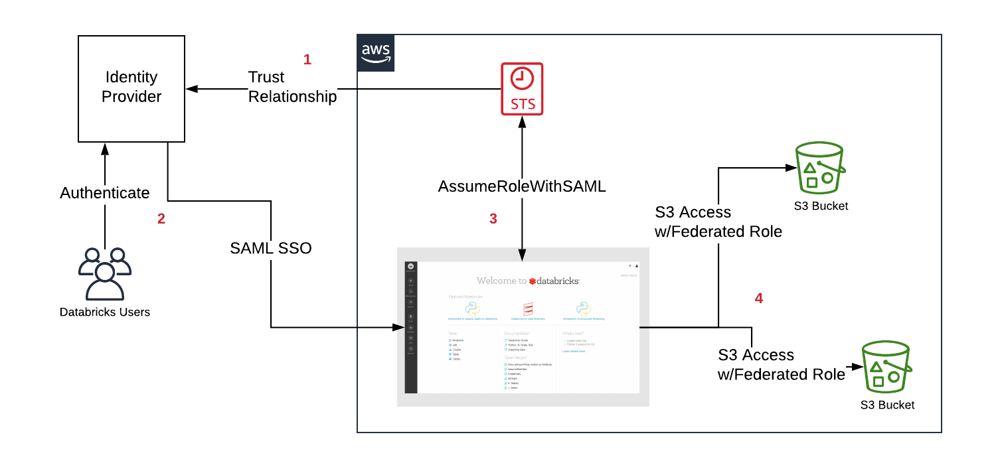

<!-- markdownlint-disable-file -->

# Databricks Single User Clusters

## Table of contents

- [What are Single User Clusters?](#What-are-Single-User-Clusters)
- [Why do we need single user clusters?](#Why-do-we-need-single-user-clusters)
- [What has been done to enable Single User Clusters?](#What-has-been-done-to-enable-Single-User-Clusters)
- [How it all fits together](#How-it-all-fits-together)
- [How to access the Audit logs?](#How-to-access-the-Audit-logs)
- [What has changed for end users when accessing Databricks using Single User Clusters?](#What-has-changed-for-end-users-when-accessing-Databricks-using-Single-User-Clusters)
- [Runbook](runbook.md)
- [Meta Roles](meta-roles.md)
- [Automated Cluster Creation Workflow](automation_workflow.md)
- [PII Access Sync](../pii_access_sync.md)

---

### What are Single User Clusters
Single User clusters, or **SU** for short, allows only the owner of the cluster to run commands. They use [IAM passthrough](https://databricks.com/blog/2019/03/26/introducing-databricks-aws-iam-credential-passthrough.html) to only allow a single user with the correct set of credentials to be able to run commands on that cluster.


### Why do we need single user clusters
See the documents below:
- [Databricks | Audit logs project](https://docs.google.com/document/d/1u3UsYd41zSLKK2tUVJoii-atccHj1fDap2LnOtn-X8k/edit#)
- [Databricks clusters with IAM passthrough](https://docs.google.com/document/d/1rS10962Fs00dxOVf3wqPZUjQn6dWP3NXv799cX-oAKQ/edit#heading=h.rh7lmocdh51)

### What has been done to enable Single User Clusters

We asked Databricks to enable the IAM Passthrough feature in our Databricks workspace and we are using Federated IAM roles via Okta IdP.

- [okta-aws](https://github.com/nubank/okta-aws/tree/master/src/okta_aws/databricks), a collection of lambdas to:
    - create such roles
    - attach policies to them
    - create and configure the Okta<->Dataricks IdP
- Bucket policies when buckets live in AWS accounts outside the Nubank BR account
- Okta SSO app configuration to pass which roles people are eligible to assume
- Okta groups to classify user access levels
- Enabling Cloudtrail to log API access to sensitive S3 buckets
- Enabling IAM Passthrough in the Single User clusters


### How it all fits together



1. When users do an SSO login inside Databricks they are taken to Okta login page where they sign in to Okta and on a successful attempt, Okta responds to Databricks with:
 - SAML assertion
 - Okta IdP ARN
 - Role ARN

2. Databricks calls AWS STS to assume role which is similar to this aws command:

```shell
aws sts assume-role-with-saml --saml-assertion [SAML] --role-arn [role-arn] --principal-arn [idp-arn]
```
(Where *SAML* is the base64 decoded assertion string that Okta passes to Databricks).

3. When the role is successfully assumed, STS returns tokens that Databricks can use to make calls to AWS. These tokens have a set expiration period, which we can tune in the federated IAM role settings in AWS.

More information about this is found [here](https://databricks.com/blog/2019/03/26/introducing-databricks-aws-iam-credential-passthrough.html).

### How to access the Audit logs?

- One way is to check splunk logs.
    - Query: `index=cloudtrail "userIdentity.type"=AssumedRole "requestParameters.bucketName"="nu-spark-metapod-*-pii"`
    - [Splunk example](https://nubank.splunkcloud.com/en-US/app/search/search?dispatch.sample_ratio=1&display.page.search.mode=smart&workload_pool=&q=search%20index%3Dcloudtrail%20%22userIdentity.type%22%3DAssumedRole%20%22requestParameters.bucketName%22%3D%22nu-spark-metapod-*-pii%22&earliest=-7d%40h&latest=now&sid=1595857560.390667_DE08CBB6-443D-4023-8E7E-1C4456F2B708)
- Another way is to use this [notebook](https://nubank.cloud.databricks.com/#notebook/4970274) (WIP).

### What has changed for end users when accessing Databricks using Single User Clusters?

- Users can now start and stop their own clusters relying less on databricks administrators to do so.
- No one other than the owner of the cluster can execute commands in it. Not even the admins.
- Users will have assumed roles when performing actions that need access to data. Most times there will be only one role, but if there are more than one they will need to change between them (admins, multi-country access, etc).  More information [here](https://docs.databricks.com/dev-tools/databricks-utils.html#credentials-utilities).

TODO: put example calls for our roles
