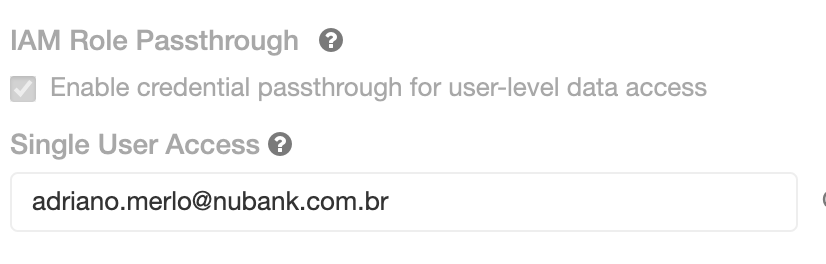

# Automated Cluster Creation Workflow

The cluster creation process involves the following steps:
1. People requesting for PII access on Databricks through #access-request forms.
1. PII access being approved by the system.
1. On Access approval, this [okta workflow](https://nubank.workflows.okta.com/app/folders/1779/flows/20413) is triggered which adds people to the okta groups.
1. [Create SU cluster Okta workflow](https://nubank.workflows.okta.com/app/folders/6526/flows/38807) is triggered by change in okta groups in the previous flow.
1. The last workflow triggers the lambda `nu-lambda-prod-databricks-lambdas-create-sucluster` which does the following steps to create the cluster:
    1. Check if the cluster already has a cluster and abort in case.
    1. Create the cluster
    1. Warmup(boot-up) the cluster
    1. Install default set of libraries in the cluster
    1. Give permission to the user to restart their cluster
    1. Shutting down the cluster
    1. Posting a bot message to the slack user

In case of a failure, a message is posted on #data-access-alarms from the Slack app named `Databricks SU Cluster Lambda` for [example](https://nubank.slack.com/archives/C8TENL0C8/p1607448331009600)

The lambda lives [here](https://github.com/nubank/databricks-lambdas)

To look at the logs, you can check the Flow history of the lambda here - https://nubank.workflows.okta.com/app/folders/6526/flows/38807/history

And for the lambda execution logs, check the [Cloudwatch logs](https://sa-east-1.console.aws.amazon.com/cloudwatch/home?region=sa-east-1#logsV2:log-groups/log-group/$252Faws$252Flambda$252Fnu-lambda-prod-databricks-lambdas-create-sucluster) or [Splunk logs](https://nubank.splunkcloud.com/en-US/app/search/search?q=search%20index%3Dlambdas%20source%3D%22sa-east-1%3A%2Faws%2Flambda%2Fnu-lambda-prod-databricks-lambdas-create-sucluster*%22&display.page.search.mode=fast&dispatch.sample_ratio=1&earliest=-7d%40d&latest=now&sid=1606763458.1306313_441E883E-2B06-437D-97A4-B78C146189E2)

For creating clusters outside the PII access workflow, people with the scope `data-access-ops` can run this command to create SU clusters as well:

```bash
nu-br serverless invoke databricks-lambdas-create-sucluster --env prod --invoke-type sync --payload '{"username":"<user-email>"}'
```

## Troubleshooting

### User does not exist

```"{\"error_code\":\"BAD_REQUEST\",\"message\":\"Principal: UserName(roberta.zaviolo@nubank.com.br) does not exist\"}"```

The error will say that the user does not exist. This happens when the user requests for access but they haven't logged into Databricks even once. The cluster is created but the Passthrough email is not set on the cluster.

In this case, ask the person to login to Databricks through Okta once which will create the user on Databricks.
Then manually edit the cluster to set the passthrough email on it. To do this follow these steps:
1. Goto Databricks and Cluster Tab
1. Find the cluster it will have the name firstname_lastname_su_cluster (from user name)
1. Click Edit and then under Advanced Options at the bottom of the page
1. Select the username in the dropdown labelled 'Single User Access'
1. Click 'Confirm and Restart' button at the top of the page.


