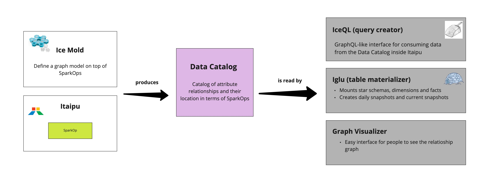

# Frozen Suite

Frozen Suite is a group of tools used to make the lives of Itaipu contributors easier and more productive,
by helping them on creating tables,
writing down complex queries,
cataloging attributes and
defining attribute relationships.

- **Ice Mold**: defining attributes and attribute relationships (**catalog**)
- **Iglu**: creating big wide tables in a modular way (**materialize**)
- **IceQL**: creating queries to consume from the Data Catalog (**query**)

