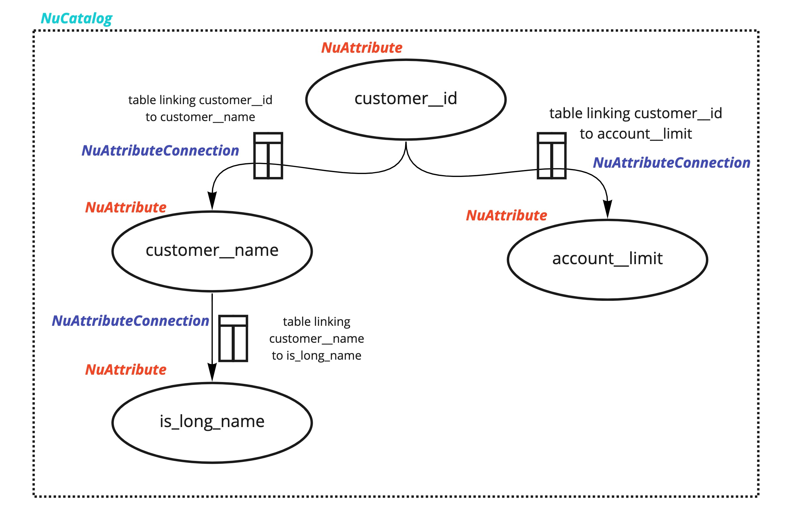
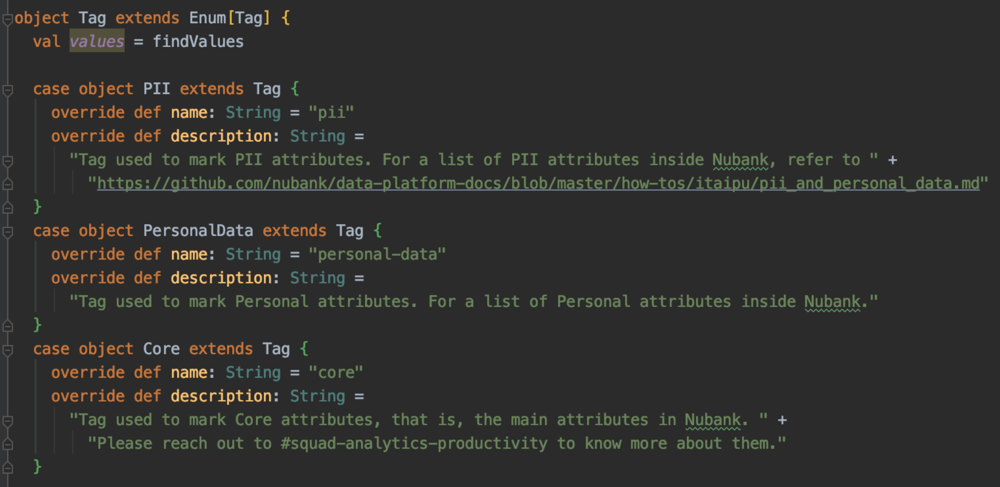

# Ice Mold Technical Docs

## Introduction

Ice Mold is a metadata tool used to create graph models on top of tabular structures.
It allows users to create complex attribute relationship models and
link relationships to their actual mappings in terms of SparkOps.
All the code used for this can be found on package etl.warehouse.ice_mold
[here](https://github.com/nubank/itaipu/tree/master/src/main/scala/etl/warehouse/ice_mold).

## Architecture

Ice Mold architecture can be summarized into two parts, namely:

- **NuAttribute**: nodes in the graph
- **NuAttributeConnection**: edges in the graph
- **NuCatalog**: the list of all attributes and all connections

#### NuAttribute

- Name: this is the unique identifier of the node
(creating a new attribute means creating a new name). Ex: "aml/customer_status"
- Output name: this is the name the attribute is referred to in tables. Ex: "customer_status"
- LogicalType: Metapod type (StringType, LongType, TimestampType, etc)
- Tags: list of user created tags associated with this attribute. Ex: "core", "pii", etc
- (optional) NuAttribute with AttributeList / Source:
a SparkOp containing the list of attributes. Ex: a table with teh list of customer__ids
- (optional) NuAttribute with AttributeList / SourceSchema:
the format of the tabular list. Ex: tabular (a table with primary keys + attribute columns),
EAVT (e: entity, a: attribute, v: value, t: timestamp), etc

#### NuAttributeConnection

- From: 'from' NuAttributes. Ex: Set(customer__id)
- To: 'to' NuAttributes. Ex: Set(customer__name, customer__last_name)
- (optional) NuAttributeConnection with Transformation / Source:
SparkOp that links 'from' and 'to'. Ex: A SparkOp with columns "customer__id",
"customer__name", "customer__last_name"
- (optional) NuAttributeConnection with Transformation / SourceSchema:
the format of the tabular representation. Ex: tabular (a table with primary keys +
attribute columns), EAVT (e: entity, a: attribute, v: value, t: timestamp), etc

#### NuCatalog

- Name: the unique identifier of the catalog
- Attributes: a list of NuAttributes
- Connections: a list of NuAttributeConnections

#### Tags

- Tags are made of a name, which identifies it uniquely and a description.
Users should be able to freely create tags for their own personal purposes. Ex:

## System Integration

There is not much wiring up done on the infra side of Ice Mold,
since it is meant to be a declarative layer that
doesn't actually apply a lot of logic on top of the graph model declaration.
Having said that, we currently have some implicit operators used to
filter attributes with a given tag (filterTag),
filter attributes tagged with a given dimension tag (filterFromDimension),
and to find connections between a given set of from and to attributes
(findConnectionExactlyFromTo).

## Future Improvements

We can improve the interface to facilitate the creation of a batch of attributes
by creating case classes to improve the interface of how users instantiate
a new NuAttribute or a new NuAttributeConnection.

## Examples

A full example of the IceMold implementation can be found here:

- Attributes: <https://github.com/nubank/itaipu/tree/master/src/main/scala/nu/data/mx/core/v2/attributes>
- Connections: <https://github.com/nubank/itaipu/tree/master/src/main/scala/nu/data/mx/core/v2/connections>
- SparkOps where the connections live: https://github.com/nubank/itaipu/tree/master/src/main/scala/nu/data/mx/core/v2/ops
