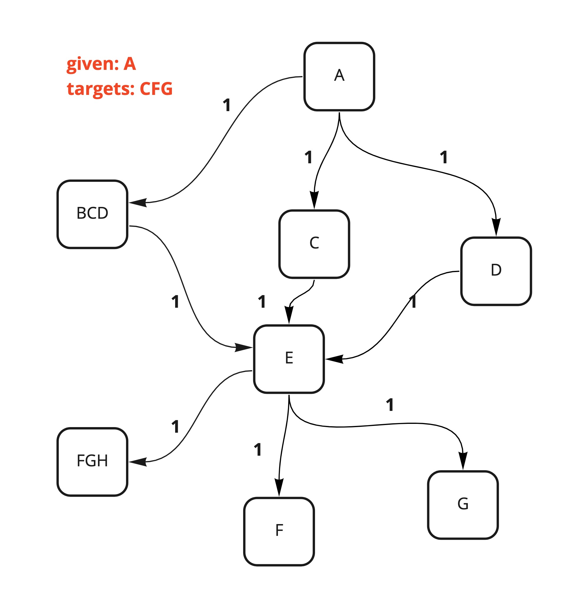
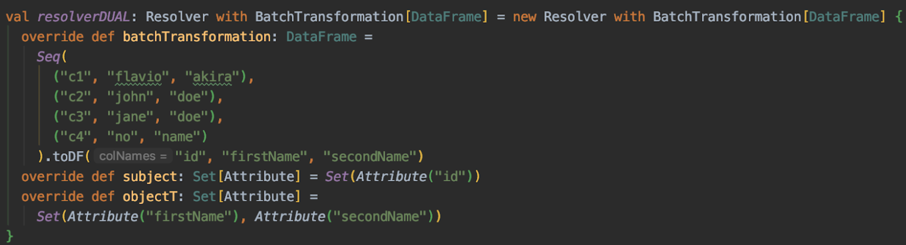

# IceQL Technical Docs

## Architecture

### API

We currently have two APIs used to create a DataFrame by passing a list of 'givens' and 'targets'.

- ConsumerAPI (users pass a list of givens, a list of targets):

  - .inputs returns the list of datasets which will be used to fetch the information requested
  - .pullAttributes(df: DataFrame, datasets: Map[String, DataFrame]) returns a left joined df by adding the target attributes

- ConsumerAPIv2 (users pass a list of givens, a list of targets):

  - .inputs returns the list of datasets which will be used to fetch the information requested
  - .entryPoint(datasets) returns a DataFrame containing the list of givens
  - .pullAttributes(df: DataFrame, datasets: Map[String, DataFrame]) returns a left joined df by adding the target attributes
  - .fetch(datasets: Map[String, DataFrame]), creates and entryPoint and left joins it adding the needed attributes

### Registry

This is the equivalent of the NuCatalog used for the purposes of IceQL.
It contains the nodes (Attribute) and edges (Resolver with BatchTransformation[R]) in a graph.
Example of registry (think of A: customer__id, C: customer__name, etc):

### Scheduler

The scheduler tries to find the paths on a graph model that will go through the nodes and
that contain all the attributes from the list of givens.
This is a modification on the Traveling Salesman Problem (TSP),
in which we want to find the minimum path on a graph that passes through a given list of nodes.

As of now, we do not solve the graph traversal problem using a TSP approach.
Instead, the operation is performed as:

1. Find all the nodes containing the given attributes
1. For each of those nodes, find the minimum path to them
1. Do a cartesian product for each attribute that is contained in more than one node finding all possible minimum paths
1. Remove redundant edges (edges that are passed more than once in the same path)
1. For each path, compute the total weight
1. Find the path with the minimum weight

There are still some modifications in order to make our problem a case of the TSP, such as:

- Some edges might share the same data source (a table customer__id <> status | dob,
can represent the edge customer__id <> status and the edge customer__id <> dob),
in which case going from one node to the other one should cost 0
- Every edge must also be accompanied by a mirrored edge with 0 weight
(going back after a given navigation should cost 0)

This current solution suffers a lot and it is demonstrated by
the amount of time needed to compute paths that exist for a list of givens and targets.
We should revisit this.

The main output of the scheduler is the path (sequence of edges)
that need to be traversed to fetch the attributes defined on the API
(shortestWalkThroughTargets).
In other terms, which tables need to be LEFT JOINed in order to grab the information needed.
In the example below, in order to fetch CFG given A,
one of the minimum paths is: A>C, C>E, E>FGH, but there are other available paths,
such as A>ZC, ZC>E, E>FGH and A>C, C>E, E>FGH.

### NuContext

NuContext contains the graph of attributes (Registry) plus the executionParams,
related to the execution variables used on the ETL run (target date, reference date).
It also runs a step on top of the Registry to **optimize the list of edges declared by users**.
Right now, the only optimization done in this step is to spawn edges from multi nodes
(customer__id <> (status, dob) will add two additional nodes and edges:
customer__id <> status and customer__id <> dob).

### Resolver with BatchTransformation[R]

This is the internal class equivalent to NuAttributeConnection.
This is the type of the edges that define
where the information from one node to another node is located.
R defines the type of the data structure that has the mapping [from: subject, to: object].

Ex: A resolver of DataFrames

Ex: A resolver of Map[String, String]

### EAVTOp

A specific SparkOp, whose columns are e: entity, a: attribute, v: value and t: timestamp.

### State[Q]

This class is used to define the type of data we will be returning after navigating through the graph. Note how this type differs from the type R above.

1. State[DataFrame]
2. -> Resolver of BatchTransformation[Map[String, String]]
3. State[DataFrame]
4. -> Resolver of BatchTransformation[DataFrame]
5. State[DataFrame]
6. -> Resolver of BatchTransformation[SparkOp]
7. State[DataFrame]

We are in a state: DataFrame, and go through an edge of type Map[String, String],
and return to a state: DataFrame. Then we go through an edge of type DataFrame and
return to a state of DataFrame. Finally, we go through an edge of type SparkOp and
return to a state of DataFrame.

In the case of the ConsumerAPI (both v1 and v2),
the state we are dealing with is a MiniSparkOp, that is,
'inside the definition of a SparkOp':

And the type R is usually a SparkOp (or an EAVTOp):

1. State[MiniSparkOp]
2. -> Resolver of BatchTransformation[EAVTOp]
3. State[MiniSparkOp] -> after traversing, the DataFrame query is LEFT JOINED and we add stuff to the inputs variable
4. -> Resolver of BatchTransformation[EAVTOp]
5. State[MiniSparkOp] -> after traversing, the DataFrame query is LEFT JOINED and we add stuff to the inputs variable
6. -> Resolver of BatchTransformation[EAVTOp]
7. State[MiniSparkOp] -> after traversing, the DataFrame query is LEFT JOINED and we add stuff to the inputs variable

### Traverser

The traverser is the LEFT JOINer.
We can implement it for multiple types of data structures on the RIGHT side,
defined by the type class Q, which defines the type of the data structure
we will be dealing with (DataFrames, maps, dictionaries, SparkOps, MiniSparkOps, etc),
and RT, which is the type of Resolver (edge) which contains the mapping [from, to].

Below is an example of the traverser for DataFrames, where the edge is also a DataFrames.
In this simple case, the only thing done is a LEFT JOIN.

Right now, we only support traversing on EAVTOps.
You can check the implementation here:
<https://github.com/nubank/itaipu/blob/master/src/main/scala/etl/warehouse/iceql/traversers/EAVTOpTraverser.scala>

### Operator

The operator is the 'controller' object that implements all the operations needed to actually pullAttributes.
In summary the order of what is done by the controller:
Ask the scheduler for a path that will go through all the nodes of the 'targets',
on top of the NuContext defined by the NuCatalog
Groups all EAVTOps resolvers of the minimum path into a single resolver
(this is a performance improvement)
Traverse the entire path (for each edge, apply the Traverse operation)
Return the MiniSparkOp (final inputs and final DataFrame)

## System Integration

IceQL consumes data from the catalog produced by Ice Mold,
which is made of NuAttributes and NuAttributeConnections.
In order to translate those into our internal classes of NuContext,
Attribute and Resolver with BatchTransformation[SparkOp],
we have the package of adapters,
each responsible for translating one of those classes respectively.

## Future Improvements

As mentioned above, there are multiple fronts from IceQL that could be improved. Namely:

- TSP issue: calculating the minimum path today is an expensive operation that might increase the compilation time of Itaipu considerably depending on how much the graph of attributes increases. We should modify our problem to make it closer to a case of the Traveling Salesman Problem and implement a known solution for TSP.
- Optimize graph: the graph declared by users can be optimized by creating middle stages of materialization, or by spawning edges and nodes that more closely resemble what is available for the operator to use.
- Operator modes (early, fast, cost efficient): when doing a request, we should be able to configure which kind of graph navigation we want to prioritize, and we can weigh the edges based on that. Right now, all edges have the same weight, which is not actually the case.
- Traversing on Tabular SparkOps (non-EAVTs): right now, we can only navigate through edges whose SparkOps are EAVTs. We should be able to navigate through edges that are tabular (suggestion: if it is tabular, transform it into an EAVT and then apply the default EAVT traverser - this avoids us into getting into duplicated issues of LEFT JOINs when keys are not unique on the right side, which can be a very troubling issue).

## Examples

<https://github.com/nubank/itaipu/blob/master/src/main/scala/etl/dataset/key_integrity/CustomerKeyIntegrity.scala>
