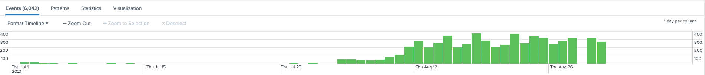
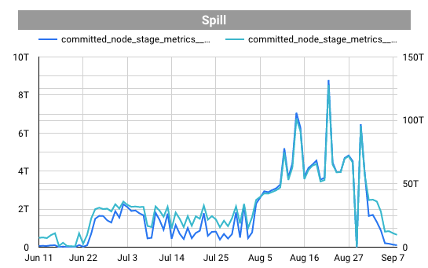
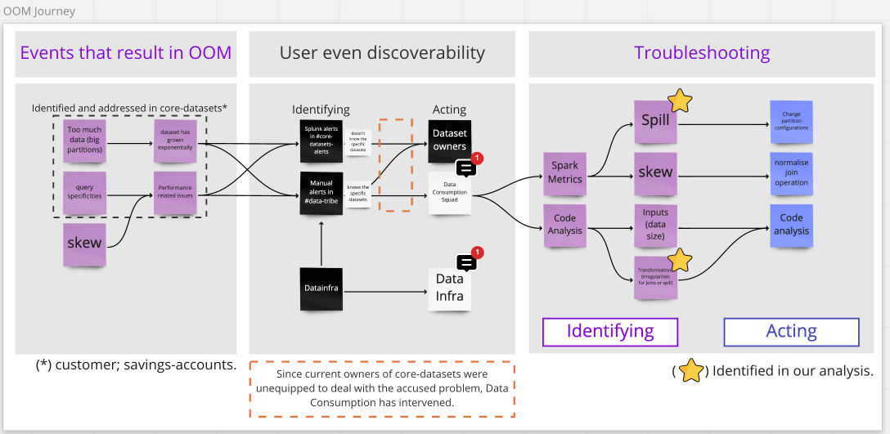

# Troubleshooting

## Case Study: Out Of Memory errors in Core Datasets built with Iglu

### Introduction
As part of the proactive monitoring of Core Datasets, the Data Consumption squad has set Splunk alerts to inform 
through the Slack channel #core-datasets-alerts when there has been any indication of Out Of Memory (OOM) errors in 
the core-datasets Airflow node during the batch run.

The OOM errors can be interpreted as a signal that spark is having trouble processing the dataset. If ignored for a 
long time they might become a bigger problem for the ETL as the data has a natural tendency of growing in size, 
increasing spark's struggle to process them. These errors are being tracked since the tooling (Iglu) capacity stress'
tests where it became clear that before a spark job (ie. the table processing), completely fails, some tasks (spark
units of processing) failed with OOM errors.

During the second half of 2021, the Splunk alerts for core datasets have had many OOM events (~6000), most of them by 
August. These errors happened at the executor level, as the Splunk query shows:



#### How to reproduce the chart
Use the query below in [Splunk](https://nubank.splunkcloud.com/en-US/app/search/search).

```sql
index=cantareira
| regex "OutOfMemoryError"
| where like(job, "aurora/prod/jobs/itaipu-core-datasets")
| search "SparkOutOfMemoryError"
```

We’ve found out that main offenders were the following tables, which represent almost all errors shown:
 - nu-br/dataset/customer-eavt-denormalized
 - nu-br/dataset/savings-account-eavt-denormalized

To reach this conclusion the analysis was done crossing information from Splunk with the table 
`series_contract.itaipu_spark_stage_metrics` using `stage` and `run_target_date` as keys in the query below:

```sql
SELECT
  grouping_label,
  sparkop_name,
  failure_reason,
  stage_id
FROM
  series_contract.itaipu_spark_stage_metrics
WHERE
  run_target_date => "2021-07-01"
  AND grouping_label = "airflow-itaipu-core-datasets"
order by stage_id ASC
```

### Impact
Having tasks failing means:
- more resources spent as the tasks have to be recalculated
- some delay in the batch run
- at some point tasks can fail up to the point that the job would be aborted, as the stress tests have indicated
That would mean the dataset and all the datasets that rely on information of this one, or its successors (including 
core datasets and its successors), would be committed empty in the day

### Solution
#### What causes OOM error in Spark?
Spark distributes data processing into jobs, these jobs contain stages and every stage has a number of tasks.
If any of these tasks has too much data to process, which can be monitored through the shuffle read metric, they may
run out of memory and have to be triggered again. After a number of attempts to run the same task the stage may fail,
and the failure of stages can also lead to a failure of jobs.
A number of operations can cause OOM errors, from inefficient queries to incorrect configuration or even the size of
the data, which makes it challenging to understand what is causing the error. If any task is reading more data than it
is capable of, the OOM error occurs. Experimentally, it is considered that having 300-400 MBs per task is fine, going
too much above this may significantly increase the risk of OOM errors.

#### How to solve OOM?
A generic guide for this is not available at the moment so we have to understand what issues spark is having in order
to correctly address them. It is known that increasing the number of partitions (in SparkOps case, the partition 
multipliers) reduces the amount of shuffle read per task, hence when experiencing an OOM error one **should increase** 
**the number of partitions used by spark**. _We recommend starting with x2 the previous number if you are unsure of what 
number to use_.

#### What other evidence do we have?
##### Postinho dashboard spill charts
Using the [Postinho dashboard](https://datastudio.google.com/u/0/reporting/e0202546-b2cc-4ca7-95e8-3e6b829bd88f) we 
were able to see that the Spill metrics seemed high.
>Spill is the term used to refer to the act of moving an RDD from RAM to disk, and 
> later back into RAM again. This occurs when a given partition is simply too large to fit into RAM.
>The consequence of this is, Spark is forced into expensive disk reads and writes to free up local RAM to 
> avoid the Out of Memory error which can crash the 
> application. [Reference](https://medium.com/road-to-data-engineering/spark-performance-optimization-series-2-spill-685126e9d21f)

`nu-br/dataset/customer-eavt-denormalized`


`nu-br/dataset/savings-account-eavt-denormalized`



The eavt-denormalized Iglu step involves spark transformations using `explode()`, which is one of the causes of 
spilling data from memory to disk.

#### What have we tried?

##### Reproduce pipeline in databricks
[Databricks notebook](https://nubank.cloud.databricks.com/#notebook/14006441/command/14434927)

**Result:** All eavt-denormalized tasks have succeeded, so no conclusions here. Also, the databricks spark configs 
in databricks are different from Itaipu's.

##### Change number of partitions in Itaipu
This has required:
- Allowing the partition configuration to be set through the Iglu's dimension 
interface [PR link](https://github.com/nubank/itaipu/pull/25168/)
- Tuning Customer Iglu's Dimension partition configuration to a higher number 
(x2 seemed enough in this case) [PR link](https://github.com/nubank/itaipu/pull/25164)
- Tuning Savings Account Iglu's Dimension partition configuration to a higher number 
(x2 seemed enough in this case) [PR link](https://github.com/nubank/itaipu/pull/25169)

**Result:** Spill metrics went down to 0 (accordingly to postinho chart) and we had no more OOM alerts.

### Conclusion
Given that
- the Iglu denormalization step, which generates tables with `-eavt-denormalized` suffix, involves spark 
transformations using `explode()`; and knowing that those are common causes of data spill in spark.
- The itaipu method for setting the number of partitions does not prevent cases where we explode data inside it.

The hypothesis is that by multiplying the number of partitions by 2 times, we redistribute the data into more partitions before exploding it, avoiding spill.

### User Journey Overview

