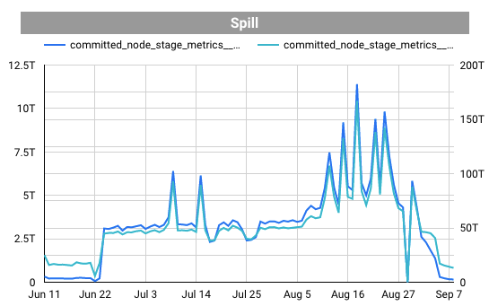

# Troubleshooting Guide

At the [end of this guide](#bonus-notebook-for-frozen-suite-users-and-other-folks-to-experiment-oom-solutions) we share a notebook that can be used by anyone having trouble with OOM to experiment solutions in databricks.

## Case Study: Out Of Memory errors in Datasets built with Iglu

As part of the proactive monitoring of Core Datasets, the Data Consumption squad has set Splunk alerts to inform
through the Slack channel #core-datasets-alerts when there has been any indication of Out Of Memory (OOM) errors in
the core-datasets Airflow node during the batch run.

The OOM errors can be interpreted as a signal that spark is having trouble processing the dataset. If ignored for a
long time they might become a bigger problem for the ETL as the data has a natural tendency of growing in size,
increasing spark's struggle to process them. These errors are being tracked since the tooling (Iglu) capacity stress'
tests where it became clear that before a spark job (ie. the table processing), completely fails, some tasks (spark
units of processing) failed with OOM errors.

During the second half of 2021, the Splunk alerts for core datasets have had many OOM events (~6000), most of them by
August. These errors happened at the executor level, as the Splunk query shows:


### How to reproduce the chart

Use the query below in [Splunk](https://nubank.splunkcloud.com/en-US/app/search/search).

```sql
index=cantareira
| regex "OutOfMemoryError"
| where like(job, "aurora/prod/jobs/itaipu-core-datasets")
| search "SparkOutOfMemoryError"
```

We’ve found out that main offenders were the following tables, which represent almost all errors shown:

- nu-br/dataset/customer-eavt-denormalized
- nu-br/dataset/savings-account-eavt-denormalized

To reach this conclusion the analysis was done crossing information from Splunk with the table
`series_contract.itaipu_spark_stage_metrics` using `stage` and `run_target_date` as keys in the query below:

```sql
SELECT
  grouping_label,
  sparkop_name,
  failure_reason,
  stage_id
FROM
  series_contract.itaipu_spark_stage_metrics
WHERE
  run_target_date => "2021-07-01"
  AND grouping_label = "airflow-itaipu-core-datasets"
order by stage_id ASC
```

## Impact

Having tasks failing means:

- more resources spent as the tasks have to be recalculated
- some delay in the batch run
- at some point tasks can fail up to the point that the job would be aborted, as the stress tests have indicated
That would mean the dataset and all the datasets that rely on information of this one, or its successors (including
core datasets and its successors), would be committed empty in the day

## Solution

### What causes OOM error in Spark

Spark distributes data processing into jobs, these jobs contain stages and every stage has a number of tasks.
If any of these tasks has too much data to process, which can be monitored through the shuffle read metric, they may
run out of memory and have to be triggered again. After a number of attempts to run the same task the stage may fail,
and the failure of stages can also lead to a failure of jobs.
A number of operations can cause OOM errors, from inefficient queries to incorrect configuration or even the size of
the data, which makes it challenging to understand what is causing the error. If any task is reading more data than it
is capable of, the OOM error occurs. Experimentally, databricks training considers that having 128 MBs per task is fine, some folks at nubank say this number is ok to be a bit higher (300MB). Nonetheless, going above any of the thresholds may significantly increase the risk of OOM errors.

### What other evidence do we have

#### Postinho dashboard spill charts

Using the [Postinho dashboard](https://datastudio.google.com/u/0/reporting/e0202546-b2cc-4ca7-95e8-3e6b829bd88f) we
were able to see that the Spill metrics seemed high.
>Spill is the term used to refer to the act of moving an RDD from RAM to disk, and
> later back into RAM again. This occurs when a given partition is simply too large to fit into RAM.
>The consequence of this is, Spark is forced into expensive disk reads and writes to free up local RAM to
> avoid the Out of Memory error which can crash the
> application. [Reference](https://medium.com/road-to-data-engineering/spark-performance-optimization-series-2-spill-685126e9d21f)

`nu-br/dataset/customer-eavt-denormalized`



`nu-br/dataset/savings-account-eavt-denormalized`


The eavt-denormalized Iglu step involves spark transformations using `explode()`, which is one of the causes of
spilling data from memory to disk.

### How to solve OOM

We have to understand what issues spark is having in order to correctly address them, some performance metrics usually help to provide a decent scenario. They are:

1. The amount of spilled megabytes
2. The total linear execution time of the sparkOp
3. The skew in shuffle (max(shuffle_read)/median(shuffle_read))

Theory says that increasing the number of partitions (in Frozen Suite SparkOps' case, the partition multipliers) reduces the amount of shuffle read per task, which usually helps reduce spill but the effect on skew is unknown. Hence, when experiencing an OOM error one recommendation is to **increase the number of partitions used by spark**.

In the frozen suite framework, some of the [traits Frozen Suite implements](https://github.com/nubank/itaipu/blob/master/src/main/scala/nu/data/br/core/dimensions/credit_card_account/CreditCardAccountDimension.scala#L27) contain the partition multiplier parameter to be tuned by consumers of the tool, and this can be used to mitigate OOM errors depending on the context.

### What have we tried

#### Reproduce pipeline in databricks: understanding the effectiveness of increasing partitions to mitigate Skew and Spill (drivers of OOM)

A discovery was performed to understand how can we simulate a good estimation to tune the partition multiplier, where sparkOps with different skew/spill cases where considered. This simulation should be able to replicate to the user the same performance metrics that are collected using the table `series-contract/itaipu-spark-stage-metrics`, in order to compare if the materialization of the sparkOp benefitted from a change in partitions.

We selected 3 examples of sparkOps that had issues to understand how a change in partitions would help to address them:  

1. `nu-br/core/credit-card-line-items` - Had Skew but no Spill
2. `nu-br/dataset/credit-card-account-eavt-denormalized` Had no Skew but had Spill
3. `nu-br/dataset/customer-eavt-denormalized` Had Skew and Spill

We materialized them in [this notebook](https://nubank.cloud.databricks.com/#notebook/15068529/command/15068551), that generated logs containing the previosly mentioned performance metrics. To achieve this, the [TaskMetricsExplorer library](https://github.com/zheyuan28/SparkTaskMetrics) in Scala was used, which is also the source for the metrics calculated in our metadata table (`itaipu-spark-stage-metrics`).

An [analysis performed](https://nubank.cloud.databricks.com/#notebook/15495147/command/15495148) on these tests concluded that tuning partitions is effective to mitigate Spill, and in some cases even Skew (depeding on how high it is). The impact on linear execution time varies a lot, so we recommend testing to understand in which situations it is more effective. The print below shows results for a test performed on `nu-br/dataset/credit-card-account-eavt-denormalized]`.


We also believe that each dataset has its nuances, so more tests are needed to confirm that the stated hypotheses are true, but we have some evidence that it makes sense.

#### Change number of partitions in Itaipu

This has required:

- Allowing the partition configuration to be set through the Iglu's dimension
interface [PR link](https://github.com/nubank/itaipu/pull/25168/)
- Tuning Customer Iglu's Dimension partition configuration to a higher number
(x2 seemed enough in this case) [PR link](https://github.com/nubank/itaipu/pull/25164)
- Tuning Savings Account Iglu's Dimension partition configuration to a higher number
(x2 seemed enough in this case) [PR link](https://github.com/nubank/itaipu/pull/25169)

**Result:** Spill metrics went down to 0 (accordingly to postinho chart) and we had no more OOM alerts.

## Conclusions

Given that

- the Iglu denormalization step, which generates tables with `-eavt-denormalized` suffix, involves spark
transformations using `explode()`; and knowing that those are common causes of data spill in spark.
- we believe that spill was the biggest issue in our datasets (skew was above average but not high), because of this, increasing the partition multiplier was an effective action

<a id="bonus-notebook-for-frozen-suite-users-and-other-folks-to-experiment-oom-solutions"></a>

## Bonus notebook for Frozen Suite users and other folks to experiment OOM solutions

**To enable other users to experiment as we did, we created [this notebook](https://nubank.cloud.databricks.com/#notebook/15587857/command/15588428)** that can be cloned by other users to run the same experiments and have a staging environment rather than trying to optimize datasets in production. There it is possible to analyse the 3 metrics and understand how they are affected by partition changes or even business logic changes.

We recommend creating an array of partitions greater than the baseline used in production, but the step size depends on intuition and how far the Shuffle megabytes are from ideal numbers. A reasonable step to use is from 50% to 100% the number of partitions, so given that the sparkOp had `X` partitions in the last run, something like `[100% X, 150% X, 200% X]` or `[100% X, 200% X, 300% X]` would be useful.

## User Journey Overview


