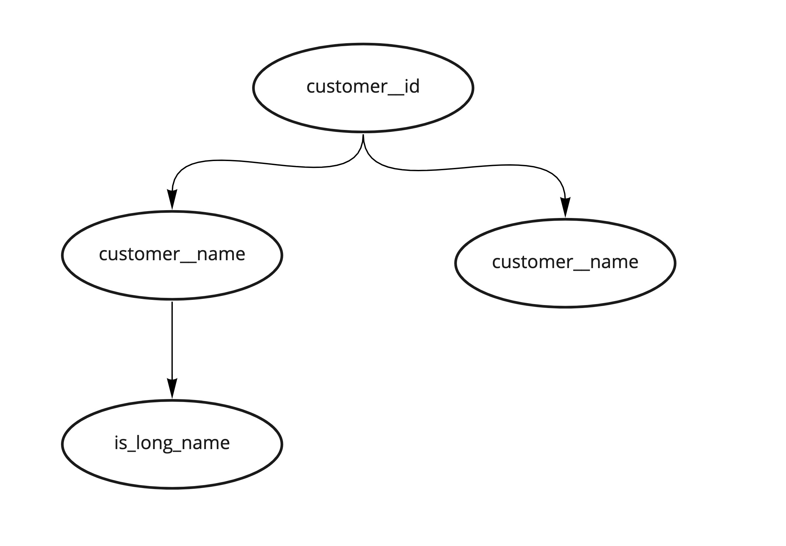
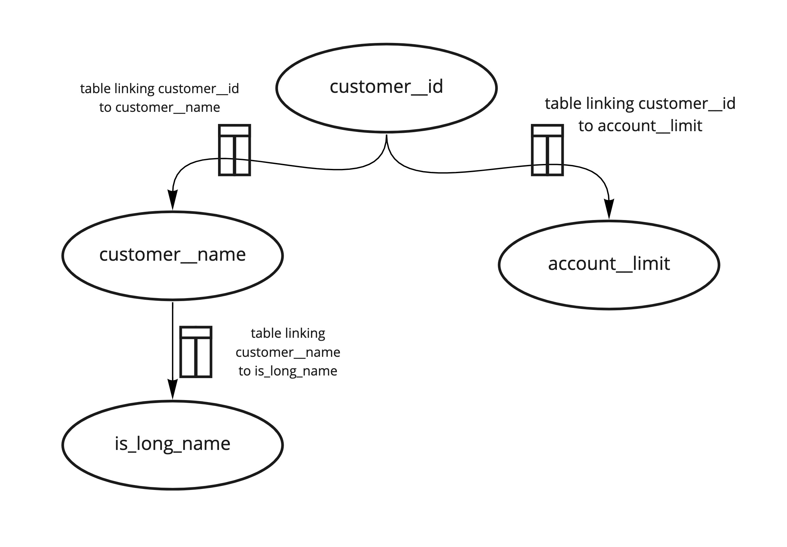

# Ice Mold
*A metadata tool to create semantic data models*

**TLDR:** AProd is releasing a (beta) new way to create data models inside Nubank 
(with a heavy inspiration on RDF and Abrams), 
which should bring a lot of value in terms of data governance, 
internationalization and long-term stability.

If you don't have a lot of context about this, skip to [Background](#Background) section. 

On a step by step on how to use it, skip to our [Guide](guide.md). 

In order to better understand how this tool could fit your analytical needs, refer to our [User Stories](user_stories.md).

On how Ice Mold interacts with other systems:
https://miro.com/app/board/o9J_lfT--8Y=/

## Background

On a TGIF in October/20, AProd presented some ideas about modelling data inside 
our data platform using RDF (Resource Description Framework) - 
check out the [recording here](https://drive.google.com/file/d/1VEEL4bFLMlZ5cQbG6hoI_nBCgu5uZMrG/view). 
The whole idea revolves around modeling attribute relationships using RDFs 
and linking attributes through resolvers (SparkOps).

We can use an extremely flexible framework to describe data called 
Resource Description Framework (RDF) 
(there is an awesome reference for this type of modeling you can check [here](https://workingontologist.org/)). 

In summary, we can describe pretty much everything using a triplet: 

**Subject** -> **Predicate** -> **Object**

For our application, we would be using this to model attribute relationships, 
that is, triplets where subject and object are attributes, 
and a predicate which indicates this attribute relationship.

Some examples of that: 
- `customer__id` (subject) `has` (predicate) a `customer__name` (subject)
- `customer__name` (subject) `has` (predicate) a `is_a_long_name` (subject)
- `customer__id` (subject) `has` (predicate) an `account__limit` (subject)

And we can also visually represent these relationships using graphs. 
For the specific case in which we are describing attributes, 
each node in a graph is an attribute, 
and each triplet can be represented by an arrow connecting two nodes. 
Using the previous example as a basis for that:

We can also enrich this model by linking our arrow to recipes - 
'how do I go from `customer__id` to a `customer__name`?'. 
Our recipes when we are talking about batch transformations are usually tables / queries. 
The full representation of this graph, also including the recipes on how to go 
from on node to another one becomes:

Attributes in this graph can have a column representation, 
but they are not defined by them, that is, 
nodes in this graph can exist in a given table, 
and the way to link them to actual tables is done through the recipe part 
(Transformation trait).

Therefore, the classes for this model are:
NuAttribute (used for creating nodes)
NuResolver (used for linking NuAttributes - creating edges)
Transformation (used to linking NuResolvers to SparkOps) 

Refer to the How to use it section for more information on how to use those classes.

## Benefits and Vision

This way of modeling data allows us to decouple our business model from SparkOps themselves, 
making our model more stable to infrastructural changes. 
For instance, we might have a migration of `customer__name` from contract X to contract Y.
Our model remains the same 
and  the only thing that changes is 'recipe' to reach this attribute. 
In other words, we only have to replace the resolver connecting those two attributes. 

Apart from this, creating a data model like this allows us to:
- Create a centralized place for describing information and tagging it. 
That is, we can add tags to our attributes, 
enriching our model with more business related information
and allow attributes to be reached by plug-ins as described next. 
Examples of tags: isPII, isCore, isHashed, isUsedInReportToBacen, 
isFeatureForLusaV4, etc (we can be really wild here!)

- Creating a data model like this allows us to plug in some modules on top of it. 
The Customer API / attribute traverse / Graph QL example 
we demoed on the TGIF is an example of that. 
We can also plug in data deletion modules that remove all information 
from a given customer__id from our analytical environment. 
We can link our data model to compass and show the relationship between 
our attributes in an interactive graph there. 
The possibilities are limitless! (we can also be really wild here!)

- We can create a shared business model between countries, 
allowing us to have some shared concepts and views between countries! 
That is, we might have some parts of our data model that are common between BR, 
MX, CO, the only thing that changes is that the 'recipes' for them live in different tables!
